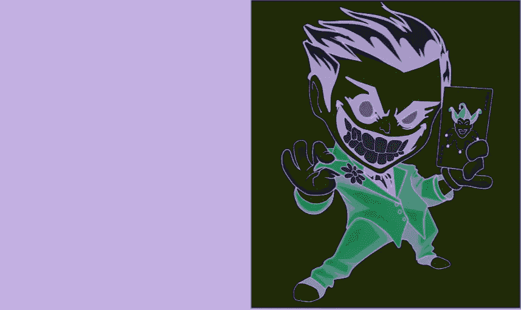
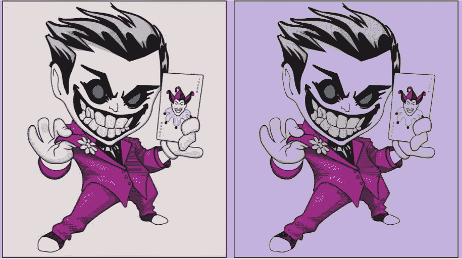
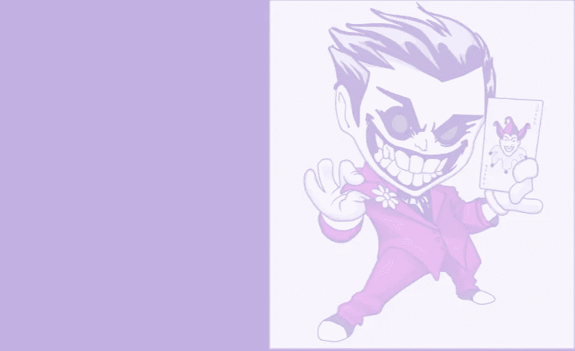
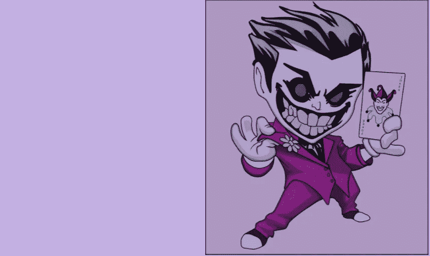
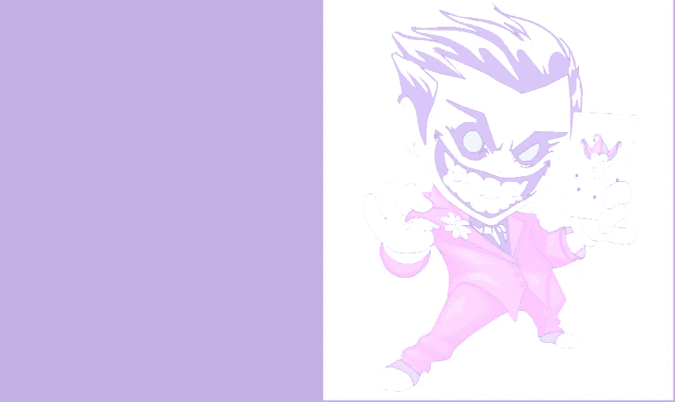
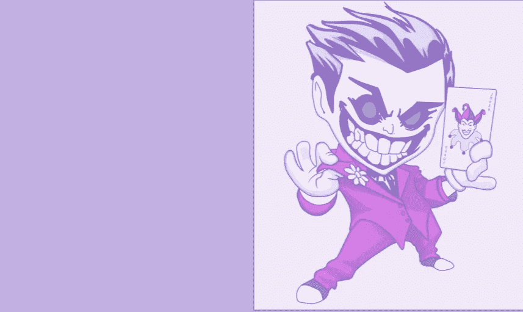

# CSS 中的背景混合模式属性

> 原文：<https://javascript.plainenglish.io/the-background-blend-mode-property-ece505bc2580?source=collection_archive---------16----------------------->

## 如何在 CSS 中使用背景混合模式属性？

`background-blend-mode`属性是一个 CSS 属性。它让我们能够定义元素的背景图像如何与背景颜色混合。

# 混合模式

有几种不同的混合模式可作为属性值用于`background-blend-mode`属性。

*   `normal` -默认混合模式(不变)
*   `multiply` -颜色乘以目的地颜色并替换目的地
*   `screen` -将背景色和源色值的补码相乘，然后对结果求补码
*   `overlay` -根据背景颜色值，增加或过滤颜色
*   `darken` -选择较暗的背景色和源色
*   `lighten` -选择背景色和源色中较浅的一种
*   `difference` -从较亮的颜色中减去两种颜色中较暗的一种
*   `color-dodge` -使背景颜色变亮，以反映源颜色
*   `saturation` -使用源颜色的饱和度和背景颜色的色调和亮度创建颜色
*   `color` -使用源颜色的色调和饱和度以及背景颜色的亮度创建颜色
*   `luminosity`-使用源颜色的亮度和背景颜色的色调和饱和度创建颜色

*在这里* *阅读更多关于这些和其他混合模式* [*。*](https://sab.webflow.io/blend-modes)

# 使用背景混合模式

为了试验这个属性，我们将使用这个小丑的图像(估计它将与即将到来的万圣节有关🎃).我们将用`background-blend-mode`提供的一些最流行的值来测试它。

让我们回顾一下这些值，并通过例子展示它们能做什么。首先，我们将展示代码，并列比较不带`background-blend-mode`的小丑和带`background-blend-mode`的小丑。

这里你可以看到左边是原始图像，右边是使用`darken`值的混合模式版本。让我们看看下面的代码是什么样子的。

现在，让我们尝试一些其他的混合模式值，通常用于这个属性。

`background-blend-mode: screen;`

`screen`混合通过移除颜色的较暗部分来使图像变亮。

background-blend-mode: multiply;

`multiply`混合与`screen`相反。它将混合色与基色相乘，从而产生一个看起来更暗的图像。

background-blend-mode: color-dodge;

`color-dodge`混合使图像更亮，同时也增加了颜色。

background-blend-mode: overlay;

`overlay`混合结合了`multiply`和`screen`混合，根据背景颜色产生更亮或更暗的外观。

background-blend-mode: saturation;

`saturation`混合保持背景图像的饱和度，同时结合背景颜色的色调和亮度。

background-blend-mode: difference;

`difference`混合从顶层减去基础层。如果与浅色或白色混合，这种混合可以反转图像的颜色，但与黑色混合，将不会有任何变化。

# 摘要

这是对`background-blend-mode`属性基础的概述。还有其他的方法来使用这个属性，我们在这篇文章中没有涉及到，比如使用线性渐变，混合多个混合模式值，以及`[mix-blend-mode](https://developer.mozilla.org/en-US/docs/Web/CSS/mix-blend-mode)`属性。

如果你想增加网站设计的趣味，那么`background-blend-mode`属性会是一个很好的补充。希望这篇文章证明了它是一个有用的 CSS 属性，可以产生一些好看的背景图片！

# 更多资源

*   [CSS 背景-混合-模式(W3)](https://www.w3schools.com/cssref/pr_background-blend-mode.asp)
*   [背景混合模式(MDN)](https://developer.mozilla.org/en-US/docs/Web/CSS/background-blend-mode)
*   [CSS 混合模式终极指南](https://highrise.digital/blog/css-blend-modes/)
*   [CSS 混合模式(YouTube)](https://www.youtube.com/watch?v=-c94pr41jaI)

*更多内容看* [***说白了***](http://plainenglish.io)