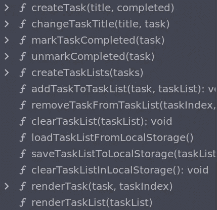

# 基本的普通 JavaScript 项目设置

> 原文：<https://javascript.plainenglish.io/the-basic-vanilla-js-project-setup-9290dce6403f?source=collection_archive---------0----------------------->

## 以下是如何开始你的下一个普通 JS 项目


在[的上一篇文章](https://medium.com/@hayavuk/what-got-me-writing-vanilla-js-again-2c53756c8a4c)中，我分享了我在从事 JavaScript 框架工作十多年后，再次完全投入到普通 JS 技术中的原因。今天，我们将直接进入基本项目设置。在这个过程中，我将涉及各种技术，并讨论它们背后的基本原理，但我不会对每件事都进行详细说明。其中一些将保留到以后的文章中。

我想指出的是，这里讨论的很多内容都要归功于我们尊敬的同事[弗拉基米尔·斯皮林](https://github.com/spirinvladimir)，他为我提供了一个学习的榜样。这篇文章混合了我对他的技术的理解以及我添加和删除的一些东西。

我记得 Vlad 第一次解释方法时没有展示代码。至少可以说，我是持怀疑态度的。我真的不相信这是可能的。我相信当你读到这篇文章时，你也会持怀疑态度。我希望当你坐下来第一次(或第二次)尝试时，你的怀疑会消失，就像我的怀疑一样。我希望一旦你意识到一切都可以变得多么简单，你会和我一样快乐。我向你保证，所有这些真的有用。它已经成功地应用于我们的一些产品代码中(其余的将在时间允许的情况下进行转换)。

# 开始之前

如果要我说出你需要知道的最重要的一件事，那就是:

> 利用平台的优势

这是我们在 [Coin Metrics](https://coinmetrics.io/) 的前端工程团队中(试图)遵守的*香草 Redux 宣言*。(Btw，是这个 [redux](https://www.merriam-webster.com/dictionary/redux) ，不是那个[另一个](https://react-redux.js.org/)。)简而言之，如果平台能为你做些什么，理解它做什么并充分利用它。不要仅仅因为不喜欢*平台如何*工作或者*看起来如何*就重新发明轮子。

# 文件

让我澄清一下:这个设置不需要构建工具。理想情况下，您只是希望能够打开`index.html`文件并开始工作。虽然这听起来相当简单，但我们仍然会在这里介绍一些对于那些刚刚开始使用香草的人来说可能不太明显的细节(或者像我一样，在过去已经这样做了很多年，但完全失去了触觉)。

你最起码需要一个文件夹来存放你的文件，`index.html`、`index.js`和`index.css`。(您可以随意命名 CSS 和 JavaScript 文件，但是 HTML 文件通常被命名为`index.html`，因为当您转到应用程序 URL 的根路径时，HTTP 服务器会查找这个文件。)

一些开发人员喜欢让 web 服务器根据代码中的变化自动重新加载应用程序的各个部分。我发现这对我来说并不可靠，而且使用这些工具的成本相对较高(例如，我不需要任何额外的工具来在浏览器中打开文件)。如果你使用的是普通的 HTML/JavaScript/CSS，许多编辑器甚至会让你免费获得类似的功能，对我来说，这感觉更好。

请记住，香草方法的基本主题不是性能或减少包的大小或类似的事情。人们对 React 的性能感到满意，因此性能显然不是一个非常可取的特征。我们的目标是*不引入我们的应用*并不严格需要的复杂度。这从围绕项目的任何工具开始，继续到代码。

# 向页面添加 CSS

使用`<head>`标签中的`<link>`标签将样式表链接到 HTML 文件中:

```
<!DOCTYPE html>
<html lang="en">
  <head>
    <meta charset="utf-8">
    <title>My app</title>
    <link rel="stylesheet" media="screen" href="index.css">
  </head>
  <body>
  </body>
</html>
```

我倾向于使用相对路径来引用样式表，以及在样式表中引用资产。这样就不需要有 web 服务器来预览更改。

如果你发现由于深度嵌套的文件夹结构，你不能使用相对路径，*寻址文件夹结构*，不要添加工具来更容易地保持复杂的结构。去除复杂性总是更便宜。

请注意`<link>`上的`media="screen"`属性，它限制样式表下载到带屏幕的设备上。

# 向页面添加 JavaScript

要将 JavaScript 链接到 HTML，我们大多数人会立即想到，“我知道这个！把`<script>`标签放在`<body>`标签的底部！”这是正确的……除了有四种其他的方法来添加 JavaScript 到你的页面，它们都有它们的用途。

首先，也是最明显的方法是这样做:

```
<script type="application/javascript">
  console.log('Hello, world!')
</script>
```

标签可以放在页面的任何地方，包括在 T1 和 T2 的任何地方。无论您将它放在哪里，它都可以访问它之前的任何元素。我知道许多人会认为这只是用于小型玩具项目的模式，但是如果你没有很多代码，这是一个完全有效的模式。并不总是需要写很多代码，当代码不多的时候，为什么还要创建一个单独的文件呢？在以后的文章中，当我开始分解更大的应用程序时，我将再次谈到这一点。

如前所述，人们添加 JavaScript 的典型方式是这样的:

```
<body>
  .... <script src="index.js"></script>
</body>
```

这样做的原因是因为它确保了页面内容在代码被评估之前就存在了。然而，这是目前我最不喜欢的方法，因为它会阻塞页面直到脚本被加载，不允许多个脚本并行加载，并且是相似的。稍后我们将讨论首选方法。

第三种方法是将脚本标签添加到`<head>`中。

```
<head>
  <script src="index.js"></script>
</head>
```

如果你这样做，那么你的脚本不能立即访问`<body>`元素。另一方面，它能够在浏览器有机会解析和布局页面内容之前执行*。它还可以访问`<head>`，以及其中任何之前的元素，能够向其中添加新元素，等等。页面的任何进一步解析都被*暂停*，直到脚本被完全加载和评估(意味着其中的所有内容都被执行)。如果您想在页面显示之前做一些初始化工作，比如注册 web workers，或者根据具体情况动态地向页面添加`<script>`标签，那么您可以使用这种模式(但是不要疯狂地使用这种模式，因为它确实会增加代码库的复杂性)。通常，你不希望你的所有应用程序都在这个脚本中。只有勉强够用的代码来进行初始化。*

脚本标签也可以有以下两个属性之一:`async`或`defer`。与前两种方法不同，在加载 JavaScript 代码时，它们不会*而不是*阻止页面的解析和绘制，所有标记有这些属性的标签都是并行加载的。由于`async`和`defer`脚本的非阻塞性质，我们通常将它们添加到`<head>`中，因为在页面中进一步添加它们通常没有好处。

`async`脚本将在一个单独的线程中加载，一旦加载，它将立即被评估，不管页面是否已经加载。相对于页面上的其他脚本，也不能保证评估的顺序，所以从这个意义上说，如果您有多个脚本，这是评估您的脚本的最不可靠的方式。此外，因为在评估时没有关于页面内容的保证，如果您想要使用页面元素，您可能需要等待`DOMContentLoaded`事件。对于不需要等待页面被完全解析和 DOM 树被填充的脚本来说,`async`脚本非常有用，它提供了自己的独立功能，与页面上的其他内容无关。Cookie 同意弹出窗口就是这样一个例子。

到目前为止，`defer`脚本标签是最有用的通用标签。它的工作方式类似于`async`，显著的区别是评估被推迟到页面被解析之后。这实际上与将`<script>`标签放在`<body>`标签的底部是一样的，除了它不会阻止对页面的解析。当页面上有多个脚本标签都使用`defer`属性时，这尤其有用，因为它们将并行加载，但按照它们在页面中出现的顺序依次执行。这使得将脚本标签放在`<body>`的底部变得非常过时。

# DOM 节点创建

有普通经验的开发人员害怕的事情之一是 DOM 节点的创建。事实上，DOM 节点的创建会产生非常冗长的代码，与 HTML 语法相去甚远，这即使不是最佳的，至少也是非常优越的。有很多方法可以让这变得更容易。许多框架都包含代码，并指定了将这种工作进行编码的语法。JSX 是一个显著的例子。当然，每种技术都有其价格标签，有些高，有些低。

我想，没有人会反对这样一种方法，它只使用熟悉的 HTML 语法，不需要任何额外的工具和代码来创建 DOM 节点——从额外成本的角度来看，本质上是免费的。正在讨论的技术是:在 HTML 文件中编写 HTML *。咄！换句话说:不要一开始就在 JavaScript 中创建节点。*

顺便说一下，这种技术对于那些严格要求 JavaScript 的应用程序是有效的。如果应用程序旨在支持脚本关闭场景，那么这种技术有一个很大的缺点，那就是用不会被使用的标记膨胀 HTML。在这种情况下，我更愿意单独运送多余的 HTML，在页面加载后通过脚本下载，并利用 SSR 作为脚本关闭功能的工作基础。

我们要做的事情的本质是在 HTML 文件中为大多数(如果不是全部)应用程序 UI 创建尽可能多的 DOM 节点，并隐藏任何不应该立即显示的内容。您可以将`index.html`文件视为您的应用程序中需要的所有 UI 元素的存储库。

在以后的文章中，我将详细介绍一些您可能需要的变化，但这里有一些您在 HTML 文件中不需要的变化:

*   只有文本内容发生变化的元素
*   只有类会改变的元素

换句话说，你不需要一个元素的每一种可能的排列，只需要那些需要你添加新元素的排列。有时这是不完全可能的，但是我们将在以后的日子里达到这一点。

这里有两个例子。

可以根据用户所在的“页面”打开和关闭的视图:

```
<div id="view-loading">Loading...</div>
<div id="view-hello" class="hidden">Hello, world</div>
```

错误消息:

```
<p class="form-field">
  <label>Name: <input id="name-input" type="text"></label>
  <span class="error hidden">Name is required.</span>
  <span class="error hidden">
    Name cannot be more than 15 characters long
  </span>
</p>
```

假设`hidden`类包含一个类似于`display: none;`的规则来隐藏最初不需要的元素。

每个必须通过 JavaScript 访问的标签都被赋予了一个唯一的`id`属性。一个好的标签命名方案非常重要，因为标签可能有很多。不要因为你有多少这样的元素而犹豫。可能有很多，但没有规定说不能太多。你需要多少就有多少。即使你有很多这样的元素，你也可以在开发人员控制台中编写一些 JavaScript，通过执行`document.querySelectorAll('[id]')`，将所有匹配的元素转换成一个 JavaScript 字符串，然后复制/粘贴到编辑器中。例如:

```
let s = ''
document.querySelectorAll('[id]').forEach(el => {
  let {id} = el
  let name = id.replace(/-(.)/g, (_, c) => c.toUpperCase())
  s += `const $${name} = document.getElementById('${id}')\n`
})
console.log(s)
```

# 组织 JavaScript 代码

在许多(但不是全部)情况下，大部分(如果不是全部)应用程序代码将保存在单个文件中*。*

我会等它被理解。

我已经看到开发人员在这一点上有不同的看法，我可以理解为什么有人在年复一年地提出各种组织文件的方法，并伴随着复杂的基本原理之后，仍然无法停止他们的怀疑。我知道这听起来很离谱，但是请原谅我。

你应该问自己的第一个问题是:首先，把文件分成模块的原因是什么？

组织代码是首要原因之一(尽管这不是模块出现的原因)。通过组织代码，我们通常意味着任何数量的或多或少的代码库的逻辑分离。这种方法的目标曾经是创建一堆孤立的、自包含的构建块，并组合它们来构建应用程序，但它通常只是作为一种编码风格来实践，而没有特定的目的。

我们将代码分离成构建块的*方法*不需要通过文件/文件夹，甚至模块。文件和模块只是人们解决这个问题的许多方法中的一部分。

当我们使用文件和文件夹结构来简化代码组织时，我们通常最终会使用模块系统。这些不仅仅是物理文件和文件夹，还包括引用其他文件内容的方法和工具。如果我们问自己为什么不使用其他方法来解决同一个问题，争论就会变得有点模糊和/或不合逻辑，最终会更符合个人风格和习惯，而不是真正的利弊分析。

我想不出一个好的理由来解释为什么我绝对需要使用文件和文件夹来进行逻辑/语义代码分离。但我能想到几个理由:

*   它要求您创建一个命名方案。仅此一项就是最难的编程挑战之一。最重要的是，它像任何其他规则一样，限制你能做什么或不能做什么，并可能导致你*避免*做事情的情况，因为这要么会违反规则，要么需要你修改规则并来回移动文件。移动文件通常比在同一个文件内移动代码更耗费人力，所以这给了我避免这样做的动机。
*   它需要一个构建工具来将所有文件收集到一个包中。构建工具不是免费的。它们增加了开发时间，在 CI 和部署过程中需要特殊的设置，并且它们经常需要定期审计，因为它们带有成千上万的依赖项。
*   它需要更复杂的工具来执行重构和搜索项目中的内容。这更多的是一个 DX 的事情，如果一些方法照顾到上述两个问题，我可以与这一个生活。如果我可以免费避免这个问题，我当然不会抱怨。

模块的另一个流行原因是代码重用。这是我在项目中实际使用的东西。*根据需要。*例如，我可能有几个共享相同功能的应用程序，或者我可能正在编写一个需要在服务器和客户端之间共享功能的全栈项目。但是如果我追求的是功能共享，我不需要*许多*文件，也不需要仅仅因为我*可能*在未来某个时候需要共享代码而抢先创建一堆文件。我将代码分解成模块的方式与 Webpack 使用其公共块功能的方式非常相似——我根据代码的实际使用模式对代码进行分组。简而言之，代码重用不需要复杂的基于文件的组织。

如果我能避免创建一个新的单行模块或十个模块，我也不介意到处复制一两个函数(是的，我知道这在 JavaScript 社区很流行，但这并不意味着这是一件好事)。我们不要忘记，有时代码重用会带来复杂性。默认为可重用模块是一种过早优化的形式。

虽然单一脚本模式并不是适用于所有项目的规则，也不是成功项目的必要条件，但在我看来，这是最好的起点。只要有意义就坚持下去，通常会使代码整体变得更简单，这与普遍持有的信念相反。

# 编辑器工具

如果你担心是否有一个大文件是可管理的，不要担心。大多数编辑器处理单个文件比处理多个文件更好。

由于单一(主)文件设置，我倾向于以一种稍微不同于通常过度…呃…完全模块化代码库的方式使用编辑器。

我发现代码折叠是不可或缺的。我不时地折叠所有东西，滚动来调整顺序或找到我感兴趣的东西。更有能力的编辑器将允许我选择代码的折叠部分而不展开它，这使得重新组织文件更容易。


Code folding with collapsed functions in a JetBrains IDE

大多数编辑器还会提供一个大纲视图，在这个视图中，只有函数名会在一个单独的面板中列出。我通常将 outline 视图放在左边，而不是通常的文件浏览器，因为我在任何给定的时间只处理一两个文件，因此不需要一开始就进行大量的文件浏览。



The Structure panel in a JetBrains IDE showing functions defined in the current module

当您只需要处理一两个文件时，这些工具和其他工具也会变得非常有用。例如，当使用单文件模式时，在 JetBrains IDEs 中检测未使用的函数要可靠得多。重构工具更加可靠，甚至可以在不支持高级代码智能的编辑器中工作。必要时，一个简单的搜索-替换就能完成任务。

有些人喜欢用注释分割出代码，然后用搜索跳转到代码。只有当我在主要功能组中有子组时，我才会这样做。

你的编辑器是否知道如何处理你的单个文件代码，与你的代码的*质量*完全没有关系，也不代表这一点。我只是指出，有一些方法可以让事情变得更容易处理。

# 起始代码布局

现在让我们来谈谈我通常在文件中拥有的逻辑部分。我称之为“开始”代码布局，因为不管最终的布局是什么，我总是这样开始。

在我的应用程序中，JavaScript 代码的一般布局最初如下所示:

*   常量，助手
*   应用状态
*   状态存取函数(getters 和 setters)
*   DOM 节点引用
*   DOM 更新函数
*   事件处理程序
*   事件处理程序绑定
*   初始设置

常数和状态被定义在最顶端，以允许读者轻松地进入应用程序世界。

```
const TODAY = Date.now()
const LOADING = 0, READY = 1, ERROR = 2let state = { ... }
```

是的，这些都是模块范围的变量。我们稍后会谈到这一点。应用数据(或状态)可以在一个或多个变量中定义。没有规则规定你应该有多少变量，是太多还是太少。这取决于应用程序。

就在保存应用程序数据的变量下面，我通常会有处理数据的函数。这不是一个建议。这只是我喜欢做的事情。

```
let state = { ... }let setLoading = () => state.view = LOADING
let setReady = () => state.view = READY
let isLoading = () => state.view === LOADING
let isReady = () => state.view === READY
```

我发现我通常希望为各种状态设置 getter 和 setter 函数。随着代码库的增长，我发现如果我有专用的访问器函数，添加或修改应用程序会更容易。我在需要的时候定义访问器，而不是一开始就定义。我还特别强调，一旦不再需要它们，就把它们拿走。有些人喜欢在不定义访问器的情况下操作整个应用程序的状态，这也很好。对我来说有点乱，但我们不是来讨论品味的。

我将从后端服务获取数据和向后端服务发送数据的函数视为访问器组的一部分。

```
let isLoading = () => state.view === LOADING
let isReady = () => state.view === READY
let loadSongs = () => fetch('/api/songs/)
  .then(res => res.json())
  .then(data => {
    state.songs = data.songs
    state.view = READY
  })
  .catch(() => state.view = ERROR)
```

其他人可能会将这些捆绑到一个单独的组中。我根据公共主题对访问器进行分组，因此异步函数进入适当的主题。

在与数据相关的函数之后，我放置了与 DOM 访问和操作相关的所有内容。

DOM 节点引用是指向具体 DOM 节点或 DOM 节点组的顶级变量。和我交谈过的其他普通开发人员一样，我发现这些变量的特殊命名方案有助于区分 DOM 和非 DOM 值。

```
let D = document
let $play = D.getElementById('play')
let $stop = D.getElementById('stop')
let $viewLoading = D.getElementById('view-loading')
let $viewReady = D.getElementById('view-ready')
let $$instruments = D.querySelectorAll('.instrument-option')
```

我过去也使用过类似这样的另一种模式:

```
let $refs = {}
document.querySelectorAll('[id]').forEach($el => {
  let key = $el.id.replace(/-(.)/g, (_, s) => s.toUpperCase())
  $refs[key] = $el
})
```

我也见过这样的模式:

```
let REFS = {
  playback: {
    play: document.getElementById('play'),
    stop: document.getElementById('stop'),
  },
  views: {
    [LOADING]: document.getElementById('play'),
    [READY]: document.getElementById('loading'),
  },
}
```

我选择了第一种模式，因为我发现变量的平面列表给了我最大的灵活性(例如，如果我移动它们，我不必担心它们在层次结构中的位置)，但是每种方式都有其优点和缺点。

下一组是 DOM 更新函数。根据操作的类型，这些函数以声明方式或命令方式更新 DOM 节点。我将在以后的文章中更详细地讨论这个问题。这里我只举几个例子:

```
let updateView = () => {
  $viewLoading.classList.toggle('hidden', !isLoading())
  $viewReady.classList.toggle('hidden', !isReady())
  $viewError.classList.toggle('hidden', !isError())
}
let updateSongDetails = (songData, index) => {
  let $song = $$songs[index]
  $song.querySelector('.active')
    .classList.toggle('hidden', !isSelected(index))
  $song.querySelector('.title').textContent = songData.title
  $song.querySelector('.tempo').textContent = songData.tempo + 'bpm'
}
let updateSongs = () => state.songs.forEach(updateSongDetails)
```

接下来，我们有我称之为事件处理器的东西(与‘事件监听器’相对)；原谅糟糕的命名，我欢迎更好的名字的建议)。这些由事件监听器调用，监听器监听 DOM 和其他事件(例如，计时器、WebSockets 等)，并通过调用访问器和 DOM 更新器来更新应用程序状态和用户界面。它们不直接注册为事件监听器的原因是模块化——通过要求普通值作为参数而不是`Event`对象，这些函数可以相互调用，或者在不同的事件监听器中使用不同的参数调用以实现变化，等等。

事件处理程序通常(但不一定)是看起来非常简洁的函数，没有太多的逻辑和分支。他们有时读起来像稍微更技术性的用户故事。

```
let onPlay = () => {
  setPlay()
  updatePlaybackButton()
  updateScoresheet()
  startPlaybackTimer()
}
let onStop = () => {
  stopPlaybackTimer()
  setStop()
  updatePlaybackButton()
  updateScoresheet()
}
let onEdit = scores => {
  onStop()
  setScores(scores)
  updateScoresheet()
}
let onSongLoaded = () => {
  setInitialScores()
  updateScoresheet()
  updatePlaybackButton()
  updateLoadError()
}
let onLoadSong = songId => {
  onStop()
  loadSong(songId).then(onSongLoaded) 
}
```

当我想调试应用程序时，它们也是我可以参考的检查点:如果我知道导致 bug 的用户操作，我就知道从哪个函数开始(通常是这样)。

我在这里稍微绕一下，指出，是的，这里没有‘反应状态’。我已经尝试了几种不同的模式，我的结论是，对我来说，反应状态往往分散和/或模糊了数据和正在更新的节点之间的关系。我更喜欢这是明确的。代价是您必须以相关函数调用的形式手动构建这些关系。我也更喜欢用现有的东西来完成这项工作，而不是构建一个[迷你]框架，只是以一种平台没有设计的方式来完成这项工作(只要它能工作)。您的偏好和里程可能不同。

在事件处理程序之后，我有事件绑定，这是我向 DOM 节点注册事件侦听器的地方。事件对象提取值的任何处理都是在调用处理程序之前在侦听器中执行的。

```
$play.onclick = () => onPlay()
$stop.onclick = () => onStop()
$scoreEditor.oninput = ev => onEdit(ev.target.value)
```

最后，我设置了一些初始状态。大概是这样的:

```
setReady()
updateView()
```

到目前为止，在我参与的所有项目中，这种模式都很好地服务了我。有些项目需要与这种组织代码的方式有很大的不同，比如编写嵌入式应用或全栈应用，但即使在这种情况下，这种布局也是一个足够的起点，并且布局的总体精神保持不变。

# 为什么是全局可变状态

现在来解决房间里的大象(无论如何是其中之一):是的，状态是*全局的和可变的。*我想，许多开发人员对此的下意识反应是，“天哪，共享可变状态！”在我们的行业中，反对共享(全局)可变状态的争论由来已久。正因为如此，一些开发人员在看到有人建议时会勃然大怒，更不用说去做了。

对于大多数同步代码来说，这不是一个大问题。然而，您的应用程序并不总是只包含同步代码。我最近在我的应用程序中使用的一个库中解决了一个[问题](https://github.com/paulrosen/abcjs/issues/721)，其中两个独立的实例正在执行异步代码，检查存储在一个共享可变变量中的状态。这些问题确实会发生。

由于担心这些问题，开发人员找到了许多聪明的解决方案，希望彻底根除这些问题。在激烈的争论中，我们中的许多人忘记了尽管尽了最大努力，我们仍然有产品缺陷。而且我们也忘记了这些问题确实可以得到解决——不需要摆脱共享状态。在我看来，恐惧通常不会激发真正有效的解决方案，因为它往往会让人们陷入狭隘的视野。

我选择使用全局可变状态的原因是——除了竞争通常对我来说不是一个大问题之外——共享访问竞争的可能性远远超过了我从这种方法中获得的好处。举几个我能想到的例子:

*   它消除了函数通过参数传递状态值的需要:不需要考虑应该共享多少，参数的位置，参数命名等等。
*   不需要任何函数来保存状态的副本，也不需要在传递状态时出现类似的奇怪情况，不需要由状态导致的内存泄漏，等等。
*   简化了必须处理状态的代码。

可变状态的原因很简单:改变对象一直是您可以编写的最自然的 JavaScript。

考虑这些数据:

```
let state = {
  tasks: [
    { title: 'Learn Vanilla', completed: false },
    { title: 'Write a blog post', completed: false },
  ]
}
```

让我们写一个函数`markCompleted`，它将一个任务标记为完成。首先，让我们看看如何在不改变状态的情况下做到这一点:

```
let markCompleted = (index, state) => ({
  ...state,
  tasks: state.tasks.map((task, i) => index === i 
    ? { ...task, completed: true }
    : task
  )
})
```

现在让我们看看如果我们改变全局状态会是什么样子:

```
let markCompleted = index => state.tasks[index].completed = true
```

如您所见，代码变得非常简单。不仅仅是*看起来更简单。实际上，它的执行成本也更低，从而带来更好的性能。*

这里的主要收获是，使用自然适合平台的风格往往会使代码更简单，而不需要任何额外的工具或努力。

# 下一个

在下一篇文章中，我将带您了解一些基本的技术，我们可以用它们来有效地创建和操作 DOM 节点。

# 你想全职做香草 JS？

如果你想加入一个遵循上述原则的团队，你可能会有兴趣了解到 [Coin Metrics](https://coinmetrics.io/) 正在[雇佣](https://boards.greenhouse.io/coinmetrics/jobs/4031704004)(普通)JavaScript 开发人员加入他们的前端工程团队。

*更多内容看* [*说白了。报名参加我们的*](http://plainenglish.io/) [*免费周报*](http://newsletter.plainenglish.io/) *。在我们的* [*社区*](https://discord.gg/GtDtUAvyhW) *获得独家写作机会和建议。*