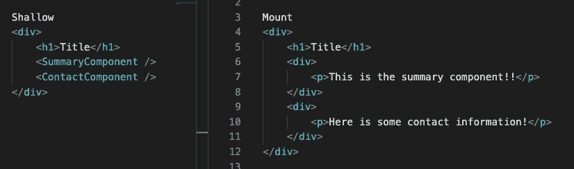

# Jest 和 Enzyme 测试驱动开发的基础

> 原文：<https://javascript.plainenglish.io/the-basics-of-test-driven-development-with-jest-and-enzyme-a97cb4c88ec0?source=collection_archive---------8----------------------->


Photo by [Jantine Doornbos](https://unsplash.com/@jantined?utm_source=unsplash&utm_medium=referral&utm_content=creditCopyText) on [Unsplash](https://unsplash.com/s/photos/code?utm_source=unsplash&utm_medium=referral&utm_content=creditCopyText)

最近，我开始学习测试驱动开发(TDD)。顾名思义，这意味着在编写任何功能代码之前都要编写测试。最多，编写一个外壳版本的代码，以便测试可以调用它，但是在编写测试之前，代码不应该起作用。

在任何真正的代码被编写之前，测试应该总是失败的。如果他们不是，你应该怀疑！否则，您不能确定您的测试实际上捕捉到了任何错误。

## **为什么是 TDD？**

TDD 是自动化的，比手工测试更有效。如果测试是提前编写的，代码往往会得到更好的规划，更容易测试和修改，有更少的错误，并且有更好的代码覆盖率。

关于提前编写测试的另一个注意事项是:测试应该基于行为而不是实现来编写。这将避免在代码改变时不得不重写测试。

## **测试类型**

有三种主要类型的测试。我们将只完成一个单元测试的例子。

**单元测试**:测试一段代码，通常是一个函数。这些测试更容易诊断，因为它们很有针对性。然而，这意味着它们也很脆弱，因为它们只能测试某些功能是否按照我们想要的方式工作。这并不意味着我们的应用程序作为一个整体在工作。

**集成测试**:测试多个单元如何协同工作。它比单元测试更健壮，因为它测试的范围更广。然而，诊断故障可能更加困难。

**验收**:端到端(E2E)测试是用户从用户界面到数据库与应用程序的实际交互方式。这通常包括硒之类的东西，这不会在本文中讨论。

因为单元测试和集成各有所长，并且可以弥补彼此的不足，所以要由程序员和他们的团队来评估两者之间的适当平衡。

## **笑话和酶**

我已经在 React 中使用 Jest 和酶开始了我的测试之旅。这篇文章假设你对 React 有一些基本的了解，并且已经用`create-react-app`设置了一个应用。这将不包括 Redux 或 Hooks。

Jest 是包含在`create-react-app`中的一个 JavaScript 测试框架，尽管它的用途并不局限于 React。Enzyme(由 Airbnb 创建)是一个库，可以更容易地专门测试 React 组件。它没有包含在`create-react-app`中，但是为了使测试更容易，它和 Jest 一起使用是很常见的。

## **浅 vs 安装**

Enzyme 创建了一个虚拟 DOM，允许在没有浏览器的情况下进行测试。通过 Enzyme，我们可以使用 jQuery 风格的选择器在 DOM 中进行搜索。渲染有两种方式。第一种方式是`shallow`渲染，它深入到代码的一个层次，而不用担心组件的子组件的行为。第二种呈现方式是用`mount`，它更深入一层，测试一个组件的子组件。两者都有利弊，这里的[和这里的](https://kentcdodds.com/blog/why-i-never-use-shallow-rendering/)和[已经详细讨论过了。因为这篇文章是关于基础的，我们将停留在浅显的一端。](/in-defense-of-shallow-rendering-5f627f7c155d)



## **创建基本测试**

终于！是时候创建一个基本测试了。对于这个测试，我们现在要做的就是确保我们的`<App />`组件被渲染。

如前所述，Jest 已经包含在`create-react-app`中。您可以通过运行下面的命令单独安装 Enzyme。

`npm install --save-dev enzyme jest-enzyme enzyme-adapter-react-16`

* *注意:在本文发表时，React 已更新为 React 17，但酶适配器 17 不可用。在大多数情况下，酶适配器 16 将会起作用。我相信存在的问题是与`mount`有关的，这里就不赘述了。然而，如果需要，这里有一个非官方的酶适配器 17。

您的主要`App`组件应该看起来像这样。如果您在`div`中修改了一些内容，这没关系，但是为了简单起见，暂时不要修改任何子组件。

默认情况下，你的`App.test.js`文件应该是这样的，但是我们很快就会做很多改变！

由于我们使用的是酶，我们可以从`@testing-libary/react`中删除导入。我们可以添加`import Enzyme, { shallow } from enzyme;`来配置`Enzyme`使用适配器，添加`{ shallow }`来创建我们之前讨论过的浅层渲染。添加`import EnzymeAdapter from ‘enzyme-adapter-react-16’`创建适配器。请注意，如果您决定使用非官方的 2017 适配器，此导入可能会有所不同，您应该参考该文档。

完全删除`test()`及其所有内容，这样我们就可以一步一步地编写一个新的。

要设置一个酶反应适配器的新实例，在导入下面添加`Enzyme.configure({ adapter: new enzymeAdapter() });`。

在我们编写测试之前，您应该运行`create-react-app`附带的脚本`npm test`。您应该会看到以下错误:

```
FAIL  src/App.test.js
  ● Test suite failed to runYour test suite must contain at least one test.at onResult (node_modules/@jest/core/build/TestScheduler.js:175:18)
      at node_modules/@jest/core/build/TestScheduler.js:304:17
      at node_modules/emittery/index.js:260:13
          at Array.map (<anonymous>)
      at Emittery.Typed.emit (node_modules/emittery/index.js:258:23)Test Suites: 1 failed, 1 total
Tests:       0 total
Snapshots:   0 total
Time:        6.499 s
Ran all test suites related to changed files.Watch Usage
 › Press a to run all tests.
 › Press f to run only failed tests.
 › Press q to quit watch mode.
 › Press p to filter by a filename regex pattern.
 › Press t to filter by a test name regex pattern.
 › Press Enter to trigger a test run.
```

如果你得到了这个错误，太好了！您的测试套件设置正确。注意，你可以使用`Watch Usage`下的任何命令。

现在，让我们写一个测试！让我们测试一下`App`组件的渲染是否没有错误。为此，编写一个新的空测试 shell。在测试中，我们想要对我们的组件`App`进行浅层渲染。我们将正在测试的组件放在从酶库导入的`shallow`包装器中。按照惯例，我们把这个叫做`wrapper`。

```
test("renders without error", () => { 
   const wrapper = shallow(<App/>);
});
```

如果你在这里运行`npm test`，你的测试应该是通过的。然而，由于这是测试驱动的开发，我们希望我们的测试在通过之前失败。为了解决这个问题，在我们正在渲染的组件的顶层添加一个`data-test`属性。在这种情况下，那就是`<App />`中的`div`。注意，你不需要使用`data-test`来工作，但这是惯例。现在让它为空，这样我们可以在测试中找到属性，让它失败。

现在，我们可以向测试中添加更多的条件。导航回`App.test.js`，在这里我们将使用`wrapper`上的`find(selector)`找到我们计划添加到浅层组件中的`data-test`值。让我们假设`data-test`值将是`component-app`。注意，选择器的属性语法在[文档](https://enzymejs.github.io/enzyme/docs/api/selector.html)中有更详细的描述。

```
test("renders without error", () => { 
   const wrapper = shallow(<App/>);
   const appComponent = wrapper.find("[data-test='component-app']")   
});
```

太好了！到目前为止，我们可以识别正在呈现的组件，并根据其值找到属性。然而，如果您运行`npm test`，您将看到测试仍然通过。这是因为到目前为止我们只定义了两个变量。我们还没有做断言语句，这是你用来实际测试某个东西的。您需要一个断言语句来抛出错误，否则您的测试永远不会失败。

为此，我们可以使用来自 [Jest](https://jestjs.io/docs/en/expect) 的`expect`断言。在这种特殊情况下，我们可以检查以确保返回的长度为 1，以确保我们只接收节点返回。一个常用的方法是`.toBe(value)`，你可以在[文档](https://jestjs.io/docs/en/expect#tobevalue)中读到更多。

```
expect(appComponent.length).toBe(1);
```

完整的`App.test.js`文件应该是这样的:

运行`npm test`如果它还没有运行，希望你会得到你的第一次失败:

```
FAIL  src/App.test.js (5.451 s)
  ✕ renders without error (11 ms)● renders without errorexpect(received).toBe(expected) // Object.is equalityExpected: 1
Received: 018 |   const appComponent = findByTestAttr(wrapper,"component-app")
      19 |   // //need this test to fail first
    > 20 |   expect(appComponent.length).toBe(1)
         |                               ^
      21 |
      22 | });
      23 |at Object.<anonymous> (src/App.test.js:20:31)Test Suites: 1 failed, 1 total
Tests:       1 failed, 1 total
Snapshots:   0 total
Time:        7.379 s
Ran all test suites.
```

完美！错误的重要部分清楚地表明，我们期望一个节点具有值为`component-app`的`data-test`属性。我们的`<App />`组件没有这个，所以测试失败了。

为了通过这个测试，您可以导航回`App.js`并在。您的文件应该如下所示。

随着`npm test`运行，应该会得到这个结果。

```
PASS  src/App.test.js
  ✓ renders without error (8 ms)Test Suites: 1 passed, 1 total
Tests:       1 passed, 1 total
Snapshots:   0 total
Time:        3.578 s, estimated 6 s
Ran all test suites.
```

我希望这篇文章对开始测试驱动开发有所帮助！这当然是一个非常基本的测试，但是这将帮助您理解为什么编写好的测试如此重要。

来源:[https://blog . log rocket . com/jest-and-enzyme-unit-testing-in-react-in-2021/](https://blog.logrocket.com/jest-and-enzyme-unit-testing-in-react-in-2021/)

[https://www . udemy . com/course/react-testing-with jest-and-enzyme/](https://www.udemy.com/course/react-testing-with-jest-and-enzyme/)