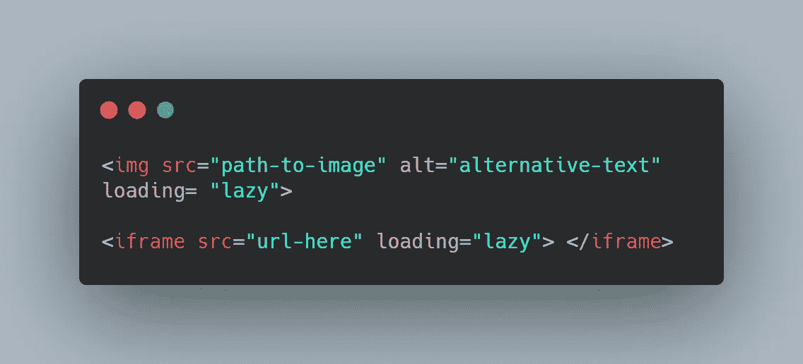
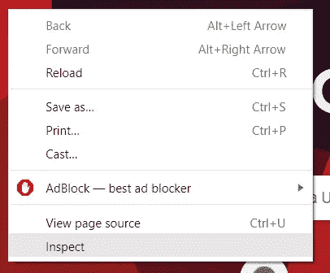
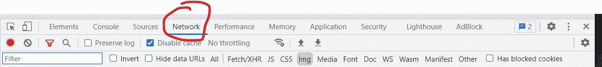
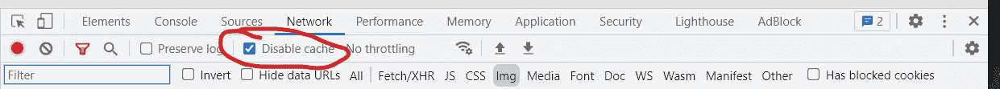
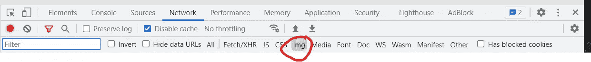
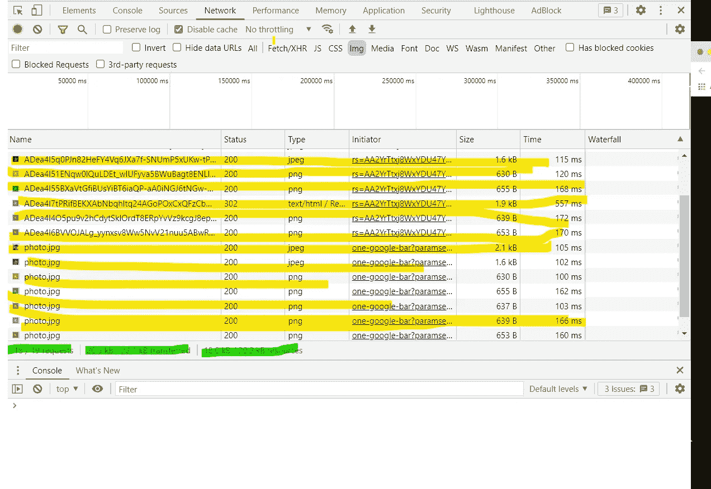

# “惰性加载”图像的初学者指南

> 原文：<https://javascript.plainenglish.io/the-beginners-guide-to-lazy-loading-images-7b49ceb9af8c?source=collection_archive---------10----------------------->

## 图片占了你网页的很大一部分！优化它们！


Photo by [Lavi Perchik](https://www.instagram.com/laviperchik/)

网站越来越多地在网页中使用更多的图片，这确实会降低网站的初始加载时间。正如分析专家尼尔·帕特尔(Neil Patel)在他的文章[中提到的，如何处理重图像的网站设计](https://neilpatel.com/blog/optimize-images-web-design/)，你应该关心网站的速度，因为它会影响网站的谷歌排名和观众保留率——以及其他原因。如果你的网站加载时间太长，浏览者更有可能点击离开你的网页。

到目前为止，我们已经讨论了实现 [CSS 精灵](https://medium.com/@kyledeguzmanx/how-css-sprites-can-improve-performance-212d01ee6605)来优化我们的网页。该方法实质上是将多个图像组合成一个图像文件。这减少了浏览器获取所有图像的请求数量。

在本文中，我们将探索延迟加载。

# 什么是懒装？

延迟加载适用于图像和 iframes。它本质上是告诉网络浏览器，“嘿，浏览器！在此图像或 iframe 在视口中可见之前，不要加载它。

换句话说，如果您必须向下滚动来查看这些图像或 iframe，那么在查看者向下滚动并实际遇到这些图像和 iframe 之前，不要获取和加载它们。

# 为什么应该使用延迟加载？

当您告诉浏览器只在用户向下滚动并遇到图像/iframe 时获取和加载它们时，它会减少浏览器最初必须加载的内容量。例如，如果您有 20 个图像，其中 18 个在初始视口中不可见(在加载您的站点时)，那么您的浏览器只需要在初始加载过程中加载其中 2 个。这样可以节省很多时间，对于使用大量图片的大型网页来说更是如此。

想象一下:加载 20 张图片中的 2 张和加载 20 张图片之间的差别。

除此之外，我们还要考虑用户体验。随着加载速度的加快，用户已经可以开始与你的网页进行交互了，尽管事实上并不是所有的内容都被加载了。但从他们的角度来看，他们甚至不会意识到并非所有的内容都已加载。他们不会意识到图像是在滚动时被获取和加载的。

因为用户可以快速地与网站互动，所以你提供了更好的用户体验。相比之下，如果没有延迟加载，网站将不得不加载整个文档中的所有 20 张图片。如果用户不得不等待很长一段时间，最后甚至不能滚动整个页面，这将是一个遗憾。

此外，作为互联网探索者，有多少次网站加载时间太长，我们点击关闭以找到一个新的网站？实现延迟加载是为了防止你的用户有类似的经历。

# 实施#1

幸运的是，HTML 为图像和 iframes 提供了一个名为“ [loading](https://developer.mozilla.org/en-US/docs/Web/Performance/Lazy_loading) 的属性。将该值设置为“懒惰”。



只需将属性附加到非关键映像和 iframes 即可开始。

有些人可能会遇到这方面的问题。如果您想测试您的延迟加载实现是否工作正常，请继续阅读。

此实施的快速求解:

*   设置图像的宽度和高度
*   [检查](https://caniuse.com/loading-lazy-attr)是否支持浏览器。您的浏览器可能不支持 loading 属性。

# 实施#2

这个实现需要更多的努力，但是非常容易。因此，有许多库和脚本提供了实现延迟加载的另一种方法。他们都做同样的事情。

我非常喜欢这个实现。这是非常简单和初学者友好的。它是由 GitHub 上一个名为 [Vanilla LazyLoad](https://github.com/verlok/vanilla-lazyload) 的库提供的。说明在自述文件或 Andrea 的个人网站上。

这个视频令人惊讶地一步一步解释了必须做的事情。它只是简单地重复了 GitHub 自述文件中的内容。

该过程从导入脚本开始。将它放在正文结束标记之前的最后一行代码中。

```
<script src="[https://cdn.jsdelivr.net/npm/vanilla-lazyload@17.5.0/dist/lazyload.min.js](https://cdn.jsdelivr.net/npm/vanilla-lazyload@17.5.0/dist/lazyload.min.js)"></script>
```

在 script 元素下面，我们将编写视频中提供的以下脚本。

```
<script>        
const myLazyLoad = new LazyLoad({            
elements_selector: "**.img-container**"        
});     
</script>
```

请注意粗体文本。这实质上是一个类选择器。如果你从来没有使用过 CSS，基本上，只需在类名后面加上一个句号。

```
.className
```

您可以选择自己的类名。您更改了类选择器。做你需要做的。

加载脚本后，我们将查看图像。

```

```

这是一个将被延迟加载的图像的例子。

首先，你会注意到这个类。如前所述，这个类名可以是您想要的任何名称。只要确保它与脚本中的类选择器匹配即可。这就是脚本如何理解您想要延迟加载哪些图像。

接下来，我们有数据-src。这将替换图像的 src 属性。它具有与 src 相同的功能目的；但是，您不能使用 src。

最后，你有你的标准替代文本。

对于 iframes 来说，这是相同的一般概念。确保您有适当的类和数据-src。有关更多信息，请查阅文档。

# 测试

最后，必须进行测试。您必须看到您的延迟加载过程实际上减少了处理时间。

首先，在实现延迟加载之前，收集关于您的网站的数据。然后实现懒加载，收集数据。最后，对比一下。

这是你如何做的。

1.  在浏览器上查看您的网页。
2.  右键单击。单击检查



3.在最顶端，单击网络



4.标记“禁用缓存”

基本上，当您访问网站时，您的浏览器可能会暂时保存资源。这样，如果您再次访问该网站，它将已经加载了资源。它将不必与服务器通信来检索它们。我们想禁用它。



5.选择图像

我们只想看看图像是如何加载的(最初和滚动时)。



现在，我们准备好出发了。



这是你的检查器标签应该看起来的样子。黄色显示为您的网页加载的图像列表。

在实现延迟加载之前，您应该看到网页上所有图像的列表。在延迟加载之后，您应该看不到列表中的所有图像。当你滚动时，新的图像应该出现在列表中。

另外，用绿色突出显示的是发出的请求数、传输的数据和使用的资源数。

在实现了延迟加载之后，请求的数量应该会减少。不应该是零，但绝对应该更低。此外，传输的数据量也应该更低。

通常，在以绿色突出显示的文本所在的同一行中，可能还有以毫秒或秒为单位的总加载时间。如果您能看到，则该数字也应该减少。

希望整个过程是成功的。现在，您可以在您的站点中实现延迟加载，并改善您的用户体验！

*更多内容看*[***plain English . io***](http://plainenglish.io/)