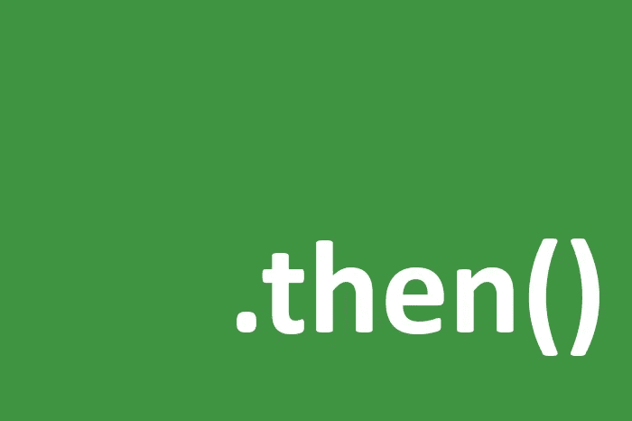

# JavaScript 中可命名对象的好处

> 原文：<https://javascript.plainenglish.io/the-benefit-of-the-thenable-object-in-javascript-78107b697211?source=collection_archive---------3----------------------->

`thenable`对象、`promise`和`async/await`的关系

如果你使用像`[**mongoose**](https://mongoosejs.com/)`、`[**knex**](http://knexjs.org/)`和其他一些类似的库——它们有某种可链接的方法，也异步运行——你也应该读读这篇文章。

你可能已经听说过`thenable`对象、`promise`和`async/await`。如果你还没有或仍然没有得到它们之间的关系，不要担心，我们会在这里完全覆盖。

## 什么是“可”对象？

`thenable`对象的定义是世界上最简单的事情:

> 任何包含名为"`then”` 的方法的对象都被称为"可命名"对象。

例如:

这个对象(`obj`)是一个`thenable`对象。

*注意:一个* `*thenable*` *对象可以有任何其他属性和方法，也可以有任何名称，但是它必须有一个名为* `*then*` *的方法才能成为一个* `*thenable*` *对象。*

## “能”的对象和“承诺”的关系？

简单来说**每个** `**promise**` **对象只是一个** `**thenable**` **对象**，因为它有一个`then`方法(用来访问一个`**settled** promise`的结果)。就是这样。

但是要记住，这种关系不是反过来，也就是说**每一个** `**thenable**` **对象都不是一个** `**promise**` **对象**。

## “能”、“答应”和“异步/等待”的关系

`then`关键字只是一个约定，定义它是为了让生活变得更容易。

例如，现在我们都知道要访问一个承诺的结果，我们应该调用它的`then`方法。名字不是`exec`、`run`、`get`、`map`或其他任何引起混淆的东西。

这种命名约定也帮助我们在 JavaScript 中拥有了`async/await`语法。但是怎么做呢？

看看下面的代码，看看它的神奇之处:

*如果你不熟悉 IIFE 函数的话，可以查看一下这篇* [*文章*](https://developer.mozilla.org/en-US/docs/Glossary/IIFE) *。*

您可能已经在代码中使用了`async/await`语法，并且知道如何使用它。

但是你也知道`async/await`是如何工作的吗？

这里我们不打算完全覆盖`async/await`场景的背后。然而，如果你对此感到好奇(你应该感到好奇)，你可以看看这篇文章来了解它是如何工作的。

## “`async/await”`如何工作的简要说明

你要知道，每当你在任何函数(对象)前放一个`await`关键字，JavaScript 只是试图调用那个对象的`then`方法。

也因为`async/await`语法是由`[generator](https://developer.mozilla.org/en-US/docs/Web/JavaScript/Reference/Global_Objects/Generator)`函数实现的，而`await`关键字正好被使用，而不是`yield`关键字，所以`async`函数需要在调用`then`方法后恢复。为了处理这个操作，`async`函数还向`then`方法发送一个回调，作为包含恢复自身功能的参数。

我知道这听起来有点模糊，为了更好地理解这个概念，您应该查看这个示例代码:

你可以自己运行这段代码并查看结果。

如果您查看输出，您可以看到几乎一切都按预期运行。但是我们仍然没有上一次`console.log(‘end’)`的结果，操作在那一点上有点冻结。

冻结的原因是因为已经发送给`then`方法的回调函数还没有被调用来恢复`async`函数。

为了解决问题，我们应该只调用回调来继续操作。

此外，如果您将任何值作为参数发送给回调，您将通过`await`关键字获得它(参见下面的代码):

现在一切都完美了。

## 主要议题

我猜到这里你已经知道我们在谈论什么了，你可能会发现`mongoose`、`knex`和其他一些库是如何通过调整代码来工作的。

提醒一下，这些库是可以链接的，无论何时你在它们后面放一个`await`关键字或者在它们的链接中调用`then`方法，它们就像一个`promise`对象一样工作。

在下文中，我们打算通过一个简单的例子来演示一个可链接的对象，这个对象可以通过`await`关键字和/或`then`方法来运行。

我们期望从这个愚蠢的例子中实现的功能是一些简单的数学方法(即`add`、`sub`、`mul`、`div`)，每当我们使用`await`关键字时，它将运行主异步操作并返回相应的结果(可以是`fulfilled`或`rejection`)。

如果最终值的余数除以 2 大于零或不等于零(`*n % 2 !== 0*`)，则完成主异步操作，否则将被拒绝。

现在我们有了一个异步函数，让我们实现另一个可以链接的简单函数。

> 注意:我只是拒绝在这里使用`this`关键字，以避免一些人对它的混淆。

现在该功能(`mathOp`)可以这样使用:

是时候抓住要点，给这个可链接的对象添加神奇的`then`方法，并在其中运行`asyncFunction`。然后返回它的结果(这是一个`promise`对象)。

*提醒:不要忘记回调函数将由* `*await*` *关键字自动发送。*

这是`then`方法的全部实现。很简单，不是吗？

让我们把它放在`op`对象内部:

现在，您可以运行下面的代码来查看结果:

到目前为止，听起来它工作得很完美，但是让我提醒你，我们没有处理由`asyncFunction`的`rejection`状态引起的错误。

首先，为了处理错误，除了`then`方法之外，我们还需要一个`catch`方法。

将此方法放在`op`对象内`then`方法的旁边。

关于`catch`方法没有什么特别的，我们只是添加了它，我们可以自己在链接方法上使用它——它的工作方式类似于链接上的`then`方法，并且还向返回的`promise`对象上的`catch`方法发送回调。

在处理错误的下一步中，我们需要调整我们的`then`方法。

如果你想知道为什么我们需要改变`then`方法来处理错误，以及它们之间的关系，让我告诉你`async/await`的另一个秘密。

我必须承认，我已经对你撒了谎，关于那个`await`关键字，我说它只是在调用`then`方法时发送一个回调，我对那个家伙感到抱歉，因为它发送了两个回调。

作为提醒，我们应该提到`promise`对象上的`then`方法接受两个回调，但是第二个是任意的，用作捕获错误的回调——就像`catch`方法一样。

*如果你很好奇* `*promise*` *是怎么工作的，你应该去看看这本* [*书*](https://github.com/Babak-Gholamzadeh/Understanding-the-Core-Ideas-of-Promise-by-Implementing-it-in-JavaScript) *。*

如果您像下面的代码一样更改`then`方法体，您将看到与下面相同的输出:

太好了！现在我们也可以在`try/catch`块中使用带有`await`关键字的`mathOp`函数来处理错误。

我们已经完成了错误处理和愚蠢示例的全部功能。

最后，我们还可以做一些有趣的事情，让代码更简洁。

## 包扎

我希望这篇文章对你有用。

如果有任何不清楚或模棱两可的部分，请随时在评论区提出您的问题，或者您可以直接给我发消息。