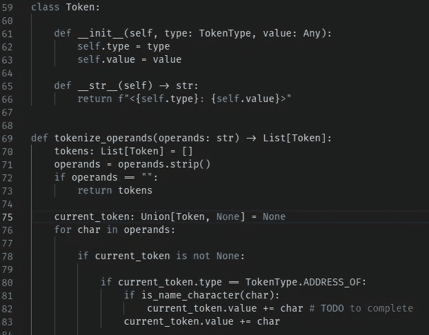

# 编程的最佳字体

> 原文：<https://javascript.plainenglish.io/the-best-font-for-programming-35f37018df05?source=collection_archive---------3----------------------->

使用 Fira Code(一种为程序员创建的字体)提高代码的可读性和美观性。

Photo by [Daniela Turcanu](https://unsplash.com/@protopopica?utm_source=medium&utm_medium=referral) on [Unsplash](https://unsplash.com?utm_source=medium&utm_medium=referral)

作为程序员，我们花大量的时间在屏幕前，盯着我们的代码。因此，对你的设置感到舒适是很重要的；高质量的监视器优于低分辨率的监视器；高性能的计算机比速度慢的要好。

当涉及到你的代码时，字体可以决定一个普通的和一个优秀的开发者体验。选择一种好的文本字体可以提高代码的可读性，并且可以让您在开发环境中感觉更加舒适。你是愿意盯着令人不快的代码行看，还是愿意使用更好的字体？

*免责声明:我与该产品无关，也不受其赞助。我个人认为这是最好的编程字体。*

## 展示 Fira 代码

[Fira Code](https://github.com/tonsky/FiraCode) 是一个很棒的无资金的自由时间项目。它基于 [Fira Mono](https://github.com/mozilla/Fira) 并由 [Nikita Prokopov](https://tonsky.me/) 开发。它提出了一个免费的[等宽字体](https://en.wikipedia.org/wiki/Monospaced_font)专为程序员设计。除了简洁美观之外，它还支持[连字](https://en.wikipedia.org/wiki/Ligature_(writing))。

注意，你可能不熟悉连字，它们是两个或更多的字素融合成一个符号。它们通常用于样式和可读性目的，就像 Fira 代码一样。

以下是 Fira 代码最重要特性的简要列表:

*   更好的字符间距。

*   面向 C 和 C++开发人员的真正的箭头操作符和更好的名称空间成员符号。

*   更好的等式和比较运算符，包括 JavaScript 的严格等式。

*   巨大的 Unicode 覆盖率使它成为数学写作的优秀字体选择，例如在文档中。

## Fira 代码兼容性

Fira 代码可以与大多数流行的代码编辑器和 ide 完美兼容，包括 VSCode、Atom、Eclipse、Sublime Text 和 JetBrains 的产品。完整的兼容性列表可在[这里](https://github.com/tonsky/FiraCode#editor-compatibility-list)找到。

Fira 代码也是终端的一个可用选项，尽管它没有得到广泛的支持，尤其是在 Linux 控制台上。

Fira 代码也可以在 web 中使用。大多数流行的浏览器都支持它，包括 Chromium(谷歌 Chrome)、Safari 和 Firefox。关于在网页上使用这种字体的更多信息，请查看[这个](https://github.com/tonsky/FiraCode#browser-support)。

## 安装 Fira 代码

在 Fira Code 的 GitHub [页面](https://github.com/tonsky/FiraCode#download--install)你会发现一个`.zip`文件的下载按钮。然后，您必须提取其内容并安装字体。

在 Windows 上，打开`ttf`文件夹，选择所有字体文件。右击并选择`Install`。

在 macOS 上，选择`ttf`文件夹中的所有字体文件。右击并选择`Open`，然后选择`Install Font`。

在 Linux 上，有很多方法可以安装 Fira 代码。一些发行版有自己的包，而其他的有其他的方法。您下载的`.zip`附带的`README.txt`文件中有主要发行版的说明。

## 在代码编辑器中启用 Fira 代码

由于 VSCode 是最流行的 IDE，我将展示如何专门为它启用 Fira 代码。您可以在与字体一起下载的`README.txt`文件中找到其他代码编辑器的说明。

现在，您可能需要重新启动代码编辑器来应用更改。

## 结论

总而言之，在一个舒适的环境中开发会大大提高你的整体生产力。代码字体是您的设置中最不明显的变量之一，但它们可以通过增加代码可读性和美观性来区分一般体验和良好体验。

> 工作占据了大多数人的时间:你最好享受它。

如果你知道任何其他好的字体或想添加一些东西，请在评论中分享你的想法。我希望你喜欢这篇文章，

**感谢阅读！**

*更多内容请看*[***plain English . io***](http://plainenglish.io/)