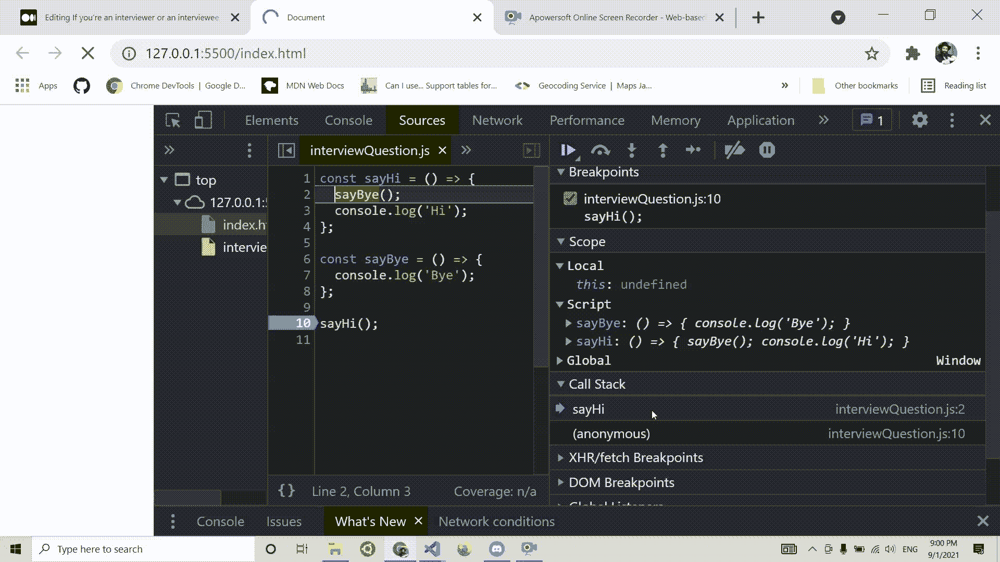

# 我遇到过的最好的 JavaScript 面试问题

> 原文：<https://javascript.plainenglish.io/the-best-javascript-question-for-an-interview-f24435471d9c?source=collection_archive---------1----------------------->


面试可能会让人精疲力尽。我们倾向于认为，只有被面试者日子不好过:坐在椅子上，汗流浃背，想尽办法给面试官留下好印象。

但实际上，面试对面试官来说也是一个令人厌倦的过程。他不仅要面试几十个甚至几百个候选人，而且面试本身有时也会很艰难，因为很难真正评估候选人的技能。

无论你是面试官还是被面试者，我都想向你介绍一个我遇到过的最棒的面试问题。

为什么这么伟大？因为它在一个代码块中涵盖了大量的 JavaScript 核心概念。

让我们来看看这个问题:

```
for(var i = 0; i<5; i++) { setTimeout(()=> console.log("i = ", i), i*10); }
```

**1。产量是多少？**

**2。怎么修？**

花几分钟时间考虑一下。

在回答第一个问题之前，我们先来分析一下代码。我们有一个 for 循环，只要“I”小于 5，它就一直运行，并且每循环增加“I”。

在 for 循环中，我们有一个超时，它在回调函数中记录“I”的值(并将其倒计时时间设置为“I”乘以 10)。

我们期望在控制台中看到什么？i=0，i=1，i=2，i=3，i=4。

# JavaScript 调用堆栈和事件循环

你可能已经猜到这不是正确的答案。控制台将打印 i=5 五次。现在是有趣的部分——为什么？

首先，我们必须了解 JavaScript 如何处理超时功能，或者更准确地说，JavaScript 如何处理异步任务。

在 JavaScript 中，我们有调用栈。顾名思义，调用栈是一堆调用——函数调用。

JavaScript 是单线程的，这意味着它一次只能处理一个任务。当它到达你的代码块中的一个函数时，它会把它堆在调用栈中并执行它。

如果该函数有更多的回调，它们将在其上堆叠，并且当它们完成执行时，它们将按照它们进来时的顺序退出调用堆栈。这被称为 FILO 数据结构:先入—后出。

让我们看看下面的代码片段在调用堆栈中会是什么样子:

```
const sayHi = () => {sayBye();console.log('Hi');};const sayBye = () => {console.log('Bye');};sayHi();
```



我们调用`SayHi()`函数，在函数体中调用`sayBye()`函数。`sayHi()`函数进入堆栈，紧接着，`sayBye()`函数被堆叠在它上面。当`sayBye()`执行完毕，它将退出调用栈，之后`sayHi()`也存在。

但是在处理异步操作时，JavaScript 的行为有点不同。例如，如果我们有一个超时，我们不希望 JavaScript 引擎等待所有的倒计时时间，直到它继续下一行代码(记住 JavaScript 是**单线程**)，对吗？

有什么解决办法？JavaScript 会将该任务(处理超时或任何其他异步操作)交给浏览器 API，该 API 运行在与 JavaScript 单线程引擎不同的环境中。

当计时器的倒计时结束时，浏览器 API 会将超时函数“推”到事件循环中。

就事件循环使用的数据结构而言，它与调用堆栈略有不同。事件循环使用队列数据结构，这意味着它是 FIFO:先进先出。当 JavaScript 引擎清除调用堆栈时(因此当它完成运行代码时)，事件循环将采取行动，并开始将队列中的任务推送到调用堆栈。

如果我们再看看上面的面试问题，那么我们可以这样解释:

在第一轮中，JavaScript 将检测超时功能，并让浏览器 API 处理倒计时。浏览器 API 会立即将回调函数推送到事件循环中(因为时间设置为 0)。事件循环现在正在等待代码的剩余部分(在本例中是 for 循环)完成。

同时，另一个超时被发送到浏览器 API，10 毫秒后，它也将被推送到事件循环。现在，事件循环中有两个任务等待进入堆栈。诸如此类。

当 for 循环结束时，事件循环会将队列中的任务一个接一个地抛出到调用堆栈中。如前所述，第一个进入事件循环的任务是第一个退出的任务(并进入调用堆栈)。

# 函数范围和块范围

但是为什么它会打印 i=5 五次呢？答案在于我们使用了 var 关键字。

您可能已经知道，每个变量都有自己的“范围”。范围意味着变量将被“锁定”在特定的区域中。在 JS 中，我们有 3 个主要作用域——全局作用域、函数作用域和块作用域。

如果我们在函数之外声明一个变量，它将被认为是全局变量。像这样:

```
const globalScope = 'global';
var alsoGlobalScope = 'global';function functionScope() {
const insideFunctionScope = 'function scope';
var alsoInsideFunctionScope = 'function scope';}
```

但是对于块范围，我们有一个不同的行为来比较 let 和 const 与 var。

虽然 const 和 let 在 if/for 语句中声明时会“接受”block 作用域，但 var 不会将其视为单独的作用域。就好像我们在那个范围之外(全局地)声明了它。

这里有一个简短的片段，可以帮助我们形象化它:

```
if(someValue) {
const insideBlock = 'inside';
}
console.log(insideBlock) // Uncaught ReferenceError: insideBlock is not defined

if(someValue) {
var insideBlock = 'inside';}console.log(insideBlock); // output: inside
```

# 关闭

让我们看看 [MDN 对闭包有什么看法](https://developer.mozilla.org/en-US/docs/Web/JavaScript/Closures):

> *闭包是对其周围状态(词法环境)的引用捆绑在一起(封闭)的函数的组合。换句话说，闭包允许您从内部函数访问外部函数的范围。在 JavaScript 中，闭包是在每次创建函数时创建的。*

好吧，这是官方的定义。听起来有点吓人？让我们简化一下:

闭包意味着在 JavaScript 运行代码之前，它会寻找函数中的所有变量。

如果它在一个内部没有声明(let、const 或 var)的函数中看到一个变量，但是在一个外部作用域(函数嵌套在其中)中，它会将该变量的值“锁定”在给定的函数中。

你还困惑吗？考虑下面的片段:

```
const myOuterFunction = () => {
  let variableInOuterFunction = 'Hello World';
 const myNestedFunction = () => {
    console.log(variableInOuterFunction);
  }; myNestedFunction();
}; myOuterFunction();
```

注意我们如何在`myNestedFunction`中使用`variableInOuterFunction`(在`myOuterFunction`中声明)？这就结束了。值“Hello World”现在在嵌套函数中被“关闭”(锁定)。听起来很简单，对吧？

现在我们可以理解为什么使用 var 声明会产生五次“i=5”了。

如果我们试图在脑海中画出它的样子，我们可以这样想:

```
//First round in the for loop
var i = 0;
setTimeout(() => console.log('i = ', i), i * 10); // sent to browser API and then to the event loop queue//Second roundvar i = 1; // same variable being override since it's the same scope.setTimeout(() => console.log('i = ', i), i * 10); //sent to browser APIoutput: i=1 X 2
```

或者像这样，如果你喜欢:

```
var i = 0;while (i < 5) {setTimeout(() => console.log('i = ', i), i * 10);i++;}
```

关键是，即使我们在每一轮中都有一个闭包(我们在超时函数中使用“I”变量)，环境的上下文总是相同的。因为我们只有一个“I”变量，所以当所有超时函数调用从事件循环返回时，除了最终值之外，什么都不会传递给它们。

对于 let 或 const 声明，它看起来完全不同。每次循环运行时，都会创建一个新的作用域，在嵌套的超时函数中锁定“I”的值。

你可以这样想象(用函数作用域来形象化):

```
*//First round in the for loop*const firstRound = (() => {let i = 0;setTimeout(() => console.log('i = ', i), i * 10); *// sent to browser API and then to the event loop queue*})()*//Second round*const secondRound = (() => {let i = 1;setTimeout(() => console.log('i = ', i), i * 10); *// sent to browser API and then to the event loop queue*})()*//yields i =  0  i =  1*
```

再次强调，这里的关键点是`setTimout`函数将记住它被触发的范围，当从事件循环中返回时，它将在记住的范围内使用变量。

在第一个场景中，当我们使用 var 声明时，`setTimout`记忆的范围是全局范围，由于我们在这个范围内只有一个变量，它将使用最终值(5)。

在第二个场景中，我们每一轮都有不同的范围，因此有一个新的“I”变量。

# 提升

人们经常错误地认为提升意味着将变量(使用 var 关键字)和函数的声明移到代码的顶部。

嗯，实际上没人会碰你的代码，不用担心。

那么，提升到底是怎么一回事呢？

在 JavaScript 引擎继续逐行执行我们的代码之前，它将对代码进行一次介绍性的会话。这就是所谓的解析时间。

它遍历代码，寻找变量和函数的声明。

一旦找到，它将把它们存储在内存中，或者更确切地说，在内存中保留一个特殊的位置(对于变量，它将在内存中保留一个未定义的位置作为值，对于函数，整个函数将保留在内存中)。

现在，当 JS 引擎运行代码时，如果它发现一个函数调用或变量在被声明之前就被使用了(在代码的底部),它将不会被“吓倒”,因为正如我们所说的，它将它们存储在内存中。

那么在我们的面试问题中，提升在哪里呢？

实际上，非常简单。所有的 var 声明都被提升到代码的顶部。由于它们都声明同一个变量(I)，结果我们只有一个变量声明。像这样:

```
var i;
for(i=0; i<5; i++) {setTimeout(()=> console.log("i = ", i), i*10);}
```

# 如何解决

我们已经看到了如何使用 var 关键字解决这个问题。但是有另一种方法可以解决这个问题。有其他解决方案的想法吗？你应该能够用你到目前为止学到的知识解决这个问题。花点时间考虑一下。

明白了吗？

如果我们创建一个新的函数来保存我们的超时逻辑，我们将在每次迭代中创建一个新的闭包。让我们看看它是什么样子的:

```
const doSetTimeout = (i) => {
  setTimeout(() => { console.log(i) },i*10);
}for (var i = 0; i < 5; i++)
  doSetTimeout(i);
```

现在我们将“I”的值传递给我们的`doSetTimeout`函数。由于每次迭代都会创建一个带有参数值“I”的新闭包，所以我们会像预期的那样在控制台上打印 0，1，2，3，4。

# 结论

我相信这篇文章的关键在于，为了在面试中取得成功，你必须非常了解 JavaScript 的核心概念。

即使你没有说出正确的答案——继续向面试官解释 JavaScript 是如何在幕后工作的。一旦你表现出你对这个问题很了解，我相信你会给面试官留下一个好印象。

面试官也是一样——不要期望你的面试者把所有事情都做对。面试可能是一件令人紧张的事情，他的精神可能不在最佳状态。相反，鼓励他展示他的知识，并以此来评估他。

*更多内容尽在* [***说白了. io***](http://plainenglish.io/) *。报名参加我们的* [***免费周报***](http://newsletter.plainenglish.io/) *。在我们的* [***社区获得独家访问写作机会和建议***](https://discord.gg/GtDtUAvyhW) *。*