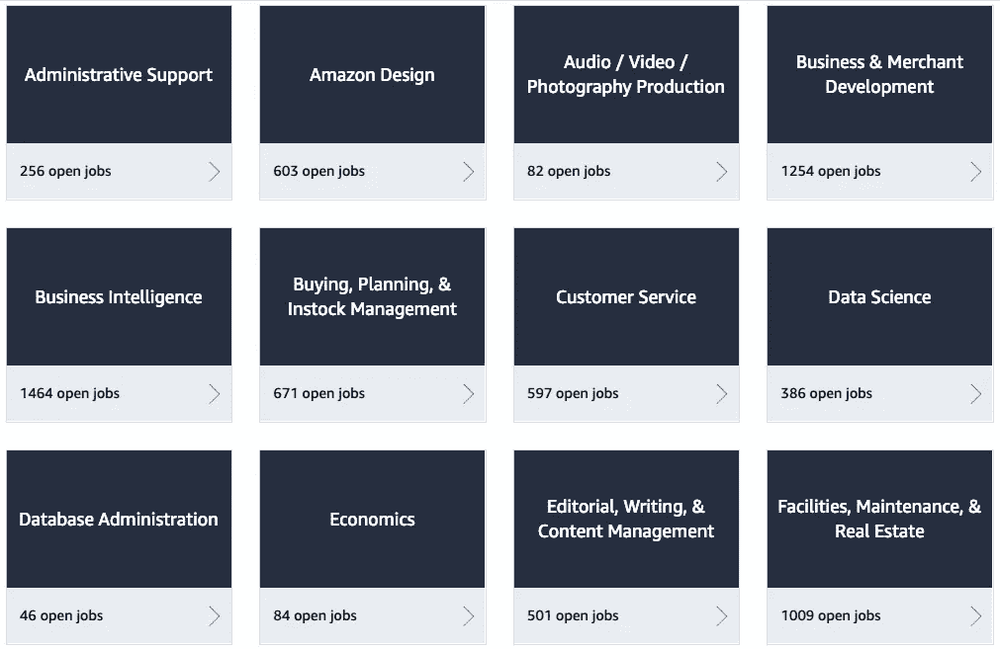
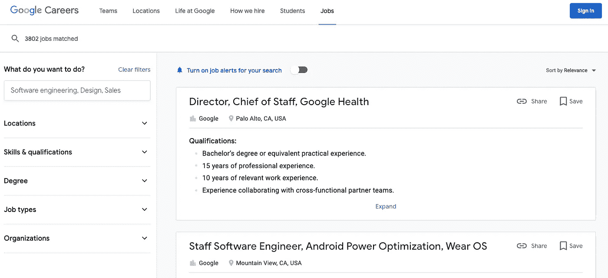
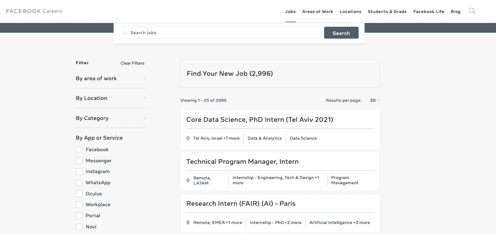

# 对程序员来说最好的工作公告板

> 原文：<https://javascript.plainenglish.io/the-best-job-boards-that-exist-for-programmers-57d83b47ed38?source=collection_archive---------16----------------------->

## 但大多被无意忽略。

Image captured by the author on Amazon.jobs

找到一份高薪程序员的工作，并为你的职业发展提供挑战，并不是一件容易的事情。在许多情况下，你会觉得你会去同样的地方，但找不到有吸引力的报价。

发生这种情况是因为你可能没有找到寻找技术工作的理想地点。因此，我要告诉你，对于程序员和其他与技术相关的职业来说，哪些是最好的工作板块。也许其中就有你们期待已久的提议。

# 亚马逊工作

你愿意为亚马逊工作吗？你可以在你的求职网站亚马逊工作平台上找到这个机会。不同的专业有成千上万的工作机会，与编程相关的简介是最受欢迎的。此外，它还提供远程或虚拟位置，让您可以在家工作。

Amazon job board 界面可以帮助你找到一个理想的职位，这要归功于它按照工作形式(全职或兼职)、城市进行的过滤，甚至可以将需要你亲自到场的职位与你可以远程执行的职位分开。

亚马逊一般会频繁更新职位空缺。因此，你不会看到像其他传统的招聘信息那样浪费你时间的旧招聘信息。

Image captured by the author on Amazon.jobs

# 谷歌工作

由于其创造性、活力和灵活的工作环境，谷歌已经成为每个程序员或技术专业人员都渴望工作的公司之一。如今，在谷歌申请工作比以往任何时候都容易，这要感谢它的工作委员会。

世界上最常用的搜索引擎有一个非常直观的工作平台，它可以根据你的专业、地点和特定技能来筛选可用的职位，以提供符合你工作愿望的空缺职位。

你在谷歌求职板上搜索得越具体，就越容易找到与你技能相符的职位。

我在 it 部门找到了 3000 多个与技术世界相关的职位。因此，我认为它是程序员最好的工作平台之一。

Image captured by the author on careers.google.com

# 脸书职业

脸书不仅仅是嘲笑那些只有开发者才懂的有趣的迷因。

它的求职板被命名为“脸书职业”,如果你想作为个人贡献者或领导工作团队，它允许你根据你的工作领域、工作天数，甚至通过应用程序或服务找到技术职位:脸书、WhatsApp、Instagram 等。你能想象用你的技术天赋改善你最喜欢的应用程序的体验吗？

Image captured by the author on facebook.com/careers/jobs

# LinkedIn 工作

当然，我们不能把 LinkedIn 排除在程序员的最佳工作平台之外。除了提供空间来提升你在互联网上的职业形象，它还有自己的求职平台。

它看起来像任何其他正常的工作板，有过滤器，可以方便地访问适合你的职位。

你可以根据你的经验水平、招聘信息的发布日期、公司、雇佣类型以及你是否希望工作地点偏远来筛选职位空缺。

寻找 LinkedIn 程序员工作的最大好处是，在广告下面，你可以看到招聘人员或发布招聘信息的人的简介。所以你可以和他们联系，扩大你未来的工作关系网。

Image captured by the author on linkedin.com/company/linkedin/jobs/

不要浪费外面的工作机会。有些公司提供有竞争力的薪水和有趣的工作环境。你可以找到简历技巧，可以准备关于编程的面试问题，甚至可以在网上搜索到你在申请前过程中可能遇到的技术测试。

您也可以遵循以下提示:

*   不要伪造简历，如实回答面试问题或测试。
*   在你去面试之前，对你申请的公司做些调查。
*   工作经验不多就不要要求太高。
*   早点去参加工作面试。
*   穿着给人留下深刻印象。不要穿你的帽衫去面试。

祝你好运。

*更多内容尽在*[*plain English . io*](http://plainenglish.io/)