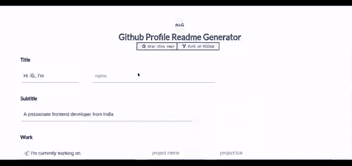

# 适合您的 GitHub 个人资料的最佳自述文件生成器

> 原文：<https://javascript.plainenglish.io/the-best-readme-generators-for-your-github-profile-ea4f50559d87?source=collection_archive---------2----------------------->

相信我，为你的 GitHub 个人资料写下标记语法并创建一个自述文件是非常令人厌倦的。但是读完这篇文章后，你可以马上写一篇类似[的自述文件给我。](https://github.com/mohithgupta)

因此，在今天的帖子中，我将分享我的最佳选择，以便立即为您的 GitHub 个人资料生成一个自述文件。

首先——为了能够生成一个特定于您的个人资料的自述文件，您需要用您的 Github 用户名创建一个存储库，并用自述文件初始化它(会有一个复选框这样做)，或者以后创建它。

**Ex** :我的用户名是“莫希古普塔”。因此，我需要创建一个名为“mohithgupta”的新回购，并选中“用 README 初始化该回购”框

**我的最佳选择是:**

 [## GitHub 配置文件自述文件生成器

### 使用这个惊人的自述文件生成器美化您的 github 个人资料。

rahuldkhain . git hub . io](https://rahuldkjain.github.io/gh-profile-readme-generator/) 

git hub Link:
[https://git hub . com/rahuldkjain/git hub-profile-readme-generator](https://github.com/rahuldkjain/github-profile-readme-generator)

星形:6.8k
叉:1.3k

这使得工作更容易，因为网站非常简单。没有“外表花哨但这是干什么的”之类的东西。像馅饼一样简单。
我用这台发电机把[变成了我的](https://github.com/mohithgupta)，我建议你也这样做。

**引起我注意的其他自述文件生成器是:**

 [## GitHub 配置文件自述文件生成器

### 用 Vue.js 制作的超级简单的 GitHub 配置文件自述文件生成器，它允许您创建漂亮的自述文件…

artursmirnovs . git hub . io](https://arturssmirnovs.github.io/github-profile-readme-generator/) 

git hub Link:
[https://git hub . com/artursmirnovs/git hub-profile-readme-generator](https://github.com/arturssmirnovs/github-profile-readme-generator)

星:490
叉:47

 [## GitHub-rahulbanerjee 26/githubprofilereadmegegenerator:为…生成一个很酷的自述文件/关于我的页面

### 本文包含 gif 资源、免版税的图像/图标以及关于如何为…创建秘密报告的教程

github.com](https://github.com/rahulbanerjee26/githubProfileReadmeGenerator) 

github Link:
[https://github . com/rahulbanerjee 26/githubprofilereadmegegenerator](https://github.com/rahulbanerjee26/githubProfileReadmeGenerator)

星星:94
叉子:18

您可能会发现下面的自述文件生成器比上面的更烦人，因为您需要运行一些命令来生成自述文件。此外，您不能编辑您已经输入的内容，因为它是从命令行输入的。
但是这个回购有 **9K 星**，这解释了有多少用户喜欢这个发电机，因此它是首屈一指的，并且可以工作。

您可以在 Github repo 中找到关于“如何使用”和其他内容的更多详细信息:

 [## GitHub-kefranabg/readme-MD-发电机:📄生成漂亮的 README.md 文件的 CLI

### 生成漂亮的 README.md 文件的 CLI。readme-md-generator 将通过阅读您的…

github.com](https://github.com/kefranabg/readme-md-generator) 

Stars: 9K
Forks: 876

这个 Github 自述文件可以作为访问您的个人资料的人的作品集。
所以，花些时间和精力，用一种吸引人的方式来创造它。
有很多招聘人员会用有吸引力的 Github 自述文件联系这些人，当然是用合适的项目:)

这就是今天的帖子。如果你在生成自述文件时遇到任何困难，你可以通过推特[联系我或者发邮件到 mohithguptak@gmail.com](https://twitter.com/tobeawebdev)

顺便说一句，你可以看看我其他一些受欢迎的帖子:

[**脚本下载 Google Drive**](https://mohithgupta.medium.com/how-i-coded-a-script-to-download-the-download-restricted-files-of-google-drive-718e74c55a68?source=your_stories_page-------------------------------------)[**只需 1 次点击**](https://python.plainenglish.io/play-youtube-videos-in-vlc-with-just-1-click-2baca84c03f3)[**就能在 VLC 播放 YouTube 视频我黑了 Chrome 恐龙游戏。下面是我如何做到的**](/an-immortal-dinosaur-and-the-fastest-too-hack-the-dino-game-7c5716c53e8b)[**转换你的’。py '到 a '。exe '文件，只有两个命令**](https://python.plainenglish.io/convert-your-py-to-exe-with-just-2-commands-4c6cefe9af4c)

希望你喜欢并发现这篇文章有用。下一集见。阿德乌斯。

*更多内容请看*[***plain English . io***](http://plainenglish.io/)