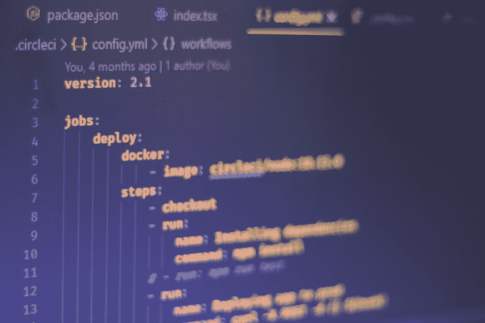

# 2021 年学习 Web 开发的最佳资源

> 原文：<https://javascript.plainenglish.io/the-best-resources-to-learn-web-development-in-2021-e315859afbd?source=collection_archive---------20----------------------->

Photo by [Ferenc Almasi](https://unsplash.com/@flowforfrank?utm_source=medium&utm_medium=referral) on [Unsplash](https://unsplash.com?utm_source=medium&utm_medium=referral)

嘿伙计们！在这篇文章中，我想与你分享学习 web 开发的最佳资源，这是我通过大量研究了解到的。

## **课程平台/在线训练营**

1.  Coursera

Coursera 是美国海量在线课程平台。它目前有大约 7600 万学习者，并与 200 多所大学合作，包括耶鲁大学、斯坦福大学、麻省理工学院、普林斯顿大学等。虽然大多数课程是付费的，但也有几门免费课程。

2.Edx

Edx 是另一个很棒的在线课程平台。edx 的机构合作伙伴包括许多著名的大学，如斯坦福大学、哈佛大学等。大量的课程是免费的，尽管你也可以获得付费证书。

3.树屋

对于喜欢从互动视频课程中学习的人来说，Treehouse 是一个非常棒的资源。它很贵，但是内容质量很高。如果你愿意花相当多的钱在你的改进上，请检查一下。

4.乌德米

Udemy 是一个相当大的课程平台，采用按课程付费的模式运营。这样做的好处之一是你可以选择你负担得起的课程，而且你只需要为此付费。

5.自由代码营

这可能是我在列表中最喜欢的一个，因为它是完全免费的，而且它有一个非常好的设计课程，所以你只需要遵循它就可以成为一名 web 开发人员。除了提供结构化的路径，它还为您提供完成课程后的证书。

6.奥丁计划

Odin 项目类似于 freecodecamp，因为它也是完全免费的。但是，它以 Ruby 编程语言为中心，不像 freecodecamp 那样教授 JavaScript。

7.乌达城

如果你对编程非常认真，Udacity 是一个很好的学习平台。它提供高质量的课程，但比提到的其他课程平台要贵得多。它得到了谷歌、美国电话电报公司、IBM 等大型科技公司的认可。如果你想从事网页开发，你应该研究一下。

## **书籍**

书籍是传统的知识来源。以编程为例，虽然大部分的学习资料都在网上，但还是有大量的书籍。

1.  HTML 和 CSS——设计和构建网站

这是一本适合新手的好书。这本书将教你快速开发简单而漂亮的网站所需要知道的一切。这本书的写作方式也是为了吸引读者的注意力。这是每个网络开发者的必读之作。

2.Marijn Haverbeke 雄辩的 JavaScript

这是一本非常好的教你 JavaScript 语言的书。这本书充满了有趣的练习，如果你通过这本书来学习，你应该能够开发功能丰富的网站。这可能是有史以来最好的 JavaScript 书籍。

3.戴维·托马斯和安德鲁·亨特的《实用程序员》

这本书可能不是专门针对 web 开发的，但它是专注于编程中经常被低估的方面(如编写高效代码和程序员心态)的最佳书籍之一。我认为这是每个开发人员的必读之作。如果你读了这本书，你将能够深刻理解编程的细微差别。

4.史蒂夫·克鲁格的《不要让我思考》

这是一本关于 UX 设计的书。这本书将教你如何创建人们喜欢访问的好网站。这本书是由世界上研究 UX 的最好的权威之一写的，如果你想开发人们喜欢使用的网站，这可能是最好的书。

## **YouTube 频道**

1.  自由代码营

不仅有 freecodecamp 课程平台，还有 youtube 频道。这是一个拥有 200 多万订户的大频道，有许多关于 web 开发的高质量视频经常被上传。

2.代码堆栈

这是一个很棒的频道，有很多高质量的内容，包括 web 开发课程和项目，这是我最喜欢的学习 web 开发的频道之一。

3.凯文·鲍威尔

这是凯文·鲍威尔的频道，他是 CSS 专家。在这个频道里，有很多关于前端 web 开发的视频，尤其是关于 CSS 的。这是一个频道，如果你对前端 web 开发感兴趣的话，你需要去看看。

4.克莱门特·米哈伊尔斯库

这个频道不是专门关于网络开发的，但是，前脸书和前谷歌软件工程师 Clement 给出了大量关于编程和创业的建议。如果你对在谷歌和脸书这样的大科技公司工作的感觉感兴趣，你需要看看这个频道。

5.[苏尼尔桑德胡](https://www.youtube.com/sunilsandhu)

这是“说白了”的创始人[苏尼尔·桑德胡](https://www.youtube.com/sunilsandhu)的频道。在这个频道里，你可以找到很多关于 Web 开发和 JavaScript 的高质量内容。

## **杂项**

1.  堆栈溢出

堆栈溢出论坛是询问编程问题和澄清您的疑问的最佳场所之一。每天都有很多程序员访问这个论坛，如果你想找到编程问题的答案，这就是 goto 论坛。

2.中等职位

在 Medium，每天都有大量精彩的编程帖子发布，我强烈推荐你每天浏览平台。

**提到的资源的链接**

1.  [Coursera](https://www.coursera.org/)
2.  [Edx](https://www.edx.org/)
3.  [树屋](https://teamtreehouse.com/)
4.  [Udemy](https://www.udemy.com/)
5.  [自由代码营](https://www.freecodecamp.org/)
6.  [奥丁计划](https://www.theodinproject.com/)
7.  [Udacity](https://www.udacity.com/school-of-programming)
8.  [Freecodecamp — youtube](https://www.youtube.com/channel/UC8butISFwT-Wl7EV0hUK0BQ)
9.  [Codestackr — youtube](https://www.youtube.com/channel/UCDCHcqyeQgJ-jVSd6VJkbCw)
10.  克莱门特·米哈伊尔斯库——YouTube
11.  [网站开发简化版——YouTube](https://www.youtube.com/channel/UCFbNIlppjAuEX4znoulh0Cw)
12.  [苏尼尔·桑德胡——YouTube](https://www.youtube.com/sunilsandhu)
13.  [堆栈溢出](https://stackoverflow.com/)

谢谢你！