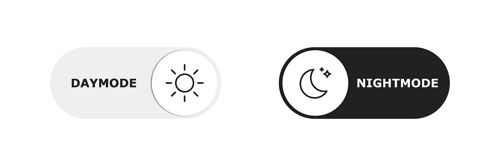

# 将黑暗模式添加到 React/Sass 项目的最佳方式

> 原文：<https://javascript.plainenglish.io/the-best-way-to-add-dark-mode-to-your-react-sass-project-ce3ae3bd8616?source=collection_archive---------2----------------------->

在[的上一篇文章](/5-steps-to-implement-maintainable-and-scalable-sass-theming-in-complex-projects-76bb6da0a8e6)中，我写了关于 Sass 的最佳实践，其中我介绍了如何将主题切换添加到以 Sass 为主题的项目中。不幸的是，该教程只涵盖了事情的 Sass 方面。在本文中，我将向您介绍我认为将主题化方法集成到 React 项目中的最干净的方法。

## 主题化萨斯之路

对于那些没有读过我写的关于 Sass 最佳实践的文章的人来说，我将把 Sass 代码留在这里(但实际上，你应该去读一读，因为它很有趣)。我不会在这里过多地解释代码。

在我们进入 React 代码之前，用这个方法要注意的一件重要事情是 Sass 被编译成`.theme — {value} .classname` CSS 代码。这意味着为了切换目标类的主题，您需要用一个具有类名`theme — {value}`的 div 来包装整个 react 项目，以便在整个应用程序中启用主题化。

## 有哪些问题？

这种主题切换方法初看起来可能很简单，但是有一个警告。您用来进行主题切换的组件可能深深地嵌套在应用程序的组件树中。这意味着在顶层组件中使用`useState`会很麻烦(因为主题 div 必须位于顶层组件中),并将当前主题值和设置的主题函数传递给主题设置器组件。

如果我是 React 的新成员，我会犯的一个错误是，我会尝试编写自己的名为`useTheme`的钩子，并让它返回值和主题设置函数。然后，我会尝试使用顶层的钩子和主题设置组件。这种方法的问题是，你必须记住，每次在组件内部使用这个钩子时，它都是创建的钩子的一个单独的实例，彼此之间没有记忆。然而，这种思路已经接近正确的解决方案。

## 救援的背景

上下文是一种反应方式，允许在组件树中的任何地方使用状态，而不必将其作为道具传递下去。它的工作原理与我之前描述的惊人地相似，所以让我们看看如何在你的应用中设置它。

正如你从 GitHub 要点中看到的，你首先使用`React.createContext`创建一个上下文，传递初始的主题设置——你不需要这样做，但这是一个很好的实践。然后，在你的应用程序的顶层，你必须用`ThemeContext.Provider`包装它，你将在你的主题和 setTheme 函数的当前状态中传递它——这是在使用`useContext`的组件中返回的值。

在主题设置组件中，我想在这种情况下使用下拉菜单，但切换按钮也应该工作。在这个组件中，我们使用`useContext`钩子获取当前主题值，并使用 setTheme 函数正确显示下拉菜单的状态，并在用户选择新主题时设置主题。

就是这样，你现在有了一个黑暗主题，应该可以在你的应用程序中添加任意数量的主题。

## 我们可以做得更好

我讨厌教程半途而废，而且从来没有展示代码在实际应用中的样子，所以让我们尝试重构和拆分我们的代码，使其“为生产做好准备”。

首先，让我们将主题上下文提供者简化成一个组件，这样我们就不会弄乱应用程序的顶层组件。

正如您在这里看到的，这个版本的主题提供者将状态逻辑抽象到一个 React 组件中，这样我们就不必担心顶级组件中的状态。该实现还将主题状态存储在本地存储中，这样当用户刷新或返回到您的站点时，他们将看到他们喜欢的主题，从而带来更好的用户体验。要使用该组件，您只需将它包装在您的应用程序组件中:

ThemeContext 和 ThemeSetter 当然和以前一样，但是在它们自己的文件中:

当然，我已经创建了一个 CodeSandox，这样你就可以玩代码了:

## 好了

这实际上是我如何在我正在工作的应用程序中实现主题切换的，我认为它工作得非常好。希望你在本教程中学到了一些东西，并在评论中让我知道你的想法。

*更多内容尽在*[***plain English . io***](http://plainenglish.io/)