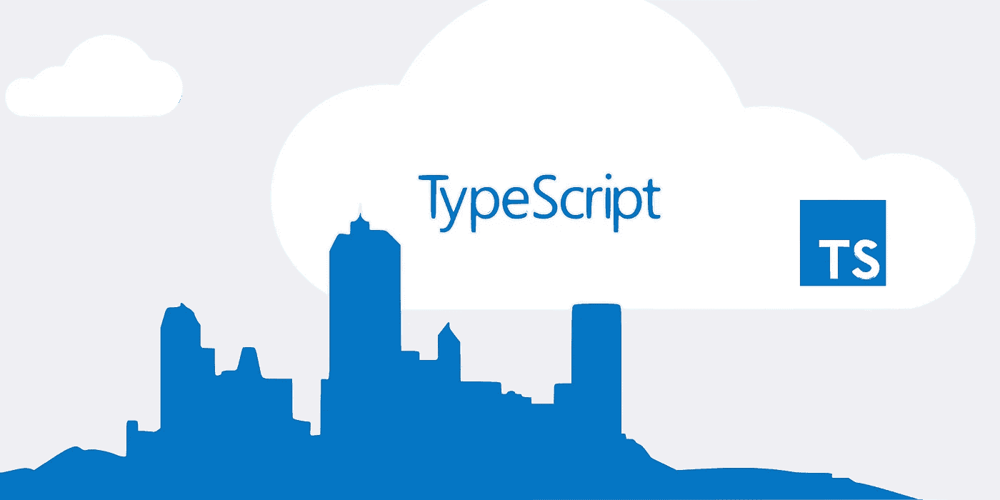

# 创建新类型脚本项目的最佳方式

> 原文：<https://javascript.plainenglish.io/the-best-way-to-create-a-new-typescript-project-6cdf19590962?source=collection_archive---------7----------------------->

## 使其快速、无痛且清洁

TypeScript 是一个很好的工具，但是开始新的项目怎么样呢？

用你最喜欢的技术、工具、插件和配置来建立一个 TypeScript 项目可能很麻烦。幸运的是，这一步不必很痛苦。

# 启动项目

常见的做法是使用生成器、模板、样板或启动项目。

专门的开发人员(或者一些库和框架的官方团队)经常创建这些。当尝试一个新的开始项目时要小心，你必须确保它满足你的需求并且得到很好的维护。

在某些情况下，您甚至可能会想从头开始创建您自己的初学者项目，或者创建一个现有的项目。

下面是我过去用过的几种开胃菜的快速列表。我建议您查看您可能需要的:

**快车**

 [## w3tec ch/express-type script-样板文件

### 灵感来自令人敬畏的框架，一种用漂亮的代码构建 Node.js RESTful API 服务的令人愉快的方式…

github.com](https://github.com/w3tecch/express-typescript-boilerplate) 

**NestJS**

 [## nestjs/typescript-starter

### 一个用于构建高效且可扩展的服务器端应用程序的渐进式 Node.js 框架。嵌套框架类型脚本…

github.com](https://github.com/nestjs/typescript-starter) 

**反应**

 [## cra-template-typescript

### 这是创建反应应用程序的官方类型脚本模板。要使用此模板，请在以下情况下添加模板类型脚本…

www.npmjs.com](https://www.npmjs.com/package/cra-template-typescript) 

**天然反应**

 [## 反应-原生-模板-类型脚本

### 干净和极简的 React Native 模板，可快速启动 TypeScript。优雅的用法直接出现在反应中…

www.npmjs.com](https://www.npmjs.com/package/react-native-template-typescript) 

**电子(与)反应**

 [## 电子反应样板/电子反应样板

### 电子反应样板使用电子，反应，反应路由器，网络包和反应快速刷新。

github.com](https://github.com/electron-react-boilerplate/electron-react-boilerplate) 

# 创建您自己的应用程序或库

对于那些使用非常著名的库和框架的人来说，这很好。现在，从头开始创建自己的库或应用程序怎么样？

欢迎从 [@bitjison](https://github.com/bitjson) 来到[打字初学者](https://www.npmjs.com/package/typescript-starter)。

 [## bitjson/typescript-starter

### 运行一个简单的命令来安装和使用交互式项目生成器。您将需要节点 v10 或更高版本。…

github.com](https://github.com/bitjson/typescript-starter) 

有大约 2.500 颗 GitHub 恒星，4 年的历史，以及偶尔的更新，`typescript-starter`不仅是一个伟大的发电机，而且维护得足够好。

如何使用它？运行`npx typescript-starter`并遵循其交互界面。

通过一个从头生成 NodeJS 应用程序或库的选项，您还可以通过以下方式自定义生成的内容:

*   更严格的类型检查
*   eslint-plugin-functional
*   cspell
*   VS 代码调试配置
*   循环-配置项配置
*   Appveyor 配置
*   TravicCI 配置

## 特征

下面是它的**自述**告诉我们的:

*   编写**标准、未来的 javascript** —具有稳定的 ESNext 特性—今天( [stage 3](https://github.com/tc39/proposals) 或 [finished](https://github.com/tc39/proposals/blob/master/finished-proposals.md) 特性)
*   [可选地使用 typescript](https://medium.freecodecamp.org/its-time-to-give-typescript-another-chance-2caaf7fabe61) 来改进工具、林挺和文档生成
*   作为一个 [javascript 模块](http://jsmodules.io/)导出，使你的作品**对于能够使用 [es6 导入](https://github.com/rollup/rollup/wiki/pkg.module)的消费者来说完全树摇**(比如 [Rollup](http://rollupjs.org/) 、 [Webpack](https://webpack.js.org/) 或 [Parcel](https://parceljs.org/)
*   导出类型声明以改善您的下游开发体验
*   Node.js 样式(CommonJS)导入的向后兼容性
*   提供严格和灵活的[打字稿配置](https://github.com/bitjson/typescript-starter/blob/master/tsconfig.json)

所以我们可以拥有美好的事物:

*   生成 API 文档(HTML 或 JSON) [而无需维护大量 JSDoc 标签](https://blog.cloudflare.com/generating-documentation-for-typescript-projects/)
*   使用 [AVA](https://github.com/avajs/ava) 的同位置、原子、并发单元测试
*   带有 [nyc](https://github.com/istanbuljs/nyc) 的源代码映射代码覆盖率报告
*   可配置的代码覆盖测试(用于持续集成)
*   使用`[typescript-eslint](https://github.com/typescript-eslint/typescript-eslint)`和[自动林挺和格式化更漂亮的](https://prettier.io/)

## 它有什么不同？

在尝试了几个生成器和启动器之后，我开始使用 [typescript-starter](https://github.com/bitjson/typescript-starter) 从头开始创建库和快速 NodeJS 实用程序。

它非常好的构建配置让我采用了它。理解这个工具的全部内容可能需要一些时间，但我保证，这是值得的。

我一点也没有失望，我只能推荐你去看看它的[自述](https://github.com/bitjson/typescript-starter/blob/master/README.md)的全部内容。

> 感谢阅读

 [## 关于我——泰迪·莫林

### 嗨，我是泰迪，一个反应的爱人🚀。

morintd.medium.com](https://morintd.medium.com/about-me-teddy-morin-9fb1d65fe24e)