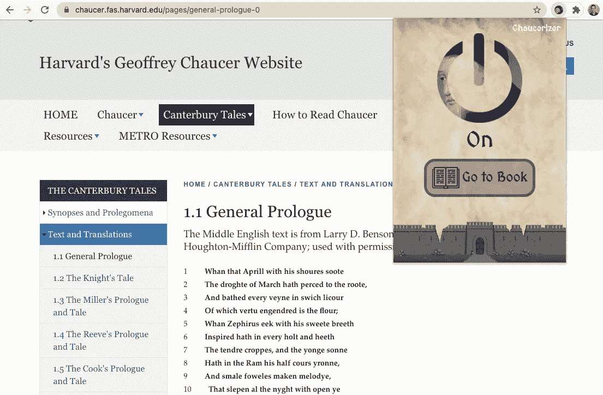

# 构建 Chrome 扩展:概念上的理解

> 原文：<https://javascript.plainenglish.io/the-chrome-extension-a-conceptual-understanding-of-its-parts-641ba1f8d431?source=collection_archive---------10----------------------->

Chrome 扩展制作起来很有趣，也不是很难；事实上，如果你愿意，你甚至可以在 React 中建造一个[。我最新的(也是唯一的)扩展是](https://gilfink.medium.com/building-a-chrome-extension-using-react-c5bfe45aaf36) [Chaucerizer](https://chrome.google.com/webstore/detail/chaucerizer/ogdlidnaifjeppnphdnknddmnglbnaph?hl=en) ，这是一个简单的扩展，可以改善哈佛的 [Chaucer 网站](https://chaucer.fas.harvard.edu/)上 *Canterbury Tales* 的阅读体验。一些扩展只不过是将脚本注入网站，比如隐藏``标签或类似的东西；其他人拥有完善的 web 应用质量特性，可以补充 Chromium 环境，比如 [Wappalyzer 扩展](https://chrome.google.com/webstore/detail/wappalyzer/gppongmhjkpfnbhagpmjfkannfbllamg?hl=en)试图告诉你你当前所在的网站采用了哪些技术。我的使用了扩展的大部分基本原则，包括脚本注入和弹出窗口。

我写这篇文章既是对我未来的参考，也是对任何对 chrome 扩展如何在我认为正确的抽象层次上工作感兴趣的人的参考。我不认为[文档](https://developer.chrome.com/docs/extensions/mv3/)有助于正确理解扩展开发的概念，所以我的目标是做一些更有机的东西，更恰当地回答扩展创建中的相关问题。

The Chrome extension I made using the architectural principles outlined below.

[Extensionizr](http://extensionizr.com/!#%7B%22modules%22:%5B%22hidden-mode%22,%22with-bg%22,%22with-persistent-bg%22,%22no-options%22,%22no-override%22%5D,%22boolean_perms%22:%5B%5D,%22match_ptrns%22:%5B%5D%7D) 是一个非常有用的网站，可以为您创建总体的扩展文件结构。通过浏览这个网站，我们可以开始了解一个扩展的不同组件，以及你的应用是否需要它们中的每一个。然而，令人失望的是，网站选项上 Chrome 文档的澄清链接会导致错误页面，所以我们必须做一些挖掘来进一步探索。前进！

其他有用的链接:

*   [Chrome 扩展架构概述](https://chrome-apps-doc2.appspot.com/extensions/overview.html#arch)

# 结构分析

[Geoffrey Chaucer](https://en.wikipedia.org/wiki/Geoffrey_Chaucer). There is a strong case that he would endorse this Medium article if it was written in Middle English, or with elements of fabliau.

## 扩展类型

这将是您希望扩展的整体“格式”。最好通过理解扩展的目的来选择它:不管它是做一般的任务还是不提供 UI(但可能不是)；是否只与特定页面相关；或者它是否应该总是以某种形式存在。

*   **隐藏扩展:**大概是一个没有出现在地址栏或者弹出窗口的扩展。非常适合脚本注入这样的简单操作，尽管我个人不会使用这个选项，因为当用户想要隐藏您的扩展的用户界面时，他们可以简单地将其隐藏在地址栏中。想想看，我从来没有使用过真正隐藏的扩展，所以我想知道这是否是一个合法的选择。我可能会避免这个。
*   **页面操作:**只有当用户在相关页面时才会出现的正常扩展。例如，只有当用户在 Pinterest 网站上时，您才可以显示 Pinterest 扩展。
*   **浏览器操作:**最常用格式；一个典型的扩展，在地址栏中显示图标，就像我们习惯的那样。

(请记住,“扩展类型”是 Extensionizr 为了更清楚地说明应用程序的目的/结构而做的一种形式，但在谷歌看来并不算什么。)

## 背景页面

关于这一点，请理解“对**扩展**的一个共同需求是拥有一个长时间运行的脚本来管理某个任务或状态……”([参考](https://chrome-apps-doc2.appspot.com/extensions/background_pages.html#:~:text=A%20common%20need%20for%20extensions,manage%20some%20task%20or%20state.&text=As%20the%20architecture%20overview%20explains,at%20a%20time%20is%20active.))。把背景页面想象成“信使”,在你的扩展和用户 Chrome 体验的更广阔世界之间进行交流。

*   **Background.html**是“一个在扩展过程中运行的 HTML 页面”；据我所知，它不是超级重要的，因为它不是用来展示用户界面的。
*   **Background.js** 可以通过消息传递与更复杂的 chrome APIs 交互。这个文件(或这些文件的集合)可能是您存储消息传递相关处理程序的地方，这些处理程序可以在弹出窗口和用户的网站/交互之间进行通信。

背景页面的一个重要替代是[事件页面](https://chrome-apps-doc2.appspot.com/extensions/event_pages.html)，与背景页面不同，它可以根据需要打开和关闭。

## 内容脚本

这是令人兴奋的事情:允许你的扩展在允许交互的网站上插入和使用 Javascript。 **Inject.js** 将允许你将 Javascript 注入网站，而 **Inject.css** 将简单地直接向网站提供一些样式(比如，如果你正在进行一个相当简单的黑暗模式，并且你知道目标应用的对象标识符)。请记住，内容脚本和背景页面/弹出窗口之间的通信需要大量使用[消息传递](https://developer.chrome.com/docs/extensions/mv2/messaging/)！(这个真的不难，一旦学会了基础。)

## 许可

权限对于 chrome 扩展非常重要，因为它们是 a)你如何获得 Chrome 能够提供的独特功能和 API 的途径，以及 b)定义良好和计算准确的权限可以简化对[扩展库](https://chrome.google.com/webstore/category/extensions?hl=en)的批准过程。

*   **URL 权限**既可以帮助您只锁定相关网站来获取信息，也可以帮助您的扩展在扩展商店中获得更容易的批准(如果它们看起来合适的话)。如果你的 app 需要所有网站的权限，可以使用`<all_urls>`；然而，这是一种黑幕，它困扰着我人们滥用这种特权的程度。如果您想要创建一个扩展，在被点击时向用户显示界面，但不需要与用户访问的网站进行任何交互(比如，一个跟踪 IOT 设备的信息并向用户显示的扩展)，那么这个字段可以是空的。
*   **其他权限:**如果你在清单中指定，你可以访问书签、用户剪贴板、cookies、历史、通知、标签(当你想通过你的扩展打开或关闭标签时)，等等。这在清单`permissions`中有所表述，文档可以在这里找到[。通常，您使用权限的方式是，它将为您提供对一个易于访问的对象的访问——就像标签权限的`chrome.tabs`——您可以在通过清单获得权限后使用它。](https://developer.chrome.com/docs/extensions/mv3/declare_permissions/)

## 选择

*   **Options.html:** 很多扩展都有一整页进行设置，比如(我相信)Honey 和 1Password。如果您认为您的扩展将证明整个页面适合设置/用户定制，请选择此选项。
*   [**嵌入式选项:**](https://developer.chrome.com/docs/extensions/mv2/options/#embedded_options) 这将在 Chrome 本身的扩展链接上显示定制选项，如果你的应用程序的定制选项/需求较少，这可能是一个更好的选择。

或者，您可以只允许用户直接在扩展接口本身上更改选项。创建这些选项解决方案是为了避免混乱，但是您的扩展可能太简单了，以至于不需要一个完全独立的选项页面，或者甚至是嵌入式选项(尽管在这种情况下，这将是一个优雅的解决方案！).

## 无视

我不太熟悉[覆盖](https://developer.chrome.com/docs/extensions/mv2/override/)的概念，但是对文档的快速分析告诉我们，我们可以覆盖书签管理器页面、Chrome 历史页面或新标签页面。此外，扩展只能覆盖这些页面中的一个；因此，你不能有一个既操作书签管理器又操作浏览器历史页面的扩展。我对这个特性的非显而易见的用例一无所知，但这是手边的好知识。

# 清单 v3 的更改

点击[此处](https://developer.chrome.com/docs/extensions/mv3/intro/mv3-overview/)查看 Chrome 第三个扩展清单版本带来的变化，以及由此产生的开发范式的改变。上述信息主要与 v2 有关，因为可以预见该版本会有更多的在线资源。但是 Manifest v3 提供了许多改进，包括防止远程代码执行(想想看，大量可疑的扩展最终会向最终用户释放恶意软件！)，并为一堆重要的扩展函数添加了`async/await`支持(这将极大地帮助我的开发人员在使用这个清单进行扩展时保持理智；在以前的清单中，您几乎无法避免回调问题)。然而，“服务人员”取代了背景页面，这可能会干扰按照上述原则和 StackOverflow 进行开发的便利性，所以一旦我对这个新清单有了体验，我会考虑撰写一篇更新的文章。

# 结论

The [Battle of Hastings](https://en.wikipedia.org/wiki/Battle_of_Hastings), which solidified the end of Anglo-Saxon rule of England

我的发展理论是，我们为应用程序开发开发不同于文档结构的心智模型，最有效的应用程序开发人员能够以对他们有帮助的方式映射信息及其关系，但可能不容易通过文本表达。希望通过查看上面的信息，你可以了解一些 chrome 扩展在内部是如何工作的，以及它们在外部是如何表现的。