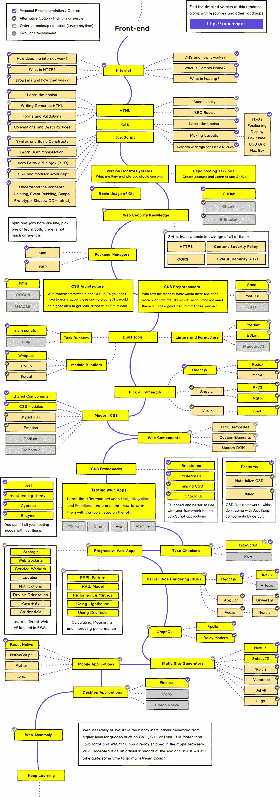
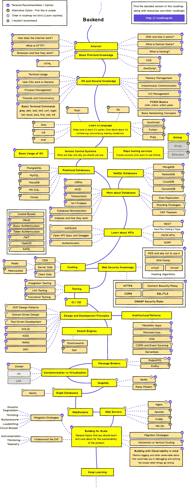

# 完整的全栈网络开发者路线图 2022

> 原文：<https://javascript.plainenglish.io/the-complete-full-stack-web-developer-roadmap-2021-7495b4ae59ac?source=collection_archive---------1----------------------->

## 成为现代全栈 web 开发人员的终极指南。

Photo by [James Harrison](https://unsplash.com/@jstrippa?utm_source=medium&utm_medium=referral) on [Unsplash](https://unsplash.com?utm_source=medium&utm_medium=referral)

朋友们好！因此，众所周知，全栈 web 开发非常受欢迎，在这个领域有很多工作等着你。因此，在本文中，我将尝试给出一个完整的路线图，告诉你如何成为一名全栈开发人员。

我去年也学习了全栈开发，你也可以这样做。我目前学习越来越多，并试图做一些项目来巩固我的知识。一旦我们学到新的东西，做一些项目是一个很好的练习。

## **那么，** **到底谁是全栈开发者呢？**

后端开发人员制作 API，设计和管理数据库，并执行使网站能够执行任务和处理数据的所有操作。然后，有前端开发人员设计网站的前端，使其反应灵敏，用户友好。他们建立网页，让后端与用户互动。

因此，全栈开发人员是能够完成这两项任务的开发人员。一个全栈开发者可以自己构建一个完整的网站，因为他自己做了两方面的工作。

对多才多艺的专业人士的需求越来越大，了解这两方面本身就是一个加分点。它帮助你在这两个领域找到工作，从而扩大你的机会，也帮助你自己建立一个完整的网站，因此，你可以建立一些涉及后端和前端的酷项目，而不需要团队合作伙伴。

然而，许多人都会犯错误。他们学习后端的一小部分和前端的一小部分，但是他们一点都不擅长。这是一个糟糕的方法，因为这样一来，这个人就什么都不是了。两个部门都一般，给人的印象很差。

成为全栈开发人员的最佳方式是专攻前端或后端，然后掌握另一部分的工作知识，并加以改进。这样，你会成为一个更好的开发人员，对任何组织都更有用。

现在，我们已经讨论了很多关于谁是全栈开发人员以及他们如何工作的问题。现在让我们进入正题— **如何成为一名全栈开发者**。另外，在最后，我会告诉你我学到了什么框架，从什么来源。

# 两条路径的基本要求

在开始学习任何前端框架或后端框架之前，你应该知道一些基本要求。

这些是每个开发人员都应该知道的基本技能

## 学习 Git 和 Github

这对任何一个开发者来说都是必须的。在开发应用程序时，了解 Git 对于管理提交和更改历史非常有帮助。如果你想回到上一次提交，这是很有用的。Github 允许你在线存储文件，并有助于协同工作或向人们展示你的作品。

## **学习命令行**

学习命令行对任何开发人员来说都是一件好事，因为命令行是我们每次运行应用程序或安装任何依赖项时都会用到的。

## 学习编程语言

如果我们要成为全栈开发人员，我们还需要了解一些编程语言。我会推荐选择 **Javascript 或者 Python** ，因为我们要做 web 开发，这两个是这个领域最受欢迎的选择。

在我们知道语言实际上是如何工作的之后，我们应该总是去学习框架。这将有助于我们更好地理解。

# 前端开发人员路线图

前端开发是网站的界面——用户与之交互的部分。前端负责用户和应用程序后端之间的交互。

前端开发不仅仅局限于 HTML，CSS 和简单的 Javascript。许多框架帮助我们为网站设计良好的前端，使我们的工作更容易。

The frontend roadmap from the [roadmap. sh](http://roadmap.sh)

我们首先需要关注基础。我们需要从 HTML 和 CSS 开始。这些是建筑材料。

## HTML 和 CSS

我们首先需要学习 HTML 和 CSS。HTML 帮助我们构建网站的内容，而 CSS 为它添加样式和效果。学 HTML 很直接，几天就能学完。然后我们需要学习一些 CSS 来设计我们的网页。

我们可以编写自己的定制 CSS 或者使用任何可用的 CSS 库。CSS 也有像 [**萨斯**](https://sass-lang.com/) 和[**LESS**](http://lesscss.org/#:~:text=Less%20(which%20stands%20for%20Leaner,learning%20it%20is%20a%20breeze.) 这样的预处理器，有助于编写的 CSS 更具编程性和可读性。

你可以学习各种各样的 CSS 库，但是有些比其他的更受欢迎。最受欢迎的选择是 [**自举**](https://getbootstrap.com/) **。**它是使用最广泛的 CSS 库，有许多不同的样式和组件可以使用，使样式更容易。

一些更好的 CSS 库是:-

1.  顺风社
2.  [物化](https://materializecss.com/)
3.  [布尔玛](https://bulma.io/)

## java 描述语言

学完 HTML 和 CSS，接下来需要学习 Javascript。HTML 和 CSS 设法构建静态的、响应性强的网站，而 Javascript 是为网站添加动态行为的工具。它可以执行一个网站上所有的逻辑操作。

Javascript 有不同的风格。最好先学习 Javascript，然后再学习它的框架，因为这会帮助你更好地理解它们。

## 前端框架

前端框架有很多，但其中三个最受欢迎— **React、Angular 和 Vue。**

大多数前端开发人员学习其中的一种或多种。如果你从其中任何一个开始都会有帮助。它们都有各自的优缺点。

参考这篇文章，看看哪一个最适合你。

 [## angular vs React vs Vue:2019 最好选择哪个？

### 2019 年，想象没有 HTML、CSS、Javascript 的 web 开发是不切实际的。Javascript 是…的灵魂

medium.com](https://medium.com/hackernoon/angular-vs-react-vs-vue-which-is-the-best-choice-for-2019-16ce0deb3847) 

不过，我个人的意见是从 React 或 Vue 开始。在我看来，棱角有点硬，对初学者来说不是一个很好的选择。一旦你熟悉了一个框架，就很容易转换，因为许多东西都是相似的。

 [## 使用 React 构建一个简单的 Todo 应用程序

### 让我们用 React 构建一个简单的 Todo 应用程序，教你 CRUD 的基本原理(创建、读取、更新和…

towardsdatascience.com](https://towardsdatascience.com/build-a-simple-todo-app-using-react-a492adc9c8a4) 

# 后端开发人员路线图

后端是应用程序中包含所有逻辑部分的部分。它与数据库通信，处理所有逻辑，还与前端部分通信。它接收数据或向前端提供数据。

Backend Developer Roadmap at the [roadmap.sh](http://roadmap.sh)

## 后端服务器

我们可以用多种语言编写后端服务器，如 J **avascript、Python、Ruby、Go、Java**T4 等。有许多流行的选择，但我建议从 Javascript 或基于 Python 的框架开始，因为它们既简单又有吸引力。

一些伟大的后端框架是:-

1.  Django (Python) —这是一个 Python 框架，对于希望更快开发应用程序的人来说是一个完美的选择。这是一个有点困难的开始，但提供了许多预置的东西。它有一个内置的管理仪表板和一个用户模型。
2.  **Flask (Python)** —这是一个简单的轻量级框架，它没有内置的所有功能，但有许多依赖项来满足它的所有需求。它最适合开发小型应用程序或 API 开发。
3.  **Express/ Node (JS)** —它是最流行的 Javascript 框架，对任何人来说都是一个很好的选择。它简单易学，可扩展性强。使用它是有意义的，因为它是基于 Javascript 的，而且我们已经使用了 Javascript 前端框架。
4.  **Ruby on Rails (Ruby)** —这是基于 Ruby 的，相当流行。它也很容易学，在许多地方被广泛使用。

## 数据库

数据库有很多选择，最受欢迎的是 **MySQL、MongoDB 和 PostgreSQL** 。你可以根据自己的选择选择其中的任何一个。

如果您选择 Express/ Node 作为后端框架，我推荐您选择 MongoDB，因为它与 Javascript 框架配合得很好。

MySQL 和 PostgreSQL 以表格的形式存储数据——行和列。但是 MongoDB 是一个 NoSQL 数据库，并且以 JSON 格式的文档形式存储数据，这是一件很棒的事情，因为我们是通过 JSON 格式的 API 发送数据的。

 [## 用 Node，Express 和 MongoDB 构建一个 REST API

### 让我们使用 Node、Express 和 MongoDB 构建一个遵循 CRUD 原则的 REST API，并使用 Postman 测试它。

towardsdatascience.com](https://towardsdatascience.com/build-a-rest-api-with-node-express-and-mongodb-937ff95f23a5) 

如果你选择 Django 作为你的框架选择，你可以单独学习 Django，或者如果你想让它构建 API 并与你学习的前端框架连接，那么 Django Rest 框架应该是理想的选择。这里有一个关于 Django Rest 框架的系列文章，在这里你可以学习 DRF 并实现它来构建一个工作博客网站。

 [## 使用 Django Rest 框架构建博客网站——概述(第 1 部分)

### 让我们使用 Django Rest 框架构建一个简单的博客网站，以了解 DRF 和 REST APIs 是如何工作的，以及我们如何添加…

towardsdatascience.com](https://towardsdatascience.com/build-a-blog-website-using-django-rest-framework-overview-part-1-1f847d53753f) 

此外，对于只使用 django 构建一些项目，我有一个很棒的系列供你参考，用 Django 框架构建一个社交媒体网站。这会帮助你更好地学习姜戈。

 [## 使用 Django 构建一个社交媒体网站——设置项目(第 1 部分)

### 在第一部分中，我们通过设置密码来集中设置我们的项目和安装所需的组件…

towardsdatascience.com](https://towardsdatascience.com/build-a-social-media-website-using-django-setup-the-project-part-1-6e1932c9f221) 

因此，正如我们所看到的，这完全是关于我们选择什么样的框架最适合我们以及我们喜欢开发什么。

# 我的选择和学习

我目前已经学会了一些框架。我从后端开发部分开始，因为我对事物的逻辑方面更感兴趣。我喜欢使用数据库和创建 API 供前端使用。

我学的第一个框架是 Flask。我选择 Flask 是因为当时我对 Javascript 一无所知。我擅长 Python，所以我使用了 Flask。我需要用 Flask 来开发我学校的委员会网站。

我是通过 Youtube 上科里·斯查费和 T3 的视频了解 Flask 的。

后来我从同一个 YouTube 频道上了解到了 Django，因为我已经听说了很多。我喜欢 Django，并用它开发了几个好项目。其中一个是我上面链接的社交媒体网站，另一个是求职门户。

 [## 用 Django 构建求职门户——概述(第 1 部分)

### 让我们使用 Django 建立一个工作搜索门户，它允许招聘人员发布工作并接受候选人，同时…

towardsdatascience.com](https://towardsdatascience.com/build-a-job-search-portal-with-django-overview-part-1-bec74d3b6f4e) 

接下来，我开始学习 Javascript，然后学习了完整的 **MERN 堆栈(MongoDB，Express，React 和 Node)** 。我从两个 YouTube 频道学到了这些，现在也在向他们学习。他们是****和 [**Traversy Media**](https://www.youtube.com/channel/UC29ju8bIPH5as8OGnQzwJyA) 。这些都是学习 web 开发的绝佳渠道。****

****你可以阅读这个基于 MERN·斯塔克的新系列，其中我详细讲述了如何使用 MERN·斯塔克来构建一个简单的电子商务网站。****

**** [## 用 MERN 堆栈构建一个电子商务网站——第 1 部分(设置项目)

### 让我们使用 MERN 堆栈(MongoDB，Express，React 和 Node)建立一个简单的电子商务网站，用户可以在其中添加项目…

shubhamstudent5.medium.com](https://shubhamstudent5.medium.com/build-an-e-commerce-website-with-mern-stack-part-1-setting-up-the-project-eecd710e2696) 

希望大家觉得这篇文章有用。我很想听听你对这篇文章的想法和反馈。

## 进一步阅读

 [## 代码文档被破坏了——但是我认为 Swimm 可能已经修复了它

### 传统的文档管理系统让软件开发人员失望了，是时候来点新的了。游泳吗…

javascript.plainenglish.io](/code-documentation-is-broken-but-i-think-swimm-may-have-fixed-it-daaa7547d834)  [## 开发人员和非开发人员合作得如何？我们询问了 200 个开发团队

### 产品开发(几乎总是)团队运动。要打造成功的产品，多个利益相关方必须共同努力…

简明英语. io](https://plainenglish.io/blog/how-well-do-developers-and-non-developers-work-together) 

*更多内容请看*[***plain English . io***](https://plainenglish.io/)*。报名参加我们的* [***免费周报***](http://newsletter.plainenglish.io/) *。关注我们关于*[***Twitter***](https://twitter.com/inPlainEngHQ)[***LinkedIn***](https://www.linkedin.com/company/inplainenglish/)*[***YouTube***](https://www.youtube.com/channel/UCtipWUghju290NWcn8jhyAw)*[***不和***](https://discord.gg/GtDtUAvyhW) *。对增长黑客感兴趣？检查* [***电路***](https://circuit.ooo/) *。*******