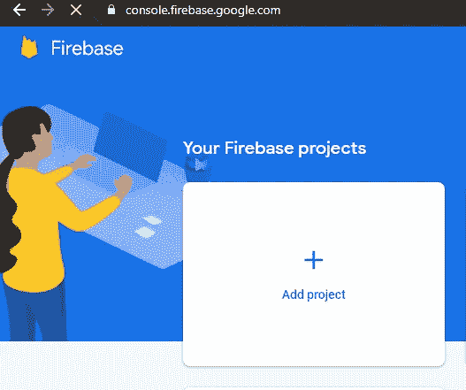
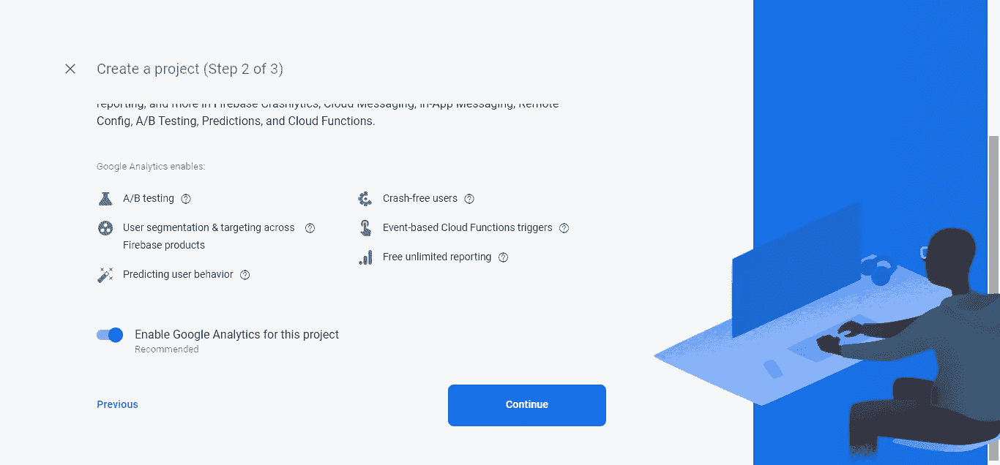
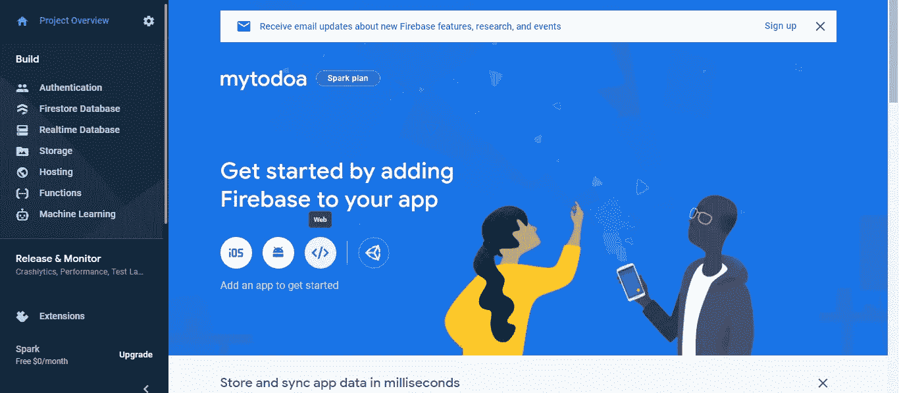
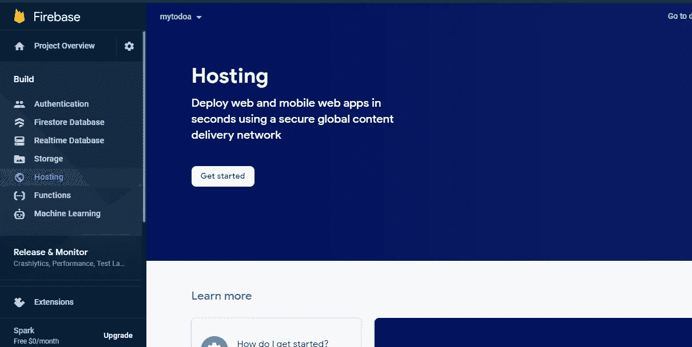
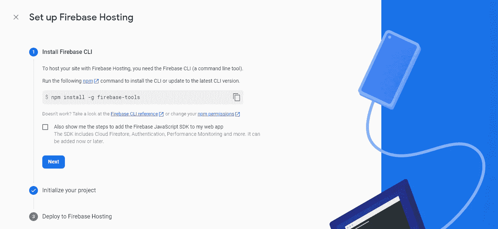
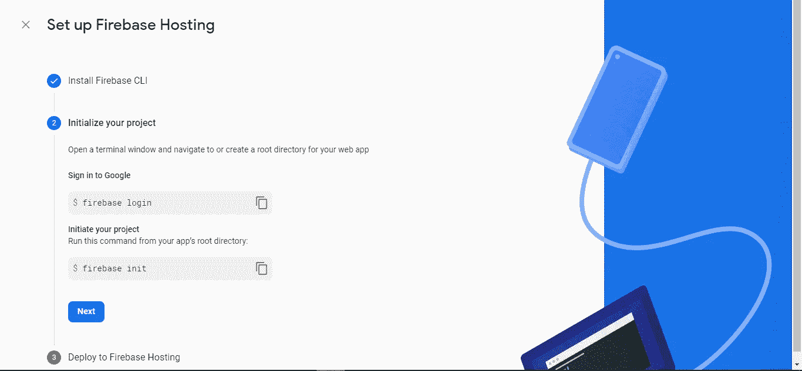

# 在 Firebase 上托管 React 应用的完整指南

> 原文：<https://javascript.plainenglish.io/the-complete-guide-to-hosting-your-react-app-on-firebase-226ceea07552?source=collection_archive---------6----------------------->

## 访客会很高兴，就像你在 Instagram 上一样


Photo by [Tim Douglas](https://www.pexels.com/@tim-douglas?utm_content=attributionCopyText&utm_medium=referral&utm_source=pexels) from [Pexels](https://www.pexels.com/photo/positive-woman-chatting-online-on-smartphone-6567331/?utm_content=attributionCopyText&utm_medium=referral&utm_source=pexels)

从任何地方访问 Instagram 而不感到头痛是什么感觉？

*惊人的正确！*

每个 web 应用程序在上线之前都是从本地主机或生产环境中出现的。

在本教程中，我们将把您的 React 应用托管到 firebase，以便随时随地轻松访问。

## 我们将使用:

*   终端或命令行，以及
*   [NodeJS](https://nodejs.org/en/download/)
*   [VScode](https://code.visualstudio.com/download)
*   [燃烧基地](https://firebase.google.com/)

我们继续吧！

```
Table of Contents· [1\. App Config on Firebase](#1285)
  ∘ [Setting up your app on Firebase](#99b6)
  ∘ [Registering your app on the web](#c151)
· [2\. Configuring the Firebase Setup Locally.](#1a39) 
  ∘ [Setting up the Firebase environment](#5c46)
  ∘ [Logging in to Firebase](#aef4)
· [3\. The Initialization Process](#172c)
  ∘ [The questionnaire](#3324)
  ∘ [Constructing the build folder](#9f90)
  ∘ [Back to the questionnaire](#609b)
· [4\. Hosting React App to Firebase](#4967)
· [5\. Updating Hosting](#3d1f) 
· [In Conclusion](#cbf6)
· [Helpful Resource](#cbb8)
```

# 1.Firebase 上的应用程序配置

现在让我们开始吧！因此，转到[https://firebase.goggle.com](https://firebase.goggle.com)，然后单击导航栏上的“转到控制台”。

现在，您需要登录您的 Google 帐户。登录后，继续下一步。

## 在 Firebase 上设置您的应用程序

要在 Firebase 上设置应用程序，请遵循以下指南:

点击“添加项目”:



Screenshot by Author

为您的项目命名:


Screenshot by Author

你可以启用你的谷歌分析。如果你不愿意，也没有问题。但是在这种情况下，我们将只启用它。



Screenshot by Author


Screenshot by Author

然后单击继续。

下图显示您的项目已成功创建，请单击继续。


Screenshot by Author

## 在网络上注册您的应用程序

因此，在创建的应用程序的仪表板上:

点击网络图标>



Screenshot by Author

注册您的应用程序，然后点按“继续”:


Screenshot by Author

现在，单击继续到控制台。

# 2.在本地配置 Firebase 设置。

在这个过程中，在本地计算机上使用 Firebase 之前，我们需要解决两个重要的问题。

## 设置 Firebase 环境

在这个过程中，我们需要安装 Firebase 工具。所以，让我们开始吧！

在边栏菜单上，单击托管，然后单击开始按钮。



您将被引导至以下页面。



Screenshot by Author

现在，如果你使用 windows，请使用命令行；如果你使用 Mac，请使用终端。

此时，运行`npm install -g firebase-tools`。

*如果您做的一切都正确，您将不会看到任何错误，这意味着它已经安装。*

## 登录 Firebase

要继续，您需要登录 Firebase。所以，运行`firebase login`

如果它返回登录为“你使用的电子邮件”，你就可以走了。



Screenshot by Author

# 3.初始化过程

现在，让我们进入正题。要开始，cd 到您的项目目录。

*如果您不知道该文件夹在哪里，请在 PC 上的文件浏览器中找到您保存该文件夹的位置。然后，单击该文件夹顶部的栏，将路径和 cd 复制到终端上的该路径。*

**高亮显示的文本是路径。**


Screenshot by Author

然后继续运行命令`firebase init`

该命令成功运行后，您将需要准备一份调查问卷。

## 问卷调查

*规则如下:y 代表是，n 代表否*

现在，让我们继续吧！

#你准备好继续了吗？y 型

#使用箭头键导航到“主机”，到达“主机”后使用空格键选择，然后按回车键确认

#选择“使用现有项目”

#选择您刚刚注册的项目

## 构造构建文件夹

现在，您将被要求提供一个`public`目录，而您现在很可能没有这个目录。

因此，在 VScode 上打开您的应用程序，然后继续打开终端。现在，在你的终端上运行`npm run build`

该命令剥离繁重开发文件的代码，并交付用于生产目的的轻量级代码。

*流程完成后，返回命令行或终端完成问卷。*

## 回到调查问卷

#对于您的`public`目录，键入 build。

因此，Firebase 将获得你的`build`文件夹中的应用程序的所有代码。

#允许重写所有指向 index.html 的 URL

#拒绝覆盖

**然后，您的初始化过程就完成了。**

# 4.托管 React 应用到 Firebase


Screenshot by Author

一旦每个步骤成功完成，运行`firebase deploy`

部署完成后，您将获得在任何地方访问您的应用程序的 URL。

*恭喜你，伙计，你刚刚在 Firebase 上部署了自己的 React 应用程序！*

# 5.更新主机

如果你更新了你的代码并且想要重新部署应用程序，你必须在部署之前运行命令`npm run build`。

# 结论

我们在 Firebase 上托管了您自己的 React 应用程序，在那里我们学习了如何在 Firebase 上创建应用程序、配置 Firebase 环境、初始化应用程序以及部署应用程序。

这很有趣吗？有帮助吗？

感谢您的宝贵时间！

[](https://medium.com/geekculture/the-complete-guide-to-hosting-your-static-website-to-firebase-16c3125bc4a4) [## 将静态网站托管到 Firebase 的完整指南

### 一个关于将静态网站托管到 Firebase 的详细教程

medium.com](https://medium.com/geekculture/the-complete-guide-to-hosting-your-static-website-to-firebase-16c3125bc4a4) 

*更多内容请看*[***plain English . io***](https://plainenglish.io/)