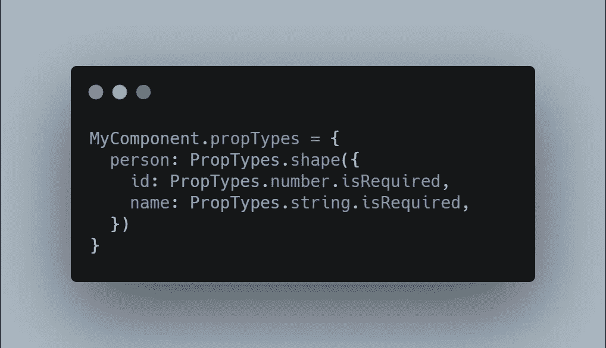
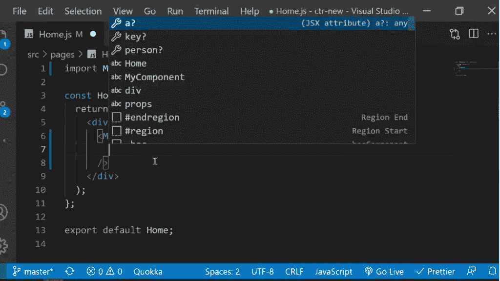

# React 中道具类型的完整指南

> 原文：<https://javascript.plainenglish.io/the-complete-guide-to-prop-types-in-react-9baa22e80ce4?source=collection_archive---------3----------------------->

## 剧透:不适合打字稿的人



如果您使用的是 React with JavaScript，并且没有进行任何类型检查，那么问自己一个问题。你写的是干净且可维护的代码吗？随着应用程序规模的增长，出现 bug 的可能性也会增加。类型检查可以为您捕捉许多错误。

React 提供了一种内置的类型检查功能。为了对组件的属性进行类型检查，我们可以给它分配一个特殊的属性`propTypes`

```
MyComponent.propTypes = {
   // type defs
};
```

为此，我们需要安装一个包`prop-types`。它过去包含在 React 本身中，但现在是一个单独的库。

```
npm i prop-types
```

PropTypes 公开了一组验证器，您可以用它们来验证作为组件 props 接收的数据。这是一个需要雇员姓名和薪水的组件。

```
function Employee({ name, salary }) {
  return (
    <h1>{name}'s salary is {salary + 0}</h1>
  );
}
```

让我们以字符串的形式给出薪水，看看会发生什么

```
function App() {
  return <MyComponent name="John" salary="150" />
}
```

你希望在屏幕上看到什么？薪水应该是一个数字，但是我们传递了一个字符串，所以它变成了

```
John's salary is 1500
```

结果并不是我们想要的，React 没有向我们显示任何警告或错误。这正是 PropTypes 的用途。

```
**import PropTypes from 'prop-types';**function Employee({ name, salary }) {
  return (
    <h1>{name}'s salary is {salary + 0}</h1>
  );
}**Employee.propTypes = {
  name: PropTypes.string,
  salary: PropTypes.number
};**
```

现在，当我们试图将 salary 作为一个字符串给出时，我们会在 JavaScript 控制台中看到一个警告。

# 基本道具类型

PropTypes 为基本类型检查提供了各种验证器。以下是一些基本的道具类型

```
import PropTypes from 'prop-types';MyComponent.propTypes = {
  optionalArray: PropTypes.array,
  optionalBool: PropTypes.bool,
  optionalFunc: PropTypes.func,
  optionalNumber: PropTypes.number,
  optionalObject: PropTypes.object,
  optionalString: PropTypes.string,
  optionalSymbol: PropTypes.symbol,
};
```

我们可以通过在道具上设置`isRequired`属性来标记道具。below prop 类型将接受任何类型的值，如果没有传递值，将抛出警告

```
MyComponent.propTypes = {
  anyRequired: PropTypes.any.isRequired
};
```

如果一个道具的值可以是多种类型中的一种，我们可以使用`oneOfType`属性。这里，属性的值可以是一个数字或字符串，这也是必需的。

```
MyComponent.propTypes = {
  value: PropTypes.oneOfType([
    PropTypes.string,
    PropTypes.number
  ]).isRequired
};
```

# 枚举

通过使用`oneOf`属性确保道具的值被限制在特定的值

```
MyComponent.propTypes = {
  role: PropTypes.oneOf(['ADMIN', 'USER'])
};
```

# 作为道具的节点和反应元素

在 React 中，数字、字符串、元素或数组是可呈现的。为了定义这种类型的道具，我们可以使用一个叫做`node`的特殊属性

```
MyComponent.propTypes = {
  renderable: PropTypes.node
};
```

或者您需要一个 React 元素

```
MyComponent.propTypes = {
  shouldBeAComponent: PropTypes.element
};
```

# 数组

如果你期望一个属性是一个具有特定类型元素的数组，使用`arrayOf`属性

```
MyComponent.propTypes = {
  arrayOfNumbers: PropTypes.arrayOf(PropTypes.number),
  arrayOfStrings: PropTypes.arrayOf(PropTypes.string),
  arrayOfObjects: PropTypes.arrayOf(PropTypes.object)
};
```

我们还可以定义一个可以接受一个数字数组或一个字符串数组作为值的属性。

```
MyComponent.propTypes = {
  numbersOrStrings: PropTypes.arrayOf(PropTypes.oneOfType([
    PropTypes.number,
    PropTypes.string
  ])),
};
```

# 目标

我们可以使用`shape`属性定义一个对象的形状

```
MyComponent.propTypes = {
  person: PropTypes.shape({
    id: PropTypes.number.isRequired,
    name: PropTypes.string.isRequired,
    address: PropTypes.shape({
      city: PropTypes.string,
      country: PropTypes.string.isRequired
    })
  })
};
```

现在我们可以给我们的组件一个`person`道具

```
<MyComponent
  person={{
    id: 1,
    name: 'John Doe',
    address: {
      city: 'Karachi',
      country: 'Pakistan'
    }
  }}
/>
```

或者如果你期待一群人

```
MyComponent.propTypes = {
  **persons****: PropTypes.arrayOf(**
    PropTypes.shape({
      id: PropTypes.number.isRequired,
      name: PropTypes.string.isRequired,
      address: PropTypes.shape({
        city: PropTypes.string,
        country: PropTypes.string.isRequired
      })
    })
  **)**
};
```

如果你想要一个对象的值匹配一个精确的形状，你可以使用属性类型的`exact`验证器

```
MyComponent.propTypes = {
  objectWithStrictShape: PropTypes.exact({
    name: PropTypes.string,
    quantity: PropTypes.number
  })
};
```

传递给`objectWithStrictShape`的带有任何额外或缺失属性的对象将在控制台中抛出警告。

# 默认道具

可以分配给组件的另一个特殊属性是`defaultProps`。它允许你为你的道具定义默认值

```
function MyComponent ({ name }) {
  return <h1>Name is {name}</h1>;
}**MyComponent.defaultProps = {
  name: 'John Doe'
};**function App () {
  // renders
  // Name is John Doe
  return <MyComponent />
}
```

如果没有为父组件中的属性定义值，React 将检查是否为该属性定义了默认值。由于`defaultProps`是在`propTypes`型式检查之前解决的，所以型式检查也将适用于`defaultProps`。

你也可以使用析构赋值来定义属性的默认值。

```
// use 'John Doe' as value if name is undefined
function MyComponent ({ **name = 'John Doe'** }) {
  return <h1>Name is {name}</h1>;
}
```

# 自动完成

如果您正确定义了属性类型，您的编辑器将帮助您定义属性的值。例如，在 VSCode 中，同时按下`ctrl+space`会给你一个建议列表，包括你定义的属性类型。



如你所见，编辑器在自动完成建议列表中也显示了嵌套的道具。

如果不使用 TypeScript 或任何其他 JavaScript 扩展进行类型检查，我强烈建议使用 prop 类型。它帮助您编写更少的错误，并使自动完成变得容易。

# 有关系的

[](https://betterprogramming.pub/7-custom-react-hooks-you-probably-need-in-your-project-12f86216df94) [## 你的项目中可能需要的 7 个自定义 React 挂钩

### 提取和重用 react 代码和 JS 逻辑的有用钩子

better 编程. pub](https://betterprogramming.pub/7-custom-react-hooks-you-probably-need-in-your-project-12f86216df94) [](https://betterprogramming.pub/architecting-a-graphql-api-codebase-in-node-js-3a951cd7f0f4) [## 在 Node.js 中构建 GraphQL API 代码库

### 建立一个具有模块化和认证的 GraphQL 服务器

better 编程. pub](https://betterprogramming.pub/architecting-a-graphql-api-codebase-in-node-js-3a951cd7f0f4) 

*更多内容请看*[***plain English . io***](http://plainenglish.io/)