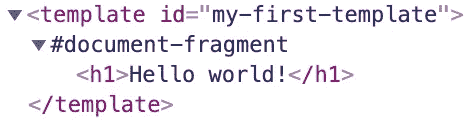

# 完整的 Web 组件指南:HTML 模板

> 原文：<https://javascript.plainenglish.io/the-complete-web-component-guide-html-templates-a957f1ee43fc?source=collection_archive---------4----------------------->

## 成为 Web 开发未来的专家(第 2 部分)

Photo by [Negative Space](https://www.pexels.com/@negativespace?utm_content=attributionCopyText&utm_medium=referral&utm_source=pexels) from [Pexels](https://www.pexels.com/photo/grayscale-photo-of-computer-laptop-near-white-notebook-and-ceramic-mug-on-table-169573/?utm_content=attributionCopyText&utm_medium=referral&utm_source=pexels)

Web 组件是基于官方 web 标准的可重用客户端组件，受所有主流浏览器支持。它们是将**的**功能从我们剩余的代码中封装出来的一种很好的方式。不仅如此，我们还可以在每个 web 应用程序和网页中重用它们。

Web 组件使我们能够完全独立于前端框架/库进行开发，这使它们成为构建必须公开共享或跨多个项目重用的可重用元素的绝佳选择。

> Web 组件的主要好处是我们可以在任何地方使用它们。有任何框架，甚至没有框架。

本文将详细解释 Web 组件的基础知识，以便稍后理解更复杂的示例。阅读完这一系列文章后，您将能够使用 Web 组件创建复杂的前端组件，您可以在任何地方重用这些组件。

# 三种主要技术

Web 组件由三种主要技术组成。结合起来，我们可以使用它们从代码的其余部分创建具有封装功能的定制元素:

*   [自定义元素](https://medium.com/@mariusbongarts11/the-complete-web-component-guide-part-1-custom-elements-a627af805df8)
*   **HTML 模板**
*   [阴影 DOM](https://medium.com/@mariusbongarts11/the-complete-web-component-guide-shadow-dom-2e40921eb77)

# HTML 模板

创建一个`template` HTML 元素允许我们声明可重用的**片段**，这些片段保存没有立即呈现的 HTML 内容。这些可以通过 Javascript 实例化，根据模板创建新元素。当在页面上重复相同的标记结构时，使用模板比多次复制相同的结构更有意义。

HTML 模板由一个 *DocumentFragment* 节点描述。加载页面时，浏览器不会解析或呈现内容。解析器只确保内容有效。模板的主要优点是模板中的资源，例如图像，会被忽略，直到它们的内容被添加到 DOM 中。

问:如果我们把它添加到一些 HTML 中，页面上会显示什么？

确切地说，没什么！

DOM structure — HTML templates

如果我们在 DOM 中查找，我们可以找到保存 HTML 内容的 HTML 片段。它描述了表示标题的 HTML 片段的结构。在我们克隆模板的内容并通过 Javascript 添加内容之前，不会显示任何内容。

Clone template and add it to the DOM

我们查询了模板元素，并使用模板作为基础创建了其内容的克隆。有像 [lit](https://lit.dev/) 这样的库可以帮助我们简化创建和克隆模板的过程。在接下来的文章中，我们将使用这个库，但是首先，我们需要详细了解基础知识。

> "模板本身是有用的，但是它们与 web 组件一起使用效果更好."— [MDN](https://developer.mozilla.org/en-US/docs/Web/Web_Components/Using_templates_and_slots)

现在，让我们使用一个 HTML 模板来扩展我们的`my-first-custom-element`:

Custom element using HTML templates

到目前为止还不错，但是看起来模板并没有真正的帮助，它们使我们的组件更加复杂。让我们通过使用插槽元素使我们的组件更加灵活。

## 该槽元件

使用`slot`元素，我们可以以一种很好的声明方式在每个元素中显示不同的文本或标记。

> “`slot`元素定义了一个槽。它通常用在阴影树中。—[https://html.spec.whatwg.org](https://html.spec.whatwg.org/multipage/scripting.html#the-template-element)

让我们在模板中添加一个槽:

我们现在可以更灵活地将自定义元素用于我们自己的文本:

**命名插槽**

当有多个插槽时，还可以添加一个`name`属性来获取和设置插槽的名称。

> “`name`内容属性可以包含任何字符串值。它代表一个插槽的名称”“[https://html.spec.whatwg.org/](https://html.spec.whatwg.org/)

让我们向组件添加另一个插槽:

Template slots

调整我们使用元素的方式:

Template slots

**样式插槽**

我们可以通过使用`:slotted()`伪元素来设计我们的插槽。注意，这只适用于影子 DOM。

我们可以选择放置在带有`::slotted(*)`的槽和类似`slot[name='headline']::slotted(*)`的特定槽中的任何元素。

这是[的代号](https://codepen.io/marius2502/pen/bGRWXLp):

Custom Element using HTML templates with slots

# 最后的想法

我希望你能理解这篇文章。我们已经了解了 Web 组件三大技术之一的**影子 DOM** 。

我总是很乐意回答问题，也乐于接受批评。请随时联系我😊

[**这里是无限制访问媒体**](https://medium.com/@mariusbongarts/membership) 上每一个内容的链接。如果你用这个链接注册，我会赚一小笔钱，不需要你额外付费。

 [## 通过我的推荐链接加入 Medium-Marius bong arts

### 作为一个媒体会员，你的会员费的一部分会给你阅读的作家，你可以完全接触到每一个故事…

medium.com](https://medium.com/@mariusbongarts/membership) 

# 关于作者

Marius Bongarts 是埃森哲互动公司的软件工程分析师。他还创建了 [Web Highlights 扩展](https://chrome.google.com/webstore/detail/web-highlights-+-bookmark/hldjnlbobkdkghfidgoecgmklcemanhm)，允许用户在标签和目录的帮助下组织文本亮点和书签。

通过**[**LinkedIn**](https://www.linkedin.com/in/marius-bongarts-6b3638171/)**与我联系。****

** [## 用 Web 组件构建自己的博客组合:基础

### 第 1 部分—定制元素、阴影 DOM 和 HTML 模板

javascript.plainenglish.io](/showcase-your-medium-articles-with-web-components-part-1-basics-d2c6618e9482)  [## 作为全栈开发人员，你应该马上学会的 5 项技能

### 现在就学习吧，你会后悔错过的

javascript.plainenglish.io](/5-skills-you-dont-get-around-to-learn-as-a-fullstack-developer-409f13c394c7)  [## 何时应该复制代码

### 复制比错误的抽象要便宜得多

javascript.plainenglish.io](/when-you-should-duplicate-code-b0d747bc1c67)**