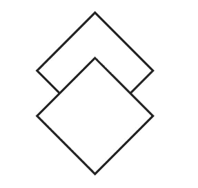
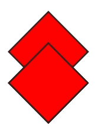
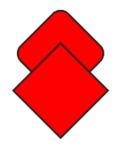
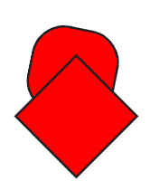
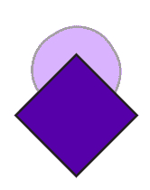
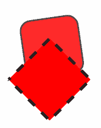

# 奇异的 SVG 案例

> 原文：<https://javascript.plainenglish.io/the-curious-case-of-the-svg-17028bdb5286?source=collection_archive---------12----------------------->

## 可缩放矢量图形是 web 的一个独特功能。


如果您是一名图形设计师或 web 开发人员，您应该已经知道 SVG 有多有用。它们很小，很容易制作，最重要的是，它们允许你为网页创建在任何可能的尺寸下看起来都完美的图像。但是它们也可以用 css 样式化，并提供多种方法来创建和控制页面中的动画。在这里，我向你展示一些非常简单的想法来开始编辑和制作动画。

当我第一次发现 SVG 格式时，我对可以在一个网页中以两种方式显示它们感到很困惑。您可以像使用常规图像一样使用它们:

```

```



Medium won’t let you embed an SVG, so but this is what our starter image looks like.

但是要小心:除非你明确地设置了图像的大小，否则你可能会得到一些不可预知的结果。例如，浏览器可能只是用未调整大小的 svg 填充窗口。

或者，您可以将文件的文本内容直接放入网页，它将呈现相同的内容:

```
<svg ae ma" href="http://www.w3.org/2000/svg" rel="noopener ugc nofollow" target="_blank">http://www.w3.org/2000/svg">
  <defs>
    <style>
     .cls-1{fill:#fff;stroke:#231f20;stroke-miterlimit:10;}
    </style>
  </defs>
  <g>
   <rect class="cls-1" x="8.58" y="8.58" width="38" height="38"
transform="translate(-11.42 27.58) rotate(-45)"/>
   <rect class="cls-1" x="8.58" y="29.58" width="38" height="38" transform="translate(-26.27 33.73) rotate(-45)"/>
  </g>
</svg>
```

> 注意，当您在页面中嵌入 svg 时，您不需要在 svg 元素中包含**xmlns = " http://www . w3 . org/2000/SVG "**——但是在独立文件中使用时，您必须包含。此外，当用作嵌入元素时，css 可以在页面中的任何地方定义，而对于独立的 svg，css 必须嵌入到文档中，如上所示。

以这种方式使用，svg 变得非常类似于 html。例如，您可以将这个 svg 制作成一个 Vue 组件——这是试验 SVG 功能的一种非常有趣的方式。我已经创建了一个简单的 svg 演示 Vue 应用程序，你可以[在 Github](https://github.com/davidmold/svg-demo) 上找到它。如果你熟悉 Vue，认识到 svg 可以是一个独立的 Vue 组件——甚至是一个组件的一部分——是很重要的，也是很自由的。React 和大多数其他框架都可以使用类似的技术。

在 Vue 中，css 样式是单独添加的，所以在我的演示中，我在单个文件组件中添加了一个单独的样式部分，添加了这些样式:

```
<style>
   .cls-1{
    fill:#f00;
    stroke:#231f20;
    stroke-miterlimit:10;
  }
</style>
```



Red styling added in Vue stylesheet

看着上面简单图形的代码，您可能会想到，您可以仅使用 div 和 css 样式在 html 中创建完全相同的效果，在这种情况下这是正确的——但是 SVG 提供了更复杂的功能，如绘制曲线，单靠 html 很难实现。不过，html 也是创建插图和动画的好方法，尤其是如果你擅长利用边框和其他效果的话。

如果您有一些 css 经验，您可能想尝试将样式和过渡应用到 SVG 中的元素。理解 svg 样式与常规 html 共享一些属性是很重要的，它们有自己的一堆属性，并且会忽略一些你已经习惯的标准 css 属性。 [MDN 开发者参考文献](https://developer.mozilla.org/en-US/docs/Web/SVG/Element)是理解 svg 元素可用选项的一个很好的来源。

SVG 最吸引人的一点是它们可以包含动画元素。如果你弹出一个**动画**元素到另一个元素中(在我们的例子中是一个**矩形】**，它将定义和控制那个元素的动画。例如，对于我们简单的徽标，我们可以添加这样一行:

```
 <svg viewBox="0 0 46 80">
    <g>
      <rect class="cls-1" x="8.58" y="8.58" width="38" height="38"  transform="translate(-11.42 27.58) rotate(-45)"> **<animate attributeName="rx" values="0;20;0" dur="5s" repeatCount="indefinite" />** </rect>
      <rect class="cls-1" x="8.58" y="29.58" width="38" height="38" transform="translate(-26.27 33.73) rotate(-45)"/>
     </g>
  </svg> 
```



Using the attributeName rx to animate the corner radius of the upper diamond.

现在，神奇的是，我们简单的标志变成了动画。你会注意到我们正在制作属性名“rx”的动画。你可能不容易猜到“rx”指的是矩形元素的圆角半径。attributeName 指定要制作动画的目标属性。该属性可以是元素的 css 样式或 svg 属性。您甚至可以将影响不同属性的多个动画元素添加到同一图形元素中。

您还可以将 **animateTransform** 元素添加到任何图形元素中。这将允许您对元素的变换进行动画处理，例如缩放和旋转。

```
<svg viewBox="0 0 46 80">
  <g>
    <rect class="cls-1" x="8.58" y="6" width="38" height="38" transform-origin="27 27">
      <animate attributeName="rx" values="0;20;0" dur="2s" repeatCount="indefinite" />
      **<animateTransform attributeName="transform" type="rotate" from="0 0 0" to="360 0  0" dur="3s" repeatCount="indefinite" />**
    </rect>
    <rect class="cls-1" x="8.58" y="29.58" width="38" height="38" transform="translate(-26.27 33.73) rotate(-45)"/>
  </g>
</svg>
```



Rotating the upper diamond while changing corner radius

正如你从演示中所看到的，只要你理解如何控制 svg 提供的不同元素，你就可以非常容易地获得一些复杂的效果。

```
<svg viewBox="0 0 46 80">
  <g>
    <rect class="cls-1" x="8.58" y="6" width="38" height="38" transform-origin="27 27">
      <animate attributeName="rx" values="0;20;0" dur="2s" repeatCount="indefinite" />
      <animateTransform attributeName="transform" type="rotate" from="0 0 0" to="360 0  0" dur="1.5s" repeatCount="indefinite" />
    **<animate attributeName="opacity" values="0;1;0" dur="4s" repeatCount="indefinite" />**
    </rect>
    <rect class="cls-1" x="8.58" y="29.58" width="38" height="38" transform="translate(-26.27 33.73) rotate(-45)">
      **<animate attributeName="fill" values="#f00;#0f0;#00f;#f00" dur="4s" repeatCount="indefinite" />**
    </rect>
  </g>
</svg>
```



Adding opacity and fill color changes

您可以将 SVG 的每个元素、组、属性和样式制作成动画。这种动画也是 SMIL 的一个子集，它代表同步多媒体集成语言。

到目前为止，一切顺利。但是我们可以更进一步，因为您还可以使用 css 动画来使 SVG 以更神秘的方式移动。例如，通过将以下代码添加到 css:

```
@keyframes stroke-draw {
 from {
  stroke-dashoffset: 12;
 }
 to {
   stroke-dashoffset: 0;
 }
}.cls-2{
  fill:#f00;
  stroke:#231f20;
  stroke-miterlimit:10;
  transition:all 0.5s linear;
  stroke-dasharray: 6;
  stroke-dashoffset: 6;
  animation: stroke-draw 0.5s linear alternate infinite;
}
```

给第二个菱形分类 **cls-2，**它让破折号沿着形状的边缘爬行。



你也可以用 javascript 控制动画和 css，让它更上一层楼。看一下 [Github 库](https://github.com/davidmold/svg-demo)，可以随意下载和玩代码。你不需要使用 Vue，并且库也包含一个文件夹，里面有嵌入 SVG 文件的[演示文件](https://github.com/davidmold/svg-demo/tree/main/src/assets)。

我所展示的只是非常简单的图形的表面。您可以沿着一条路径制作动画，并创建各种交互式元素。将 javascript 和 svg 结合起来，你可以在网页上创建任何你能想到的东西，甚至是复杂的 2D 游戏和非常漂亮的定制界面。通过避免庞大的图形，使用这些技术构建的页面即使在最慢的网络上也能快速加载。在网上搜索 SMIL 和 SVG 动画教程会让你探索更多的想法。