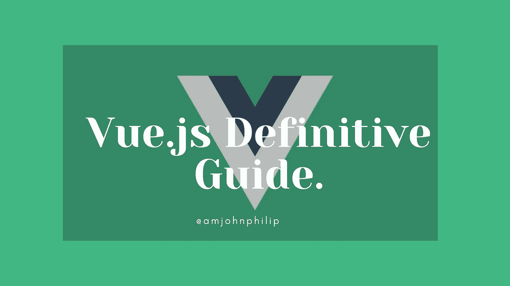

# 学习 Vue.js 的权威指南

> 原文：<https://javascript.plainenglish.io/the-definitive-guide-to-learning-vue-js-10b479a19a2c?source=collection_archive---------16----------------------->

## 学习 Vue.js 及其生态系统的路线图。

Photo by [John Philip](https://medium.com/u/c2cdb19c0977?source=post_page-----10b479a19a2c--------------------------------).

Vue.js 就像任何其他前端框架一样，当你想要学习和掌握这个框架时，会有一些复杂性。

在本文中，我们将把这个框架分解成简单、容易理解的主题，任何初学者或中级开发人员都可以快速跟踪他们的学习并获得更多关于 Vue.js 的信息。

这篇文章并不打算作为掌握 Vue.js 的通用标准，而是指导您学习最受欢迎的 Vue.js 主题及其相关生态系统。

## **入门。**

1.  **为什么要用 vue . js**

*   Vue.js 是什么？ **(** 简介 **)**
*   安装(NPM、CLI、Vite)。
*   使用 Vue.js 的好处(Vue.js 解决的优点/问题)。

**2。Vue.js 3 App 的基本结构**

*   Vue 3 App 的目录结构。
*   Vue 模板。
*   Vue.js 中的选项 API
*   为什么作文-API。
*   Vue 中的生命周期挂钩。
*   Vue.js 3 中的 Options vs Composition-API。
*   计算属性与方法。
*   观察者。

**3。Vue 指令、绑定(输入、数据状态)和反应。**

*   Vue.js 指令。
*   计算属性**。**
*   条件渲染**。**

**4。Vue.js 中的输入数据和事件处理**

*   使用 v-model 指令的双向状态/输入绑定。
*   使用 v-bind 的值绑定**。**
*   使用 v-for 指令遍历数组。
*   鼠标和键盘事件**。**
*   事件和输入修饰符。
*   事件指令修饰符。
*   在 Vue.js 中发出事件。

## **5。Vue 组件。**

*   什么是 Vue 组件？
*   为什么要使用组件？。
*   单个文件组件。
*   动态和异步组件。
*   处理边缘案件。
*   分解成可组合的成分。
*   道具入门。
*   使用 props 传递数据(父到子)。
*   带有 Vue.js 插槽的模块化组件。
*   设计 Vue.js 组件的样式。
*   组件范围与全局 CSS。
*   条件句。

## **6。服务器交互(API 和数据库)**

*   从 API 获取数据/信息。
*   将数据发布到服务器。
*   使用 fetch/Axios。

## **7。用 Vue 路由器在 Vue.js 中路由。**

*   为什么路由。
*   使用 Vue 路由器配置路由。
*   命名路线。
*   子路由和嵌套路由。
*   配置缺失/未找到的页面。
*   嵌套路由。
*   动态路由。
*   路线守卫。
*   使用 Vue 路由器重定向。

## 8。使用 VueX 进行状态管理。

*   VueX 是什么？。
*   什么是“国家管理模式”？。
*   为什么是状态管理(它解决什么)。
*   我应该什么时候使用它？。
*   安装。
*   Vuex 商店。
*   在 Vue.js 中配置 VueX 库
*   入门(状态、获取器、变异、操作、模块)。

## **高级。**

*   应用结构。
*   插件。
*   严格模式。
*   表单处理。
*   测试。
*   热重装。

## **9。高级 Vue.js 主题。**

*   过滤器。
*   Vue.js mixins。
*   Vue.js 插件。
*   自定义指令。
*   渲染函数和 JSX。
*   转换(进入/离开)
*   服务器端渲染。
*   性能瓶颈。
*   高级指令(v-once 等。).
*   Vue.js 框架(Gridsome，NuxtJS，Vue Native，Vuepress)。
*   带有 UI 框架的 Vue . js(tail wind UI，Chakra UI，Bootstrap，Vuetify，Keen UI，Ant Design Vue，Fish UI，Buefy，PrimeVUE，Vuikit，Ionic Vue 等。)

## Vue 阿波罗和 GraphQL。

*   消费图表 QL
*   突变。
*   阿波罗万岁。

## **打字稿和 Vue10。**

*   注释道具。
*   正在配置 tsconfig.json。
*   Vue.js 中的自定义钩子。

## **单元测试**

*   测试介绍。
*   断言。
*   真实世界的应用测试。

## **vue . js 中的伸缩性能**

*   组件的异步加载
*   异步装载路线
*   图像压缩或使用 WebP 图像
*   未使用的 CSS 样式的树抖动(当使用 CSS 框架时)。

## **如何使用开发者工具。**

*   过滤已检查的数据。
*   DOM 检查。
*   过滤器组件。

## **结论。**

这是从初学者到更高级主题的掌握 Vue.js 的完整指南。

我希望这篇文章对你有用，如果有用，请不要犹豫，与他人分享。

## **更多内容:**

 [## 如何用 Nuxt.js 和 Tailwind CSS 构建定时器

### 用 Nuxt.js 和 Tailwind CSS 构建一个定时器。

javascript.plainenglish.io](/how-to-build-a-timer-with-nuxt-js-and-tailwind-css-3312313d8e1f)  [## 您需要知道的 10 大 JavaScript 技巧和诀窍

### 您可能不知道可以在 JavaScript 中执行的有用提示和技巧。

javascript.plainenglish.io](/top-10-javascript-tips-and-tricks-you-need-to-know-27896d2a313f) 

*更多内容看* [***说白了. io***](http://plainenglish.io/)