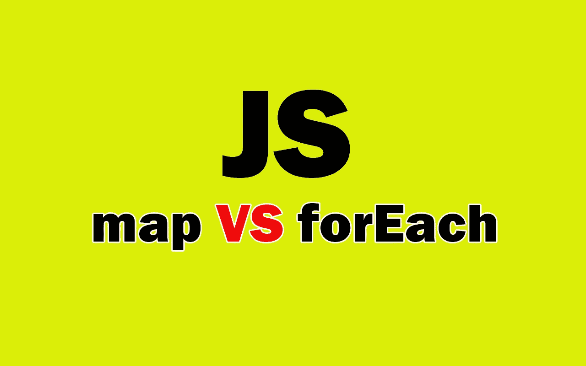

# JavaScript 中 ForEach 和 Map 的区别

> 原文：<https://javascript.plainenglish.io/the-difference-between-foreach-and-map-in-javascript-f369c3207e50?source=collection_archive---------7----------------------->

## JavaScript 方法:forEach VS map 及示例。



Image created with ❤️️ By [author](https://mehdiouss315.medium.com/).

# 介绍

JavaScript 有遍历数组的方法。forEach 方法和 map 方法是两种最常用的方法。很多初学者认为这两种方法的工作方式是一样的，因为它们都进行迭代并输出一些东西。

在本文中，我们将通过介绍 forEach 和 map 在 JavaScript 中的区别来了解它们。让我们开始吧。

# forEach 方法

方法`forEach`是一个高阶函数，因为它将回调作为其参数。它用于遍历数组元素，并返回`undefined`。回调可以接受三个参数(元素、值和索引)。

这里有一个例子:

```
let arr = [1, 2, 3 , 4];//ES5:
arr.**forEach**(function(**elem**){
 return **elem * 2**;
});
//returns "undefined"//ES6:
arr.**forEach**(**elem** => **elem * 2**);
//returns "undefined"
```

如你所见，上面的方法`forEach`返回`undefined`。它不会改变数组，但是可以通过回调改变数组。

方法`forEach`不接受附加其他方法。

这里有一个例子:

```
let arr = [1, 2, 3 , 4];arr.**forEach**(function(**elem**){
 return **elem * 2**;
}).**reduce**((a,b) => a + b);//Uncaught TypeError: Cannot read property 'reduce' of undefined
```

在使用 forEach 后附加 reduce 方法或任何其他方法将导致类型错误。

# 映射方法

方法`map`也用于遍历数组元素。它将回调函数作为其参数，并根据回调函数返回一个包含新元素的新数组。

回调可以接受三个参数(元素、值和索引)。

看看下面的例子:

```
let users = [
  { name: 'John', age: 34 },
  { name: 'Amy', age: 20 },
  { name: 'camperCat', age: 10 }
];
users.**map**(user => user.name);
//returns a new array: ["John", "Amy", "camperCat"]
```

正如您在上面看到的，我们在`users`数组上使用了`map`方法来返回一个新数组，该数组只包含用户名作为元素。为了简单起见，这个例子只使用了回调的第一个参数(元素)。方法`map`不会改变原始数组`users`。

方法`map`也接受附加其他方法。

这里有一个例子:

```
let users = [
  { name: 'John', age: 34 },
  { name: 'Amy', age: 20 },
  { name: 'camperCat', age: 10 }
];
users.**map**(user => user.age).**reduce**((a,b) => a + b);
//returns 64
```

与`forEach`不同，方法`map`接受附加其他方法。

# forEach 和 map 的区别

*forEach 方法:*

*   返回`undefined`。
*   回调可以改变数组。
*   它不接受向其附加其他方法。

*贴图方法:*

*   返回一个新数组。
*   它不会改变原始数组。
*   它接受向它附加其他方法。

# 结论

如您所见，这些是 forEach 和 map 之间的差异。在我的例子中，我更喜欢使用 map 方法，因为它返回一个新的不同的数组。但是，如果您不需要返回的数组，使用 forEach 也是一个好主意。

感谢您阅读本文，希望您觉得有用。

# 更多阅读

*如果你对 JavaScript 和 web 开发相关的更有用的内容感兴趣，也可以* [*订阅*](https://mehdiouss.ck.page/) *我的快讯。*

*下面是另一篇有用的文章，请点击链接查看:*

[](https://medium.com/javascript-in-plain-english/7-useful-free-resources-for-front-end-developers-f427cf5d5392) [## 7 个对前端开发人员有用的免费资源

### 你需要用到的牛逼前端开发资源。

medium.com](https://medium.com/javascript-in-plain-english/7-useful-free-resources-for-front-end-developers-f427cf5d5392)