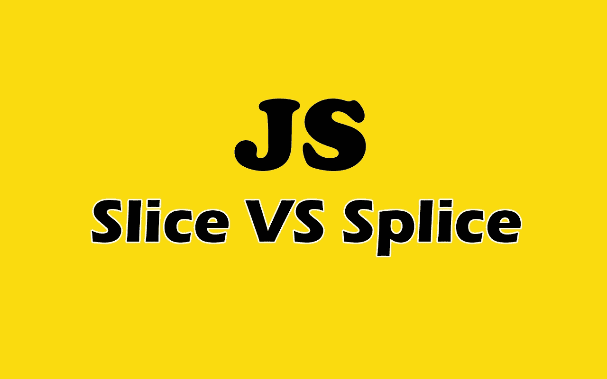

# JavaScript 中切片和拼接的区别

> 原文：<https://javascript.plainenglish.io/the-difference-between-slice-and-splice-in-javascript-af7043055f36?source=collection_archive---------4----------------------->

## JavaScript 方法:切片与拼接及示例。



Image created with ❤️️ By [author](https://mehdiouss315.medium.com/).

# 介绍

Slice 和 splice 是处理数组的两种有用的 JavaScript 方法。因为它们听起来相似，许多初学者混淆了它们。这就是为什么我决定让你简单地理解和知道这两种简便方法之间的区别。

在本文中，我们将通过介绍 JavaScript 中的 slice 和 splice 之间的区别来了解它们。让我们开始吧。

# 切片法

JavaScript 中的方法`slice`用于复制数组的片段。你也可以复制整个数组。它生成切片数组的浅层副本，并返回复制的数组。

方法`slice()`有两个参数:开始复制的起始索引和复制结束的结束索引。不包括第二个参数，这意味着当您将一个数组从索引 1 复制到索引 5 时，它只会从索引 1 复制到索引 4。

这里有一个例子:

```
let languages = [ "JavaScript", "Python", "Java", "PHP" ];languages.**slice(1,3)**; // ["Python", "Java"]**languages.slice(2)**; //(from index 2 until the end of the array).
// ["Java", "PHP"]**console.log(languages)**; // the original array is not mutated.
//[ "JavaScript", "Python", "Java", "PHP" ]
```

正如你在上面看到的，方法`slice()`没有改变原始数组，它只返回一个复制的数组。

方法`slice()`也是一个字符串方法。与数组方法类似，字符串的`slice`方法也将字符串的一部分切片并返回。它不会变异或改变原始字符串。

这里有一个例子:

```
let str = "Hello I love JavaScript"; str.**slice(6, 13)**; //returns: "I love"str.**slice(2)**; // slices from index 2 until the end.
// returns: "llo I love JavaScript"str.**slice(-10)**; // copy elements from the last index to the left 10 indices.
// returns: 'JavaScript'console.log(str); Does not mutate the original string.
// returns: "Hello I love JavaScript"
```

# 该拼接方法

方法`splice()`用于在 JavaScript 中添加和移除数组中的元素。与`slice`不同，方法`splice`对原始数组进行了变异。它返回一个新数组中被移除的元素。

它接受三个参数:

*   第一个参数(start)指定应该插入或移除元素的索引。
*   第二个参数指定从提供的起始索引开始要移除的元素总数。
*   第三个参数指定要添加到数组中的元素。

第一个参数是必需的，其他参数是可选的。对于第三个参数，如果有很多元素要添加到数组中，可以添加更多的参数。

下面是`splice`参数的语法:

```
arr.splice(**start**, **deleteCount**[optional], **newElem**[optional], **newElem** [optional], ...);
```

让我们尝试一些实际的例子:

```
let friends = ['John', 'Chris'];friends.**splice(0,0,"Mehdi")**; //returns removed array: []console.log(friends); // Original array is mutated.
//["Mehdi", "John", "Chris"]
```

在上面的例子中，我们在数组的索引 0 处添加了`Mehdi`。如果我想将上面的拼接方法转换成一个文字句子，我会说在索引 0 处移除 0 个元素并添加`Mehdi`。还要注意，原始数组发生了变异。

因为方法`splice`返回一个移除的数组，并且我们指定了 0 个元素要移除，所以上面例子中的拼接方法返回一个空数组`[]`。

下面是另一个示例，我们在第二个索引处插入了 2 个元素，并删除了 1 个元素:

```
let friends = ['John', 'Chris', "Alex"];friends.**splice(2,1,"Mehdi","Brad")**; //returns removed array:["Alex"]console.log(friends); // Original array is mutated.
//returns: ["John", "Chris", "Mehdi", "Brad"]
```

在上面的例子中，我们去掉了`Alex`，增加了`Mehdi`和`Brad`。因为我们移除了一个元素(Alex ), splice 方法在一个新数组中返回移除的元素。

# 切片和拼接的区别

*切片法:*

*   它不会改变原始数组。
*   需要两个参数。
*   制作原始数组的浅表副本。
*   返回复制的数组。

*拼接方法:*

*   改变原始数组。
*   它接受一个强制参数，也可以接受一堆可选参数来替换元素。
*   从原始数组中添加或移除。
*   返回新数组中移除的元素。

# 结论

Slice 和 splice 是 JavaScript 中非常有用的方法，你必须知道。当然，它们听起来很相似，但工作方式完全不同。这就是为什么理解它们之间的差异是一件好事。

感谢您阅读这篇文章。希望你觉得有用。

# 更多阅读

*如果你对 JavaScript 和 web 开发相关的更有用的内容感兴趣，也可以* [*订阅*](https://mehdiouss.ck.page/) *我的简讯。*

*这是另一篇有用的文章，请点击下面的链接查看:*

[](https://medium.com/javascript-in-plain-english/20-useful-javascript-array-methods-that-you-should-know-6f0e5a9c710a) [## 你应该知道的 20 个有用的 JavaScript 数组方法

### 20 个有用的方法和例子，帮助你在 JavaScript 中轻松操作数组。

medium.com](https://medium.com/javascript-in-plain-english/20-useful-javascript-array-methods-that-you-should-know-6f0e5a9c710a)