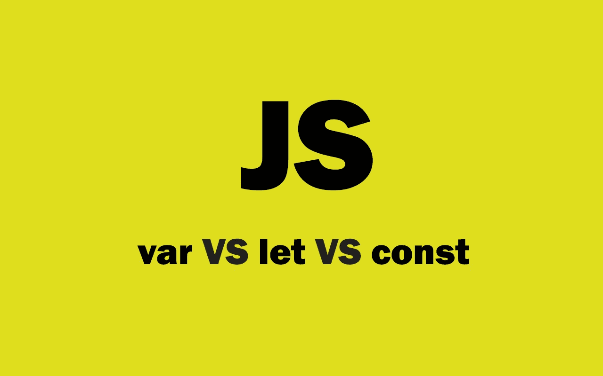

# JavaScript 中 var、let 和 const 的区别

> 原文：<https://javascript.plainenglish.io/the-difference-between-var-let-and-const-in-javascript-630b5a8bb1c5?source=collection_archive---------6----------------------->

## 用例子解释 JavaScript 中的变量声明关键字。



Image created with ❤️️ By author.

JavaScript 有三个关键字用于变量声明。每个关键词都很有用，并且有你需要使用它的场合。这就是为什么理解 JavaScript 中三个变量声明关键字之间的区别非常重要。

当谈到需要使用什么关键字时，许多初学者会感到困惑。尤其是，如果他们不明白这三个关键词的区别。

这就是为什么在本文中，我们将了解这些关键字(`var`、`let`和`const`)之间的区别。所以让我们开始吧。

# var 关键字

JavaScript 中的关键字`var`是开发者用于变量声明的第一个关键字。

当你使用关键字`var`在函数中声明一个变量时。该变量在函数之外是不可访问的，因为在这种情况下它有一个函数作用域。

这里有一个例子:

```
function sayHelllo() {
 **var** greeting = 'Hello!';
 console.log(greeting);
}

sayHelllo(); // 'Hello!'

console.log(greeting) // ReferenceError: sentence is not defined
```

正如你在上面看到的，当我们在函数中调用变量`greeting`时，我们在调用函数时在控制台中得到我们的响应。

但是当我们在函数外部调用`greeting`时，我们会得到一个引用错误，因为在函数内部用关键字`var`声明的变量在函数外部是不可访问的。

然而，如果你在函数之外使用关键字`var`声明一个变量，它将会有一个全局范围。这意味着在代码中的任何地方都可以访问它。

这里有一个例子:

```
/* This variable has a global scope, it's accessible everywhere */
**var** greeting = "Hello John";function sayHelllo() {
 console.log(greeting); // "Hello John"
}console.log(greeting); // "Hello John"
```

所以在函数外部用关键字`var`声明的变量是全局范围的。它们随处可见。

除此之外，带有关键字`var`的变量是可声明和可重新赋值的。这意味着您可以重新声明同一个变量，并重新分配它没有任何问题。

这里有一个例子:

```
**var** name = 'John';
**var** name = 'Brad';console.log(name) // 'Brad'
```

即使我们声明了同一个变量，并对它进行了重新赋值，代码仍然可以正常工作，不会出错。然而，这并不好，因为有时你可能在代码中写了相同的变量而没有注意到它们。这也可能导致你的程序出错。

使用`var`时要记住的另一件事是，所有用关键字`var`声明的变量和函数都被提升到它们作用域的顶部。如果你对 JavaScript 中的*提升*不熟悉，我真的建议你学习一下，因为这是一个需要了解的重要概念。

# 关键字 let 和 const

关键字`let`和`const` 在 ES6 中被引入作为`var`的替代。它们非常有用，几乎每个 JavaScript 开发人员都在使用它们。

与关键字`var`不同，这两个关键字有 block 作用域。这意味着当你在一个块中声明它们时，它们只能在那个块`{}`中被访问。

这里有一个例子:

```
**{**
    **const** a = 5;
    **let** b = 6;
    var c = 8;
**}**//Accessing the variables outside the block.
console.log(a); //Error: a is not defined.
console.log(b); //Error: b is not defined.
console.log(c); // 8
```

正如您所看到，用`const`和`let`声明的变量在花括号之间的范围之外是不可访问的。这就是为什么我们得到一个错误。所以这非常有用，因为有时候用关键字`var`你可以改变一个变量而不会注意到它。

另外，请记住，与`var`不同，用`let`和`const`声明的变量和函数不会被提升。所以不用在意吊装。

现在你可能想知道`let`和`cosnt`有什么区别？

用关键字`let`声明的变量是可重赋值的，不可重声明的。而用关键字`const`声明的变量是不可重赋值和不可重声明的。

因此，只需将`let`用于您稍后要更改的变量，将`const`用于您不想更改的常量变量。

这里有一个例子:

```
**const** name = "Brad";
**const** name = John; //Error.**let** x= 1;
x = 2;console.log(name); //"Brad"
console.log(x); // 2
```

# 差异

*关键词* `*var*` *:*

*   函数作用域和全局作用域。
*   升起。
*   可重新分配和重新申报。

*关键字* `*let*` *:*

*   阻止范围。
*   未悬挂。
*   可重新分配且不可重新申报。

*关键字* `*const*` *:*

*   阻止范围。
*   未悬挂。
*   不可重新分配和重新申报。

# 结论

正如你所看到的，这些是 JavaScript 中关键字`var`、`let`和`const`之间的区别。就我个人而言，大多数时候我在代码中使用`const`和`let`，因为它们更安全、更有用。我很少使用关键字`var`,有时只是为了全局变量或者如果我想提升我的变量。

感谢您阅读这篇文章。希望你觉得有用。

**更多阅读:**

[](/5-exciting-reactjs-projects-for-all-junior-frontend-developers-eb7f28098ab4) [## 所有初级开发人员都应该构建的 5 个 React 项目

### 作为一名前端开发人员，您应该构建令人敬畏的 React 项目。

javascript.plainenglish.io](/5-exciting-reactjs-projects-for-all-junior-frontend-developers-eb7f28098ab4) [](/dynamic-imports-in-javascript-explained-with-examples-c2122743e5ac) [## 用例子解释 JavaScript 中的动态导入

### 如何在 JavaScript 中轻松使用动态导入？

javascript.plainenglish.io](/dynamic-imports-in-javascript-explained-with-examples-c2122743e5ac) 

*更多内容看*[***plain English . io***](http://plainenglish.io/)