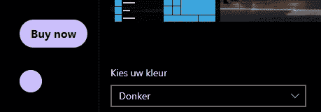

# 实现黑暗模式的最简单方法

> 原文：<https://javascript.plainenglish.io/the-easiest-to-implement-dark-mode-32057aaec511?source=collection_archive---------6----------------------->

## TailwindCSS 的团队真的超越了自己。

Photo by [Nadine Shaabana](https://unsplash.com/@nadineshaabana?utm_source=unsplash&utm_medium=referral&utm_content=creditCopyText) on [Unsplash](https://unsplash.com/s/photos/dark?utm_source=unsplash&utm_medium=referral&utm_content=creditCopyText)

# 介绍

当 Tailwind 团队宣布推出 TailwindCSS 2.0 时，他们增加了一个过去很难实现的奇妙特性。[黑暗模式](https://tailwindcss.com/docs/dark-mode)。

黑暗模式通常是作为一个单独的主题来实现的，你可以很容易地切换到这个主题。然而，这需要更多的代码，而不仅仅是一行代码。并且您必须为每个改变了样式的元素添加新的颜色类。

然而，在 Tailwind 中，你只需像对待响应性的`md`或`lg`前缀或`hover`一样，给你的类添加一个`dark`前缀。

# 安装和设置

为了简单起见，我将使用另一篇 Tailwind 文章中的一个简单的 [NextJS](https://nextjs.org/) 项目作为样板文件。你可以使用任何你喜欢的框架。NextJS 基于 React，旨在轻松开发简单的网络应用。

 [## TailwindCSS 入门指南

### TailwindCSS 会扼杀传统 CSS 吗？

mbvissers.medium.com](https://mbvissers.medium.com/tailwindcss-starter-guide-90815db8ecc1) 

Tailwind 为那些使用 NextJS 并希望将 TailwindCSS 集成到项目中的人增加了一个教程。如果你不想读另一篇文章，你可以在这里找到。

## 配置

安装后，我们需要配置`tailwind.config.js`文件。在这个文件中，我们需要添加黑暗模式的功能。Tailwind 不像其他高级功能那样默认提供黑暗模式，但是添加它根本不是什么大事。

您可以将黑暗模式值设置为“媒体”或“类别”。`Media`将根据用户操作系统的设置自动切换黑暗模式。如果你将它设置为`class`，你将不得不通过编程手动切换它。我们会用`media`。

## 在 Windows 中切换黑暗模式

不幸的是，我只有一台 Windows PC。切换黑暗模式非常容易做到。在你的设置中搜索“黑暗模式”或者类似的东西。

Toggling dark-mode

这是您应该找到的屏幕。在我的情况下，它是在荷兰。选择框说:“选择你的颜色”，这可以是深色、浅色或定制。保持此屏幕打开，以测试顺风代码。

# 顺风黑暗模式

就像我之前提到的，在顺风中增加黑暗模式是一件轻而易举的事情(双关语)。只需在你的代码前添加前缀`dark:`到你想在黑暗模式下改变的类。

如果没有提供带有`dark:`的类，默认样式将保持不变。就像我们习惯使用 Tailwind 的简单工具一样。

上面的代码是为了展示黑暗模式的功能。它呈现一个按钮和一个圆圈，两者都根据用户使用的操作系统的主题改变颜色。在这种情况下，它们将有一个黑色背景作为容器，在暗模式下有一个浅紫色背景和黑色文本，在亮模式下有一个深紫色背景和白色文本。

Light mode

它在轻模式下看起来不错，没有太花哨。

Dark mode

正如我们所料，黑暗模式非常好，非常暗。而且实施起来再容易不过了。所以总结一下:

*   更新配置
*   使用`dark:`前缀
*   黑暗模式

# 结论

**巨大的**道具给了顺风团队的开发者。他们创造了最容易实现的黑暗模式。使用易于使用的前缀来响应是不错的，但对于黑暗模式，它肯定是一个游戏规则的改变者。

非常感谢你的阅读，祝你有美好的一天。