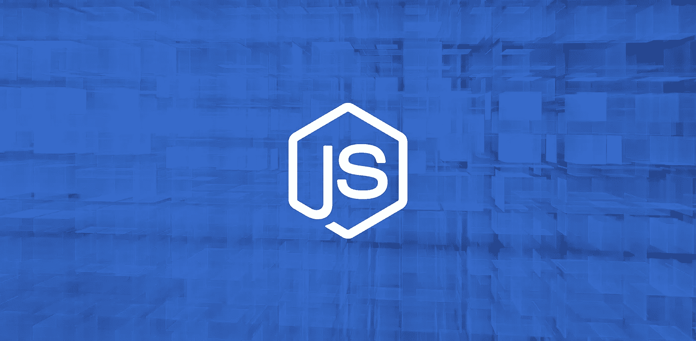
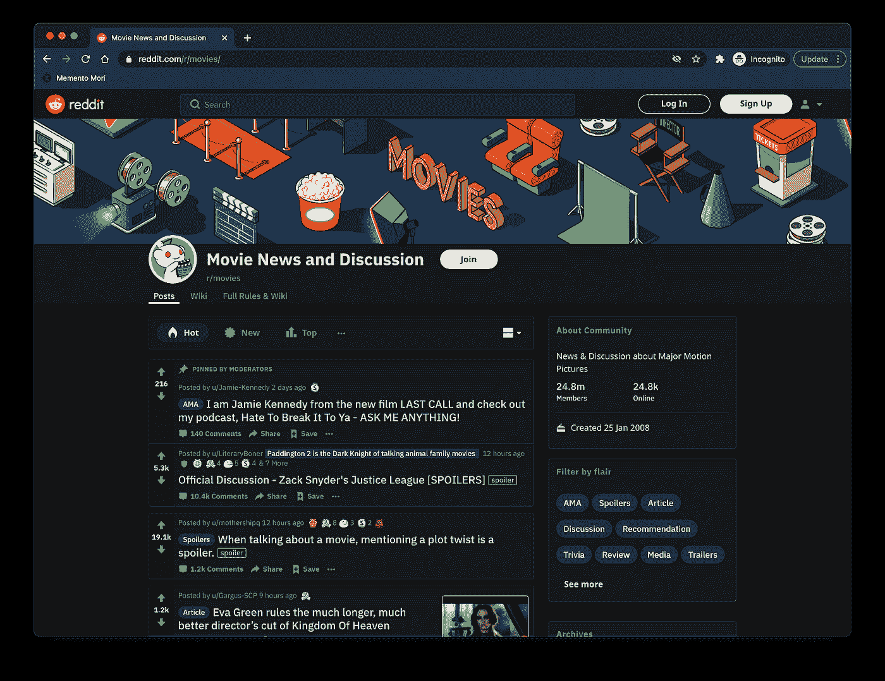
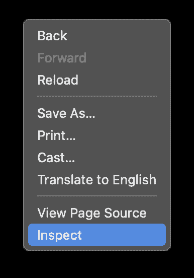
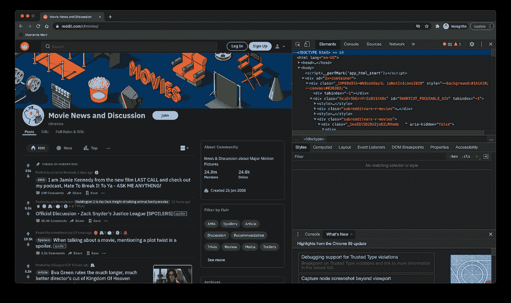

# 使用 JavaScript 和 Node.js 构建 Web Scraper 的最简单方法

> 原文：<https://javascript.plainenglish.io/the-easiest-way-to-build-a-web-scraper-using-javascript-and-nodejs-25bb8e8790d3?source=collection_archive---------1----------------------->



你可能已经知道，我们正被自己的数字数据淹没。不过，在网上找东西很容易:打开一个浏览器窗口，用谷歌搜索你需要的东西，差不多就行了。

但是当你需要从一个网站收集一些数据的时候，你会怎么做呢？

即使是最常用的搜索引擎也加入了敌人一方。就在你认为收集数据是容易的一步时，你碰壁了。当搜索引擎发现你试图未经许可抓取他们的网站时，他们会限制你的访问。根据您的物理位置，如果请求来自不可信的区域，网站可以完全禁止您的访问。

因此，在下面的文章中，我将帮助您使用 NodeJS 构建自己的 web 抓取器，而不会被阻塞。但是在我们直接进入主题之前，让我们了解更多关于网络抓取的信息。

[**什么是网页抓取？**](#6c6a)[**为什么要用 JavaScript？**](#02b9)[**打造你的网络刮刀**](#9773)
∘ [1。选择你想要刮的页面](#cd60)
∘ [2。查看网站](#9b90)
∘ [3 的代码。写代码](#b635)
∘ [4。运行代码](#4a79)
∘ [5。存储您提取的数据](#2b2f)
[**自己提取数据从未如此简单**](#8fd4)

# 什么是网页抓取？

web scraper 是帮助我们自动收集网站数据的工具。在没有它的情况下，人们不得不向网站发出请求，检查 HTML 页面并分解它以获得他们需要的数据。

对于那些还不知道 web scraper 用途的人，我将在下面提到一些主要的使用案例:

*   价格比较
*   学术研究
*   市场分析
*   线索挖掘
*   为机器学习收集训练和测试数据集

让我给你一个更实际的例子:使用一些网络抓取技术，一家名为 Brisk Voyage [的公司帮助他们的用户在最后一分钟的周末旅行中节省高达 80%的费用。](https://medium.com/brisk-voyage/how-we-scrape-300k-flight-prices-per-day-from-google-flights-79f5ddbdc4c0)

他们通过不断检查航班和酒店价格来做到这一点，当他们的工具发现一个低价的异常旅行时，用户会收到一封电子邮件，其中有预订说明。很漂亮，对吧？

# 为什么要用 JavaScript？

JavaScript 是互联网上使用最多、最容易学习的编程语言之一。它帮助开发者为他们的网站添加复杂的功能，如显示动态内容、交互式地图、滚动视频点播机等。每当一个网站除了呈现一些静态信息之外，它最有可能使用 JavaScript。

在本文的下一节，我将帮助您使用 Node.js 编写自己的 web scraper 应用程序。它之所以受欢迎，是因为它可以帮助用户在几分钟内构建和运行网络应用程序。

# 创建你的网页抓取器

首先，请确保您拥有以下流程所需的所有工具:

*   Chrome(或任何其他浏览器，就此而言)。这里可以下载[。](https://www.google.com/chrome/)
*   VSCode(或其他代码编辑器)。这里可以下载[。](https://code.visualstudio.com/)
*   Node.js 和 npm。安装 Node.js 和 NPM 最简单的方法是获得一个 [Node.js 官方源代码](https://nodejs.org/en/download/)安装程序，然后运行它。成功安装 Node.js 后，您可以在新的终端窗口中运行`node-v`和`npm-v` 来验证一切是否顺利。如果你对这个过程有疑问，你可以查看这些说明。

现在为这个项目创建一个新文件夹，打开一个新的终端窗口，导航到新创建的文件夹并运行`npm init-y`。

*   Axios。在新创建的文件夹中运行`npm install axios`。
*   再见。同前，运行项目文件夹中的`npm install cheerio` 。

请记住，如果您选择了单页应用程序来抓取，事情可能会稍微复杂一点，并且我为本教程选择的工具可能无法工作。如果这发生在你身上，看看[木偶师](https://developers.google.com/web/tools/puppeteer)。

现在，让我们开始建造铲运机:

## 1.选择要刮除的页面

首先，你需要使用 Chrome 或任何其他网络浏览器访问你想要抓取的网站。要成功收集数据，你必须了解网站的结构。对于下面的步骤，我选择抓取 [/r/movies 子编辑](https://old.reddit.com/r/movies)上的信息。

## 2.检查网站的代码

访问网站后，试着想象一个普通用户会怎么做。点击查看主页上的帖子，阅读评论，根据你的喜好对帖子投赞成票或反对票，甚至按日、周、月或年排序。



让我们试着理解信息在任何子编辑上是如何构成的。这也有助于你对数据有一个更清晰的概念。

Chrome Dev Tools 为您提供了一种探索网站文档对象模型的方法。只需右键单击页面上的任意位置，然后选择“检查”选项。



我们将看到以下窗口。选择“元素”选项卡，查看网站的交互式 HTML 结构。



您可以通过编辑网站的结构、展开和折叠元素，甚至删除它们来与网站进行交互。请注意，这些更改仅对您可见。

我们现在可以通过将鼠标悬停在呈现的结构上来突出显示网站的不同元素，甚至删除它们。这些更改仅对您可见。

为了简单起见，我将只收集帖子的标题。我们开始工作吧！

## 3.写代码

让我们创建一个名为 index.js 的新文件，并键入或复制以下几行:

```
const axios = require("axios");
const cheerio = require("cheerio");

const fetchTitles = async () => {
 try {
  const response = await        axios.get('https://old.reddit.com/r/movies/');

        const html = response.data;

  const $ = cheerio.load(html);

  const titles = [];

  $('div > p.title > a').each((_idx, el) => {
   const title = $(el).text()
   titles.push(title)
  });

  return titles;
 } catch (error) {
  throw error;
 }};

fetchTitles().then((titles) => console.log(titles));
```

为了更好地理解上面写的代码，我将解释主异步函数的作用:

首先，我使用之前安装的库 Axios 向旧的 Reddit 网站发出 GET 请求。该请求的结果由 Cheerio 加载到第 10 行。使用 Chrome Dev 工具，我发现包含所需信息的元素是两个锚标记。为了确保我只选择包含文章标题的锚标签，我还将使用下面的选择器来选择它们的父标签:`$(`div>p/title>a`)`。

为了单独获取每个标题，而不仅仅是一大堆毫无意义的字母，我必须使用`each()`函数遍历每个帖子。最后，在每个项目上调用`text()`将返回我那个特定帖子的标题。

## 4.运行代码

要运行它，只需在终端中键入`node index.js`并按回车键。您应该会看到一个包含所有文章标题的数组。

## 5.存储提取的数据

根据您将使用抓取的数据做什么，您需要将它存储在一个 CSV 文件、一个新的数据库或一个普通的旧数组中。让我向您展示如何将它们存储在新的 CSV 文件中。

在您之前编写的同一个 index.js 文件中，将最后一行代码替换为以下内容:

```
fetchTitles().then((titles) => {
var csv = titles.join("%0A");
var a = document.createElement('a');
a.href = 'data:attachment/csv,' + csv;
a.target = '_blank';
a.download = titles.csv';

document.body.appendChild(a);
a.click();
});
```

首先，创建一个新的锚元素。您将 href 的类型设置为 attachment，并添加先前生成的数组作为其内容。链接的目标应该设置为`_blank`,因为您需要在一个新窗口中打开新生成的文件，并且为了具体起见，您还将文件名设置为“titles.csv”。完成以上所有工作后，将锚元素添加到 DOM 的主体，并通过调用`click()` 方法，调用下载过程。

# 自己提取数据从未如此简单

这就是如何使用 JavaScript、Node.js 和 Cheerio 从单个网页中获取所有需要的信息。我希望这篇文章能让这个过程变得更容易忍受一些。

正如你所看到的，抓取一个网页并不是你在互联网上度过的最有趣的时光。除了非常耗时之外，如果需要刮一页以上，还必须反复做。

现在，如果你需要一起做，你需要找到稍微高级一点的软件。从我个人的经验来看，使用一个网页抓取 API 可以帮你节省很多时间。市面上还有很多工具，但是你可以从查看 [WebScrapingAPI](https://webscrapingapi.com/) 开始，看看它是否符合你的要求。

谢谢你坚持到最后&祝你有美好的一天！

## 进一步阅读

[](/top-5-instant-data-scraping-tools-for-easy-web-scraping-2f3d1c4b07f0) [## 轻松抓取网页的五大即时数据抓取工具

### 光明数据，ParseHub，Apify，Octopase，Mozenda。有大量的即时网页抓取工具可供选择。如何挑选…

javascript.plainenglish.io](/top-5-instant-data-scraping-tools-for-easy-web-scraping-2f3d1c4b07f0) [](/best-tool-for-web-scraping-beautifulsoup-vs-regex-vs-advanced-web-scrapers-50b8fb92950d) [## 最佳网络抓取工具:beautiful soup vs . Regex vs . Advanced Web Scrapers

### BeautifulSoup、正则表达式或高级 web scraper——哪一个是 web 抓取的最佳工具？深潜…

javascript.plainenglish.io](/best-tool-for-web-scraping-beautifulsoup-vs-regex-vs-advanced-web-scrapers-50b8fb92950d) [](/overcoming-3-major-web-scraping-challenges-that-developers-face-1e664ffe4783) [## 克服开发者面临的 3 大网络抓取挑战

### 如何克服 3 个主要的网络抓取限制—动态网站、网站交互和指纹管理…

javascript.plainenglish.io](/overcoming-3-major-web-scraping-challenges-that-developers-face-1e664ffe4783) [](https://plainenglish.io/blog/how-to-create-an-amazon-product-search-api-with-data-collectors) [## 如何使用数据收集器创建亚马逊产品搜索 API

### API(应用程序编程接口)是两台或多台计算机之间的一种通信方式，目的是…

简明英语. io](https://plainenglish.io/blog/how-to-create-an-amazon-product-search-api-with-data-collectors) [](https://plainenglish.io/blog/5-use-cases-of-web-scraping-in-ecommerce) [## 电子商务中网络抓取的 5 个用例

### 利用 web scraper 可以让您的组织鸟瞰行业趋势。这有无数…

简明英语. io](https://plainenglish.io/blog/5-use-cases-of-web-scraping-in-ecommerce) [](/automate-web-scraping-with-an-easy-to-use-browser-extension-cb6073f1e61d) [## 使用易于使用的浏览器扩展自动抓取网页

### 如何使用 Listly，一个初学者友好的无代码工具，轻松实现 web 抓取过程的自动化。

javascript.plainenglish.io](/automate-web-scraping-with-an-easy-to-use-browser-extension-cb6073f1e61d) 

*更多内容请看*[***plain English . io***](https://plainenglish.io/)*。报名参加我们的* [***免费周报***](http://newsletter.plainenglish.io/) *。关注我们关于*[***Twitter***](https://twitter.com/inPlainEngHQ)**和*[***LinkedIn***](https://www.linkedin.com/company/inplainenglish/)*。查看我们的* [***社区不和谐***](https://discord.gg/GtDtUAvyhW) *加入我们的* [***人才集体***](https://inplainenglish.pallet.com/talent/welcome) *。**