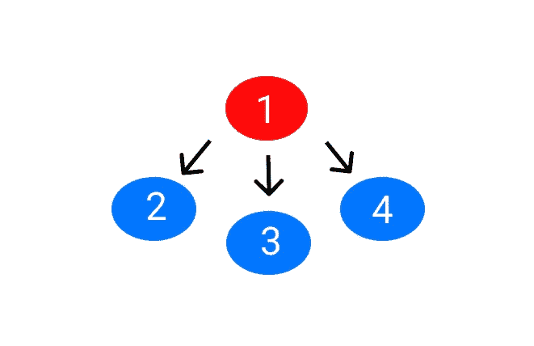
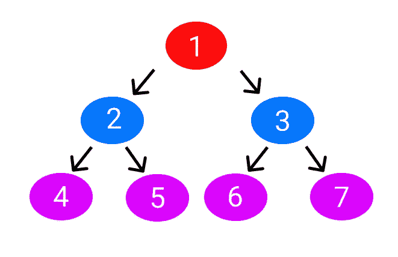
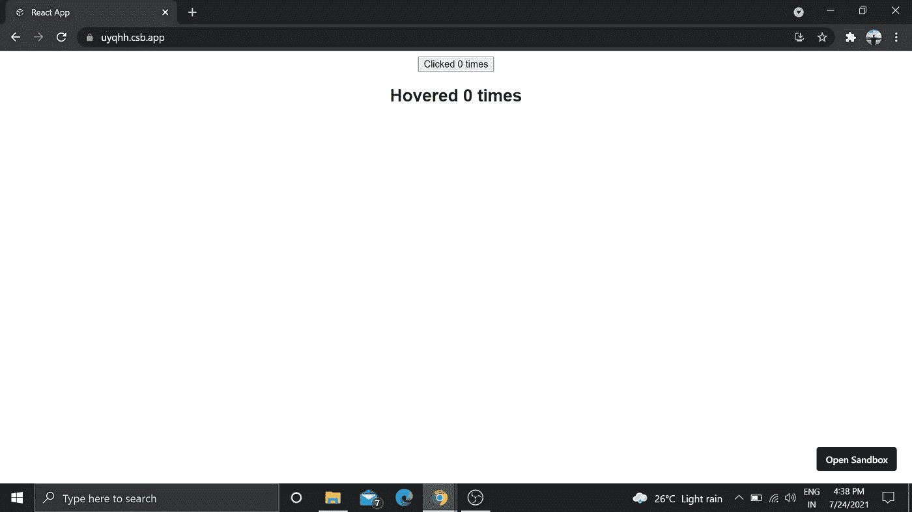

# 用简单实例学习高阶元件的最简单方法

> 原文：<https://javascript.plainenglish.io/the-easiest-way-to-learn-higher-order-components-with-simple-instance-44c4230c5351?source=collection_archive---------13----------------------->

## React 中的高阶组件，用一个简单的例子解释并使用功能组件。


Photo by [Anthony Tran](https://unsplash.com/@anthonytran?utm_source=medium&utm_medium=referral) on [Unsplash](https://unsplash.com?utm_source=medium&utm_medium=referral)

您可能多次听说过高阶元件(HOC)。申请实习的时候被问到高阶元件。

你可能想知道这是什么。或者你可能读到过，但还没有理解。

没问题。在这里，我将帮助你轻松学习。

这篇文章将基于基本的 React 概念，如[类和功能组件](https://medium.com/code-blog/learn-react-components-for-your-next-react-or-react-native-project-bcf69cd81752)，所以在继续之前，试着熟悉它们。

> 我使用了来自 [YouTube 视频](https://youtu.be/rsBQj6X7UK8)的代码，做了一点改动。在视频中，使用类组件解释了 HOC，而我在这里使用了功能组件。

我们开始吧。

# **我们为什么需要特设委员会？**

根据 [React 文档](https://reactjs.org/docs/higher-order-components.html)，高阶组件(HOC)是 React 中重用组件逻辑的高级技术。

简单来说，高阶组件主要用于避免重复代码和重用相同的组件逻辑。

在创建一个网站时，很多时候我们在几个组件中应用相同的逻辑；相反，我们可以使用特设。

让我们看一个例子来更清楚地理解它。

假设你正在创建一个网站，你有三个相同的组件功能。这意味着你只是复制代码，而不是重用它。



Src: Author

一种方法是将状态提升到父组件，并将状态和处理程序作为道具传递给子组件。



嗯，如果我们有同一个父元素的子元素，这是没问题的，但是如果组件是分散的，我们必须在几个组件中传递道具，那该怎么办呢？

这将是最糟糕的情况。为此，我们可以使用 HOC。

# 什么是 HOC？

为了更清楚地记住它，我再重复一遍。

根据 [React 文档](https://reactjs.org/docs/higher-order-components.html)，高阶组件(HOC)是 React 中重用组件逻辑的高级技术。

简单来说:

高阶组件主要用于避免重复代码和重用相同的组件逻辑。

很多时候，我们在几个组件中应用相同的逻辑；相反，我们可以使用 HOC。

特设的语法非常简单。

```
const NewComponent = higherOrderComponent(originalComponent)
```

这可以理解为我们有一个函数，它接受原始组件添加功能并返回新组件。

实际的语法是:

```
const EnhancedComponent = higherOrderComponent(WrappedComponent);
```

为了解释得更清楚，这里有一个非技术性的例子:

```
const IronMan = withSuit(TonyStark);
```

实际上，我在 YouTube 的一个视频中见过这个语法，所以所有的功劳都归 YouTube 频道。

# 无条件的实例

假设我们需要在用户点击一个按钮以及用户悬停在另一个按钮上时创建一个计数器功能。

为此，我们将创建 Click.js 和 Hover.js 文件来添加功能。

在 Click.js 中，

```
import React, { useState } from "react";const Click = () => {
 const [count, setCount] = useState(0);
 const incrementCount = () => {
  setCount(count + 1);
 }; return 
  <button onClick={incrementCount}>Clicked {count} times</button>;
};export default Click;
```

在 Hover.js 中，我们将编写以下代码。

```
import React, { useState } from "react";const Hover = () => {
 const [count, setCount] = useState(0); const incrementCount = () => {
  setCount(count + 1);
 }; return (
  <div>
   <h2 onMouseOver={incrementCount}>Hovered {count} times</h2>
  </div>
); };export default Hover;
```

最后，我们将通过在 App.js 中导入组件来显示它

```
import "./styles.css";
import Click from "./Click";
import Hover from "./Hover";export default function App() {
return (
  <div className="App">
   <Click />
   <Hover />
  </div>
);}
```



Output

输出可以工作，但是您是否意识到我们在点击和悬停组件中重复了代码？

现在让我们用 HOC 来解决这个问题。

# 带有 HOC 的实例

我们将创建一个 Counter.js 文件来添加计数器功能。

在 Counter.js 中编写以下代码。

```
import React from "react";
import { useState } from "react";const UpdatedComponent = (OriginalComponent) => {
 const NewComponent = () => {
   const [count, setCount] = useState(0);
   const incrementCount = () => {
    setCount(count + 1);
   }; return <OriginalComponent count={count} incrementCount={incrementCount} />; }; return NewComponent;};export default UpdatedComponent;
```

这里我们有一个接受原始组件、添加功能并返回新组件的函数。

现在，您还记得我们将添加到 Click.js 和 Hover.js 文件中的语法吗？

```
const NewComponent = higherOrderComponent(originalComponent)
```

修改 Click.js 文件，

```
import React from "react";
import UpdatedComponent from "./Counter";const Click = (props) => {
  const { count, incrementCount } = props;

  return <button onClick={incrementCount}>Clicked {count} times </button>;};**export default UpdatedComponent(Click);**
```

并修改 Hover.js 文件，

```
import React from "react";
import UpdatedComponent from "./Counter";const Hover = (props) => {
  const { count, incrementCount } = props; return (
  <div>
   <h2 onMouseOver={incrementCount}>Hovered {count} times</h2>
  </div>
);};**export default UpdatedComponent(Hover);**
```

就是这样！我们使用了 HOC 来重用逻辑。

# 让我们结束吧

在我学习 React 的时候，它是帮助我学习 HOC 的最简单的例子。

从这篇文章中，我想你们大多数人会明白我们为什么使用 HOC 以及如何使用它。

如果没有，请再次阅读文章，然后在任何代码编辑器中练习相同的示例。它会帮助你更清楚地掌握这个概念。

别忘了[关注我](https://nitinfab.medium.com/)，它会帮助我写更多这类内容。

谢了。

[](/11-web-development-tools-i-use-every-day-because-they-make-my-life-easier-54ede59743c2) [## 我每天都在使用的 11 个 Web 开发工具，因为它们让我的生活变得更加轻松

### 他们也一定会为你做同样的事情。

javascript.plainenglish.io](/11-web-development-tools-i-use-every-day-because-they-make-my-life-easier-54ede59743c2) [](/8-life-lessons-a-programmer-with-30-years-of-experience-taught-me-2a9fb090a398) [## 一个有 30 多年经验的程序员教给我的 8 条人生经验

### 就连千禧一代也在放弃六位数的技术工作。

javascript.plainenglish.io](/8-life-lessons-a-programmer-with-30-years-of-experience-taught-me-2a9fb090a398) 

*更多内容尽在*[***plain English . io***](http://plainenglish.io/)