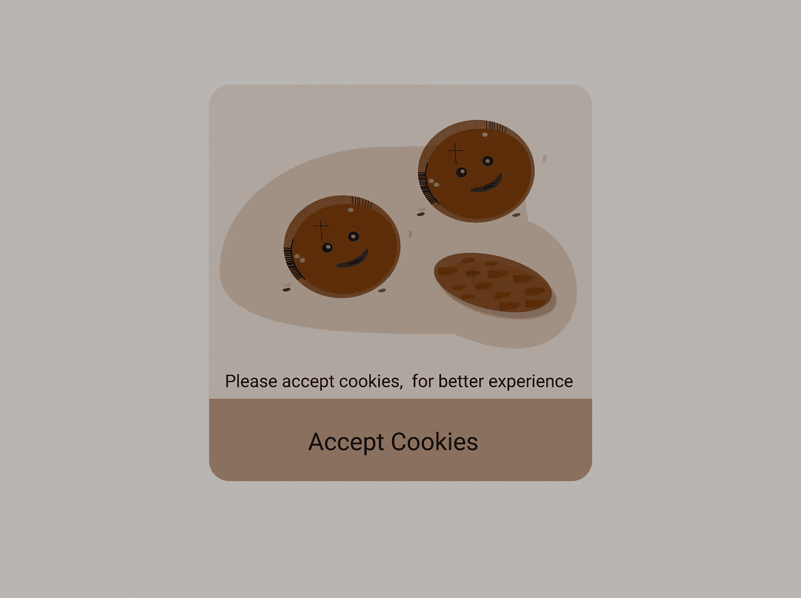
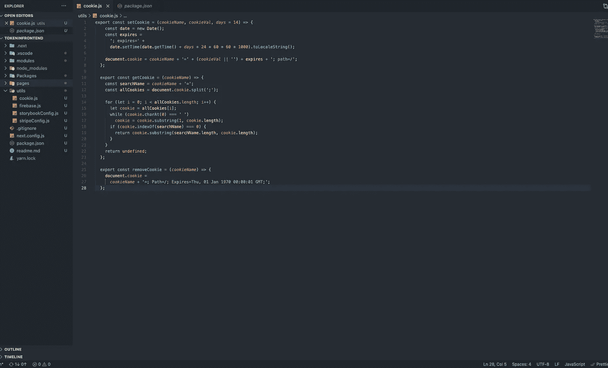
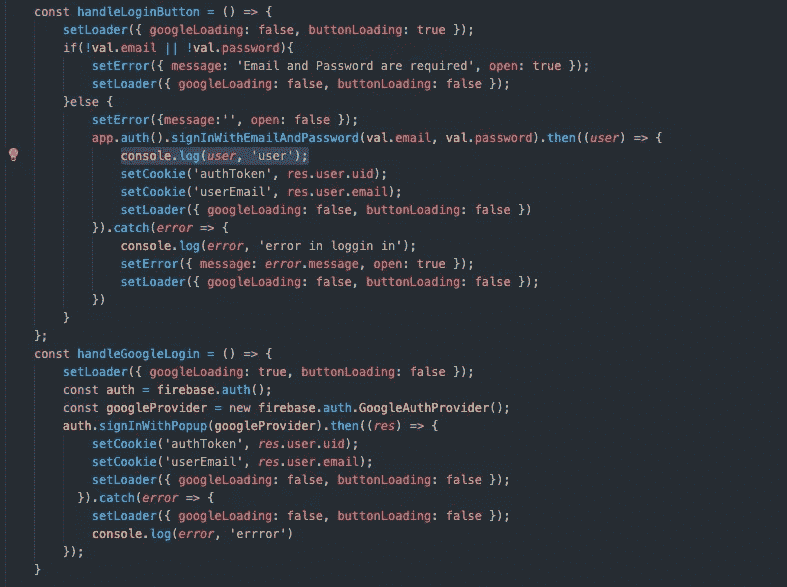
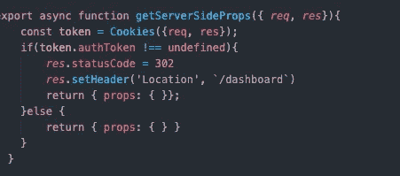
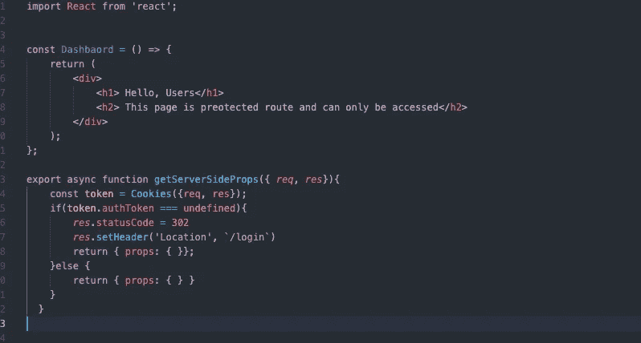

# 管理令牌和创建受保护页面的最简单方法

> 原文：<https://javascript.plainenglish.io/the-easiest-way-to-manage-token-and-created-protected-pages-in-frontend-c60db33f1921?source=collection_archive---------19----------------------->

## 避免在 Redux 或 LocalStorage 中存储身份验证令牌，而是使用 Cookies。

Storing authentication token in Cookie([Website](http://ihatereading.in/creativity))

需要令牌来使 API 在将来免受任何攻击，并判断请求的真实性。在所有敏感 API 的头部或主体部分添加令牌总是一个好方法。最好使用的令牌之一是 JWT——JSON Web 令牌是一种向服务器发出 API 请求的新的安全方式。JWT 有 3 个部分有效载荷，签名和报头。

1.  **Header** —定义用户的令牌和算法类型。
2.  **有效负载** —有效负载由发出 API 请求时传输的数据组成。
3.  **签名**——JWT 的签名部分，用于解码/检测令牌的真实性。

本文的主要目的是避免将这些令牌存储在 redux store 或本地存储中，下面是我们不应该这样做的原因:
1。当用户重新加载应用程序时，redux 中存储的令牌会被删除(尽管 redux 中有一种方法可以避免这个问题)。用户可以轻松清除/删除冗余存储。
3。Redux store 不能在服务器端访问(稍后将涉及这一点)。
4。LocalStorage 存储令牌的时间比预期的长。
5。本地存储容易受到攻击，因此存储的数据也不安全。

**存储令牌和管理用户会话的最佳方式是什么？** 我总是喜欢将令牌存储在 cookie 中，并设置令牌的到期时间。以下是在 cookie 中保存令牌的好处 **:**
1。Cookie 令牌可以在服务器端和客户端轻松访问。
2。Cookie 令牌将在最多 14 天后自动过期。
3。即使用户重新加载应用程序，Cookie 数据也会保持一致(无需添加额外的层来使数据在重新加载后保持不变)。
4。Cookie 数据在浏览器的所有选项卡中保持持久，这使得同时管理多个选项卡中的会话变得容易。

# **在饼干里放一个代币**

Cookie 有自己的方法，Browser 为我们提供了添加、删除和编辑 cookie 的方法。添加一个 cookie 方法需要 3 个参数 **cookie 名称**、 **cookie 值**和 **cookie 到期时间**(以天为单位)。第三个参数有助于在每隔“**x”**天后使令牌过期(x =您设置为方法的第三个参数的过期天数)，一旦令牌过期，它将从浏览器内存中删除。

Cookie methods in utils

我们已经在名为“ **utils”的文件夹中创建了设置 cookie、获取 cookie 和删除 cookie 的函数。**这样，我们可以在多个组件上重用这些方法来检索 cookie、设置 cookie 和删除 cookie。

**管理用户会话**
我们总是将认证令牌保存在名为“ **authToken”的 cookie 中。**我们将在安装 firebase 认证时使用代码库。

下面是代码:[https://github . com/shreyvijayvargiya/iHateReadingLogs/tree/main/TechLogs/firebase authentic ation](https://github.com/shreyvijayvargiya/iHateReadingLogs/tree/main/TechLogs/FirebaseAuthentication)。

# **接近**

1.  添加 API 的认证方法，我们正在使用 firebase，我已经添加了一个电子邮件和谷歌 Firebase 方法登录。
2.  成功添加登录和注册方法后，firebase 方法将用户" **uid"** 作为 **"authToken "，**我们将把它作为一个身份验证令牌，并将该令牌存储在一个 cookie 中。
3.  现在在客户端或服务器端取决于您的需要，我们将从 cookie 中获取 authToken。
4.  检查" **authToken** 的真实性，可以使用 firebase 方法本身来检查用户" **uid"** 值是否正确。
5.  因为我们设置了 14 天的过期时间，所以每隔 14 天令牌就会被擦除。
6.  如果令牌不存在，则将用户从您网站上所有安全或受保护的页面中注销。例如，只有当令牌存在于 cookie 中并且令牌是正确的令牌时，用户才能使用仪表板。

Login with Email and Password methods above and Login with Google method below.

使用 firebase 登录 API 中的“**set cookie”**方法，将用户“**uid”**和“**email”**添加到 cookie 中。在用户登录后，我们将把用户抛到一个受保护的页面，就像我们例子中的仪表板页面。此外，我们还需要在仪表板页面上添加一些检查，看看 cookie 中是否存在“ **authToken** ”以及该令牌是否正确。

完成后，我们的主要目标是在服务器端为仪表板页面获取这个 cookie。在我们的例子中，我们将检查“**authToken”**是否存在于 cookie 中，如果不存在，那么在重定向到仪表板页面之前，我们将把用户扔到登录页面。我们将在登录页面中添加同样的检查。一旦用户登录，他/她就不能访问登录页面，如果他/她试图这样做，我们会将他们重定向到控制面板页面。

我们将使用 **next-cookie** npm 包来访问 cookie，并将此功能添加到登录和仪表板页面的“ **getServerSideProps** 中。

> “**getServerSideProps”**只能在“**pages”**目录的路由页面内使用。更多阅读请点击这里=>[https://nextjs . org/docs/basic-features/data-features # getserversideprops-server-side-rendering](https://nextjs.org/docs/basic-features/data-fetching#getserversideprops-server-side-rendering)

“**getServerSideProps**” method inside the login page and the dashboard page in the left image and the right image respectively.

# **结论**

我们必须编写最多 30/40 行代码，并为这个设置安装一个 npm 包。我发现，与在 redux store 或 LocalStorage 中存储令牌相比，这种方法是最简单、最强大的。此外，您可以在 getServerSideProps 中添加更强大的功能。例如，在 API 头中使用相同的“ **authToken** ”从 API 获取数据，然后将数据传递给仪表板组件以在页面上显示数据，这被称为预取页面数据。

希望你从这篇文章中学到了一些东西，下次再见，祝大家有美好的一天。

下面是代码仓库= >[https://github . com/shreyvijayvargiya/iHateReadingLogs/tree/main/tech logs/token infrontend](https://github.com/shreyvijayvargiya/iHateReadingLogs/tree/main/TechLogs/TokenInFrontend)

*代表*[***plain English . io***](https://plainenglish.io/)*，感谢阅读！*