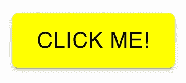
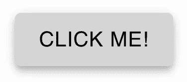
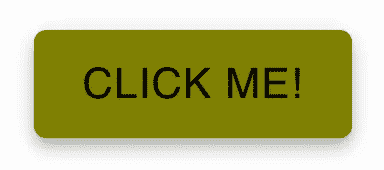

# 样式化你的材质 UI 组件的最简单的方法:makeStyles 函数

> 原文：<https://javascript.plainenglish.io/the-easiest-way-to-style-your-material-ui-components-the-makestyles-function-a66ab7b9fe01?source=collection_archive---------3----------------------->

## 如何在 Material-UI 中使用 makeStyles 函数


Photo by [Kimberly Farmer](https://unsplash.com/@kimberlyfarmer?utm_source=medium&utm_medium=referral) on [Unsplash](https://unsplash.com?utm_source=medium&utm_medium=referral)

Material-UI 是我最喜欢的 React 组件库！我每天都在工作中使用 Material-UI，在我的许多个人项目中也是如此。

使用 Material-UI 的一个重要概念是学习如何设计组件的样式。每个组件都有自己的 API，您可以在其中传递属性来设置它们的样式。但是有时，这还不够，您还需要对组件进行更多的定制。

根据他们的[文档](https://material-ui.com/styles/basics/)，有 3 个 API 可以用来设计你的组件。

*   钩子 API
*   样式组件 API
*   高阶组件 API

在我看来，样式化 Material-UI 组件最简单的方法是使用 Hook API 使用`makeStyles`函数。

在本文中，我们将了解如何使用`makeStyles`函数来设计按钮组件的样式。

# 什么是 makeStyles？

`makeStyles`是 Material-UI 中的一个函数，允许我们使用 JavaScript 对象创建 CSS 类和规则。

`makeStyles`函数返回一个 React 钩子，我们可以在功能组件中使用它来访问样式和类。然后，我们可以将这些样式应用于组件中的任何元素。

# 建立

对于这个例子，我们将在一个`create-react-app`项目中工作。首先，您需要从 Material-UI 安装核心包。

```
*// with npm*
npm install @material-ui/core*// with yarn*
yarn add @material-ui/core
```

为了展示`makeStyles`是如何工作的，我们将首先创建一个基本的按钮组件。

```
import Button from '@material-ui/core/Button';const App = () => {
  return (
    <div *className*="App">
      <*Button* *variant*="contained" color="primary">Click me!</*Button*>
    </div>
  );
};export default App;
```

如果你以前使用过 Material-UI，你会知道这会在屏幕上呈现一个蓝色的按钮。这种蓝色是默认的原色。


# 使用`makeStyles`

假设我们想将它改为一个带有黑色文本的黄色按钮。一种选择是改变默认主题。如果你想了解如何做到这一点，看看下面的文章。

[](https://medium.com/swlh/create-a-customized-color-theme-in-material-ui-7205163e541f) [## 在材质界面中创建自定义的颜色主题

### 为下一个 React 项目定制颜色主题很容易

medium.com](https://medium.com/swlh/create-a-customized-color-theme-in-material-ui-7205163e541f) 

然而，如果我们改变默认的颜色主题，这将改变所有按钮的颜色。如果我们只想定制一个按钮，这就是`makeStyles`派上用场的地方。我们将创建 CSS 规则并将它们添加到这个按钮中。

首先，从 Material-UI 导入`makeStyles`函数。

```
import { makeStyles } from "@material-ui/core/styles"
```

这个函数将返回一个 React 钩子。命名 React 钩子的一个常见惯例是以*‘use’*开始函数名。因此，我们将这个钩子命名为`useStyles`。

`makeStyles`函数接受一个包含我们想要应用的 CSS 类和规则的对象。

这个对象的每个属性都是一个 CSS 类。每个属性的值将是包含 CSS 规则的另一个对象。

```
*// Outside of functional component*
const useStyles = makeStyles({
  button: {
    backgroundColor: 'yellow',
    color: 'black',
  },
});
```

# 向组件添加样式

为了使用我们创建的 CSS 类，我们需要在组件内部调用`useStyles`钩子。这将返回一个包含我们编写的所有 CSS 类的对象。我们可以将它存储在一个名为`classes`的变量中。

```
*// Inside of functional component*
const classes = useStyles();
```

为了给我们的按钮组件添加 CSS 类，我们将通过`classes.button`给组件添加一个类。

```
<*Button* *variant*="contained" ***className*={classes.button}**>
  Click me!
</*Button*>
```



# 添加悬停属性

我们的纽扣目前看起来不错。但是你可能会注意到，如果我们将鼠标悬停在按钮上，它仍然使用默认的悬停效果。该默认效果将背景色变为浅灰色。



我们可以通过向使用`makeStyles`函数创建的 CSS 类添加悬停状态来改变这一点。

```
const useStyles = makeStyles({
  button: {
    backgroundColor: 'yellow',
    color: 'black',
    **'&:hover': {
      backgroundColor: 'olive',
    },**
  },
});
```

现在，如果我们检查按钮的悬停状态，它将有一个橄榄色的背景色，而不是默认的灰色。



您可以在下面的代码片段中查看该示例的完整代码。

# 结论

感谢阅读！我希望这篇文章对你开始在 Material-UI 中设计组件有所帮助。在 Material-UI 中设计组件样式时，有许多选项可供选择。这包括使用样式组件、高阶组件，或者我们在本文中看到的`makeStyles`函数。

如果你想继续学习 Material-UI，可以看看下面的文章。

[](https://medium.com/geekculture/what-really-happens-when-you-use-the-textfield-component-in-material-ui-1e62652196f) [## 在 Material-UI 中使用 TextField 组件时，实际会发生什么？

### 让我们更深入地调查一下

medium.com](https://medium.com/geekculture/what-really-happens-when-you-use-the-textfield-component-in-material-ui-1e62652196f) [](https://blog.devgenius.io/how-to-use-icons-in-material-ui-to-create-a-button-fb12cfdf7873) [## 如何在 Material-UI 中使用图标创建按钮

### 材质用户界面图标库简介

blog.devgenius.io](https://blog.devgenius.io/how-to-use-icons-in-material-ui-to-create-a-button-fb12cfdf7873) 

## 进一步阅读

[](https://bit.cloud/blog/how-to-build-material-ui-components-with-bit-l3isiibs) [## 如何用 Bit 构建 React 材质 UI 组件

### Material UI 是一个流行的开源()UI 组件库，它将材质设计与 React 结合在一起。材料 UI 是…

比特云](https://bit.cloud/blog/how-to-build-material-ui-components-with-bit-l3isiibs) 

*更多内容请看*[***plain English . io***](https://plainenglish.io/)*。报名参加我们的* [***免费周报***](http://newsletter.plainenglish.io/) *。关注我们关于*[***Twitter***](https://twitter.com/inPlainEngHQ)[***LinkedIn***](https://www.linkedin.com/company/inplainenglish/)*[***YouTube***](https://www.youtube.com/channel/UCtipWUghju290NWcn8jhyAw)***，以及****[***不和***](https://discord.gg/GtDtUAvyhW) *对成长黑客感兴趣？检查* [***电路***](https://circuit.ooo/) ***。*****