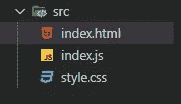

# 缩小 HTML CSS 和 JavaScript 文件的简单方法

> 原文：<https://javascript.plainenglish.io/the-easy-way-to-minify-html-css-and-javascript-files-52affdf0a908?source=collection_archive---------7----------------------->

## 让我们使用 ParcelJS 来缩小我们的生产文件。


Photo by [Fotis Fotopoulos](https://unsplash.com/@ffstop?utm_source=medium&utm_medium=referral) on [Unsplash](https://unsplash.com?utm_source=medium&utm_medium=referral)

# 介绍

提高网站性能的一个好方法是缩小 HTML、CSS 和 JavaScript 文件。这也可以让你提高你的网站加载时间。为此，您需要使用 web 应用程序捆绑器，如 Webpack、宗地或 Rollup。在我看来，最简单的一个是 Parcel，因为它不需要任何配置。请记住，在将文件发布到生产环境之前，您应该始终缩小这些文件。

在本文中，我们将使用 Parcel 来缩小我们的 HTML、CSS 和 JavaScript 文件。让我们直接切入正题。

# 安装地块

我打开了一个测试项目，其中包含一个 HTML 文件`index.html`，一个 CSS 文件`style.css`，以及一个 JavaScript 文件`index.js`。所有文件都位于测试项目中的源文件夹`src`中。



Project folder by author.

在测试项目文件夹中，我将使用 Git Bash 添加一个`package.json`文件，方法是使用 NPM 编写以下命令:

```
**npm init -y**
```

现在，我们可以在命令行中使用 NPM(Git Bash 或集成终端)将 Parcel 作为开发依赖项进行安装。

*安装地块:*

```
**npm install -D** **parcel-bundler**
```

如果您想了解更多有关 Parcel 的信息，可以查看下面我的文章:

[](/parcel-the-zero-configuration-webpack-alternative-1bcd6704ab9f) [## 地块—零配置 Webpack 替代方案

### 项目用超级简单的 JavaScript Bundler 入门

javascript.plainenglish.io](/parcel-the-zero-configuration-webpack-alternative-1bcd6704ab9f) 

# 添加脚本

在`package.json`文件内部，我们需要修改脚本如下:

```
"scripts": {
 "dev": "**parcel src/index.html**",
 "build": "**parcel build src/index.html**"
}
```

为了缩小我们的文件，我们需要在命令行中使用 NPM 运行构建脚本，如下所示:

```
**npm run build**
```

这将自动创建一个名为`dist`的文件夹，其中包含我们所有的文件缩小和捆绑。

现在，您只需要将该 dist 文件夹部署到服务器上。因此，你的网站将比以前快得多，当你的文件没有缩小。

# 结论

可以看出，使用宗地可以更轻松地缩小文件并提高性能。它还具有更多其他有用的特性，您可以从中受益。

感谢大家阅读本文。我希望你发现它有用。

**更多阅读**

[](/10-awesome-front-end-project-ideas-for-code-newbies-b0ba03dc0bd) [## 面向代码新手的 10 大绝佳前端项目创意

### 有用的前端 web 开发项目，以提高您的编码技能。

javascript.plainenglish.io](/10-awesome-front-end-project-ideas-for-code-newbies-b0ba03dc0bd)