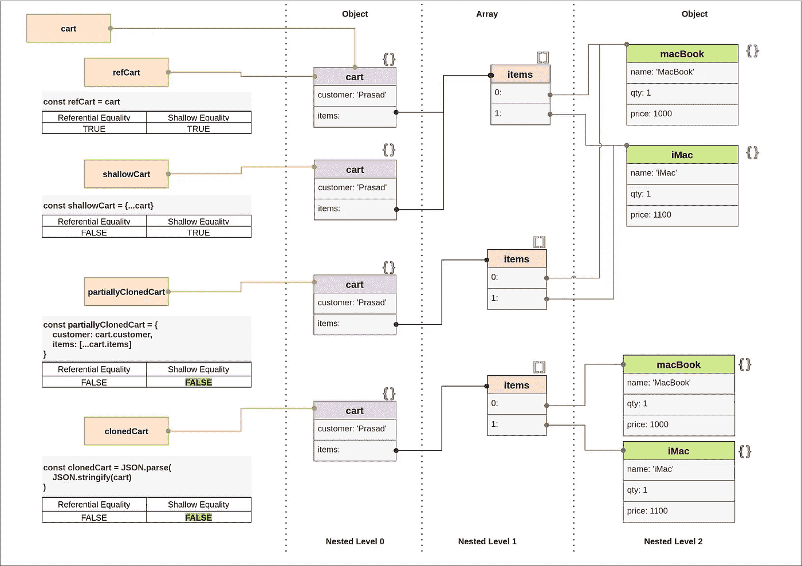
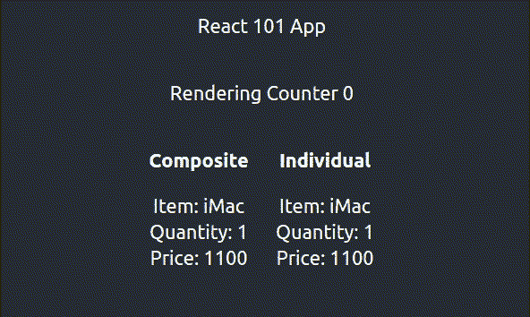

# 浅相等在反应中的作用

> 原文：<https://javascript.plainenglish.io/the-effect-of-shallow-equality-in-react-85ae0287960c?source=collection_archive---------7----------------------->


Photo by [Pavel Herceg](https://unsplash.com/@pavelherceg?utm_source=unsplash&utm_medium=referral&utm_content=creditCopyText) on [Unsplash](https://unsplash.com/s/photos/shallow?utm_source=unsplash&utm_medium=referral&utm_content=creditCopyText)

## **什么是浅薄的平等？**

浅相等通过迭代被比较的对象的关键字来验证，并且当每个对象中的一个关键字的值对于所有关键字严格相等时返回 true。

## **为什么肤浅的平等很重要？**

React 依赖于当前和下一个状态之间的**浅相等**/props**来决定是否重新渲染。**浅比是对浅等的否定。**如果 shallowCompare 返回 true 则渲染。**

Code fragment from React legacy add-on

当嵌套性增加时，浅层平等变得危险。我已经创建了心智模型(备忘单)来记住这些错综复杂的东西。



**Referential Equality vs Shallow Equality**

> Dmitri Pavlutin 撰写的博客“[如何比较 JavaScript 中的对象](https://dmitripavlutin.com/how-to-compare-objects-in-javascript/)”中提供了关于比较 JS 对象的详细解释

## **React useState()中需要使用原语还是对象？**

*   原语是初学者友好的。
*   一旦浅相等被彻底理解，可以使用具有一个嵌套级别(最多)的简单对象。
*   避免使用深度嵌套的对象。请改为规范化嵌套对象。

> 如果我们规范化，深度嵌套的对象可以很好地处理。更多详情，请查看[**normal izr**](https://www.npmjs.com/package/normalizr)**库和相关[示例](https://github.com/paularmstrong/normalizr/tree/1f6ae6ad6f3155888a41eacab3ed1e12c07a9c8b/examples/relationships)**

## ****有没有与 React useState()用法相关的问题？****

**到目前为止，您已经知道每个状态变化都会触发组件呈现。考虑以下选择**

```
const[*state*, *setState*]= *useState*({ *name*:'iMac', *qty*:1, *price*:1100});vsconst[*name*]= *useState*('iMac');
const[*qty*, *setQty*]= *useState*(*1*);
const[*price*, *setPrice*]= *useState*(*1100*);
```

**那么，当我们多次调用 set*方法时会发生什么呢？**

```
*setState*({ *name*:'iMac', *qty*:***2***, *price*:**1200**});vssetQty(2);
setPrice(1200);
```

**来源: [StackOverflow](https://stackoverflow.com/questions/53048495/does-react-batch-state-update-functions-when-using-hooks)**

*   **如果直接触发**，则**批量**。****
*   **如果**状态变化**被异步触发(如被包裹在承诺中)，则**不会被批量**；**

**在下面的示例应用程序中，**

*   **Composite:价格和数量通过一次 setState 调用得到更新**
*   **个人:通过两个方法调用更新了价格和数量— setQty 和 setPrice**

****

**Rendering effect on useState**

**在典型的用例中，几个额外的重新渲染并不坏。但是，如果您的组件对渲染发生的次数很敏感，那么将复合对象作为一种状态会很方便。**

## **结论**

**我们做到了！希望你现在对什么是肤浅的平等，以及它为什么重要有了更好的理解。**