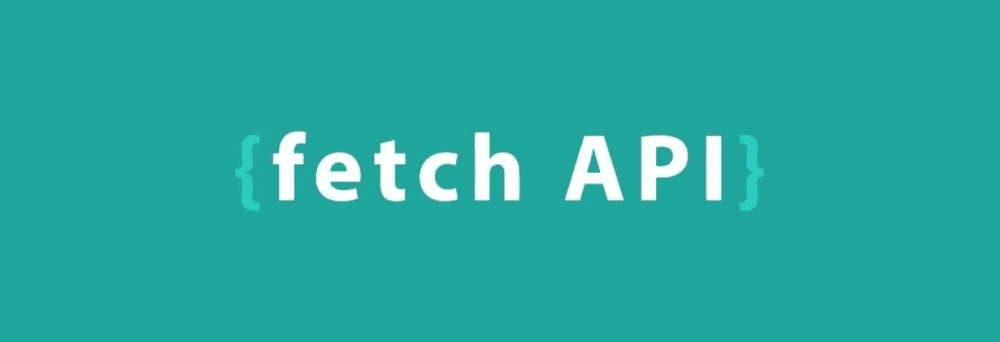
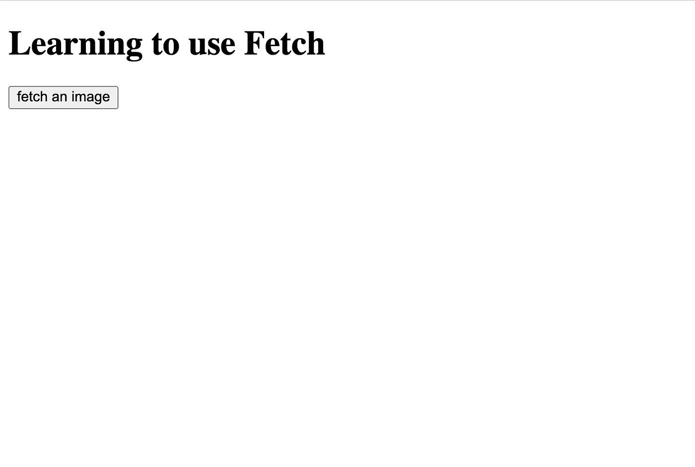
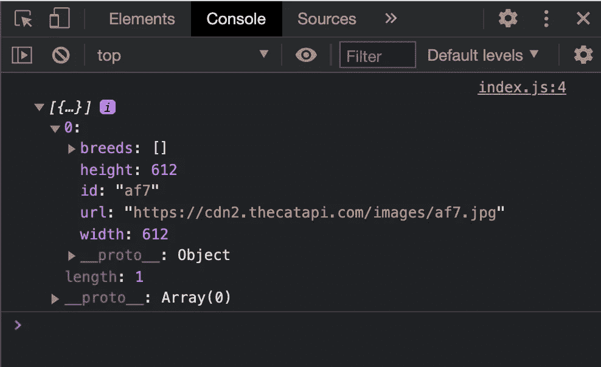
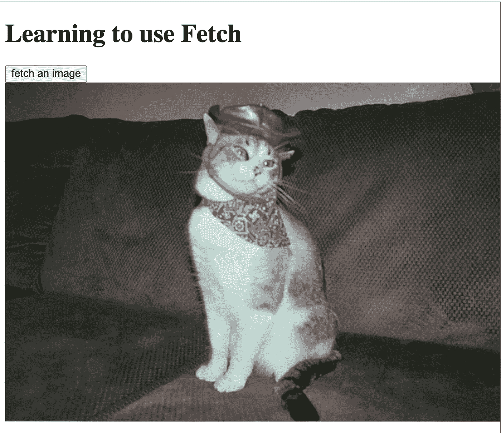
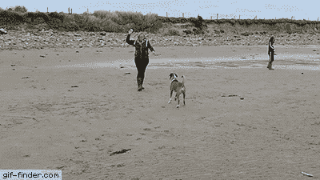

# JavaScript 获取 API 入门

> 原文：<https://javascript.plainenglish.io/the-fetch-api-7fb542b25f4d?source=collection_archive---------7----------------------->

与 API(应用程序编程接口)通信是 web 开发的一个关键部分，是构建全栈应用程序所必需的。这篇博客将讨论如何使用 JavaScript 中内置的 Fetch API 与外部 API 进行通信。如果您是 JavaScript 新手，本教程将一步一步地介绍所有内容，并帮助您理解代码及其背后的概念。

# 如何构造获取请求

我们可以用 **fetch** 函数开始一个获取请求，并向它传递一个 URL 参数。除非另有说明，否则默认情况下，这将向该地址发送所谓的“GET”请求，并以承诺作为响应。承诺代表异步事件的最终实现或失败。

一旦我们从 fetch 请求中收到一个承诺，我们就可以使用另一个叫做**的 JavaScript 方法。然后()**来回报这个承诺。这个方法采用两个回调函数作为参数，一个处理承诺的成功，一个处理失败。这是什么意思？因为 fetch 请求试图到达一个 API 并返回一个异步承诺，所以在这个过程中可能会出错。服务器可能出错，您可能失去互联网连接，传递给 fetch 的 URL 可能拼写错误。既然承诺有可能落空，那**。然后()**被装备来处理故障，甚至中继一个错误消息来指示哪里出错了。

所以，我们叫**。然后()**在获取之后做一些叫做数据解析的事情。我们使用另一种内置方法**。json()** 将获取的响应数据转换成 JavaScript 对象符号(json)数据，这样更容易阅读和处理。我们然后称之为**。然后()**再次对解析后数据进行实际操作，比如控制台日志记录。

下面是我们的样本获取请求的样子:

The arguments ’response’ and ‘data’ can be named whatever you want, but following this naming conventions makes your code easier to read and understand

就这么简单！

如果看起来有点混乱，不要担心。在下一节中，我们将详细介绍创建和测试第一个获取请求的每个步骤。

# 设置您自己的提取请求

要编写自己的获取请求，您唯一需要的是安装在您机器上的最新版本的[节点](https://nodejs.dev/learn/how-to-install-nodejs)。我们可以从创建一个锅炉板*index.html*文件和一个 *index.js* 文件开始。在 HTML 文件中，添加一个“h1”标记和一个“button”标记。在“button”标签下面，创建一个“div”标签，使用“image-container”类。我们将在这里添加我们的猫图片，但是现在你的浏览器应该是这样的:

run ‘open index.html’ to view your html in the browser

我们将向一个免费的 API 写一个获取请求，以获取猫的图片并在我们的浏览器中显示它们。我想不出比免费的可爱猫咪图片更好的使用 fetch API 的方法了。你可以在[https://docs.thecatapi.com/](https://docs.thecatapi.com/)查看 API 文档，但是对于这个请求，你只需要跟着代码走就可以了。

我们将复制博客前面的获取请求，但是将示例 url 替换为 cat api url。它应该是这样的:

保存您的工作，返回浏览器并刷新页面。如果您查看开发人员控制台(右键单击，选择 Inspect，转到 console 选项卡)，您会将我们的 API 给我们的响应解析为 JSON 数据！

Please note, I have clicked the small gray arrow on the far left to expand this array and view the object at index[0]

## 使用数据

恭喜你已经写了你的第一个获取请求！但是，就在几句话前承诺的可爱的猫图片在哪里呢？使用 fetch 访问 API 的全部目的是接收或发送数据，并实际使用它做一些事情。有很多方法可以实现这一点，但是让我们使用一些普通的 JavaScript 来创建一些 HTML 元素并将它们添加到 DOM 中。我们的代码现在应该是这样的:

The “src’” attribute on the ‘img’ tag can be set in JavaScript with the above dot notation

请注意，我们不只是将图像标签的来源分配给从获取请求中获取的“数据”对象。使用 API 最重要的部分之一是我们如何使用它们返回给我们的数据。因为这个 API 调用返回了一个名为“data”的数组，其中有一个对象，所以我们在第 6 行使用括号表示索引 0 来引用它。一旦到了索引 0，或者数组中的第一个位置(在本例中是唯一的位置)，我们就使用点符号来引用“url”键值。从而为我们提供了之前看到的控制台记录的字符串“https://CD N2 . the catapi . com/images/96n . jpg”。这个字符串是我们的图像标签的 url，它生成了一只可爱的猫的图像。

A cat on his way to the rodeo

如果您仍然不确定我们如何从 fetch 请求返回的“data”对象中获得 url，请查看控制台上返回的对象。您需要对分解对象和数组有一个相当好的理解，才能找到您想要的值。当您不确定会发生什么时，打印获取请求的响应是一种可视化数据的好方法。从那里，您可以使用开发人员控制台打开任何下拉菜单，并更深入地挖掘您的数据。

## 关于异步函数的更多信息

获取请求的目的是使用 API 异步发送或检索数据。异步的意思和它听起来的一样，就是这个请求像我们文件中的其他代码一样超时执行。换句话说，我们的应用程序不会在运行 JavaScript 的其余部分之前等待获取请求完成，当然，除非我们要求它这样做。

如果您想查看如何工作的示例，请在最后一个。**然后()**方法完成，在浏览器开发者控制台看它登录到哪里。您会发现，尽管 fetch 请求是在控制台日志之前写的，并且 JavaScript 是从上到下执行的，但是控制台日志会先打印出来！这是因为 fetch 请求需要一些时间来完成，虽然它可能很快，但它仍然是异步的，并且必须等待响应，因为其他代码是从文件中直接读取的。

# 不同类型的获取请求

A failed fetch request, but a great attempt

当使用 fetch 请求访问数据时，我们实际上是使用 HTTP(超文本传输协议)方法与我们的 API 进行通信。从技术上讲，大约有 39 种 HTTP 方法，但是最重要的是 GET、POST、DELETE、PATCH 和 PUT。我将对每一个都举一个例子并做一个简要的解释。

## 得到

HTTP 请求 GET 方法可能是最容易理解的。我们获取单幅猫图片的例子演示了一个 GET 请求。您不应该使用 GET 请求来发送数据，它们只应该用于检索数据。

示例:

A GET request

## 邮政

POST 方法用于向特定端点提交信息或数据。例如，在社交媒体网站上创建新的个人资料。在 POST 请求中，需要使用 fetch 方法的第二个参数。这将是一个 init 对象，可以有几个属性，但这里需要的是“方法”、“主体”和“标题”属性。“method”属性定义了我们使用的 HTTP 方法，这里是 POST。请求的“主体”表示我们发送的要更新到 API 的数据，在本例中是新的概要信息。“headers”属性充当将名称映射到值的方式，例如这里将说内容是在 json 数据中解码的。

JSON.stringify() converts a JavaScript object into a JSON string that the API endpoint can work with

请注意，POST 请求不一定要返回任何要使用的特定数据，但是如果 API 端点指定了返回数据，它就可以返回。它将返回一个 promise 对象，告诉您您的请求是否成功。将它解析为 JSON 后，您可以在控制台记录它，根据响应执行一些基于逻辑的操作，或者按照您想要的方式使用它。

## 删除

删除请求的结构类似于 POST 请求，因为它需要一个“方法”和一个“头”属性。假设我们想删除一张旧的 Instagram 图片，并请求获取。这张图片可能有一个 Id 属性，允许我们引用它。我们可以在我们的 fetch 请求中插入 URL，并将我们 instagram 帖子的 Id 传递给它以删除它！

Using back-ticks around the URL, and the dollar sign and curly braces around our pictures Id, we can delete the Instagram picture with the Id of 24

## 修补

补丁方法类似于“编辑”方法，因为它部分地修改我们的数据。我们可能会使用补丁请求来编辑我们的谷歌帐户，以更新我们的电话号码。就像删除请求一样，补丁请求传递带有“方法”、“主体”和“头”的对象的第二个参数。

再次注意，我们在 URL 中插入了我们谷歌账户的 Id。这就要求我们专门寻找我们的个人资料。这里的“正文”将作为 JSON 对象接收，用字符串表示我们的新电话号码。尽管我们的个人资料可能有很多不同的东西我们可以改变，比如照片、密码等等，因为这是一个补丁请求，它会用一些新数据“修补”我们现有的数据，所以我们不需要发送一个全新的“个人资料”对象。

## 放

最后但同样重要的是 PUT 方法。这类似于开机自检方法，除了 PUT 能够覆盖。何时使用 PUT 与 POST 主要取决于所谓的幂等性。这个概念有点棘手，但可以将其视为无论执行多少次都能够产生相同结果的能力。也就是说，PUT 方法创建了一个全新的东西的实例，而 PUT 方法用一个全新的对象替换现有的对象，并覆盖最初在端点的任何东西。

PUT 用于当您知道您试图访问的确切 URL 时，而 POST 则不知道。例如，如果您在网站上订购寿司，您会希望使用 PUT 请求，因为如果它因为某种原因多次触发，它发送的实例将保持为单个实例。一个帖子请求会持续发出多个请求，你会被太多寿司卡住(尽管我不认为有可能吃太多寿司)。

# 资格证书

我想简单讨论一下凭据，因为它们对 HTTP 请求至关重要，尤其是当您开始使用安全数据构建应用程序时。凭据是传递给提取请求的 init 对象的另一个属性，指示端点是否应该发送 cookie。默认情况下，它被设置为“同原点”，这意味着如果 URL 与调用它的脚本位于同一原点，则可以发送用户凭据。您可以选择“忽略”任何 cookie，也可以将“包含”传递给“凭据”，以便始终在用户和端点之间发送 cookie。

某些 API 可能需要在获取数据或使用其他 HTTP 方法的获取请求中包含凭据。要包含凭据，只需将其添加到 init 对象中，如下所示:

You do not have to include the method here, but I chose to as to better illustrate what type of method this is

# 熟能生巧

如果您是第一次接触获取请求，或者只是第一次接触 JavaScript，这看起来会有很多令人困惑的信息。我强烈建议您尽可能多地写下这些请求。为了不同的目的，在 init 对象中尝试不同的属性。尝试使用 fetch 构建一个小型 CRUD(创建读取更新删除)应用程序。请随意在下面留下问题和评论，一如既往，快乐编码！

*资源:*

 [## Aidan MBC/fetch blog

### 通过在 GitHub 上创建帐户，为 Aidan mbb/fetch blog 的开发做出贡献。

github.com](https://github.com/AidanMcB/fetchBlog)  [## 卡特彼勒 API -卡特彼勒即服务。

### 一个关于猫的公共服务应用编程接口，在制作新的应用、网站或服务时可以免费使用。

thecatapi.com](https://thecatapi.com/docs.html?ref=apilist.fun)  [## 获取应用编程接口

### 获取 API 提供了获取资源的接口(包括通过网络)。对…似乎很熟悉

developer.mozilla.org](https://developer.mozilla.org/en-US/docs/Web/API/Fetch_API) 

*更多内容看*[***plain English . io***](https://plainenglish.io/)