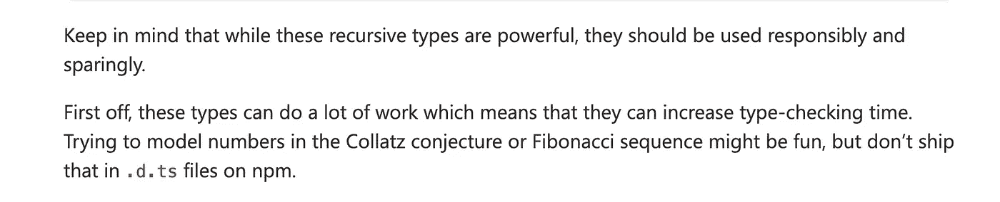

# 打字稿中的斐波那契数列

> 原文：<https://javascript.plainenglish.io/the-fibonacci-sequence-in-typescript-4401bd3b9d1f?source=collection_archive---------6----------------------->


Image included so article has nice thumbnail 😄

用 Javascript 写斐波那契数列就是递归的“hello world”。你可能会在计算机科学入门课上第一次遇到它。它看起来像这样:

在这篇文章中，我想展示的是如何在类型系统中编写斐波那契数列。

# 积木

在编写我们的算法之前，让我们先来研究一些最近和不久前添加到 TypeScript 类型系统中的特性。我们将把这些作为我们最终算法的基础。

## 查找类型

*在 TS 2.1 中引入*

为了查找另一种类型的属性的结构类型，TypeScript 引入了*索引访问类型*，也称为**查找类型**。从语法上来说，它们看起来完全像一个元素访问，但是被写成类型:

## 条件类型

*在 TS 2.8 中引入*

[https://github.com/Microsoft/TypeScript/pull/21316](https://github.com/Microsoft/TypeScript/pull/21316)

> *条件类型根据表示为类型关系测试的条件选择两种可能类型之一:*

```
T extends U ? X : Y
```

上面这句话的意思是:如果`T`可以赋给`U`，那么类型就是`X`，否则类型就是`Y`。条件类型的一些示例如下:

## 在条件类型中推断

*在 TS 2.8 中引入*

[https://github.com/microsoft/TypeScript/pull/21496](https://github.com/microsoft/TypeScript/pull/21496)

> *条件类型也为我们提供了一种方法，使用 infer 关键字*从我们在 true 分支中比较的类型中进行推断

现在，在条件类型的`extends`子句中，我们可以使用`infer`关键字来引入一个要被推断的类型变量。这些推断的类型变量以后可能会在条件类型的分支中被引用。

## 可变元组类型

*在 TS 4.0 中引入*

[https://github.com/microsoft/TypeScript/pull/39094](https://github.com/microsoft/TypeScript/pull/39094)

> *元组类型具有扩展通用类型的能力，这些通用类型可以通过类型实例化用实际元素替换。*

查看拉取请求，深入了解该特性。有很多东西需要解开，包括类型推断、数组文字的展开、索引/析构、rest 参数和展开参数。

## 递归条件类型

*在 TS 4.1 中引入*

[https://github.com/microsoft/TypeScript/pull/40002](https://github.com/microsoft/TypeScript/pull/40002)

TS 2.8 中引入了条件类型，但限制为非递归(即条件类型不能引用自身)。这种限制是由于当时 TS 编译器中的一些限制而产生的。从那以后，有了许多改进，允许 TypeScript 团队移除这一限制，并发布了**递归条件类型，**，但是递归深度限制为 50(这已经足够了)。

伴随着这个特性的[发布公告](https://devblogs.microsoft.com/typescript/announcing-typescript-4-1/#recursive-conditional-types)的是这个警告:



# 将这一切与斐波那契数列结合在一起

现在我们已经得到了我们的背景(和我们的警告)，我们可以继续编写我们的算法。为了写出斐波那契数列，我们需要能够做**加法**。不幸的是，类型系统不支持加法——至少以我们熟悉的方式。然而，类型系统支持添加(或连接)元组类型，这可以帮助我们实现添加。我们将处理`true`的元组，但是元素实际上可以是任何东西。

为了利用元组的加法，我们需要一种从整数到元组以及从元组到整数的映射方式。我们可以通过以下类型实现这一点:

我们还需要一些其他的算术工具类型，比如加法和减法:

有了这个和我们从上面学到的一切，我们可以写出我们的斐波纳契公式:

如你所见，我们能够在 TypeScript 的类型系统*中单独编写斐波那契数列。*这只是一个例子，展示了 TypeScript 的强大功能和灵活性，以及 TypeScript 团队所做的出色工作。

如果您想自己试验代码，可以在 TypeScript playground 中查看这个[链接。](https://www.typescriptlang.org/play?ts=4.2.3#code/C4TwDgpgBAggTnAhiA8gMwMoEsBeEA8AclBAB7AQB2AJgM5SUCuAtgEYRwB8UAvFMWQo16xAPxQAFEzYcS5KnX5RxrAPaqANhESUA2gF0oALigB9eElSZcBQgBooBzgEpjDCADcOAbgCwAKFBIMwtkdGw8IjkhRWl2OAcAJWiFekZKAGtKVQB3PX1uPkTdAHItSgBzYAALEsNBVKVxZJNzBDDrSPtHYDhGCAcAOmHEgr9-AKDoAAUNRloARnwYFOEoHRAnXh6+gahhwZh9canYampl1cUNgwcAISv6G4Lt3QOYIeG748nwaABZLBMRaXBprZ6FWCPKBwbTUVSUDQgRwbUSfQZAtCyACqhnE2Lcb2GRxOfyggOBACZQfJwZRNi8+BT5ktmSCYJxOOMAgB6HlQLxwLBoZGMYBYDRYcUQeg5VRwDK-YIrPihKwRAgAZi5UD5O36Dl6BqgRog+gCSugDz4sxZyx1et0psNuxdxtN5sCZIAwts2UsOd5dfyna6TbtPacACJ+oHzamB4P6s0Wr3BUwAMSwrHwAEkACoAUUSMHzuZQAlpijUmm0+UhBeLpfLhFK5SqtXqVfoCygAB8oAAGAJQZRQRslssVkduGDnfCZ7P4f15ouTluchyLnNs6kT5sVzlcy1QLM5ysxehxDiQ7fLdrqmxETltqgdurctPQDO9vhn-ALA6-ILCeGaUts-6UkBUAgV+p6ahBS7akGeqUqBAAsiE5uh0GaqBACsWH4Ph0H4aBABsRHkdBAAcoEAOxEfR0ELHhcEZjRRE0dBlKwacGYAJxEQJuHoaBlKDkREnQeR9HkWR7GapJf5IYO0GFgg8oBEAA)