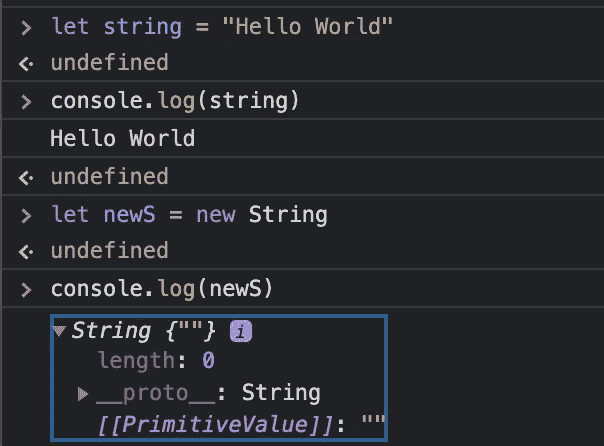

# 面向对象的 4 个原则—第 1 部分:继承

> 原文：<https://javascript.plainenglish.io/the-four-principles-of-oop-inheritance-cf11cb1944fb?source=collection_archive---------5----------------------->

Image credits to [Olia Danilevich](https://www.pexels.com/photo/person-coding-on-a-macbook-pro-4974912/)

在本系列的第 1 部分中，我将讨论编程中的两种类型的继承:类和原型。

继承是面向对象编程的四个原则之一，OOP 是软件工程中非常受欢迎的技能。那么，什么是遗传呢？

我们知道遗产是上一代人可能传给我们的东西——也许你收到了一些有意义的东西，让你想起你的家庭。类似的事情也发生在编程中。

在编程中，继承被定义为“[一种机制，在这种机制中，您可以从共享一组属性和方法](https://stackify.com/oop-concept-inheritance/)的类层次结构的另一个类中派生出一个类。

举个例子，假设你有一个汽车对象。这个对象将包含各种各样的蓝图。你的汽车对象可能有一个 Park 方法，一个 Drive 方法，它可能由四个轮子和一个引擎组成。然后，您可以创建或构造一个丰田对象。这个丰田对象可以继承四个轮子和引擎属性，以及停车和驾驶方法，但是可能您的丰田对象是蓝色的。

Car 对象被视为父类，因为它包含其他类正在继承的属性和方法。Toyota 对象以及其他可能继承自 Car 对象的对象被称为子类。

JavaScript 没有注意到这一点，因为它有原型继承。

那么，原型继承到底是如何工作的呢？当您创建或构造一个新对象时，它从父类“继承”属性和特性。这个新对象实际上将有一个`**__proto__**`属性，该属性将**直接**指向那些从其父对象继承的属性和方法。Allan Sendagi 写道，我们可以使用原型继承来“提升原型链”。

In this example, I instantiated a variable, newS, to the value of new String. When I console.log newS, the __proto__ property shows this is, in fact, a String (along with String methods)

理解面向对象编程，以及随之而来的它的四个原则，无论你是想得到你的第一份工作还是下一份工程师的工作，都会非常有帮助。甚至在类和原型继承中也有许多不同类型的继承。我使用了下面的资源来学习这篇文章中提到的两种类型的继承。如果你想了解更多，请查看它们。

在本系列的下一篇文章中，我将深入探讨**封装**，这是 OOP 的另一个原则。

## 资源

 [## 关于原型继承 Javascript 的第二个支柱，您需要知道的就是

### 我们在这里学到的东西将帮助我们理解面向对象编程(OOP)。

medium.com](https://medium.com/swlh/all-you-need-to-know-about-prototypal-inheritance-the-second-pillar-of-javascript-d8d851cd4509)  [## 继承和原型链- JavaScript | MDN

### 对于熟悉基于类的语言(如 Java 或 C++)的开发人员来说，JavaScript 有点令人困惑，因为它是动态的…

developer.mozilla.org](https://developer.mozilla.org/en-US/docs/Web/JavaScript/Inheritance_and_the_prototype_chain)  [## 理解和使用 JavaScript 中的原型继承

### JavaScript 是最流行的支持原型的语言，这些技能可以节省编码时间。这是…

www.educative.io](https://www.educative.io/blog/understanding-and-using-prototypal-inheritance-in-javascript)  [## 面向初学者的 OOP 概念:什么是继承？

### 继承是面向对象编程(OOP)语言的核心概念之一。这是一种机制，您可以…

stackify.com](https://stackify.com/oop-concept-inheritance/)  [## 3 种不同的原型继承:ES6+版本

### 本文改编自“JavaScript 应用程序编程”，针对 ES6 进行了扩展和更新。

medium.com](https://medium.com/javascript-scene/3-different-kinds-of-prototypal-inheritance-es6-edition-32d777fa16c9) 

*更多内容尽在*[*plain English . io*](http://plainenglish.io/)