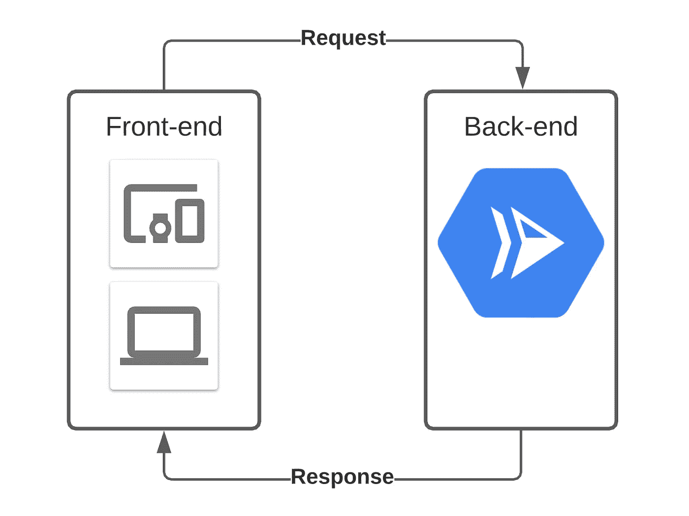

# 后端开发的前端开发人员指南

> 原文：<https://javascript.plainenglish.io/the-front-end-developers-guide-to-back-end-development-4ffb1cc55449?source=collection_archive---------5----------------------->

作为前端 JavaScript 开发人员如何入门一个简单的 Node.js 后端？


Photo by [Wes Hicks](https://unsplash.com/@sickhews?utm_source=medium&utm_medium=referral) on [Unsplash](https://unsplash.com?utm_source=medium&utm_medium=referral)

当你开始做前端开发人员时，后端方面的事情往往看起来过于复杂，学习曲线看起来相当陡峭。许多后端教程将使用 Python 或其他外语，您可能认为您需要学习如何管理服务器、编写路由规则、维护数据库——这个列表是无穷无尽的。

然而，在这个现代世界中，根本没有必要考虑或学习后端的大部分复杂性。也没有任何理由不开始用 JavaScript 编写。🚀

在本教程中，我们将使用 Node.js 和 Express 在 Google 云平台上设置一个简单安全的后端 API 服务。

## 为什么需要后端？

一些应用程序从来不需要一行后端代码。如果你的应用程序是一个在线的 ToDo 应用程序，只是在本地主机中存储数据，那么后端就毫无意义。有时后端是完全抽象的——例如，如果您使用 Google Firebase 进行身份验证，并从前端直接与 Google Firestore 交互，那么您可能永远不需要自己编写的后端服务。

但是，作为开发人员，在某些时候，您很可能需要在后端发生一些事情。这样做的主要好处是**代码不在用户手中**——不在他们的浏览器中。这意味着您可以在后端做一些从前端做起来不安全的事情，例如，使用 API 密钥调用昂贵的第三方 API，或者向用户帐户添加点数。请记住，前端的所有代码都是可读的，并且能够被恶意用户操纵。

拥有后端的另一个原因是接收异步数据。假设您有一个使用 Stripe 进行支付的订阅服务。你可以(以某种令人费解的方式)让用户注册你的应用，并通过 stripe 进行初步支付，让他们通过前端的付费墙，但下个月当用户的卡下降时会发生什么？Stripe 将向您发送一个 webhook，您需要一个始终可用的服务来接收数据并对您的应用程序状态进行更改。

对于这两种情况(以及许多其他情况),一个简单的 Node.js API 服务是完美的工具。

# HTTP API 服务的基础

让我们先回顾一些基本概念…

## 请求和回应

用最简单的话来说，您将处理**请求** ( *请求*)和**响应** ( *请求*)。如果您曾经在前端使用 fetch 或 Axios 从第三方 API 获取数据，您会对这些术语很熟悉。

在前端工作时，你*向后端发送*一个**请求**以获取一些数据，并且(如果一切顺利的话)你将*收到*一个**响应**以及你所请求的数据。

另一方面，当在后端工作时，你将*接收*一个**请求**，进行某种计算，然后*向*发回一个**响应**。

这是一个小图表中的概念:



It really couldn’t be simpler. Front-end sends a request, back-end receives a request. Back-end sends a response, front-end receives a response.

## 路线

接下来要考虑的是后端在哪里接收请求。因为我们是通过 HTTP(希望是 HTTPS)进行通信的，所以我们能够通过路由来分离我们的 API 逻辑。你可以把它想象成一个前端网站的页面。每个页面在一个域中有不同的路由，每个页面有不同的用途。假设你在 https://your-website.com/contact.有一个联系页面，这里的域名是“your-website.com”，路径是“/contact”。

后端以类似的格式拆分。您可以在“api.your-website.com”域中使用 API 服务，并且在该服务上，您可以有一个将提交的联系表单保存到数据库“/contact-form-submissions”的路径。在这个例子中，你的前端将发送一些数据到[https://api.your-website.com/contact-form-submissions.](https://api.your-website.com/contact-form-submission.)你的后端将从**路由** (/contact-form-submissions)知道它应该如何处理这个**请求**——它将做一些计算，例如将数据保存到数据库，可能给管理员发送一封关于它的电子邮件，最后它将向前端发送一个响应。

需要注意的是，在这种情况下，即使前端不需要任何数据返回，后端仍然必须发送一个**响应**。每个 HTTP 通信都有一个**请求**和一个**响应**。发送回一个**响应**允许前端知道后端已经完成了它需要做的事情，并向用户提供一些反馈。如果您没有从后端发回任何响应，前端就会挂起并等待响应，直到超时。

## HTTP 方法

与前端的页面不同，后端的路线可以分成不同的方法。您将使用的最常见的是:

*   得到
*   邮政
*   放
*   删除

理解后端 API 服务中的**一个路由**可以有**多个方法**做完全不同的事情是很重要的。

让我们以/contact-form-submissions 路线为例:

您可以向该路由发送一个 **GET** 请求，您的后端可以发送回一个包含所有联系人表单提交的数组。

您可以向该路由发送一个带有一些数据的 **POST** 请求，您的后端可以将数据保存到数据库中。

您可以发送一个带有一些数据的 **PUT** 请求到该路由，后端可以更新数据库中的提交。

您可以向该路由发送一个 **DELETE** 请求，您的后端可以从数据库中删除所有提交。

围绕这些方法有一些标准，可以帮助您实现 API 服务的最佳实践。一般来说， **GET** 请求用于获取数据， **POST** 请求用于发送数据， **PUT** 请求用于更新数据， **DELETE** 请求用于删除数据。然而，这些只是最佳实践，实际上您可以做您想做的任何事情，尽管使用正确的方法确实有它的优点——例如，GET 请求可以通过简单地使用头来轻松缓存(我们稍后将讨论头)。

您会发现有些服务的所有路由都是 POST 方法(比如 GQL 服务器)，但是对于最基本和高性能的 API，您可以只使用 GET 请求来获取数据，而 POST 请求用于其他任何事情。我倾向于将此与描述性的路线名称结合起来，以使服务易于交互。对我来说，更容易理解的是对“/ all-contact-form-submission”的 GET 请求将返回所有联系人表单提交，而对“/new-contact-form-submission”的 POST 请求将保存一个新的联系人表单提交。

只需要接收数据时使用 GET，需要发送一些数据时使用 POST。保持简单。

## 数据

那么数据是如何来回发送的呢？在**请求**和**响应**里面当然有！

最常见和最简单的数据传输方式是在请求体中使用 JSON 格式。如果您使用 JavaScript 已经有一段时间了，那么您一定会遇到 JSON。这是一种将 JavaScript 对象表示为字符串的格式，并通过一些方便的方法内置到 JavaScript 语言中:
-JSON . stringify(obj)-将 js 对象转换为 JSON 字符串
-JSON . parse(string)-将 JSON 字符串转换为 JavaScript 对象

下面是一个代码示例:

```
const someObject = {
  name: 'Jamie',
  likes: ['coding', 'surfing', 'potatoes']
}const jsonVersion = JSON.stringify(someObject)
console.log(jsonVersion)
// {"name":"Jamie","likes":["coding","surfing","potatoes"]}const parsedJsonVersion = JSON.parse(jsonVersion)
console.log(parsedJsonVersion)
//  {
//    name: 'Jamie',
//    likes: ['coding', 'surfing', 'potatoes']
//  }
```

大多数情况下，当您的前端向后端发送一些数据时，这些数据将被格式化为 JSON，当您的后端接收到这些数据时，这些数据将被从 JSON 解析回 JavaScript 对象。另一方面，当您的后端向前端发送一些数据时，这些数据将被格式化为 JSON，当您的前端接收到这些数据时，这些数据将被从 JSON 解析回 JavaScript 对象。

幸运的是，我们在 JavaScript 中使用的框架，如前端的 Axios 和后端的 Express，可以为我们做到这一点，所以我们基本上只使用 JavaScript 对象——奢侈！

## 头球

对于我们的基本后端 API 服务，需要理解的另一部分是头。每个方法的每个请求都可以有头，这些头是附加到请求或响应中的额外的小块数据，存在于主体数据之外。头用于元数据，如认证令牌、发送的数据类型(在我们的例子中，主要是 application/JSON)和缓存设置。

大多数时候，我们不需要太担心头文件，除非我们有一个复杂的 API，我们只是覆盖了基础。

如果您的应用程序包含某种身份验证，让后端知道是什么用户发出请求的一个选项是身份验证令牌的形式。这些有不同的格式，但最常见的是“不记名”令牌。这是一个在登录时获得的令牌，然后添加到后端的所有请求中指定的“`Authorization`”标头中，格式如下:

```
Authorization: `Bearer ${token}`
```

您的后端服务可以很容易地检查这些头，并且您可以基于它们做您需要做的事情。

## 响应代码

谜题的最后一块是响应代码。这些信息与来自后端的响应一起发送，基本上是关于被发送回的响应类型的元信息。所有响应代码都是数字，并且这些数字在为不同目的设计的范围内:

*   100–199 =信息响应
*   200–299 =成功回答
*   300–399 =重定向
*   400–499 =客户端错误
*   500–599 =服务器错误

您会发现最常见的响应代码是:

*   200 = OK 成功。
    表示请求已经成功。
*   400 =错误的请求。
    表示前端发送了坏的/意外的数据
*   401 =未授权。
    表示发送请求的客户端未被认证或授权访问端点。
*   404 =未找到。
    表示没有找到请求的资源。
*   500 =服务器错误。
    表示您的后端代码出了问题，出现了意外/未处理的错误。

当您在前端工作时，由您来处理这些不同的响应代码，如果返回的不是成功的(100-299)状态代码，Axios 之类的库就会抛出一个错误。

当您在后端**工作时，由您来发送响应**的相关状态代码。如果前端发送一个未找到的数据请求，您应该发回一个 404 状态代码。如果一切正常，您应该发回一个 200 状态代码。您将所有代码包装在 try/catch 中，并在发生意外错误时将 500 代码发送回客户端。

发回错误的错误代码可能会使前端编码人员非常困惑，并且前端逻辑可能会根据响应代码提供不同的用户体验。想象一下，如果返回 401 响应代码，前端应用程序会将用户重定向到登录页面。如果您不小心发送了 401 代码而不是 404(未找到)代码，这可能会在前端导致一些令人困惑的错误！

幸运的是，作为一个后端开发人员，所有可能的响应代码都有很好的文档记录，你可以在这里找到它们的列表:
【https://developer.mozilla.org/en-US/docs/Web/HTTP/Status】T4

# 让我们开始编码吧！

好了，说够了。让我们写一些代码。对于这个例子，我们将在一个文件中编写一些非常简洁和现代的 JavaScript，它将在我们的 API 中公开几个路由。写后端代码的一个好处是你不需要担心浏览器。我们设置我们想要的环境，所以我们可以写非常现代的 JS，而不用担心兼容性。

让我们从做一个新项目开始。打开你最喜欢的终端，创建一个新的节点项目。(我将使用纱线，但如果你喜欢，也可以使用 NPM)。

```
$ mkdir my-first-api && cd my-first-api && yarn init
```

运行交互式 yarn 会话，为您的项目创建基本的 package.json。(回车回车回车)。

然后，我们将安装 Express，这是最常见且非常易于使用的节点包，用于处理 HTTP 请求和响应。

```
yarn add express
```

我们需要使用的另一个方便的包是`cors`。CORS 代表跨源资源共享，说白了就是你的后端将允许来自不同域的前端的请求。如果您的 API 服务位于像 api.your-website.com 这样的子域中，这将非常有用。如果您不在后端启用 CORS，您的前端将无法发送任何请求。CORS 可能很复杂，所以对于我们的基本示例，我们将允许来自所有来源或域的请求。

```
yarn add cors
```

另一个对任何 API 服务都有用的包`cookie-parser`是一个很小的库，它将把请求中的 cookies 解析成 JavaScript 对象，这样我们就可以轻松地读取它们。我们现在可能不需要这个，但是知道这个很好。

```
yarn add cookie-parser
```

这就是我们目前所需要的，所以让我们创建一个 index.js 文件来开始编写代码:

```
touch index.js
```

在您最喜欢的编辑器中打开该文件，并导入我们安装的软件包:

```
import express from 'express'
import cors from 'cors'
import cookieParser from 'cookie-parser'
```

我们将通过作为函数调用 Express 并将其结果存储在 const 中来创建 Express 的实例。做这件事的标准快捷方式是打电话给警察`app`:

```
const app = express()
```

然后我们将告诉 Express 实例(`app`)使用`cors`和`cookie-parser`。Express 是基于插件和可扩展的，所以我们需要做的就是调用`use()`函数并传入相关的库:

```
app.use(cors())
app.use(cookieParser())
```

我们可以做的另一件事是告诉 Express，这将是一个主要基于 JSON 的 API，它应该自动尝试和解析任何请求中的 JSON。这样我们就不用这么做了，并且将在请求中的一个名为`body`的对象中公开数据，我们稍后将会了解这个内容。我们将把一个对象作为参数传递给 JSON 插件，这将把 JSON 有效负载的大小限制提高到 50MB，但是可以根据需要设置。

```
app.use(express.json({ limit: '50mb' }))
```

这就是设置，所以让我们写我们的第一条路线！我们将编写一个简单的 GET 请求路由，它只使用一个字符串进行响应。我们将能够在我们的浏览器中点击这条路线，我们应该看到我们的字符串返回。快速应用程序为每种请求方法提供了一种功能:

*   GET = `app.get()`
*   POST = `app.post()`
*   PUT = `app.put()`
*   删除= `app.delete()`
*   诸如此类…

在每个函数中，第一个参数总是相对格式的路线。省去协议和域部分。在我们的例子中，我们将选择路线`/hello-api`。下一个参数是一个处理函数，它传递一个请求和响应对象，并进行一些计算。它看起来有点像这样:

```
app.get('/hello-api', (req, res) => {
  // do some stuff
})
```

API 中的所有路由都将遵循相同的格式。随着 API 服务变得越来越大越来越复杂，你可以使用许多不同的方法来拆分代码，使其更易于维护，但它将始终遵循这种基本格式。

还记得本文前面的请求和响应概念吗？让我们把它们派上用场吧！request 对象可作为处理函数的第一个参数(`req`)，response 对象可作为第二个参数(`res`)。每个对象都有一些有用的属性，有些是数据，有些是函数。`req.body`将存储任何请求数据，而`res.json()`函数对于将对象作为 JSON 发送回前端非常有用。

对于我们的`/hello-api`路由，我们不期望任何数据与请求一起发送(毕竟，这是一个 get 请求路由)，我们将只发送一个 200 响应代码和一个字符串。为此，我们将在处理函数中添加一行代码:

```
app.get('/hello-api', (req, res) => {
  // do some stuff
  return res.status(200).send('Hello front-end!')
})
```

这是我们创建的第一条后端路线！

注意如何在响应对象上链接函数。这样写起来超级简单。

我们需要做的最后一件事是实际运行 API 服务，并让它监听本地端口上的请求。当您实际上在 Google Cloud Run 这样的地方托管 API 服务时，标准的做法是注入一个端口环境变量。因此，我们将告诉我们的应用程序检查一个 env 变量，并默认为端口 3001。这意味着当我们在本地运行应用程序时，它将在 [http://localhost:3001](http://localhost:3001) 上可用。我们还将设置一个函数，以便在服务器启动运行并准备好接受请求时记录到控制台:

```
const port = process.env.PORT || 3001
app.listen(port, () => {
  console.log(`Server listening on port ${port}...`)
})
```

我们的整个后端应用程序目前看起来像这样:

```
import express from 'express'
import cors from 'cors'
import cookieParser from 'cookie-parser'const app = express()app.use(cors())
app.use(cookieParser())app.use(express.json({ limit: '50mb' }))app.get('/hello-api', (req, res) => {
  // do some stuff
  return res.status(200).send('Hello front-end!')
})const port = process.env.PORT || 3001
app.listen(port, () => {
  console.log(`Server listening on port ${port}...`)
})
```

多么简洁！

让我们运行应用程序。对于热重装，我们也可以使用`nodemon`。让我们将它添加到我们的开发依赖项中:

```
$ yarn add nodemon -D
```

默认情况下，nodemon 不理解模块，所以我们将它与`esm`包一起使用:

```
$ yarn add esm -D
```

然后我们将添加一个`dev`脚本到我们的 package.json 中，它将运行`nodemon -r esm index.js`。package.json 将如下所示:

```
{
  "name": "my-first-api",
  "version": "1.0.0",
  "main": "index.js",
  "license": "MIT",
  "scripts": {
    "dev": "nodemon -r esm index.js"
  },
  "dependencies": {
    "cookie-parser": "^1.4.5",
    "cors": "^2.8.5",
    "express": "^4.17.1"
  },
  "devDependencies": {
    "esm": "^3.2.25",
    "nodemon": "^2.0.7"
  }
}
```

我们现在应该能够运行该脚本，并且应该看到我们的 console.log 消息`Server listening on port 3001...`

```
$ yarn dev
```

现在打开你的浏览器，进入[http://localhost:3001/hello-API。](http://localhost:3000/hello-api.)您应该会看到您的消息出现`Hello front-end`。

那里发生了什么？当我们从浏览器点击一个 URL 时，它总是会发出一个 GET 请求。因此，我们向 api 服务的/hello-api 路由发出 GET 请求。我们的 Express 应用程序查看是否有为/hello-api 路径上的 GET 方法定义的处理程序函数——确实有——并在处理程序中运行 JavaScript 代码。该代码的一部分发送回一个带有 200 代码和文本`Hello front-end`的响应。我们的浏览器得到响应，看到这是一个 200 状态，并试图呈现响应中返回的任何内容，即我们的文本。

让我们创建一个发送回一些 JSON 数据的路由。在/hello-api 处理程序的上面或下面添加这个新的路由处理程序。重要的是，所有的路线处理程序都发生在 Express 应用程序设置之后，但在`app.listen()`功能之前。

```
app.get('/give-me-json', (req, res) => {
  const someData = {
    name: 'Jamie',
    likes: ['coding', 'surfing', 'potatoes']
  } return res.status(200).json(someData)
})
```

我们的整个 index.js 现在看起来像这样:

```
import express from 'express'
import cors from 'cors'
import cookieParser from 'cookie-parser'const app = express()app.use(cors())
app.use(cookieParser())app.use(express.json({ limit: '50mb' }))app.get('/hello-api', (req, res) => {
  // do some stuff
  return res.status(200).send('Hello front-end!')
})app.get('/give-me-json', (req, res) => {
  const someData = {
    name: 'Jamie',
    likes: ['coding', 'surfing', 'potatoes']
  }return res.status(200).json(someData)
})const port = process.env.PORT || 3001
app.listen(port, () => {
  console.log(`Server listening on port ${port}...`)
})
```

保存它，确保 nodemon 重新启动，然后打开浏览器并进入[http://localhost:3001/give-me-JSON。](http://localhost:3001/give-me-json.)您应该看到浏览器中显示了表示为 JSON 的`someData`对象。简单！

现在让我们尝试向 API 服务发送一个 POST 请求。最简单的方法是用我为你做的一个小笔:

这将允许您点击本地主机上的任何路由。确保为任何 post 请求输入有效的 JSON！响应数据显示在请求按钮下方。

对于我们的第一个 POST 请求，我们将在应用程序中创建一个简单的 js 对象状态。将此添加到您的文件中:

```
const database = {
  users: []
}
```

我们将在那个对象中存储内容。注意，每次 nodemon 重新加载后，它都是空的。

然后，我们将创建一个简单的 post 路由，将用户保存在数据库对象的用户数组中。

```
app.post('/add-user', (req, res) => {})
```

这个路由的处理程序将从请求对象`req`中获取我们从前端发送的数据。因为我们使用的是`express.json()`插件，我们不需要担心 JSON 的转换——它只是作为一个对象在`req.body`中可用。

```
app.post('/add-user', (req, res) => {
  // get the data out of the request
  const newUser = req.body
})
```

我们将进行一点验证，如果验证失败，将返回一个 400 状态(记住 400 意味着坏数据/客户端错误)。

```
app.post('/add-user', (req, res) => {
  // get the data out of the request
  const newUser = req.body // validate the user has a firstName
  // and a lastName
  if (!newUser || !newUser.firstName || !newUser.lastName) {
    return res
      .status(400)
      .send('Make sure the user has a firstName and lastName')
  }
})
```

然后，我们将增强发送给我们的数据，为用户添加一个时间戳，并给用户一个 id(只是在数组中的位置)。

```
app.post('/add-user', (req, res) => {
  // get the data out of the request
  const newUser = req.body // validate the user has a firstName
  // and a lastName
  if (!newUser || !newUser.firstName || !newUser.lastName) {
    return res
      .status(400)
      .send('Make sure the user has a firstName and lastName')
  } // add a timestamp and give the user an id
  newUser.timeStamp = new Date().toISOString()
  newUser.id = database.users.length
})
```

然后，我们将数据添加到我们的用户数组，并将增强的用户对象发送回前端

```
app.post('/add-user', (req, res) => {
  // get the data out of the request
  const newUser = req.body // validate the user has a firstName
  // and a lastName
  if (!newUser || !newUser.firstName || !newUser.lastName) {
    return res
      .status(400)
      .send('Make sure the user has a firstName and lastName')
  } // add a timestamp and give the user an id
  newUser.timeStamp = new Date().toISOString()
  newUser.id = database.users.length // add the user to the database
  database.users.push(newUser)

  // return the new user in the response
  return res.status(200).json(newUser)
})
```

保存您的文件，确保 nodemon 重新加载并测试新路线。确保点击了`/add-user`端点，并将方法设置为`post`，下面是一些要发送的 JSON:

```
{
  "firstName": "Bilbo",
  "lastName": "Baggins"
}
```

几次点击该路径，您应该会看到时间戳和 id 发生了变化，如果您决定更改的话，还会看到名字和姓氏。

厉害！

使用 Express 可以做的另一件事是使用 URL 参数。这些是路由的可变部分，便于向 get 请求添加上下文。例如，让我们制作另一个 GET route 处理程序，通过用户 id 获取用户数据。我们将使用 URL 参数`:id`(注意表示路线动态部分的`:`)，它将在`req.params.id`的请求对象上可用。路由将是`/user/:id`，当我们从前端请求它时，我们将用用户的实际 id`/user/1`替换`:id`。

```
app.get('/user/:id', (req, res) => {
  // get the user id out of the request params
  const userId = req.params.id
})
```

然后，我们可以在我们的`database.users`数组中查找该用户:

```
app.get('/user/:id', (req, res) => {
  // get the user id out of the request params
  const userId = req.params.id // look for the user in the data store
  const user = database.users.find(x => `${x.id}` === userId)
})
```

如果没有找到用户，我们将返回 404(未找到)状态

```
app.get('/user/:id', (req, res) => {
  // get the user id out of the request params
  const userId = req.params.id // look for the user in the data store
  const user = database.users.find(x => `${x.id}` === userId) // send a 404 if user not found
  if (!user) {
    return res
      .status(404)
      .send(`No user with id: ${userId} found in database`)
  }
})
```

最后，如果发现带有 200(成功)状态代码的用户数据，则以 JSON 的形式发送回用户数据:

```
app.get('/user/:id', (req, res) => {
  // get the user id out of the request params
  const userId = req.params.id // look for the user in the data store
  const user = database.users.find(x => `${x.id}` === userId) // send a 404 if user not found
  if (!user) {
    return res
      .status(404)
      .send(`No user with id: ${userId} found in database`)
  } else {
    return res.status(200).json(user)
  }
})
```

此时，您的完整 index.js 将如下所示:

```
import express from 'express'
import cors from 'cors'
import cookieParser from 'cookie-parser'const app = express()app.use(cors())
app.use(cookieParser())app.use(express.json({ limit: '50mb' }))app.get('/hello-api', (req, res) => {
  // do some stuff
  return res.status(200).send('Hello front-end!')
})app.get('/give-me-json', (req, res) => {
  const someData = {
    name: 'Jamie',
    likes: ['coding', 'surfing', 'potatoes']
  } return res.status(200).json(someData)
})const database = {
  users: []
}app.post('/add-user', (req, res) => {
  // get the data out of the request
  const newUser = req.body // validate the user has a firstName
  // and a lastName
  if (!newUser || !newUser.firstName || !newUser.lastName) {
    return res
      .status(400)
      .send('Make sure the user has a firstName and lastName')
  } // add a timestamp and give the user an id
  newUser.timeStamp = new Date().toISOString()
  newUser.id = database.users.length // add the user to the database
  database.users.push(newUser) // return the new user in the response
  return res.status(200).json(newUser)
})app.get('/user/:id', (req, res) => {
  // get the user id out of the request params
  const userId = req.params.id // look for the user in the data store
  const user = database.users.find(x => `${x.id}` === userId) // send a 404 if user not found
  if (!user) {
    return res
      .status(404)
      .send(`No user with id: ${userId} found in database`)
  } else {
    return res.status(200).json(user)
  }
})const port = process.env.PORT || 3001
app.listen(port, () => {
  console.log(`Server listening on port ${port}...`)
})
```

保存文件，确保 nodemon 重新加载，通过点击`/add-user`路径再次将用户添加到数据库，然后通过点击`/user/0`路径尝试将该用户从数据库中取出。也许可以再添加一些用户，并尝试再次获取他们的数据。

哇，我们已经涵盖了很多东西。我希望这能在你掌握后端的道路上帮助你！有很多东西需要学习，但是你现在应该已经掌握了基础知识，剩下的就是 JavaScript 了！:D

编码快乐！

# 支持你的创作者！

如果你觉得这个故事有用，并希望我继续写有用的内容，请考虑在 [Patreon](https://www.patreon.com/jamiecurnow) 上支持我🤗

[](https://www.patreon.com/jamiecurnow) [## Jamie Curnow 正在开发软件| Patreon

### 今天就成为 Jamie Curnow 的赞助人:在世界上最大的…

www.patreon.com](https://www.patreon.com/jamiecurnow) 

*更多内容尽在*[*plain English . io*](http://plainenglish.io/)