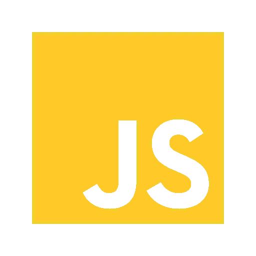

# 未来是…JavaScript？作者:艾哈迈德·贝莱德

> 原文：<https://javascript.plainenglish.io/the-future-is-javascript-7c6907ca0105?source=collection_archive---------13----------------------->

当你对某样东西不熟悉时，你通常会搜索它的定义，然后在维基百科上找到它。在 JavaScript 的例子中，你可能会遇到比你进来时更多的问题！因为它是很多很多事物的语言。

毫无疑问，即使对于有经验的开发人员来说，停下来想一想你正在使用的工具是什么以及为什么要使用它们也是很好的。

今天，最流行和使用的编程语言是 JavaScript。根据 2020 Stack Overflow developer insights，就受欢迎程度而言，JavaScript 是编程语言皇冠上的宝石，因为它的性能和无处不在。

事实上，大多数使互联网成为现代生活不可或缺的功能和应用程序都是用某种形式的 JavaScript 编写的。

诚然，JavaScript 的主要用途可能仍然是前端 web 开发，但现在由于 Node.js 的出现，它的作用远不止于此——这个 JavaScript 运行时是支持 web 服务器的流行工具。这意味着 JavaScript 开发人员可以使用 Node.js 用 JavaScript 编写客户端和服务器端代码，而无需依赖外部 web 服务器。

此外，回到过去，你需要其他语言来开发优秀的移动应用程序，比如 iOS 的 Objective-C 或 Android 的 Java。不过，现在使用 JavaScript 连接移动 API 比以往容易多了。这意味着您可以使用移动设备的功能，如本地化或相机来构建 JS 支持的应用程序。

这再一次向更多的开发者开放了移动应用程序开发，他们不再需要学习一门新语言来开始他们的职业生涯…它可以简单地做任何事情。

事实上，选择它作为您的主要编程语言可以让您自由地切换到任何平台:

*   前端(浏览器)。
*   后端(节点，Deno)。
*   Android/iOS (React Native，NativeScript)。
*   桌面(电子)。
*   混合型(离子型)。

正如我们所看到的，JavaScript 总是让它变得栩栩如生！它让开发人员专注于解决问题，并让开发人员使用插件和他们自己的代码片段的混合来让应用程序工作，从而帮助完成工作。此外，它有潜力进入许多热门行业，如机器学习和数据分析，Python 仍然主宰着游戏。甚至现在用 TensorFlow.js 这样的工具也在发生！

我们不能忘记它的包管理器，它简单易用，直观，这使得开发者之间更容易共享代码。换句话说，在一个项目中使用一个包给我们带来了一些好处，比如更快的开发，获得新的，定期的更新，以及比定制更好的安全性，这是非常有用的，因为它们是自动处理项目依赖性的工具。

现在可以肯定地说，JavaScript 将继续存在，并凭借其灵活性和动态性统治这个行业十年，在这个时候，它很难被击败。

*更多内容看*[***plain English . io***](http://plainenglish.io/)