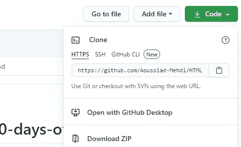
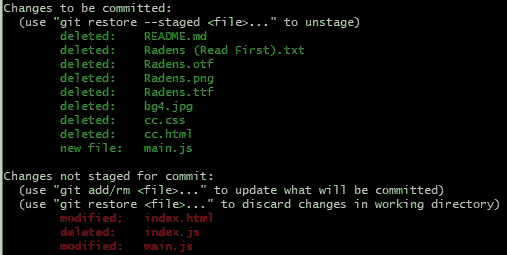

# 初级开发人员的 Git 备忘单

> 原文：<https://javascript.plainenglish.io/the-git-cheat-sheet-for-junior-developers-97f55cd01305?source=collection_archive---------5----------------------->

## 了解您需要知道的 Git 命令


Photo by [Yancy Min](https://unsplash.com/@yancymin?utm_source=medium&utm_medium=referral) on [Unsplash](https://unsplash.com?utm_source=medium&utm_medium=referral)

Git 是非常重要的技能之一，无论你是哪种类型的开发人员，你都必须拥有它。如果你只是看一下一些工作网站，你会意识到大多数开发人员的工作需要了解 Git。

如果您不熟悉 Git，它是一个版本控制系统，允许您跟踪代码更改，并在出现问题时返回到代码的不同版本。它对从事同一项目的团队也很有用，例如，它允许他们在远程 GitHub 存储库中跟踪他们的变更。因此，Git 为开发人员提供了许多特性，以使他们的开发过程更加容易。

在本文中，我们将为您提供一个 Git 备忘单，帮助您轻松了解您需要了解的基本命令。让我们开始吧。

# Git 配置

在你的机器上第一次安装 [Git](https://git-scm.com/) 之后。您需要在 Git 终端上进行一些配置，以添加您的电子邮件和用户名。

以下是用于全局配置的 Git 命令:

```
git config --global user.email [your email]git config --global user.name [your username]
```

您也可以使用下面的命令来编辑用户配置:

```
git config --global --edit
```

# Git 克隆

Git 允许您克隆包含其他开发人员项目的远程存储库，以便您可以在本地机器上安装它们。

例如，如果您想在 GitHub 上克隆一个远程存储库。您必须:

*   从 GitHub 上的存储库中复制克隆链接。



Capture from [GitHub](https://github.com/) by author.

*   在您想要安装存储库的地方打开终端(如果您在 Windows 上，请打开 Git Bash)。
*   然后在终端中使用命令`git clone`,后跟您刚刚从 GitHub 复制的库的链接。

```
git clone repository-link
```

之后，该项目将被添加到您的本地计算机上。

# Git 初始化

当您想要开始一个新项目时，命令`git init`或`git init [project-name]`用于在您的本地机器中初始化一个存储库。

在为项目初始化存储库之前，一定要确保您在项目的正确目录中。

# Git 添加

当您的项目中有文件时，您需要将它们存放在本地存储库中。

因此，如果您想要暂存项目中的所有文件，可以使用下面的命令:

```
git add **.**
```

对于单个文件，您可以使用下面的命令:

```
git add **[fileName]**
```

# Git 提交

命令`git commit`用于保存本地存储库中的项目变更。

您还可以添加注释来描述您在项目中执行的每个提交。

这里有一个例子:

```
git commit -m "adding the footer"
```

# Git 状态

命令`git status`用于列出您添加到存储库中的所有文件，以便检查哪些文件在提交中保存了，哪些没有保存。它还向您显示未跟踪的文件。

下图显示了使用绿色提交保存的文件和使用红色未提交的文件。



Capture from the Git bash terminal.

# Git 日志

命令`git log`用于显示您对项目所做的所有提交的历史。它显示了提交的日期和提交人的姓名。

# Git 推送

命令`git push`用于将本地存储库中的变更推送到您在 GitHub 或 Gitlab 上创建的远程存储库中。它将提交的变更保存在远程存储库中，以便人们可以访问您的项目。

注意，您将需要首先使用`git remote`来指定您想要将变更推送到的远程存储库。之后，您可以使用下面的命令来推送您的更改:

```
git push origin **[branchName]**
```

# Git 拉

`git pull`允许您获取原始分支中发生的所有变更，并将它们合并到本地分支中。

如果远程存储库中有变更，您必须在推送任何其他新的变更之前使用`git pull`命令。

# Git 分支

命令`git branch`允许您显示存储库中所有可用分支的列表。

要创建一个新的分支，您必须使用`git branch`,后跟分支的名称。

```
git branch **[branch-name]**
```

您也可以使用下面的命令删除特定的分支:

```
git branch -d **[branch-name]**
```

# Git 检验

`git checkout`用于从您所在的分支切换到您指定的另一个分支。

```
git checkout [branch-name]
```

# Git 合并

命令`git merge`允许您将指定分支的变更作为参数传递到您所在的分支。

以下命令将把分支`testBranch`的更改合并到当前分支:

```
git merge [testBranch]
```

# 最后的想法

如您所见，我们看了一下所有开发人员都必须知道的所有基本 Git 命令。当然，我们没有涵盖所有内容，这只是一个帮助您掌握重要命令的备忘单。

感谢您阅读这篇文章。希望你觉得有用。

**更多阅读**

[](/the-6-powerful-javascript-object-methods-that-you-should-know-b2a659ddf3b5) [## 你应该知道的 6 个强大的 JavaScript 对象方法

### 实用的 JavaScript 对象方法和实例

javascript.plainenglish.io](/the-6-powerful-javascript-object-methods-that-you-should-know-b2a659ddf3b5) 

*还有，如果你对 JavaScript 和 web 开发相关的更有用的内容感兴趣，可以* [*订阅*](https://mehdiouss.ck.page/) *我的快讯。*