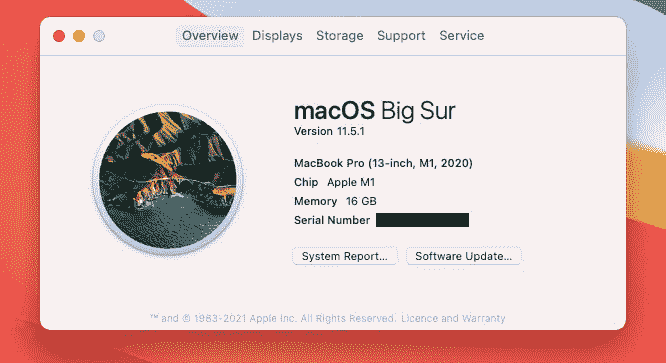
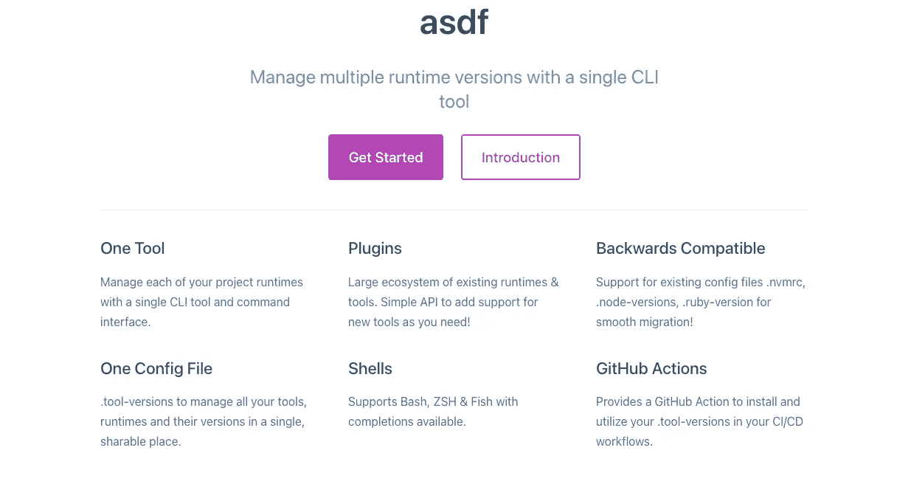
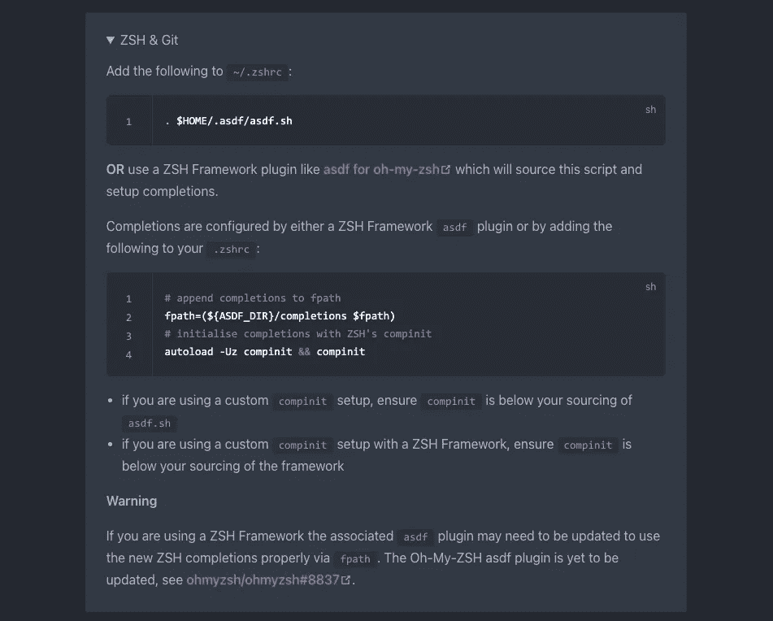

# 目前最伟大的包装经理

> 原文：<https://javascript.plainenglish.io/the-greatest-package-manager-at-the-moment-e6d3547e510b?source=collection_archive---------21----------------------->


[https://pixabay.com/photos/shelf-library-indoors-inside-3195132/](https://pixabay.com/photos/shelf-library-indoors-inside-3195132/)

# 魔镜魔镜，谁是最漂亮的包装经理？

让我们面对现实吧:所有阅读这篇文章的人并不同意所有的事情，最伟大的包经理是这个月最不烦你的人。

我最近发现自己不得不在一台新的 2020 年苹果 Macbook Pro 上重新安装并从头设置我的开发环境，该产品采用了新的苹果 M1 芯片。这意味着 Vim 插件，Jetbrains IDEs，编程语言，插件，更多的插件，另外 100 个我不知道我在使用的扩展，等等。

> **注意:**新的 M1 芯片不能运行开箱即用的旧软件包或编程语言。因此，如果你正考虑购买一台带有 M1 芯片的 Mac 电脑，那么在安装过程中可能会经历一些痛苦。



Mac book overview details

# 如果有一个包管理器可以安装所有的包，生活不是更简单吗？

输入 [asdf](http://asdf-vm.com/) 。Mac 和 Linux 变种得到了很好的支持。抱歉，windows 用户，但目前不支持 Windows。



asdf homepage

使用 asdf，您可以为各种语言和版本进行他们所谓的单独的全局和本地设置。

例如，可以使用 asdf 设置一个目录，其中包含您的计算机上需要 Node.js v14、Elixir 1.10 和 Erlang 23 的代码，以便在该 repo 中专门使用这些版本。没有更多的`nvm use v14`和其他包管理器在回购中使用特定的版本。当切换到该目录时，Node.js 的可用版本将是您希望的任何特定版本。

# **安装 asdf**

启动和运行 asdf 包括几个步骤。一旦你做了几次，你就会把它们放下来。没有看起来那么复杂。

*   安装依赖项
*   正在下载 asdf 核心
*   安装 asdf
*   为您希望管理的每个工具/运行时安装插件
*   安装工具/运行时版本
*   本地或全局激活特定版本

## 安装依赖项

asdf 需要在系统上安装 gpg 和 gawk。因为我们将在后面的步骤中使用 git，所以也需要安装 git。个别编程语言、框架、库或技术可能有自己的依赖关系。在你到达那一步之前，不要担心这个。

```
brew install gpg gawk
```

## 正在下载 asdf 核心

我们将使用 git 方法来安装 asdf，因为通过这种方式，您知道您将得到什么。Brew 等方法以我的经验来看一直不靠谱。

从命令行或您选择的 git GUI 运行 git clone。以下命令会将 repo 克隆为您的主目录中的隐藏目录。

```
git clone https://github.com/asdf-vm/asdf.git ~/.asdf --branch v0.8.1
```

## 安装 asdf

安装 asdf 是一个比较棘手的地方。请务必查看您的具体设置的官方网站。我要去 Zsh 和 Git。



在官方网站上为这一步找到你的具体情况，并遵循它们。就这么简单。

这应该完成了通常称为 asdf 核心的安装。这意味着你已经完成了 asdf 的安装，但还没有安装任何特定的语言或框架。

## 为您希望管理的每个工具/运行时安装插件

既然您已经成功安装了 asdf 并添加了一个插件，那么是时候实际安装一个二进制文件或一些可运行的东西了。

我们将继续我们的 Node.js 示例。第一步是列出所有可用的 Node.js 版本。如果你有一个特定的版本，然后搜索该版本。

若要搜索 Node.js 的所有可用版本，请运行以下命令。

```
asdf list-all nodejs
```

若要搜索 Node.js 的特定版本，请运行以下命令。

```
asdf list-all Node.js 14
```

最后，要安装特定的版本，运行下面的命令。

```
asdf install Node.js 14.17.5
```

## 将特定版本激活为全局安装或本地安装

全局仅仅意味着系统中的任何地方。假设您在一个目录中，没有指定应该使用哪个版本的 Node.js，那么运行的将是全局版本。

要全局设置 Node.js 的安装版本，请运行以下内容。

```
asdf global Node.js 14.17.5
```

本地仅仅意味着一个特定的目录。假设您 git 克隆了一个 repo，并且希望在该目录中只使用 node 的一个特定版本，那么您应该运行下面的代码。

```
asdf local Node.js 14.17.5
```

键入`Node.js -v`现在应该会给出您熟悉的输出。

***祝贺你！*** 您现在有了 asdf 的工作设置，并且可以自由地不必为一个项目在一百个特定语言的包管理器之间切换。

*更多内容请看*[***plain English . io***](http://plainenglish.io/)