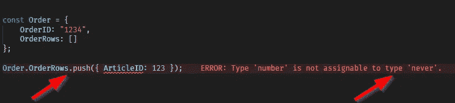
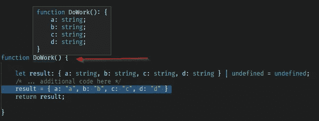
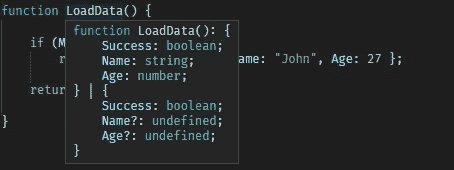
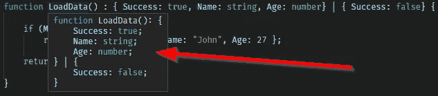
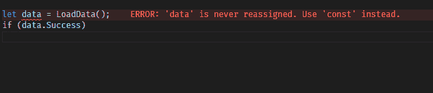
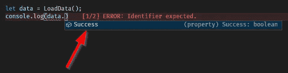
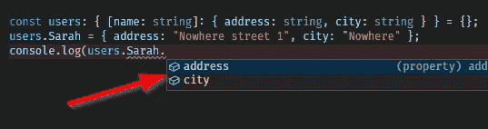

# 后端类型脚本开发入门指南

> 原文：<https://javascript.plainenglish.io/the-guide-to-kickstarting-backend-typescript-development-e2656c2f5d17?source=collection_archive---------21----------------------->


Photo by [Oskar Yildiz](https://unsplash.com/@oskaryil?utm_source=medium&utm_medium=referral) on [Unsplash](https://unsplash.com?utm_source=medium&utm_medium=referral)

本文要求您至少具备一些类型脚本知识。主题包括`ReturnType`、`Partial`、泛型`<T>`、交集、如何修改全局名称空间以及`tsc`命令行。同时专注于使用 TypeScript 提供的安全类型。

让我们从建立几件事情的基线开始。

# 跑步与发展

在开始学习 TypeScript 时，我希望有人能更具体地说明这一点。*编写*代码和*运行*代码是两码事。TypeScript *在开发时只有*存在，而真正运行的*是普通的 JavaScript。这使得调试更加困难，并且在运行时无法使用类型(除了普通 JavaScript 支持的类型)。*

# tsconfig.json 建议

尽可能保持设置紧凑，让 TypeScript 熠熠生辉。这个*尤其是*包括`noImplicitAny: true`和`strictNullChecks: true`。保持严格的设置有时看起来很烦人，但从长远来看，这是一个成功的概念。更少的错误，更好的智能感知，重构变成了公园里的散步。

## 目标

在 https://www.typescriptlang.org/tsconfig/#target的`target`和 se 文档中有许多变化。对于后端开发，不需要考虑浏览器兼容性。用最新最棒的功能就好。

```
{
  "compilerOptions": {
    "target": "ES2020", 
    "module": "commonjs", /*  'commonjs', 'es2020', or 'ESNext'.  */
    "outDir": "./out",
    "rootDir": "./src", 
    "strict": true, 
    "esModuleInterop": false,
    "skipLibCheck": true,
    "forceConsistentCasingInFileNames": true, 
    "allowUnreachableCode": true,
   ** "noImplicitAny": true,
    "strictNullChecks": true,**
    "strictPropertyInitialization": true,
    "alwaysStrict": true,
    "noImplicitThis": true,
    "strictBindCallApply": true,
    "experimentalDecorators": true,
    "incremental": true,
    "noUncheckedIndexedAccess": true
  }
}
```

# 定义简单类型

在深入有趣的细节之前，让我们先简要地看一下如何定义一个简单类型:

```
type User = {
    Name: string,
    AccessLevel: "NewUser" | "User" | "Admin"
}
```

要使用它，只需引用名为`User`的类型，如下所示:

```
function Login(userName: string, pw: string) : User | undefined { let theUser: User | undefined = undefined; if (userName === "root" && pw=== "root")
        theUser = { Name: "Root", AccessLevel: "Admin" }; return theUser;
}
```

好了，说完了，让我们进入正题。

# 已知类型 vs“任何”vs“未知”

## 任何的

定义为 any 的对象可以被认为是一个“JavaScript 对象”。本质上，所有的操作都是允许和不允许的(赋值、删除值等等)。就当是程序员决定说“我对这个变量一无所知，不用任何类型检查就可以访问、删除、修改上面的任何值”。

`any`在从 JavaScript 迁移到 TypeScript 时确实很有用，但是尽量避开它。如果必须这样做，则更改`tsconfig.json`，将`noImplicitAny`设置为假以减少错误数量。

```
let a: **any** = {
    Foo: "1"
};a = { Foo: "100", Fruit: "Banana" };   // No problema.Bar = "2";         // No problem
delete a.Foo;        // No problemconsole.log(a.Foo);  // Returns undefined
```

## 未知的

未知类型有些不同。可以随意赋值(就像`any`一样)，但是试图访问/修改这些值会出错。

```
let a: **unknown** = {
    Foo: "1"
};a = { Foo: "100", Fruit: "Banana" };   // No problema.Bar = "2";         // Returns error
delete a.Foo;        // Returns errorconsole.log(a.Foo);  // Returns error
```

## 从不

`never`不会出现在好的书面类型脚本中，但是在从 JavaScript 转换到类型脚本时可能会出现。考虑以下场景:

```
const Order = {
    OrderID: "1234",
    OrderRows: []
};Order.OrderRows.push({ ArticleID: 123 });
```

由于在`Order`对象上没有定义类型，TypeScript 将试图找出该对象的样子。不幸的是，`OrderRows`只是一个数组，但它的类型无法确定。因此，类型将被设置为`never`。



解决这个问题很简单，只需指定对象的类型:

```
const Order : { OrderID: string, OrderRows: {ArticleID: number}[] }= {
    OrderID: "1234",
    OrderRows: []
};Order.OrderRows.push({ ArticleID: 123 });
```

# 进入类型…

现在理论上所有的对象都被很好的定义了，类型也是已知的。实际上，大多数(所有？)从磁盘加载或远程获取的对象则不是。作为一名开发人员，这带来了一个挑战，因为(例如)一个获取数据的`get`请求会返回某种需要适应 TypeScript 的对象。

(至少)有四种方法可以将类型分配给对象:

## 方法 1:类型断言(如果您喜欢 c#语法，也可以使用强制转换)

```
const myObject = **<TheTargetType>**request("http://...");// orconst myObject = request("http://...") **as TheTargetType**
```

## 方法 2:声明一个特定类型的变量

```
const myObject : **TheTargetType** = request("http://...");
```

## 方法 3:使用用户定义的类型保护

用户定义的类型保护是检查一个对象的函数，如果它通过了设定的要求，它就被认为是某种类型。

```
// The type
type Person = { Name: string, Age: string }// User Defined Type Guard
function isPerson(object: unknown): ***object is Person*** {
    // Rules: Name and Age must exist in in the object.
    const keys = Object.keys(data);
    return (["Name", "Age"].every(v => keys.includes(v)));
}// The unknown data (gotten from somewhere)
const rawData = `{"Name":"Sarah","Age":30}`;
const data = JSON.parse(rawData);         // type is "any"// Using the type guard
if (isPerson(data)) {
    // data is of type Person (inside this closure)
    console.log(`name: ${data.Name}, age ${data.Age}`);
}
```

## 方法 4:泛型

当从一个网站加载远程数据时，泛型特别有用。因为泛型非常强大，所以下面有专门的一章。

```
async function FetchRemoteSite<T>(url: string): Promise<T> {
  const result = await axios.get(`[https://site.com/api/${url}`](https://remotesite.com/api/${url}`));
  return result.data as T;
}
```

# 类型 of

传统 JavaScript 中的 typeof 用于获取对象或原语的类型名称(即“对象”、“字符串”、“数字”等等)

```
const a = { Foo: "Bar" };
const b = "Bar";
console.log(typeof a);   // Returns "object"
console.log(typeof b);   // Returns "string"
```

使用 typeof 获取 *TypeScript* 类型是不可能的，因为所有运行代码的*都是 JavaScript，类型不存在。*

```
type FooType = { Name: string, Age: number };
const foo: FooType = { Name: "A", Age: 1 };
console.log(typeof foo);  //"FooType"? No! returns "object"
```

那么 TypeScript 中的 typeof 可以用来做什么呢？它可以复制其他对象和函数的现有类型。例如，这是有效的代码:

```
let x: { id: number };const y: typeof x = { id: 7 };
```

一个更大的例子是:

```
const DefaultConfig = {Foo: 1, Bar: 44 };function LoadFromDisk(): typeof DefaultConfig { // Copy the type
    let result: typeof DefaultConfig | undefined = undefined; result = fs.existsSync("config.json")
        ? JSON.parse(fs.readFileSync("config.json", "utf-8"))
        : DefaultConfig; return result!;
}
```

# ReturnType

考虑下面的代码。`DoWork`的返回是`{ a: string, b: string} | undefined`，函数必须以某种方式构建结果。这可能导致再次声明同一个对象(见第 3 行)

```
function DoWork(): **{ a: string, b: string } | undefined** {const result: ***{ a: string, b: string } | undefined*** = undefined;
    /* ... additional code here */
    return result;}
```

有几种方法可以解决这个问题，最明显的方法是声明一个单独的类型:

```
type WorkResult = { a: string, b: string };function DoWork(): WorkResult | undefined {
    const result: WorkResult | undefined = undefined;
    /* ... additional code here */
    return result;
}
```

但是还有其他方法。

## 远离函数的返回值

从函数行中删除返回信息，让 TypeScript 施展它的魔法。当鼠标悬停在`DoWork`上时，TypeScript 知道返回类型。不幸的是，这降低了可读性，而且有时，TypeScript 不能产生足够清晰(甚至正确)的 ReturnType。



## 使用 ReturnType

使用`ReturnType`，可以引用一个函数并提取它返回的类型。

**例 1:**

```
function DoWork(): { a: string, b: string} | undefined { let result: ReturnType<typeof DoWork> = undefined; /* Code that populates the result variable */
    result = { a: "a", b: "b" } return result;}DoWork();
```

**例 2:**

如果您想从不受您控制的模块中获得一个类型，这可能会更有用。考虑一个编码糟糕的数据库实现的依赖性。这样可以保证返回的类型与被引用模块的类型相同。

```
import { LoadDatabaseEntry } from './badlycoded';function Trimname(): ReturnType<typeof LoadDatabaseEntry> { const entry = LoadDatabaseEntry();
    entry.Name = entry.Name.trim();
    return entry;}
```

将`ReturnType`与`Omit`或`Pick`结合在一起可以提供更多的控制:

```
import { LoadDatabaseEntry } from './badlycoded';
function Trimname(): **Pick<***ReturnType<typeof LoadDatabaseEntry>*, **"Name" | "Age">** {
    const entry = LoadDatabaseEntry();
    entry.Name = entry.Name.trim();
    return entry;
}Trimname()  // Contains only "Name" and "Age"
```

# 多个返回类型(联合)

例如，可以返回一个带有相关数据的对象(成功时)或一个错误对象(带有相关错误数据)，如下所示:

```
function LoadData(): **{ Name: string, Age: number }** | { **Error: string }** {
     // Simulate a call that succeeds 90% of the time
     if (Math.random() > 0.1)
         return { Name: "John", Age: 27 }; return { Error: "Could not load data." };}
```

## 返回关于成功和失败的不同数据—更详细:

这个功能有好有坏。它会提高代码的可读性，同时也会降低可读性。继续读下去。:)

考虑一下这个。在`Success: true`上，返回相关数据。在`Success: false`时，没有数据返回:

```
function LoadData() { // Simulate a call that succeeds 90% of the time
      if (Math.random() > 0.1)
        return { **Success: true,** Name: "John", Age: 27 }; return { **Success: false** };
}
```

将鼠标悬停在该函数上，可以发现 TypeScript 已经构建了正确的返回类型:



现在，让我们换成这样:

```
function LoadData() : { **Success: true**, Name: string, Age: number} | { **Success: false**} {
...
}
```

已指示 TypeScript 注意返回的数据中有一个*差异*(取决于`Success`的结果)。现在悬停显示:



带智能感知；既然我已经检查了`data.Success`为真，那么我就可以访问年龄和姓名值(而 ***只有*** )。



那么这种方法有什么不好呢？嗯，只是这样。在下面的例子中，没有检查 Success 是否为真，因为 TypeScript 不能*完美地*决定显示什么，所以姓名和年龄值被隐藏。这对开发人员隐藏了重要的信息。



# 返回多个值

这不是一件打字稿的事情，但是知道这一点是有好处的。

```
function MultipleReturns1() {
    return { Foo: "Yes", Bar: "No" };
}const { Foo, Bar } = MultipleReturns1(); // Destructuring
console.log(`Foo=${Foo}, Bar=${Bar}`);   // Prints "Foo=Yes, Bar=No"
```

对于数组:

```
function MultipleReturns2() {
    return ["Yes", "No"];
}const [a, b] = MultipleReturns2();
console.log(`${a} ${b}`);              // Prints "Yes No"
```

# 交叉点/“合并”类型

将两种类型“合并”成一种新类型是可能的。在 TypeScript 中，这被描述为“通过交集扩展类型”。

```
type User = { Name: string, Age: number }function LoadData(): **User & { IsNewUser: boolean }** { const n = Math.random() > 0.2;
   return { Name: "John", Age: 27, IsNewUser: n};}const data = LoadData();
console.log(data.IsNewUser);   // OK!
```

# 仿制药

泛型由类型参数标识，通常用单个字母 T 标识，如`function LoadData***<T>***() { ... }.`

最简单的解释是:不是函数决定要返回的类型(例如，“如果你调用这个函数，它将返回一个用户对象”)，而是*调用者*决定要返回的对象。基本上，类型是函数的一个参数。

当谈到为从磁盘、数据库或远程(http://…)加载数据而编写的函数时，泛型是最有可能考虑的。

**例如:**

```
type User = { Name: string, Age: number }async function LoadData**<T>**(url: string): Promise<T> {
    const result = await axios.get(`[https://site.com/api/${url}`](https://remotesite.com/api/${url}`));
    return result.data as T;
}async function Main() { const u1 = await LoadData("users");          // u1 is unknown :(
   const u2 = await LoadData<User[]>("users");  // u2 is User[]}
```

根据功能的不同，类型参数可以省略:

```
function Reverse<T>(data: T[]): T[] {
    // For the sake of demo only
    return data.reverse();
}const sourceData = ["A", "B", "C"];
console.log(Reverse(sourceData));   // Output = [ 'C', 'B', 'A' ]
```

# enums

最基本形式的枚举声明如下:

```
enum FileAccess {
    Read,    // Will become the number 0
    Write    // Will become the number 1
}const p: FileAccess = FileAccess.Read;
```

将存储在数据库或类似数据库中的枚举需要在应用程序的生命周期内永久固定。

```
// Declare the enum
enum eFileAccess {
    Read = "ACCESS_READ",
    Write = "ACCESS_WRITE"
}// Use it
const p: eFileAccess = eFileAccess.Read;if (p === eFileAccess.Read)
    console.log("Read access graned");console.log(p);  // Returns "ACCESS_READ"// Convert from string to enum
const f = <eFileAccess>"ACCESS_WRITE";
if (f === eFileAccess.Write)
    console.log("Write access granted");
```

## 按位枚举/标志(来自 c#)

标志并未真正得到支持，但可以通过一些按位运算轻松修复。

```
enum eFileAccess {
    Read = 1 << 0,            // 0001 = 1
    Write = 1 << 1,           // 0010 = 2
    ReadWrite = Read | Write  // 0011 = 3
}const p: eFileAccess = eFileAccess.ReadWrite;if (p & eFileAccess.Write) // Bitwise and
    console.log("Write access graned");
```

# 只读！

有多种方法可以做到这一点。

**方法 1:** 定义使用`readonly`的类型:

```
type Position = {
    readonly x: number;
    readonly y: number;
}const a: Position = { x: 1, y: 5 };
a.x = 10;   // Error
```

**方法 2:** 将现有类型变为只读。

```
type Position = {
    x: number;
    y: number;
}function GetPosition(): Readonly<Position> {  // Returns readonlyconst result: Position = { x: 0, y: 0 };
    result.x = 10;  // Writable
    result.y = 20;
    return result;}let a = GetPosition();
a.x = 10;  // Error
```

# 索引签名/好的任意/键值对

`any`应该尽量避免，但有时需要将数据存储在“键”和“值”对中。索引签名允许这种情况。

```
const kv: { **[key: string]: string | number** } = {};
kv.Name = "Sarah";
kv.Age = 47;console.log(JSON.stringify(kv)); // {"Name":"Sarah","Age":47}
```

循环具有类型安全性的索引签名就像:

```
for (const [key, value] of Object.entries(kv))
    console.log(`key=${key}, value=${value}`);
```

最后，如果索引签名应为只读，请执行以下操作:

```
type rokv = { **readonly** [x: string]: number; }const foo: rokv = { "Hour": 3, "Minute": 29 };console.log(foo.Hour);   // Returns 999foo.Minute = 12;         // Not allowed, is read only
```

当然，在 IntelliSense 中，有可能将对象作为值。



# 接口？还是类型？

它们几乎完全相同，无论是在使用方式还是书写方式上。这是一种个人喜好，几乎没有例外。用一些空格来对齐它们，它们可以比较为:

```
interface Person   { Name: string, Age: number }
     type Person = { Name: string, Age: number }
```

扩展两种类型都是可能的，但是语法不同。更多信息请访问[https://www . typescripttlang . org/docs/manual/2/day-types . html #类型别名和接口之间的区别](https://www.typescriptlang.org/docs/handbook/2/everyday-types.html#differences-between-type-aliases-and-interfaces)

一个显著的区别是同名接口被*合并了*！当需要修改已经存在的接口时，这一点尤其重要(请继续参见下面的“修改全局命名空间”)。

```
interface Person { Name: string }
interface Person { Age: number }
const newUser: Person = { Name: "Linda", Age: 80 };   // OK!
```

# 修改全局命名空间(global.name)

有时，需要在整个 Node.js 项目中有一个全局变量。它可以是常数、函数或记录器。

Globals 在 **.d.ts** 文件中定义，与本文件`declarations.d.ts`相同。将其置于“src”下。

**重要！**将环境变量`TS_NODE_FILES`设为“真”。这将启用`tsconfig.json`中的`include` / `exlude`配置设置

```
declare global {
   namespace NodeJS {
    interface Global {
       LicenseKey: string
    }
  }
}export { };  // Don't forget this 
```

:!:得到“与自定义类型脚本模块和名称空间相比，ES2015 模块语法更可取”？不要使用`.ts`命名，使用`.d.ts`。

要访问全局变量、函数或对象，您只需要:

```
function Main() {
   global.LicenseKey = "ABC123";
}
```

可以在根上声明变量。一个例子是全局拥有一个`logger`对象，这个对象不需要包含在每个文件中就可以访问。对于这种情况，有几件事情需要考虑:

**申报单**

```
type Logger = {
    debug: (p: string) => void
}declare global { // eslint-disable-next-line no-var
    declare var logger: Logger;
}export { };
```

像这个`logger`这样的全局对象的最大挑战是它需要超级早的初始化。制作一个`index.ts`来初始化需要的全局变量，并且*只初始化*。这个文件又包含一个*单个*文件，像`main.ts`一样，init 的其余部分在这里运行。做对了，`index.ts`将能够在之前运行它的代码*，包括 main.ts 文件。*

```
# Init my (fake) global logger (note: without global-prefix)
logger.debug = (iData: string) => { console.log(iData); };# Use it
logger.debug("Logger initialized, booting system.");
```

# 环境变量和全局名称空间

最后，让我们研究一下如何修改全局名称空间来对环境变量进行类型检查。`process.env.VARIABLENAME`可以配置为:

```
declare global {
    namespace NodeJS {
        interface ProcessEnv {
            NODE_ENV: "production" | "development",
            VARIABLENAME: string | undefined,
        }
    }
}
export { };
```

用法:

```
if (process.env.NODE_ENV === "development")
   console.log(`VARIABLENAME=${process.env.VARIABLENAME}`);
```

# 修改 Express 命名空间

# 关于使用全局变量的更多信息

我写了一篇关于此事的附加文章，在这里阅读。

# 修改 Express 命名空间

```
import "express"; // Modifies global namespace, so include it!declare global {namespace Express {
        interface Request {
            token: string,
            userId: string
        }
    }
}export { };
```

添加中间件来解码我们的用户(来自 bearer、cookie 或类似的内容),并将经过验证的用户存储在`req`对象中。可以只存储用户的 ID，也可以存储包含更多数据的实际对象。

```
import * as Express from "express";app.use((req: Express.Request, res: Express.Response, next: Express.NextFunction) => { // Do work to decode req.headers.authorization here
    req.token = "thetoken";
    req.userId = "usr00001"; next();});
```

在您的路线中，非常简单:

```
app.get(`/test`, async function (req: Express.Request, res: Express.Response) { if (!req.userId)
    // ... Not authenticated
    res.status(401).json({ Success: false });
   else
    // ...All ok
    res.json({ Success: true });
  });
```

# 承诺 vs 异步

让我们首先确定，对于大多数用例来说，它们可以被认为是相同的。下面是两个函数，一个返回一个`new Promise`，另一个使用`async`(带类型安全)。这两个函数有四种不同的调用方式。

```
// Two different implementations doing the same thingasync function DoSomething(): Promise<number> {
  return Math.random();
}function DoSomething2() {
 return **new Promise<number>**((*resolve: (result: number) => void*) => {
    resolve(Math.random());
 });}// Test functionasync function TestThemAll() {// Test both using ".then" syntaxDoSomething().then(result => {
        console.log(`DoSomething returned: ${result}`);
    });DoSomething2().then(result => {
        console.log(`DoSomething2 returned: ${result}`);
    });// Test them both using "await" syntaxconsole.log(`DoSomething returned: ${await DoSomething()}`);
    console.log(`DoSomething2 returned: ${await DoSomething2()}`);}TestThemAll();
```

…但是复试呢？请吧。号码

# 按原样启动 TypeScript 项目

不需要将文件传输到 out 并从那里运行代码，它可以动态完成(即使有断点并单步执行 VSCode)。

从命令行启动 TypeScript 项目:

```
set TS_NODE_FILES=true & node -r ts-node/register src/index.ts
```

在 VSCode 中，需要有一个`.vscode\launch.json`文件。添加添加以下内容，然后按 F5 运行。

```
{
 "version": "0.2.0",
 "configurations": [
  {
   "name": "Debug typescript",
   "type": "node",
   "request": "launch",
   "smartStep": false,
   "sourceMaps": true,
   "args": ["${workspaceRoot}/**src/index.ts**"],
   "runtimeArgs": [
            "-r",
            "ts-node/register/transpile-only"
   ],
   "cwd": "${workspaceRoot}",
   "protocol": "inspector",
   "internalConsoleOptions": "openOnSessionStart",
   "env": {
    "TS_NODE_IGNORE": "false",
   ** "TS_NODE_FILES": "true", // Respect include/exclude in tsconfig.json => will read declaration files**
    "NODE_ENV": "development"
   },
   "skipFiles": [
    "<node_internals>/*",
    "<node_internals>/**",
    "<node_internals>/**/*",
    "${workspaceRoot}/node_modules/**",
    "${workspaceRoot}/node_modules/**/*"
   ],
   "stopOnEntry": false,
   "outputCapture": "std",
  },
 ]
}
```

如果您想更改按 F5 时运行的内容，请打开 vscode 命令面板(ctrl-shift-p)并搜索`Debug: Select and start debugging`。

# 一些工具提示！

终于到了最后。让我们总结一些杂项工具提示。

## ThermalStressCracking 热应力龟裂

在开发过程中运行`tsc`将有助于跟踪项目层面的错误。结合`eslint`和[错误镜头](https://marketplace.visualstudio.com/items?itemName=usernamehw.errorlens)插件的 VSCode 将显示本地错误。

**建筑一次**

打开一个终端，键入`tsc -b -v`一次性构建项目(打开 verbose)。当前工作目录应该和`tsconfig.json.`在同一个文件夹

**连续构建(观察&增量)**

更好的方法是打开监视文件变化的`-w`，并使用增量`-i`来加快传输速度。总而言之使用:

```
tsc -b -v -i -w
```

## 类型同步

并非 npmjs.com 上的所有模块都有内置类型。[类型同步](https://www.npmjs.com/package/typesync)扫描项目并尝试找到所需的类型:

```
📦 project1 — package.json (1 new typings added, 0 unused typings removed)
└─ + [@types/express](http://twitter.com/types/express)
```

如果模块本身不存在类型，或者没有单独的类型，那么您只能靠自己了。手动编写定义或使用`declare module`将模块设置为`any`。对于后者，创建一个包含以下内容的`definition.d.ts`:

```
declare module '<module name here>';// Example:
declare module 'rfc822-validate';
```

## NPM-检查

使用 [npm-check](https://www.npmjs.com/package/npm-check) 工具升级您的依赖项。用`npm-check -d`或`npm-check -d -g`运行

## 死文件

找到未使用的文件有点棘手，因为有很多方法可以使用文件。 [deadfile](https://www.npmjs.com/package/deadfile) 干得不错。

```
deadfile .\\src\\index.ts --exclude out --exclude log
```

# 享受:)

*更多内容请看*[*plain English . io*](http://plainenglish.io/)