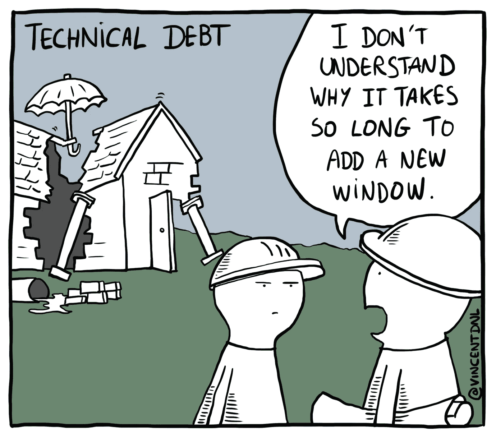

# 技术债务的隐性成本——千刀万剐

> 原文：<https://javascript.plainenglish.io/the-hidden-costs-of-technical-debt-death-by-a-thousand-cuts-23569200df48?source=collection_archive---------13----------------------->

Image by [Vincent Déniel](https://vincentdnl.com/drawings/technical-debt)

许多文章和帖子讨论了如何处理、避免或维护技术债务。在这篇文章中，我想解决一些很少被讨论的技术债务的隐藏成本，我希望这能帮助你在下一次讨论是否采用“嘿，我们以后再解决”的方法来开发新功能时做出更好的决定。

## 什么是技术债？

简单地说，技术债务是任何使当前开发更快的技术捷径——以复杂化和减缓未来的变化和添加为代价，使这些功能的总成本高于没有它的成本。[CISQ](https://medium.com/r?url=https%3A%2F%2Fwww.it-cisq.org%2Fthe-cost-of-poor-quality-software-in-the-us-a-2018-report%2Fdl.htm)最近的研究得出结论，2018 年美国劣质软件的总成本为**2.84 万亿美元**，其中他们将 18.2%归因于技术债务。

*“我的改变也影响未来。我可能会看到一种快速加入这一功能的方法，但这种方法违背了程序的模块化结构，增加了 cruft。如果我走那条路，我今天会让它变得更快，但会拖慢其他人在未来几周或几个月内处理这些代码的速度。一旦团队中的其他成员做出了同样的决定，一个易于修改的应用程序会很快积累起来，以至于每一个微小的改变都要花费数周的时间。”—* [*马丁·福勒*](https://martinfowler.com/articles/is-quality-worth-cost.html)

技术债务的直接成本——系统相关领域中未来特性增加的开发时间，并不是唯一的成本。下面是一些需要考虑的隐性成本。

# 隐性成本

## 复杂性增加

在许多情况下，将 cruft 添加到软件中会增加整个系统的整体复杂性。这种增加的复杂性使其成本乘以与该领域有任何交互的人数，例如设计新功能、分析数据、为新团队成员学习曲线等。这种增加的成本会以多种方式表现出来，例如更长的会议、知识孤岛，以及在改变或发展这一领域之前需要咨询许多人。

## bug 和缺陷数量增加

设计糟糕的系统、缺乏测试覆盖、反直觉的行为以及其他种类的技术债务增加了在修改代码时将 bug 引入系统的机会。就开发人员的时间、业务损失、糟糕的用户体验、坏名声等而言，错误和缺陷的成本可能非常高。

## 机会的丧失

虽然注意到技术债务对开发时间的影响比较容易，但是对于那些从一开始就没有开发出来的特性和产品，通常会有一个盲点。在考虑到需要的努力和更高的风险之后，已知有大量技术债务的系统区域可能最终会阻碍团队在那里开发新的特性。它不仅阻止了组织探索新的机会和快速迭代，很多时候，不开发一个特性的决定是在花费精力探索和理解系统相关领域的问题和复杂性、做出努力估计和讨论替代方案(例如将增加技术债务的“快速和肮脏”的解决方案)之后做出的。

## 可预测性降低

因为很难总是预见哪些特性会受到技术债务的影响，所以通常只有在实现特性的时候才能发现，这增加了很大的延迟。添加到开发中的未计划的工作可能非常高，如果它被包含在最初的估计中，它可能会改变特性的优先级，这可能会被一些更高价值/工作的开发所取代。

## 管理技术债务的努力

技术债务需要努力去管理它。这些努力包括管理技术债务任务，确定优先级(和多次重新确定优先级..)他们，在计划冲刺时讨论他们的价值和紧迫性，以及在讨论相关的计划功能时。此外，当在开发过程中遇到它时，它通常会让团队停下来，与产品经理、特性所有者、管理层等利益相关者讨论替代方案及其影响。

## R&D 文化

最后但并非最不重要的一点是，将技术债务引入系统而不加以解决，随着时间的推移，也会影响 R&D 的文化，并可能鼓励其他人也这样做。

社会心理学家和警察都倾向于认为，如果一栋建筑的一扇窗户被打破而又不修理，那么其他的窗户很快也会被打破——[*破窗理论*](https://en.wikipedia.org/wiki/Broken_windows_theory)

在质量已经很低的系统中加入 cruft 是相当诱人的。此外，当开发人员阅读糟糕的代码和设计，而不是从好的代码和设计中学习时，这也会对他们的快乐和专业成长产生负面影响。

# 例子

假设我们的网站上有一个注册页面，当用户注册时，我们将一个“注册”事件发送到我们的事件流中，该事件流目前仅用于分析目的。现在，我们得到了一个新的要求，即在用户注册后发送一封电子邮件，邀请他们为产品安排一次培训。我们构建了一个服务来消费这些事件，并在用户注册后立即触发电子邮件。每个人都很开心。过了一会儿，一个新的服务被添加到网站上，还有另一个注册流程。对于这项服务，注册后不应发送电子邮件。添加新注册页面的开发人员提出了一个快速解决方案，在与产品经理和分析师核实此事件没有用于此新服务之后，不会为该页面发送“注册”事件。新的注册页面上线了，大家又开心了。
让我们来看看这一决定的未来影响和成本:

整个系统**的复杂性**增加了——本来应该是一个简单的“注册”事件现在有了一些隐藏的逻辑，它并不总是被发送，电子邮件触发系统现在耦合到这个逻辑。这将影响对这些组件的未来更改，需要许多人熟悉这个逻辑，例如现在应该知道何时可以和不可以使用这个事件进行分析的分析师，或者通过艰苦的方式发现它。

未来的**错误**更有可能发生，例如，如果添加了一个新的注册流，它会无辜地触发一个“注册”事件，而不是打算为用户触发一封电子邮件。如果开发人员很早就发现了这个问题，可能不会引入 bug，但是项目会出现延迟，因为团队必须决定要么解决它，要么重构并移除这个技术债务。这两种选择都会增加项目的计划外延迟，对**可预测性**产生负面影响。

如果团队决定解决这个问题，他们可能会将某种“重构”任务添加到他们的待办事项中，这些任务必须被优先化、讨论，并且通常被重新讨论，直到这个债务被移除，这增加了管理技术债务的成本。

# 结论

下一次，当你考虑增加你的技术债务时，问问你自己(和其他利益相关者)——更早发布这个新特性/产品的价值比它将要延迟的下一个的价值高这么多吗？在大多数情况下，答案是“不”——明天的机会可能会和你今天面临的机会一样紧迫。当你决定走“快速和肮脏”的道路时，为第二天制定一个可靠的计划，并确保很好地沟通，以便每个人都同意以后如何继续发展这个系统或产品。

> 希望听到您的想法和评论！

## 进一步阅读

 [## 糟糕的文档是技术债务——以下是解决方法

### 如果你想快速行动，尽可能少破坏东西，文档文化是至关重要的，那么为什么好的文档…

javascript.plainenglish.io](/bad-documentation-is-tech-debt-heres-how-you-solve-it-ce1d0b3ee760)  [## 为什么开发人员会产生低质量的代码和技术债务？因为他们因此得到了回报

### 你得到你奖励的代码

javascript.plainenglish.io](/why-do-developers-create-low-quality-code-and-technical-debt-because-they-are-rewarded-for-it-76d4714dcef6)