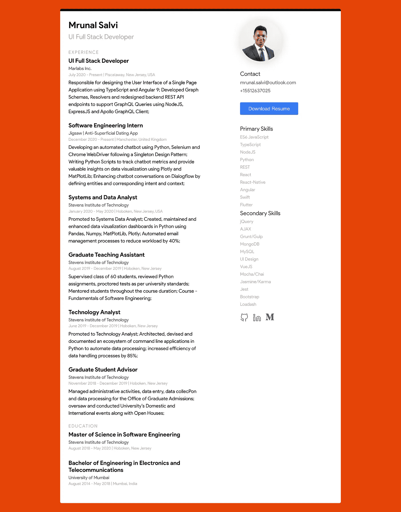

# JavaScript 生态系统# 2——AureliaJS——构建您自己的 Web CV 并部署在 Netlify 上

> 原文：<https://javascript.plainenglish.io/the-javascript-ecosystem-2-aureliajs-build-your-own-web-cv-and-deploy-on-netlify-9e64d143aae8?source=collection_archive---------16----------------------->

问候我所有的读者，我希望你们都保持安全和健康。让我们深入了解这个博客系列的第一个库/框架“ **Aurelia** ”。现在，由于网络上充斥着 React、Angular 和 Vue 上的帖子，我决定探索一个不太受欢迎的图书馆 AureliaJS。享受学习！

# 介绍

Aurelia 是一个开源的 JavaScript 框架，旨在创建**单页应用**，并创建 web 应用的用户界面。它由一系列*现代 JavaScript 面向特性的模块*组成，比如**依赖注入、绑定、模板、路由器**等等。使用 Aurelia 的优势之一是它遵循*“约定优于配置”*的哲学，通过减少构建应用系统所需的代码量，帮助开发人员遵循既定的模式。

AureliaJS 的一些主要特征是:

1.  组件是 Aurelia 应用程序的构建块，由 **JavaScript 视图模型对**和 **HTML 视图**组成。
2.  允许开发人员根据项目复杂性和需求在**类型脚本**和 **JavaScript** 之间进行选择。
3.  由于 Aurelia 将现代 JS 模块与一种不引人注目的方法相结合，所以对 web 应用程序进行单元测试就像测试普通 JavaScript 一样简单。[(阅读我之前关于普通 Web 组件的帖子)](https://medium.com/javascript-in-plain-english/the-javascript-ecosystem-blog-1-vanilla-web-components-7d6960f34ff9)
4.  Aurelia 是最干净的现代框架之一，它完全专注于 web 标准。
5.  它提供了一种简单且可扩展的方式来集成不属于 Aurelia 框架的其他工具和库。
6.  它是麻省理工学院许可的开源框架，提供企业/商业支持。

就像任何其他基于组件的框架一样(React、Angular、Vue ), Aurelia 组件也有特定的生命周期方法，允许开发人员控制组件的生命周期。让我们快速看一下组件生命周期方法:

Component Lifecycle Methods

现在我们已经对 Aurelia 框架有了一个简单的概述，让我们开始创建一个简单的项目。

# 项目概述:

我们将建立一个简单的项目，一个静态的单页应用程序使用 **AureliaJS，AureliaCLI，HTML，**和 **CSS** ，你可以展示为你的在线投资组合/简历。为了保持项目简短，我们不会使用框架提供的任何路由或任何组件生命周期方法。我们将仅仅触及一些基本概念，如基于组件的设计、绑定和视图循环。完成后，我还会指导你将应用程序部署到 **Netlify** 上，这是一个为小型静态 web 项目提供的免费托管服务。你可以在这里看一下已经完成的 app [。](https://aureliacv.netlify.app/)



Aurelia CV

# 初始设置

所以首先，确保你的机器上已经安装了 **NodeJS** 和**节点包管理器** **(NPM** )。我们将使用 NPM 安装 Aurelia CLI，然后使用 CLI 命令创建一个新的应用程序。在您的机器上打开一个终端选项卡，并导航到您想要创建 web 应用程序的工作目录。在终端窗口中，输入以下命令来设置您的 Aurelia 应用程序。

```
npm install -g aurelia-cli
au new aureliaCV
```

在终端上执行 *"au new"* 命令时，CLI 为您提供了一组预置，您可以使用这些预置来用 JavaScript 或 TypeScript 创建默认应用程序或插件。确保选择*“默认 ESNext 应用程序”*，并在 CLI 提示符下安装所需的节点模块依赖项。在终端上导航到您的项目目录，并在您选择的 IDE 中打开它。要运行您的 Aurelia 应用程序，您可以在项目目录的根目录下执行以下命令。

```
au run
-> Compiled Successfully and running on localhost:8080
```

## 文件结构:

成功执行 CLI 命令后，您可以在终端上导航到您的项目目录，并在您选择的 IDE 中打开它。您将看到许多由 Aurelia CLI 创建的文件，您暂时不必担心。我们将只处理应用程序的*“src”*文件夹。您的*“src”*文件夹的文件结构应该如下所示:

```
-src
----resources
----app.html
----app.js
----main.js
----styles.css
```

*"main.js"* 是我们的应用程序的入口点，您可以在这里为您的 web 应用程序定义配置设置。 *"app.js"* 是您的应用程序的主要组件，有其对应的模板 *"app.html"* 。你不会找到一个默认的 *"styles.css"* ，但是你可以从[这里下载我为这个项目创建的](https://gist.github.com/msalvi96/0ebcfc541aae1893a23c099cf3343150)文件，并把它放在你的 *"src"* 文件夹中。

完成这个设置后，创建一个名为*“components”*的文件夹，它将存放我们所有的其他组件模块。确保您的应用程序遵循如下所示的文件结构。

```
-src
----resources
----app.html
----app.js
----main.js
----styles.css
----components
------contact
--------contact.js
--------contact.html
------education
--------education.js
--------education.html
------experience
--------experience.js
--------experience.html
-------introduction
--------intro.js
--------intro.html
-------skills
---------skills.js
---------skills.html
-------social
---------social.js
---------social.html
```

> 注意—我还在静态文件夹中添加了我的个人资料图片和 PDF 简历，我将在我的组件视图中使用它们。

如您所见，我们已经将应用程序分成了不同的组件。在处理 Aurelia 组件时，JS 文件对应于包含组件的数据和业务逻辑的类组件，而 HTML 文件对应于该组件的视图。我们首先将简单的组件绑定到视图，然后根据绑定的数据呈现动态视图。

## 接触模块

Contact Module

从上面显示的代码块可以看出， *"contact.js"* 文件中的构造函数用于定义要绑定到模板的值。我们可以使用*“字符串插值”*在模板中进一步使用这些绑定的组件值。 *"contact.html"* 文件中的 *"href.bind"* 方法是 Aurelia 处理链接的方式，用于将 html 属性绑定到 JavaScript 表达式。我们还将使用 *"download"* 属性，该属性可用于*<a></a>*标签，以便在点击时下载您的简历文件。

我们可以使用与使用构造函数的数据绑定相同的基本特性功能来实现简介和社交组件。

## 简介模块

Introduction Module

## 社交模块

Social Module

## 技能模块

现在我们已经设置了简单的组件，让我们看看如何为绑定到模板的数组中的数据呈现动态视图。我们将创建两个数组，包含一系列属于主要技能和次要技能的技术。

Skills Module

为了遍历主要技能和次要技能的列表，我们将使用 Aurelia 的 *"repeat.for"* 方法，该方法允许您遍历与组件绑定的集合。然后，我们可以使用*“字符串插值”*渲染数组中元素的特定视图。请注意，根据数组中元素的总数，您为数组中的单个元素定义的视图将被渲染多次。我们将继续看一个更复杂的例子，在组件中处理对象时遍历集合。

## 体验模块

对于我们的工作经验组件，我们将把我们的数据绑定到一组对象中，这些对象包含关于您的工作经验的元数据，如职称、公司、持续时间和职责。

Experience Module

> 小注意——我使用了` `(反勾号)来合并多行字符串

在观察 *"experience.html"* 文件时，您可以看到，您可以使用 *"repeat.for"* 方法遍历对象列表，该方法为您提供列表中的每个对象，并且您可以使用*"字符串插值"*和*"点符号"*访问对象的属性来呈现对象的特定视图。

## 教育模块

与 experience 组件类似，我们也可以使用包含教育详细信息元数据的对象绑定列表来实现 education 组件。

Education Module

## 把这一切都结合在一起！

既然我们已经按照组件需求定义了实现关注点分离和绑定数据的单个组件，那么是时候将它们放在一起了。我们将把这些模块导入到我们的*“app . html”*中，并呈现如下。

App Module

可以使用 Aurelia 框架提供的*<require></require>*标签导入组件模块和 styles.css。Aurelia 导入编译时定义的文件，这些组件模块可供包含*<require></require>*标签的模板使用。注意，你可以在任何组件模板中使用*<require></require>*标签来实现嵌套组件的概念。

## 在网络上部署

让我们一步一步地将 Aurelia CV Web 应用程序部署到 Netlify。

步骤 1:修改您的 package.json

```
"scripts": {
    "start": "au run",
    "build": "au build"
} 
```

步骤 2:在你的 Github 帐户上初始化一个 Git 存储库，并将你的本地机器代码推送到远程源。

```
git init
git commit -m "first commit"
git branch -M main
git remote add origin git@github.com:username/aureliaCV.git
git push -u origin main
```

> 有趣的事实——在 Github/Git 上，“master”现在是“main ”,因为#BlackLivesMatter

步骤 3:创建一个用于部署的新分支“netlify”。

```
git branch netlify
git checkout netlify
```

第四步:修改*”。gitignore"* 移除编译和构建项目文件的 *"dist"* 文件夹。

步骤 5:在项目的根目录下运行下面的命令，在*“dist”*文件夹中构建应用程序。

```
npm run build
```

步骤 6:使用以下命令将*“netlify”*分支推到原点。

```
git push -u origin netlify
```

第七步:登录 [Netlify](https://www.netlify.com/) ，连接你的 Github 账号。这允许你在你的 Github 账户上选择不同的库来部署在 Netlify 上。

步骤 8:选择“来自 Git 的新站点”选项，这将引导您到一个简单的 GUI 来部署您的应用程序。

步骤 9:选择 aureliaCV 作为您要部署的存储库，并按照下面的步骤配置部署选项:

```
Branch to deploy - netlify
Build Command - npm run build
Publish Directory - /dist
```

第 10 步:点击*“部署站点”*，你的站点就上线了。在 Netlify 中，您可以在项目的域设置中更改站点的 URL 和域。

# 结论

嗯，我们已经使用 AureliaJS 成功实现了我们的第一个单页面应用程序。虽然我们还没有触及 Aurelia 提供的一些非常高级的特性，但是这个项目将会给你一个很好的起点，让你开始使用基本的概念，并在你未来的项目中使用 Aurelia。

回想我与 Aurelia 一起工作的经历，它无疑提供了一种清晰的编码体验，使开发人员遵循框架规定的惯例，并专注于代码和业务逻辑。由于它使用了现代的 JS 模块，与普通的 JavaScript 类似，它很容易使用，并且为组件的有效测试提供了空间。

你可以在 [Github](https://github.com/msalvi96/aureliaCV) 上找到这个应用的完整源代码。结束这篇文章。希望你们喜欢。下一集再见！