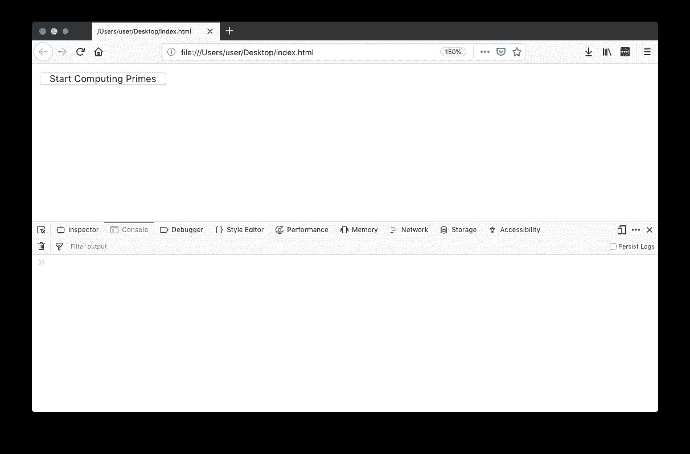
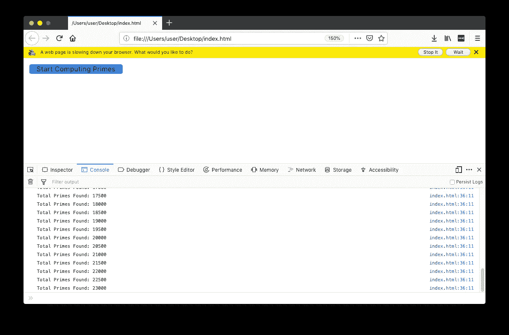
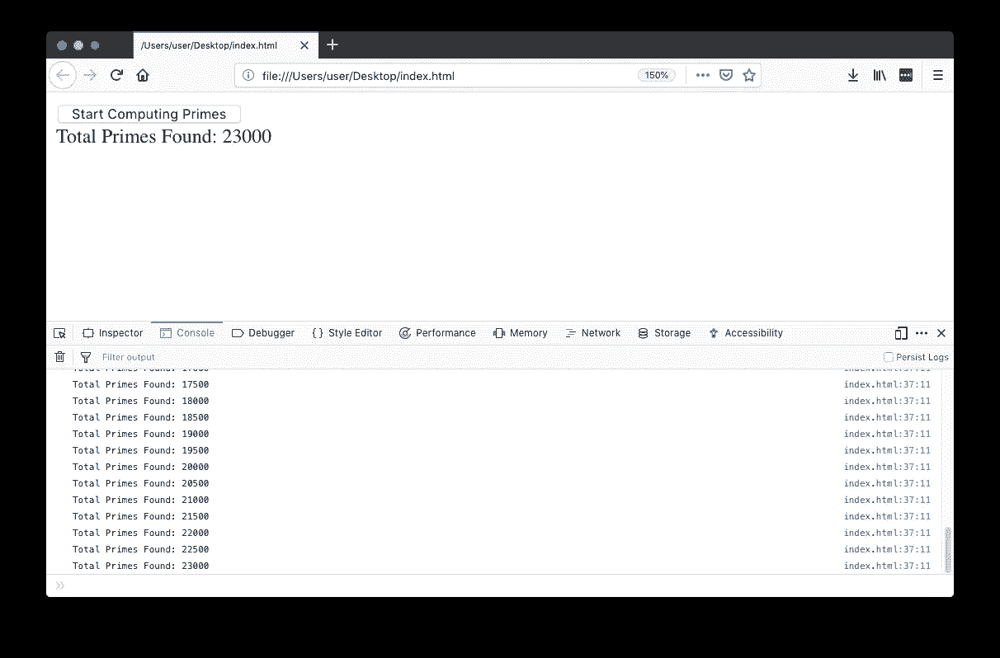
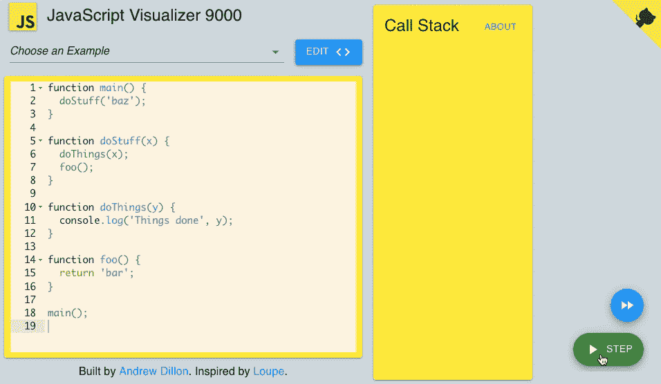
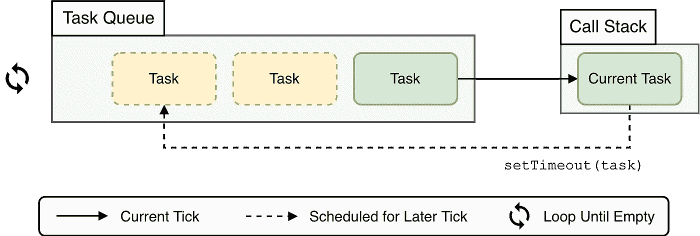
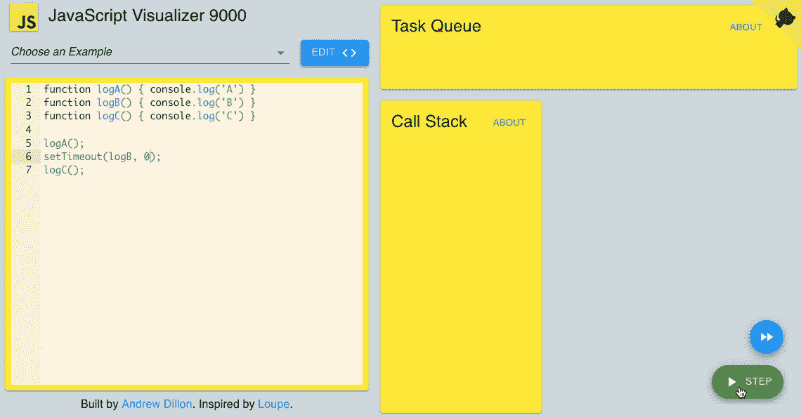
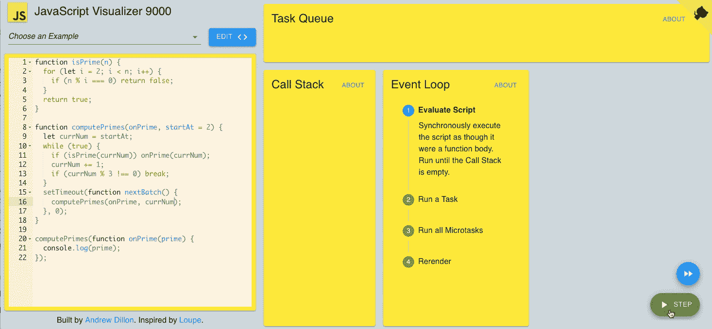

# JavaScript 执行模型

> 原文：<https://javascript.plainenglish.io/the-javascript-execution-model-part-1-448e62628f23?source=collection_archive---------3----------------------->

## 第 1 部分:调用堆栈，事件循环

*这篇文章中的动画可视化是用*[*https://jsv 9000 . app*](https://jsv9000.app/.)*创建的——一个旨在帮助你可视化和了解事件循环的工具。*

我写 JavaScript 已经有一段时间了。我用 Express 编写过 web 服务，用 React 编写过 web 应用，用 React Native 编写过移动应用，我还编写过库，比如`[pdf-lib](https://github.com/Hopding/pdf-lib)`。

最近，在开发`pdf-lib`时，我发现自己在处理一些长时间运行的同步代码。我对这段代码进行了优化，以尽可能快地运行。然而，当这段代码运行时，它有时会冻结网页，并导致浏览器警告用户某个脚本降低了速度。

我意识到这个功能需要以某种方式分解。它需要是异步的，以便允许其他工作在它完成之前完成。但是函数本身并没有做任何基本的异步工作(它没有发出任何 HTTP 请求或者执行任何文件 I/O)。

如何将一个基本同步的任务变成异步的呢？我不知道该怎么做。为了弄清楚这一点，我花了一些时间学习复杂的`setTimeout()`、`Promise.resolve()`、事件循环以及 JavaScript 的[执行模型](https://en.wikipedia.org/wiki/Execution_model)。

我写这一系列帖子的目的是分享我学到的东西。通读之后，我希望你能对 JavaScript 的执行模型有更好的理解，以及 async JavaScript 实际上是如何工作的。

# 一个工作实例

让我们先写一些代码来重现我在制作`pdf-lib`时遇到的问题。我们大多数人都熟悉[素数序列](https://en.wikipedia.org/wiki/Prime_number)，所以让我们写一个函数来计算它:

```
**function** isPrime(n) {
  **for** (**let** i = 2; i < n; i++) {
    **if** (n % i === 0) **return** **false**;
  }
  **return** **true**;
}

**function** computePrimes(onPrime, startAt = 2) {
  **let** currNum = startAt;
  **while** (**true**) {
    **if** (isPrime(currNum)) onPrime(currNum);
    currNum += 1;
  }
}
```

*   `isPrime()`功能非常简单。如果一个数是质数，它返回`true`，如果不是，则返回`false`。
*   `computePrimes()`功能无限期运行。它检查从 1 到无穷大的每个数，看它是否是质数。每当找到一个，它就被传递给`onPrime`回调。

让我们试一试:

```
computePrimes(prime => {
  console.log(prime);
});
*// => 1 2 3 5 7 11 13 ...*
```

(如果您在节点 REPL 中运行它，您必须按 ctrl-c 来停止它。在浏览器中，您只需关闭选项卡)

记录素数很有趣，但我更希望看到我们计算出了多少个素数，而不是这些值本身。让我们做一个简单的网站来为我们渲染一个现场计数！

```
<!DOCTYPE html>
**<html>**
  **<head><meta** charset="utf-8" **/></head>**

  **<body>**
    **<button** onclick="startComputingPrimes()"**>**Start Computing Primes**</button>**
    **<div** id="primes-count"**></div>**
  **</body>**

  **<script** type="text/javascript"**>**
    */* Insert isPrime() and computePrimes() here... */*

    **let** primesCount = 0;
    **const** primesCountDiv = document.getElementById('primes-count');

    **function** startComputingPrimes() {
      computePrimes((prime) => {
        primesCount += 1;
        **if** (primesCount % 500 === 0) {
          **const** msg = `Total Primes Found: ${primesCount}`;
          primesCountDiv.textContent = msg;
          console.log(msg);
        }
      });
    }
  **</script>**
**</html>**
```

当您在浏览器中载入此网页时，您会看到以下内容:



*Webpage after first loading*

让我们点击“开始计算素数”按钮，看看会发生什么:



*Webpage after running for a short time*

哦，那太糟糕了。我们没有实时的“找到的素数总数”计数。相反，浏览器警告我们网页运行缓慢，并给我们机会停止它。

我们的代码肯定在运行，你可以从它打印的日志中看到这一点。这意味着我们的`primesCountDiv.textContent = msg;`行也在执行。那么为什么我们的`primes-count` div 不更新呢？而且不仅是我们的 div 卡住了，按钮还呈现按下的状态！由于某种原因，网页似乎没有重新呈现…

让我们看看能否用魔法解决这个问题🎩🐇✨.把`computePrimes()`函数改写成这样:

```
**function** computePrimes(onPrime, startAt = 2) {
  **let** currNum = startAt;
  **while** (**true**) {
    **if** (isPrime(currNum)) onPrime(currNum);
    currNum += 1;
    **if** (currNum % 500 === 0) **break**;
  }
  setTimeout(() => computePrimes(onPrime, currNum), 0); *// Magic‽*
}
```

现在，当我们点击“开始计算质数”按钮时会发生什么？



*Webpage after running with magic*

有用！但是为什么…？要回答这个问题，我们需要说说 JavaScript 的**调用栈**和**事件循环**。让我们从调用堆栈开始。

# 调用堆栈

调用栈是 JavaScript 语言的基础部分。它是一个记录保存结构，允许我们执行函数调用。每个函数调用都被表示为调用堆栈上的一个**帧**。这就是 JavaScript 引擎跟踪哪些函数被调用以及调用顺序的方式。JS 引擎使用这些信息来确保在函数返回后，执行在正确的位置重新开始。

当 JavaScript 程序第一次开始执行时，调用堆栈是空的。当进行第一次函数调用时，一个新的框架被推到调用堆栈的顶部。当该函数返回时，它的框架被弹出调用堆栈。让我们看一个例子。

考虑下面的代码片段:

```
function main() {
  doStuff('baz');
}

**function** doStuff(x) {
  doThings(x);
  foo();
}

**function** doThings(y) {
  console.log('Things done', y);
}

**function** foo() {
  **return** 'bar';
}

main();
```

让我们看看在执行上述代码片段时调用堆栈中进行的每个转换:



*Visualization of the Call Stack. Created with* [*https://jsv9000.app/*](https://jsv9000.app/)

这种调用堆栈的可视化对我们大多数人来说都很熟悉。我们都对这里发生的事情有直观的感觉。然而，调用栈只是 JavaScript 执行模型的一部分。它没有讲述全部的故事。考虑以下片段:

```
function logA() { console.log('A') }
**function** logB() { console.log('B') }
**function** logC() { console.log('C') }

logA();
setTimeout(logB, 100);
logC();

*// => A C B*
```

`B`怎么会是最后登录的？调用堆栈总是按顺序工作。但是我们在这里看到的是无序发生的。

`setTimeout`负责我们看到的无序日志记录。我们所做的是告诉 JavaScript 在 100 毫秒内调用`logB`。因为计算机速度很快，所以在 100 毫秒之前，`logC()`就会被调用。

但是如果我们通过了 0 毫秒的超时呢？

```
logA();
setTimeout(logB, 0);
logC();
*// => A C B*
```

有意思！同样的事情还是会发生。要理解为什么，我们需要理解`setTimeout`在幕后实际上在做什么。显然，这不是你的典型功能。它的行为不能仅用调用堆栈来解释。为了解释`setTimeout`是如何工作的，我们需要谈谈**事件循环**。

# 事件循环

如果调用堆栈跟踪现在正在执行的函数，那么事件循环跟踪将来将要执行的函数。术语**事件循环**指的是两件事:

*   **任务队列**，任务的 FIFO 队列。
*   处理任务队列中任务的循环算法。

**任务**是同步代码块。你可以把它们想象成`Function` 物体。

事件循环通过连续循环任务队列并逐个处理它包含的任务来工作。事件循环的一次迭代称为**滴答**。

```
while (EventLoop.waitForTask()) {
  EventLoop.processNextTask();
}
```

为了处理一个任务，事件循环调用与之相关的`Function`。当任务运行时，它对调用堆栈具有独占访问权。事件循环等待处理下一个任务，直到当前任务完成，并且调用堆栈为空。

当任务正在运行时，它可以将其他任务排入队列，以便在事件循环的后续节拍中进行处理。有几种方法可以做到这一点，其中最简单的是`setTimeout(taskFn, 0)`。任务也可以来自外部资源，如 DOM 和网络事件。



*The JavaScript Event Loop*

让我们用调用堆栈和任务队列来可视化我们的最后一个代码片段:



*Visualization of the Call Stack. Created with* [*https://jsv9000.app/*](https://jsv9000.app/)

# 一次一个事件

JavaScript 只有一个调用栈。因此，事件循环一次只允许处理一个任务。这形成了一个相对简单的执行模型，避免了 JavaScript 的大量并发问题。

考虑[重入](https://en.wikipedia.org/wiki/Reentrancy_(computing))，维基百科定义如下:

> …如果一个计算机程序或子例程可以在执行过程中被中断，然后在其前一次调用完成之前被安全地再次调用(“重新进入”)，则该程序或子例程称为可重入的。中断可能是由内部动作(如跳转或调用)或外部动作(如中断或信号)引起的。一旦重入的调用完成，先前的调用将恢复正确的执行。

JavaScript 程序员不必担心让他们的函数可重入，因为它们永远不会被中断！JS 函数总是运行到完成。

然而，这个简单的执行模型并不是没有风险的。

假设一个“流氓”任务进入了调用堆栈。这个流氓任务永远不会结束运行，并无限期地占用调用堆栈。如果发生这种情况，流氓任务将阻止所有其他任务被处理。这意味着所有其他工作都将停止，阻碍关键任务，如重新渲染！

因此，web 浏览器会监控任务在调用堆栈上花费的时间。如果任务需要很长时间才能完成，浏览器会提醒用户并给他们“停止它”的选项，即从调用堆栈中删除任务并允许处理其他事件。

# 我们的魔法是如何运作的

让我们回到我们的例子。在我们添加魔法之前，我们的代码会导致网页冻结。过了一会儿，浏览器给了我们停止它的选项。这是因为我们的`computePrimes()`函数出了问题。在它被放入调用堆栈后，它就再也没有完成运行。它阻塞了调用堆栈并阻止处理呈现任务。

我们可以通过添加一些魔法来解决这个问题。当然，这并不是*真正的*魔法。现在我们已经讨论了调用堆栈和事件循环，我们可以理解它实际上是如何工作的。

我们从一个无限长的任务开始。我们的魔法将它分解成一系列短时间运行的任务。每个任务将计算 500 个素数，然后让一个新任务排队来计算接下来的 500 个素数(使用`setTimeout(computePrimes, 0))`)。这允许 JS 引擎处理在素数计算之间排队的其他任务。

# 没有魔法


*Visualization of Naive Primes Implementation. Created with* [*https://jsv9000.app/*](https://jsv9000.app/)

注意事件循环是如何一直停留在脚本评估步骤的。无论脚本运行多长时间，都不会移动到后续步骤重新渲染。

# 用魔法



*Visualization of Primes with Tasks Implementation. Created with* [*https://jsv9000.app/*](https://jsv9000.app/)

注意事件循环是如何通过它的每个阶段的。在检查了三个数字是否是质数之后，一个新的任务被加入队列，事件循环能够允许重新呈现。

# 结论

JavaScript 是一种单线程、非阻塞、异步编程语言。作为 JavaScript 开发人员，我们每天都要处理这些语言特性。我们倾向于对如何编写和使用异步 JavaScript 有一个直观的理解。

然而，对于我们中的许多人来说，这种直观的理解并没有得到对 JavaScript 的执行模型以及它如何在幕后工作的深刻理解的支持。这是不幸的，因为它会导致在不应该关心的事情上浪费精力(例如，使函数可重入)。它还会妨碍我们理解如何解决某些性能问题(例如，长时间运行的同步函数)。

我希望这篇文章能帮助你更好地理解 JavaScript 的执行模型！请考虑阅读本系列的[第二篇文章](https://andrewjdillon.medium.com/the-javascript-execution-model-part-2-467c7b9b42fa)，了解承诺是如何融入画面的。

【2019 年 2 月写了这篇文章。原来这里贴的是[](https://qdivision.io/javascript/)**。**

****这篇文章关注的是调用栈和事件循环。*** [***第二部分***](https://andrewjdillon.medium.com/the-javascript-execution-model-part-2-467c7b9b42fa) ***以此为基础，讨论承诺如何融入画面。****

## *脚注*

*[1]:这并不完全正确。例如，生成器和递归函数可以在其初始调用完成之前再次输入。然而，这不是运行时强加给开发人员的并发问题。所以这个场景并不代表开发人员通常关心的可重入性。*

## *额外阅读和观看*

*   *[https://www.youtube.com/watch?v=8aGhZQkoFbQ](https://www.youtube.com/watch?v=8aGhZQkoFbQ)*
*   *[https://blog . rising stack . com/writing-a-JavaScript-framework-execution-timing-beyond-settimeout/](https://blog.risingstack.com/writing-a-javascript-framework-execution-timing-beyond-settimeout/)*
*   *[https://jakearchibald . com/2015/tasks-micro tasks-queues-and-schedules/](https://jakearchibald.com/2015/tasks-microtasks-queues-and-schedules/)*
*   *[https://developer . Mozilla . org/en-US/docs/Web/JavaScript/event loop](https://developer.mozilla.org/en-US/docs/Web/JavaScript/EventLoop)*
*   *[https://blog . bitsrc . io/microtask-and-macro task-a-hands-on-approach-5d 77050 e 2168](https://blog.bitsrc.io/microtask-and-macrotask-a-hands-on-approach-5d77050e2168)*
*   *[https://developer . Mozilla . org/en-US/docs/Tools/Performance/Scenarios/Intensive _ JavaScript](https://developer.mozilla.org/en-US/docs/Tools/Performance/Scenarios/Intensive_JavaScript)*

## *主要来源*

*   *[JavaScript 语言规范](https://www.ecma-international.org/ecma-262/9.0/index.html)*
*   *[HTML 脚本规范](https://www.w3.org/TR/html52/webappapis.html)*

## *二手来源*

*   *[https://nodejs . org/en/docs/guides/event-loop-timers-and-next tick/](https://nodejs.org/en/docs/guides/event-loop-timers-and-nexttick/)*
*   *[https://www . quora . com/Does-JavaScript-in-the-browser-have-the-equivalent-of-process-next tick-or-set immediate-in-node-js-or-do-we-just-have-setTimeout](https://www.quora.com/Does-JavaScript-in-the-browser-have-the-equivalent-of-process-nextTick-or-setImmediate-in-node-js-or-do-we-just-have-setTimeout)*
*   *[https://stack overflow . com/questions/26615966/how-to-make-non-blocking-JavaScript-code](https://stackoverflow.com/questions/26615966/how-to-make-non-blocking-javascript-code)*
*   *【http://latentflip.com/loupe/ *
*   *[https://stack overflow . com/questions/38752620/promise-vs-settimeout](https://stackoverflow.com/questions/38752620/promise-vs-settimeout)*
*   *[https://stack overflow . com/questions/24117267/nodejs-settimeoutfn-0-vs-setimmediate fn](https://stackoverflow.com/questions/24117267/nodejs-settimeoutfn-0-vs-setimmediatefn)*
*   *[https://stack overflow . com/questions/779379/why-is-settimeoutfn-0-有时有用](https://stackoverflow.com/questions/779379/why-is-settimeoutfn-0-sometimes-useful)*
*   *[https://es discuse . org/topic/the-initial ization-steps-for-web-browsers # content-16](https://esdiscuss.org/topic/the-initialization-steps-for-web-browsers#content-16)*
*   *[https://blog . session stack . com/how-JavaScript-works-event-loop-and-the-rise-of-async-programming-5-ways-to-better-coding-with-2f 077 c 4438 b 5](https://blog.sessionstack.com/how-javascript-works-event-loop-and-the-rise-of-async-programming-5-ways-to-better-coding-with-2f077c4438b5)*
*   *[https://blog . session stack . com/how-JavaScript-works-the-building-blocks-of-web-workers-5-cases-when-you-should-use-them-a547c 0757 f6a](https://blog.sessionstack.com/how-javascript-works-the-building-blocks-of-web-workers-5-cases-when-you-should-use-them-a547c0757f6a)*
*   *[https://stack overflow . com/questions/2734025/is-JavaScript-guaranteed-to-be-single-threaded/2734311 # 2734311](https://stackoverflow.com/questions/2734025/is-javascript-guaranteed-to-be-single-threaded/2734311#2734311)*
*   *[https://en . m . Wikipedia . org/wiki/Reentrancy _(计算)](https://en.m.wikipedia.org/wiki/Reentrancy_(computing))*
*   *[https://stackoverflow.com/a/19699970](https://stackoverflow.com/a/19699970)*