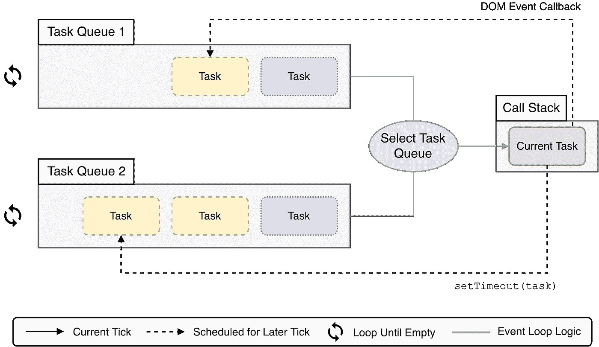
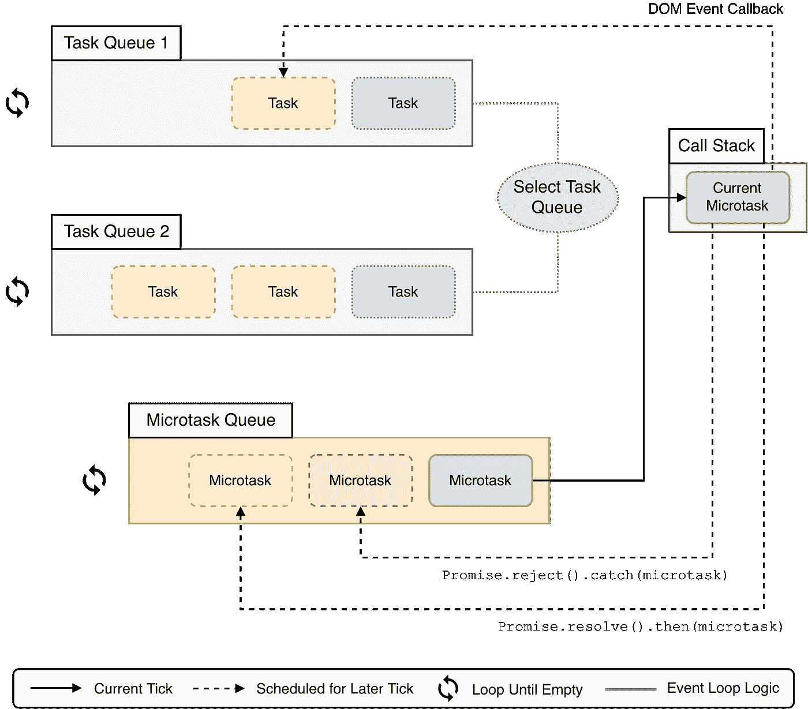
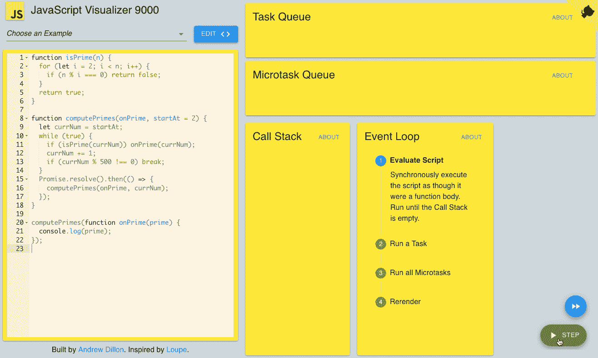

# JavaScript 执行模型

> 原文：<https://javascript.plainenglish.io/the-javascript-execution-model-part-2-467c7b9b42fa?source=collection_archive---------6----------------------->

## *第 2 部分:承诺如何与 JavaScript 的调用堆栈和事件循环交互*

*这篇文章中的动画可视化是用*[*https://jsv 9000 . app*](https://jsv9000.app/.)*创建的——一个旨在帮助你可视化和了解事件循环的工具。*

在上一篇文章中，我们了解了 JavaScript 的调用堆栈和事件循环。我们完成了一个使用`setTimeout()`将一个长时间运行的同步功能分解成一系列短任务的例子。但是我们为什么选择了`setTimeout()`？我们可以用`Promise.resolve()`来代替吗？毕竟，承诺应该是异步的，所有异步 JavaScript 都是通过在事件循环中将任务排队来工作的。

我们试试吧！

# setTimeout()与 Promise.resolve()

我们将使用在第 1 部分中创建的网页来测试我们的理论。

这是我们的`computePrimes()`函数的最终版本:

```
**function** computePrimes(onPrime, startAt = 2) {
  **let** currNum = startAt;
  **while** (**true**) {
    **if** (isPrime(currNum)) onPrime(currNum);
    currNum += 1;
    **if** (currNum % 500 === 0) **break**;
  }
  setTimeout(() => computePrimes(onPrime, currNum), 0); *// Magic‽*
}
```

让我们改写一下，用`Promise.resolve()`代替`setTimeout()`:

```
**function** computePrimes(onPrime, startAt = 2) {
  **let** currNum = startAt;
  **while** (**true**) {
    **if** (isPrime(currNum)) onPrime(currNum);
    currNum += 1;
    **if** (currNum % 500 === 0) **break**;
  }
  *// Let's try Promise.resolve() instead of setTimeout()*
  Promise.resolve().then(() => computePrimes(onPrime, currNum));
}
```

现在，在浏览器中打开网页，点击“开始计算素数”按钮。


*Webpage after running for a short time using Promise.resolve()*

没用！也许`Promise.resolve()`终究不是真正的异步？让我们来看看:

```
**function** logA() { console.log('A'); }
**function** logB() { console.log('B'); }
**function** logC() { console.log('C'); }

logA();
Promise.resolve().then(logB);
logC();

*// => A C B*
```

试着自己运行这个。你会发现 B 总是**最后一个被记录。这与我们在第 1 部分的`setTimeout()`中看到的行为相同。因此，我们已经确认`Promise.resolve()`实际上是异步的。它像`setTimeout()`一样将任务排队。**

但是当我们试图用`Promise.resolve()`而不是`setTimeout()`来分解我们的`computePrimes()`函数时，它不起作用！Why‽

显然，`setTimeout()`和`C`是相似的，但是在一些基本的方式上也是不同的。让我们尝试调整我们之前的脚本，以便更好地处理它们各自的行为方式:

```
**function** logA() { console.log('A') }
**function** logB() { console.log('B') }
**function** logC() { console.log('C') }
**function** logD() { console.log('D') }

logA();
setTimeout(logB, 0);
Promise.resolve().then(logC);
logD();

*// => A D C B*
```

如预期的那样，首先执行两个同步调用(`logA()`和`logD()`)。但是我们用`setTimeout()` ( `logB()`)和`Promise.resolve()` ( `logC()`)进行的两个异步调用被无序记录。由`Promise.resolve()`排队的任务总是在由`setTimeout()`排队的任务之前执行。

这没有意义，因为事件循环是按照 FIFO 顺序处理任务队列中的任务的。由于`setTimeout()`在我们的脚本中首先运行，我们希望它的任务首先被执行。但显然不是。

我们在第 1 部分中获得的关于调用堆栈和事件循环的理解不能解释这里发生了什么。为了理解为什么`setTimeout()`和`Promise.resolve()`表现不同，我们必须谈谈**微任务**。但是在这之前，我们需要充实一下我们对**任务**和**任务队列**的理解。

# 任务

在第 1 部分中，我们将任务队列作为事件循环的一部分进行了介绍。它被表示为一个 FIFO 任务队列。然而，这幅图并不完整。事实上，事件循环包含*几个*任务队列。

JavaScript 语言规范允许 JS 引擎拥有任意多的队列。但是有 [2 个必需的队列](https://www.ecma-international.org/ecma-262/9.0/index.html#table-26):

*   **脚本任务队列** —该队列包含验证和评估 JavaScript 源代码的任务。我们不会在这篇文章中进一步讨论这个队列。
*   **承诺任务队列** —该队列包含在`Promise`被解决或拒绝后排队的任务。例如，您可以使用`Promise.resolve().then(taskFn)`将任务放入这个队列中。

JS 引擎通常也有额外的队列。例如，浏览器可能有第三个队列用于 DOM 事件，第四个队列用于计时器回调。

JavaScript 规范没有规定这些队列被服务的顺序。这由 JavaScript 引擎的设计者来决定。一个引擎可能会选择首先处理它的计时器队列中的所有事件，只有当计时器队列为空时才移动到 DOM 事件队列。或者，引擎可能会交叉两个队列中的事件。

当所有事件队列都为空时，引擎设计者也要决定发生什么。一个引擎可能选择退出(像 NodeJS)或者继续运行并等待某个外部源将一个新事件加入队列(像 web 浏览器)。

让我们用 JS 代码对事件循环的更新版本进行建模:

```
**while** (EventLoop.waitForTask()) {
  **const** taskQueue = EventLoop.selectTaskQueue();
  **if** (taskQueue.hasNextTask()) {
    taskQueue.processNextTask();
  }

  rerender();
}
```

让我们更新第 1 部分中的事件循环图，以包括额外的任务队列:



*The JavaScript Event Loop with Multiple Task Queues*

# 有些东西闻起来有鱼腥味🐟

HTML 规范概述了浏览器中事件循环的 9 步[处理模型:](https://www.w3.org/TR/html52/webappapis.html#event-loops-processing-model)

> 只要事件循环存在，它就必须持续运行以下步骤:
> 
> 1.**在事件循环的任务队列中选择最早的任务。**
> 2。将事件循环的当前运行任务设置为上一步中选择的任务。
> 3 .**运行所选任务。**
> 4。将事件循环当前运行的任务设置回 null。
> 5。从任务队列中删除在步骤 3 中运行的任务。
> 6。执行微量询问检查点。
> 7。**更新渲染。**
> 8。*…省略(此步骤仅适用于网络工作人员)…*
> 9。**返回事件循环的第一步。**

这很重要，因为根据这个模型，浏览器应该在处理任务之间重新渲染。

这里有些不对劲。如果`Promise.resolve()`和`setTimeout()`都将任务排队，那么就我们的`computePrimes()`函数而言，它们应该是等价的:`computePrimes()`应该能够将其主要计算分解成承诺或定时器任务队列中的一系列任务。在运行这些任务之间，事件循环应该允许浏览器重新渲染(步骤 7)。但是我们已经表明，这仅适用于计时器任务队列。基于我们之前的实验，浏览器不会**重新渲染承诺任务队列中的中间处理任务。**

那么是什么呢？

# 故意违反

这种差异是由 HTML 规范所称的**微任务**造成的。但是在 JavaScript 规范中没有提到微任务。那么，他们来自哪里呢？HTML 规范有一个[部分](https://www.w3.org/TR/html52/webappapis.html#integration-with-the-javascript-job-queue)谈到了这一点(请注意，这个摘录中的术语“工作”就是我们一直所说的“任务”):

> JavaScript 规范定义了 JavaScript 作业和作业队列抽象，以便指定承诺操作如何以干净的 JavaScript 执行上下文堆栈和特定顺序执行的特定不变量。然而，在撰写本文时，该规范中对 EnqueueJob 的定义[原文如此]不够灵活，无法与 HTML 集成为一个宿主环境。
> 
> ***注*** *:* 严格来说这不是真的。事实上，通过充分利用算法中许多“实现定义”的部分，有可能按照我们的目的扭曲它。然而，最终的结果是大量混乱的间接和变通方法，它们基本上完全绕过了作业队列基础设施，尽管这种方式在技术上是在实现定义的行为范围内得到认可的。我们不走这条路，而是引入以下故意违反。
> 
> 因此，用户代理必须使用下面的定义来代替 JavaScript 规范中的定义。这些确保了由 JavaScript 规范排队的 promise 作业被正确地集成到用户代理的事件循环中。

说了很多话。HTML 规范基本上是说 JS 规范的一个特定部分使得 HTML 规范很难完成它的工作。因此，HTML 规范没有试图绕过这一部分，而是提出了自己的版本。

有意思！HTML 规范故意违反了 JavaScript 规范。这种违反就是微任务的来源。

由于这种违反，我们在本文前面形成的关于 Promise 任务队列的图片并不真正正确。没有一个主流的 JS 引擎有 Promise 任务队列。相反，他们有一个微任务队列。本应进入承诺任务队列的任务转到这里，被称为**微任务**。

# 微任务

**微任务**很像**任务**。它们是同步的代码块(把它们想象成`Function`对象),在运行时可以独占访问调用堆栈。就像任务一样，微任务能够将额外的微任务或接下来要运行的任务排队。

微任务和任务之间的唯一区别是它们被存储在哪里，以及何时被处理。

*   众所周知，任务存储在任务队列中。但是微任务存储在微任务队列中(这里只有一个)。
*   任务在循环中处理，渲染在任务之间执行。但是在任务完成之后，在重新渲染发生之前，微任务队列被清空。

让我们将微任务队列循环添加到事件循环模型中:

```
while (EventLoop.waitForTask()) {
  **const** taskQueue = EventLoop.selectTaskQueue();
  **if** (taskQueue.hasNextTask()) {
    taskQueue.processNextTask();
  }

  **const** microtaskQueue = EventLoop.microTaskQueue;
  **while** (microtaskQueue.hasNextMicrotask()) {
    microtaskQueue.processNextMicrotask();
  }

  rerender();
}
```

我们还将更新我们的图表:



# 为什么 Promise.resolve()冻结了我们的网页

让我们回到我们的例子。如果我们使用`setTimeout()`分解质数计算，效果会很好。但是如果我们尝试用`Promise.resolve()`来代替，网页又会死机。

发生这种情况是因为`Promise.resolve()`没有将任务入队——它将一个*微任务*入队。正如我们在上面看到的，直到微任务队列为空，事件循环才重新呈现。因此，如果微任务队列从不为空，浏览器将永远不会重新呈现。

这正是导致我们的示例网页冻结的原因！就在`computePrimes()`函数返回之前，它将另一个微任务排入队列，以计算下一批素数。这防止微任务队列被事件循环完全清空。

`setTimeout()`运行良好的原因是因为它将任务排队，而不是微任务。如上所述，浏览器能够在处理任务之间重新呈现(但不能在微任务之间)。

让我们想象一下这一切。



*Visualization of the Microtask Queue. Created with* [*https://jsv9000.app/*](https://jsv9000.app/)

注意事件循环是如何在运行所有微任务步骤中停滞的。无论脚本运行多长时间，它都不会进入 rerender 步骤。

# 结论

在 ES6 之前，JavaScript 的事件循环模型相对简单，与 HTML 规范配合得很好。但是 ES6 带来了承诺，随之而来的是 JavaScript 事件循环的额外复杂性。JS 规范只是用另一个任务队列来处理承诺。但是 HTML 规范违反了 JS 规范，用一种新的结构处理承诺:微任务队列。这就是今天所有主流 JavaScript 引擎处理承诺的方式。

在 JavaScript 中启动异步操作的两种显而易见的方法是`setTimeout(taskFn, 0)`和`Promise.resolve().then(microtaskFn)`。如果您对 JavaScript 及其事件循环只有基本的了解，这些方法可能看起来是等效的。但实际上，由于微任务，它们在一些重要方面的操作是不同的。

我希望这篇文章能帮助你更好地理解承诺是如何与 JavaScript 的执行模型交互的。感谢阅读！

【2019 年 2 月写了这篇文章。原来这里贴的是[](https://qdivision.io/javascript-settimeout-an-in-depth-look-part-2/)**。**

****这篇文章建立在*** [***第一部分***](https://andrewjdillon.medium.com/the-javascript-execution-model-part-1-448e62628f23) ***的基础上，讨论了承诺如何与 JavaScript 的调用堆栈和事件循环交互。****

## *脚注*

*[1]:如果我们只关心 JavaScript 规范要说什么，那么*就是*正确的。但是所有主要的 JavaScript 引擎都是为浏览器开发的(包括 NodeJS 使用的 V8 引擎)。因此，这些 JS 引擎必须符合 JS 和 HTML 规范。因此，实际上，您编写的任何 JS 代码都将在使用微任务的环境中运行。*

## *额外阅读和观看*

*   *https://www.youtube.com/watch?v=8aGhZQkoFbQ*
*   *[https://blog . rising stack . com/writing-a-JavaScript-framework-execution-timing-beyond-settimeout/](https://blog.risingstack.com/writing-a-javascript-framework-execution-timing-beyond-settimeout/)*
*   *[https://jakearchibald . com/2015/tasks-micro tasks-queues-and-schedules/](https://jakearchibald.com/2015/tasks-microtasks-queues-and-schedules/)*
*   *[https://developer . Mozilla . org/en-US/docs/Web/JavaScript/event loop](https://developer.mozilla.org/en-US/docs/Web/JavaScript/EventLoop)*
*   *[https://blog . bitsrc . io/microtask-and-macro task-a-hands-on-approach-5d 77050 e 2168](https://blog.bitsrc.io/microtask-and-macrotask-a-hands-on-approach-5d77050e2168)*
*   *[https://developer . Mozilla . org/en-US/docs/Tools/Performance/Scenarios/Intensive _ JavaScript](https://developer.mozilla.org/en-US/docs/Tools/Performance/Scenarios/Intensive_JavaScript)*

## *主要来源*

*   *[JavaScript 语言规范](https://www.ecma-international.org/ecma-262/9.0/index.html)*
*   *[HTML 脚本规范](https://www.w3.org/TR/html52/webappapis.html)*

## *二手来源*

*   *[https://nodejs . org/en/docs/guides/event-loop-timers-and-next tick/](https://nodejs.org/en/docs/guides/event-loop-timers-and-nexttick/)*
*   *[https://www . quora . com/Does-JavaScript-in-the-browser-have-the-equivalent-of-process-next tick-or-set immediate-in-node-js-or-do-we-just-have-setTimeout](https://www.quora.com/Does-JavaScript-in-the-browser-have-the-equivalent-of-process-nextTick-or-setImmediate-in-node-js-or-do-we-just-have-setTimeout)*
*   *[https://stack overflow . com/questions/26615966/how-to-make-non-blocking-JavaScript-code](https://stackoverflow.com/questions/26615966/how-to-make-non-blocking-javascript-code)*
*   *[http://latentflip.com/loupe/](http://latentflip.com/loupe/)*
*   *[https://stack overflow . com/questions/38752620/promise-vs-settimeout](https://stackoverflow.com/questions/38752620/promise-vs-settimeout)*
*   *[https://stack overflow . com/questions/24117267/nodejs-settimeoutfn-0-vs-setimmediate fn](https://stackoverflow.com/questions/24117267/nodejs-settimeoutfn-0-vs-setimmediatefn)*
*   *[https://stack overflow . com/questions/779379/why-is-settimeoutfn-0-有时有用](https://stackoverflow.com/questions/779379/why-is-settimeoutfn-0-sometimes-useful)*
*   *[https://es discuse . org/topic/the-initial ization-steps-for-web-browsers # content-16](https://esdiscuss.org/topic/the-initialization-steps-for-web-browsers#content-16)*
*   *[https://blog . session stack . com/how-JavaScript-works-event-loop-and-the-rise-of-async-programming-5-ways-to-better-coding-with-2f 077 c 4438 b 5](https://blog.sessionstack.com/how-javascript-works-event-loop-and-the-rise-of-async-programming-5-ways-to-better-coding-with-2f077c4438b5)*
*   *[https://blog . session stack . com/how-JavaScript-works-the-building-blocks-of-web-workers-5-cases-when-you-should-use-them-a547c 0757 f6a](https://blog.sessionstack.com/how-javascript-works-the-building-blocks-of-web-workers-5-cases-when-you-should-use-them-a547c0757f6a)*
*   *[https://stack overflow . com/questions/2734025/is-JavaScript-guaranteed-to-be-single-threaded/2734311 # 2734311](https://stackoverflow.com/questions/2734025/is-javascript-guaranteed-to-be-single-threaded/2734311#2734311)*
*   *[https://en . m . Wikipedia . org/wiki/Reentrancy _(计算)](https://en.m.wikipedia.org/wiki/Reentrancy_(computing))*
*   *[https://stackoverflow.com/a/19699970](https://stackoverflow.com/a/19699970)*