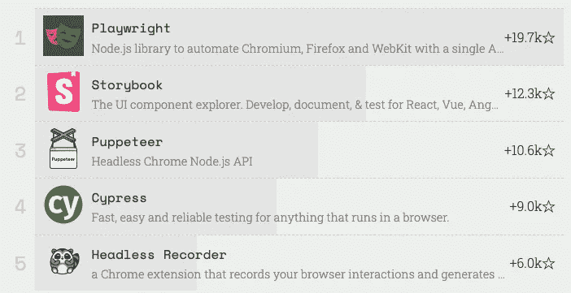
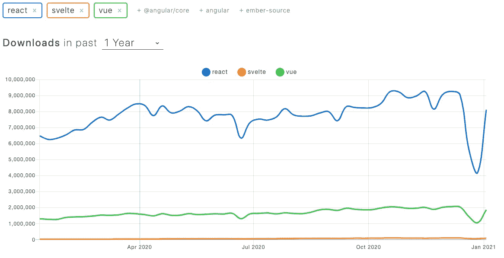
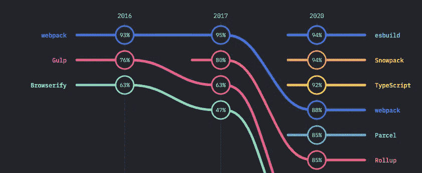
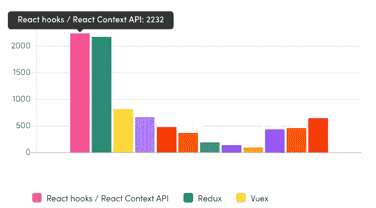

# 2021 年的 JavaScript 前景

> 原文：<https://javascript.plainenglish.io/the-javascript-landscape-in-2021-573d5e7a43c6?source=collection_archive---------3----------------------->

Photo by [Sergey Pesterev](https://unsplash.com/@sickle?utm_source=unsplash&utm_medium=referral&utm_content=creditCopyText) on [Unsplash](https://unsplash.com/s/photos/landscape?utm_source=unsplash&utm_medium=referral&utm_content=creditCopyText)

在 web 开发中，我们的世界变化很快，但是我们能确定 2021 年将会发生什么呢？通过仔细研究 2020 年开发者调查的数据，我强调了我认为 JavaScript 的大故事将会是什么。

在进入细节之前，先简要说明一下 JavaScript 调查。遗憾的是，下一版优秀的[前端工具调查](https://ashleynolan.co.uk/blog/frontend-tooling-survey-2019-results)将在一段时间内不会发布，这使得寻找趋势变得更加困难。虽然我们可能会失去一个好的调查，但一个新的调查已经取代了它:[前端状态](https://tsh.io/state-of-frontend/)。虽然没有以前的年度数据来帮助我们了解趋势，但它是由来自世界各地的多达 4500 名开发人员填写的，所以它绝对是一个宝贵的资源。

让我们深入探讨一下我从数据中获得的见解。

# 包管理器

[去年](https://medium.com/engineered-publicis-sapient/the-javascript-landscape-in-2020-b8e5898b847e)我建议我们关注 [PNPM](https://pnpm.js.org/) 的崛起，它旨在避免版本冲突，并与 monorepos 配合良好。它有一些热情的拥护者，去年在 Github 上达到了 95000 颗星，所以它显然赢得了开发者的支持。然而，我觉得不太可能在 2021 年的使用上与[竞争，考虑到](https://www.npmtrends.com/yarn-vs-pnpm-vs-npm) [Yarn](https://yarnpkg.com/) 和 [NPM](https://www.npmjs.com/) 在实际项目中的嵌入程度以及两者在发布新功能上投入的精力。其中一些功能是直接针对 PNPM 开发的，特别是[工作区](https://classic.yarnpkg.com/en/docs/workspaces/)。这正好显示了竞争在推动开源软件向前发展中的重要性。

# 测试

2019 年，[赛普拉斯](https://www.cypress.io/)和[木偶师](https://github.com/puppeteer/puppeteer)作为高新晋作品脱颖而出，他们都在 2020 年继续取得成功。然而，微软以[剧作家](https://github.com/microsoft/playwright)的形式带来了一个新的 E2E 测试工具，它似乎凭空出现，仅在 2020 年就获得了不到 2 万颗星。作为世界上最大的软件公司之一，他们有能力广泛推广他们的产品，但这只是该工具受欢迎的部分原因。主要原因是它的特性集和从[木偶师](https://pptr.dev/)的简单迁移路径。

Playright tops the Rising Stars testing frameworks chart despite not having featured at all in 2019

自从纳德拉接任首席执行官以来，微软已经养成了生产流行且强大的开源工具的习惯。 [VSCode 有人](https://2020.stateofjs.com/en-US/other-tools/#text_editors)？

# JavaScript 风格

我去年说过 [TypeScript](https://www.typescriptlang.org/) 已经缓慢但肯定地接管了 JavaScript 世界；这一趋势已经加剧。无数开源项目急切地将它列为受支持的特性。 [Deno](https://deno.land/) 是*2020 年最受瞩目的 Github 项目* [，内置了 Typescript 编译器。](https://risingstars.js.org/2020/en#section-all)

去年[我建议我们关注 PureScript](http://www.purescript.org/) ，因为人们对它所实施的静态类型*和*函数式编程感兴趣。然而，2020 年的接受度并没有那么高，Github 上只有 641 个新星，兴趣下降了 3%。看着 TypeScript 与其竞争对手之间[巨大的使用差距](https://www.npmtrends.com/typescript-vs-elm-vs-coffee-script-vs-purescript-vs-reason)，感觉语言战争已经结束，微软的产品取得了胜利。任何新来的人在社区里经过多年的讨论和语言超载的环境后都很难引起我们的注意。

看到社区在这一领域达成共识，我感到很欣慰。现在，我们避免不同超集的干扰，更多地关注语言本身。

# UI 框架

[Vue](https://vuejs.org/) 是 2019 年最受瞩目的框架，这在当时是一个大新闻，并且传递了一个明确的信息:开发者*热爱*它。[2020 年](https://risingstars.js.org/2020/en#section-framework)也是如此。然而，当我们看到 [NPM 下载](https://www.npmtrends.com/react-vs-vue-vs-svelte)的时候[反应](https://reactjs.org/)市场份额仍然巨大。

React downloads in the past year

还有另外两个有用的指标:GitHub 中的标签和广告工作。目前，GitHub 上有超过 80k 条标记为“React”的回复，而标记为“Vue”的回复只有 25k 条。看看就业市场，去年 5 月，Career Karma 报告称，Indeed.com 为美国的 React 开发人员提供了 10，005 份工作，而 Vue 只有 1025 份工作。React 无处不在，正在经受激烈的竞争。

不提到[苗条](https://svelte.dev/)和[棱角](https://angularjs.org/)我就不能结束这一节。Angular 仍然非常受欢迎——它去年获得了 13300 万颗新星，在 NPM 上每周有近 250 万次下载。鉴于 React 的统治地位，这可能会让一些人感到惊讶，但这些数据值得认可。苗条，相比之下很年轻，但是[在 JS](https://2020.stateofjs.com/en-US/technologies/front-end-frameworks/) 的满意度排行榜上名列榜首。然而，由于 React 和 Vue devs 的学习曲线陡峭，我预计它只会在 2021 年取得适度的收益。

# 后端

现在这是一个复杂的领域，静态站点生成框架与 API 生产框架并存。如果我们稍微细分一下，看看纯服务器框架，我们可以看到 [Express](https://expressjs.com/) 仍然拥有 51.5k 的星级。然而， [Nest](https://nestjs.com/) 在 2020 年以惊人的 10.3k *new* stars 出现，使其总数达到 33.6k。开发者已经喜欢上它，因为他们被它自以为是的方法所吸引，这可以加快开发速度，简化维护。哦，我有没有提到它使用打字稿？

看看全栈框架的激增，这一领域正在进行一场非常重要的人心争夺战，因为它们对架构、性能和工作方式有着如此大的影响。两个基于 React 的框架， [NextJS](https://nextjs.org/) 和 [Gatsby](https://www.gatsbyjs.com/) ，在使用方面仍然比它们的 VueJS 同行更受欢迎，但这只是证实了我们对 UI 框架生态系统的了解。真正值得注意的是盖茨比的满意度下降了多少。坊间证据表明，它有一个令人困惑的 DX，尽管网上有大量证据反驳这种说法。随着 NextJS 由 [Vercel](https://vercel.com/) 开发，并为其增加了静态站点生成等功能，我只能看到它今年会越来越强大。

# 构建工具

这个领域现在有一些值得注意的竞争。尽管人们对 Webpack 的 DevX 有所抱怨，但它在很长一段时间内占据着至高无上的地位，并且在主要公司中[仍然拥有最高的使用率](https://www.npmtrends.com/webpack-vs-gulp-vs-rollup-vs-parcel)。去年，我们看到[罗马](https://github.com/rome/tools)挑战这一领域，今年我们有 [esbuild](https://github.com/evanw/esbuild) 、 [Snowpack](https://www.snowpack.dev/) 和 Vite 登上[新星排行榜](https://risingstars.js.org/2020/en#section-build)。Esbuild 的职责很简单:加快构建时间。这对于许多工程团队来说显然非常有价值，并解释了向它发展的原因。

esbuild and Snowpack are joint top of the State of JS 2020 build tools chart

虽然 GitHub 星级是一个指标，但 Snowpack 在 JS 调查的状态中高居*兴趣*图表的榜首，但更重要的是，它在 [*满意度*图表](https://2020.stateofjs.com/en-US/technologies/build-tools/)中并列第一。虽然使用率可能仍然很低，但我觉得它的时代即将到来。Snowpack 和 Vite 的流行传达了一个重要的信息:原生 ES 模块正在被社区认真对待。这是一个很大的话题，因为它对构建过程、缓存和开发/生产模块对称性有影响。

# 状态管理

没有状态管理器，什么样的 UI 框架是完整的？抛开复杂性与未来验证的争论，这个领域特别有趣，因为 Redux 正受到来自两个角度的挑战:来自 React 本身和独立的新来者。

我从个人经验中知道 React 的钩子和上下文 API 有多强大，但它们确实有其局限性。无论哪种方式，它们肯定是 React 开发者的一大热门，几乎一半的前端参与者都表示他们在使用它们。

State of Front End 2020 Survey State Management Category

# 结论

在去年的文章中，我探讨了*整合*的主题。在多年分离模式、框架和库之后，感觉我们正在向模式和实践看齐。虽然我认为这一趋势将在 2020 年继续，但很明显，JavaScript 的流行已经导致了以前由其他语言独占的市场中工具的激增；越来越多的 E2E 测试和机器学习工具说明了这一点。

从 2020 年的数据中出现的关键主题是，大型软件供应商正在定义 JavaScript 的前景。微软的 TypeScript 正在成为行业标准，基于它的项目有更好的成功机会，NestJS 和 NextJS(不要混淆)就是很好的例子。

JAMStack 方法的影响和对速度的需求也是影响因素，静态站点生成器和 ESbuild 之类的工具很快就脱颖而出。

在特性、浏览器支持、运行时和不断扩大的数字范围的快速发展的推动下，JavaScript 的前景一直在扩大。

## *注意事项*

*这篇文章得到了* [*乔治·亚当森*](https://medium.com/u/147be8b16a2f?source=post_page-----573d5e7a43c6--------------------------------) *和乔安妮·巴夏礼*的善意评论