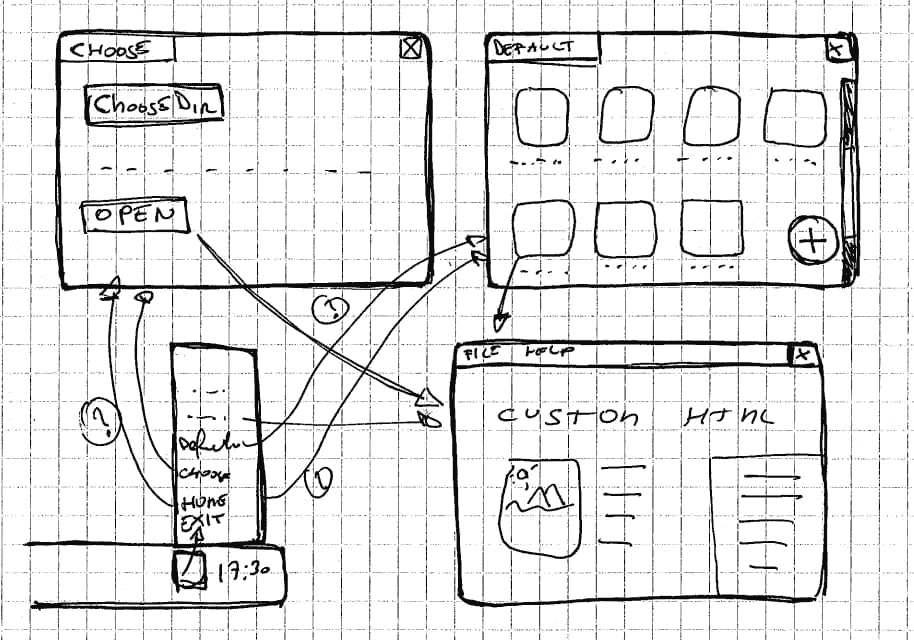
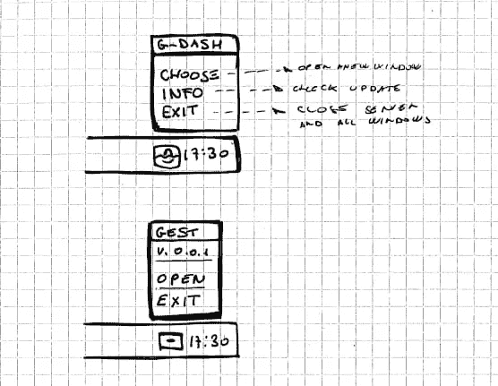
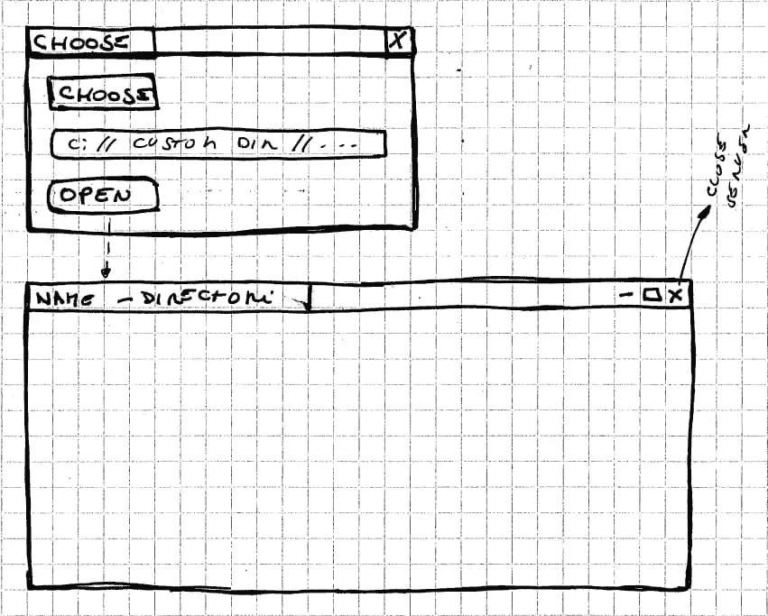
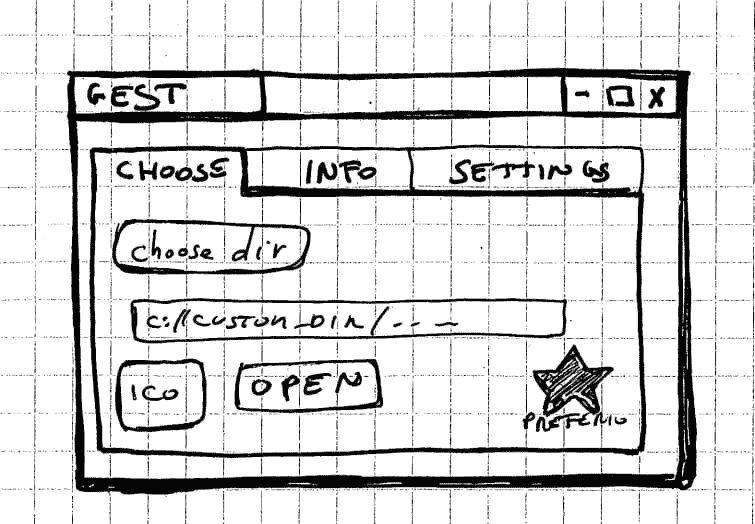
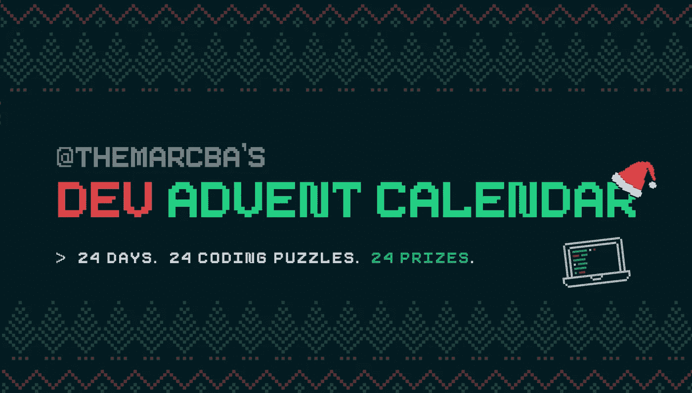
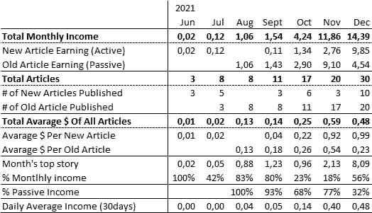
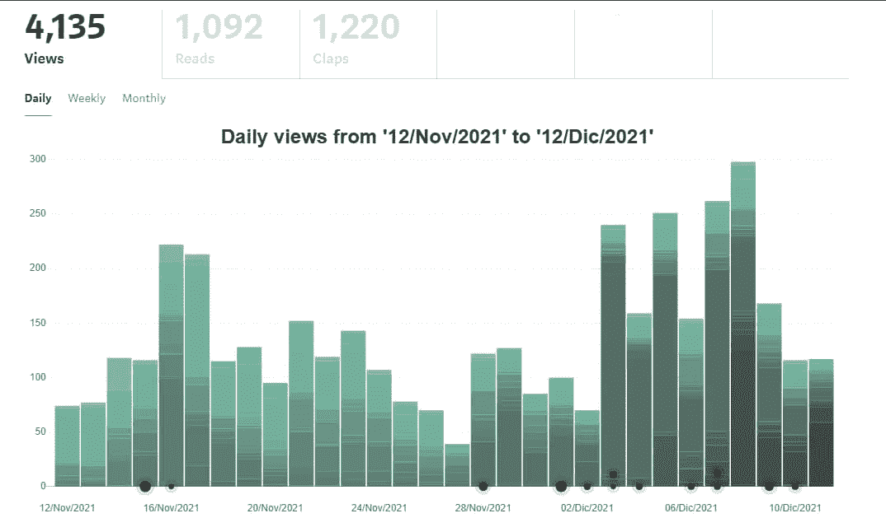

# 一个程序员新手的旅程

> 原文：<https://javascript.plainenglish.io/the-journey-of-a-novice-programmer-82366ec7851a?source=collection_archive---------13----------------------->

Photo by [Markus Winkler](https://unsplash.com/@markuswinkler?utm_source=unsplash&utm_medium=referral&utm_content=creditCopyText) on [Unsplash](https://unsplash.com/s/photos/update?utm_source=unsplash&utm_medium=referral&utm_content=creditCopyText)

自从我给[写了一些关于未来](https://www.patreon.com/posts/56074311)的笔记以来，已经过去 3 个月了。是时候看看进展如何了。也是因为上个月我没有在 Patreon 上发表任何东西，很抱歉。

# 帕特里翁和我

我从这个开始。虽然 Patreon 可能是一个优秀的平台，但它有一个主要的限制:不容易共享代码片段。这对我来说是一个基本的方面。事实上，我所有的帖子都包含代码示例。我暂时没有改变的打算。

为什么？

因为我的文章无非就是我的旅行日记。它们是我的笔记和我的思考。我的发现和我的错误。它们被用来记录我学到的东西，以便将来能够找到它，并与那些发现自己面临同样问题的人分享。

所以我必须决定该怎么做。我认为最好的事情是定期更新我的各种项目。并在我的博客上发布文章的链接(和媒体——但我一会儿会回来)。这样我就可以避免用难以辨认的帖子填充 Patreon。我也可以避免把它变成只有我的博客链接的页面。我也可以用这个空间作为借口来阐述我的项目进展如何，这也是我最喜欢的。我可以谈谈我的困难。

下一个问题是:多久一次？我不知道这个。一个月至少一次。也许两个。

# GEST-DASHBOARD:返回前进

这三个月，我相信还有接下来的三个月，都是以回归为特征的。我开始着手`gest-dashboard`项目，遇到了许多限制。

该项目的想法是创建一个电子应用程序，可以在 PC 上打开文件夹，并像在服务器上一样阅读它们。

为什么？因为我想创建一些可以脱机工作的应用程序。但是我不想要需要高级软件开发知识的东西。

我试着更好地解释自己。我感兴趣的是有一个简单的方法来本地运行保存为 html 文件夹的应用程序。用户启动主程序，然后选择要打开的文件夹，就可以开始使用该应用程序，而无需设置任何本地服务器。

这样我就不必为每一个应用程序都创建一个电子程序。

我很清楚这是一种非常特殊的需要，而且很可能只是一种形式上的练习。但这不是一个简单的问题，对我来说不是。

在处理这一切时，我注意到了自己的缺点。缺乏学术训练造成的缺点。换句话说，我缺乏基础。因此，我必须努力工作来建造它们。

# 理解电子如何工作

Photo by [Jr Korpa](https://unsplash.com/@jrkorpa?utm_source=medium&utm_medium=referral) on [Unsplash](https://unsplash.com?utm_source=medium&utm_medium=referral)

我的大部分空闲时间都花在了弄清楚如何用 electronic 构建应用程序上。并且花同样多的时间去理解如何更新和测试它们。我在一些文章中追踪了所有这些。

 [## 如何使用 ipcMain 和 ipcRenderer

### 在玩电子、打字稿和电子的时候，我遇到了一些问题。在我的模板的第一个版本中(…

el3um4s.medium.com](https://el3um4s.medium.com/electron-and-typescript-how-to-use-ipcmain-and-ipcrenderer-english-4ebd4addf8e5)  [## 如何测试电子应用程序

### 探索剧作家工具

better 编程. pub](https://betterprogramming.pub/how-to-test-electron-apps-1e8eb0078d7b)  [## 带细长尾翼的电子无缝标题栏

### 经过一些测试，我决定不使用默认情况下电子创建的窗口。我决定创造我自己的…

el3um4s.medium.com](https://el3um4s.medium.com/electron-seamless-titlebar-with-svelte-and-tailwind-bd4d53d81c67) 

这些文章不足以理解如何用电子创建一个 app。它们展示了我不得不面对的一些问题。我写过其他的，以后也打算多写这个话题。

# 如何创建 Web 组件

Photo by [Pankaj Patel](https://unsplash.com/@pankajpatel?utm_source=medium&utm_medium=referral) on [Unsplash](https://unsplash.com?utm_source=medium&utm_medium=referral)

但是在这一点上，我遇到了另外两个缺点。首先，我对样式表(又名 CSS)的了解很少。其次，我缺乏构建 web 应用程序的现代框架的知识。

在做了一些测试后，我说服自己尝试 [TailwindCSS](https://tailwindcss.com/) 。我讨厌承认它，但是它是一股新鲜空气。

尤其是因为我决定将顺风和我最近的另一个发现结合起来:[苗条](https://svelte.dev/):

> *Svelte 是一种构建用户界面的全新方法。尽管 React 和 Vue 等传统框架在浏览器中完成大部分工作，但 Svelte 将这些工作转变为编译步骤，在构建应用程序时进行。*

显然，我写了一个指南，提醒未来的我要采取的各种步骤:

 [## 顺风 CSS &苗条

### 正如我几天前所说的，我决定专注于一些更复杂的项目。第一个是“GEST-Dashboard”。够糟的…

el3um4s.medium.com](https://el3um4s.medium.com/tailwind-css-svelte-315075404c04) 

我想了解更多关于如何创建一个苗条的组件:

 [## 如何创建和发布苗条的组件

### 在我的上一篇文章中，我主要谈到了如何整合苗条，顺风，笑话和如何使用 NPM。为什么都…

el3um4s.medium.com](https://el3um4s.medium.com/how-to-create-and-publish-svelte-components-e770f1e94435) 

在博客和媒体上还有其他关于这个话题的文章。

# 如何记录代码

Photo by [Kaleidico](https://unsplash.com/@kaleidico?utm_source=medium&utm_medium=referral) on [Unsplash](https://unsplash.com?utm_source=medium&utm_medium=referral)

下一个问题是一个经典问题:我写了很多代码，有时并不完全清楚。有时候，代码变得错综复杂，难以阅读、修改、修复和改进。我从多个方面着手解决这个难题。我尽量让代码保持干净，继续折射代码本身的函数、方法、变量和结构。

然后我发现了持续测试的重要性。不仅作为验证代码正确性的工具，而且作为理解其工作原理的工具。毕竟，作为一个业余程序员，这些测试被证明是最好的文档。一方面，它们显示了应用程序的给定部分是如何工作的，另一方面，它显示了预期的结果。好的测试也用来显示所有的边界情况，也许是那些你永远不会想到的，但当它们出现时会产生无尽的问题。

但是还有一个方面是如何向其他人记录一个模块或组件的操作。解决这个问题花了我很长时间。甚至可能太久了。

我没有写过太多关于记录代码的文章，只是一篇文章。然而，我计划在某个时候写第二部分:

 [## 如何记录纤细的组件

### 如何创建编写自己的文档的组件

better 编程. pub](https://betterprogramming.pub/how-to-document-svelte-components-ab504661a6fc) 

创建这个组件迫使我更深入地了解苗条是如何工作的。最终这是一个恶性循环。

# 开发降临日历

在空闲时间编程有时会让人精疲力尽，尤其是当你觉得自己没有进步的时候。这对我来说是一种重要的激情，但有时很难找到继续下去的动力。随着时间的推移，我明白了处理这种情况的最好方法是给我强加一些东西。

纯属偶然，我发现了这个项目:从 12 月 1 日到圣诞节，每天解决一个不同的难题。提出的问题很简单，但它们迫使我深入研究 JavaScript 的一些我一直忽视的方面。我发现了很多有趣的事情。也许他们将是微不足道的，但我不知道他们。

# 中等

Photo by [Jeremy Bezanger](https://unsplash.com/@jeremybezanger?utm_source=medium&utm_medium=referral) on [Unsplash](https://unsplash.com?utm_source=medium&utm_medium=referral)

说到列表，除了基督降临节日历上的列表，还有另外两个列表，我把我的文章放在里面了。显然，它们也都出现在我的博客上，但在我看来，它们似乎更有条理一些。

第一个列表包含我写的关于电子的文章。

第二个是关于[苗条，苗条，部分也是关于尾翼](https://medium.com/@el3um4s/list/svelte-sveltekit-bf5be8834fbf)。

但是为什么我开始在媒体上发表文章呢？出于几个部分矛盾的原因。

首先，因为我发现把我的帖子导入到 Medium 是相当快的。所以尝试花费了我有限的时间。

其次，可以使用各种技术展示我的示例代码。其中，可以通过简单的复制和粘贴来显示保存在 [GitHub Gist](https://gist.github.com/) 上的代码。而且因为我用 GitHub 写博客，嗯，太简单了。

第三个原因和未来有关。我计划重写我博客背后的代码。我还不知道怎么做，但我想更好地区分各个部分。和 Medium 允许您将您的配置文件链接到自定义域。这是我正在考虑但还没有决定的事情。

最后，我很好奇我的文章在金钱方面会有什么表现。现在下结论还为时过早，但还是有一些有趣的方面。然后我喜欢看到浏览量的增长。这是一个虚荣的问题，但是请把它给我。

# 接下来的步骤

Photo by [Lindsay Henwood](https://unsplash.com/@lindsayhenwood?utm_source=medium&utm_medium=referral) on [Unsplash](https://unsplash.com?utm_source=medium&utm_medium=referral)

下一步该怎么做？嗯，首先完成组件的修复，以记录组件。好递归的一句话！

然后，做完这些，我必须回到`gest-dashboard`项目。我想通过研究这个库来做一个测试:[Ashley scirra/serve folder . dev](https://github.com/AshleyScirra/servefolder.dev)。这可能是解决我问题的正确方法，但现在说还为时过早。

感谢阅读！敬请关注更多内容。

***不要错过我的下一篇文章—报名我的*** [***中邮箱列表***](https://medium.com/subscribe/@el3um4s)

 [## 通过我的推荐链接加入 Medium—Samuele

### 阅读萨缪尔的每一个故事(以及媒体上成千上万的其他作家)。不是中等会员？在这里加入一块…

el3um4s.medium.com](https://el3um4s.medium.com/membership) 

*更多内容请看*[*plain English . io*](http://plainenglish.io/)*。报名参加我们的* [*免费周报在这里*](http://newsletter.plainenglish.io/) *。*