# 采用 TypeScript 的利与弊:一个 20 年经验丰富的开发人员的观点

> 原文：<https://javascript.plainenglish.io/the-main-benefits-and-drawbacks-of-adopting-typescript-in-your-project-34952800059e?source=collection_archive---------12----------------------->

## 当我加入一个新的团队和项目时，一个问题反复出现——我们应该采用 TypeScript 吗？我们来看看利弊。

“我们应该采用打字稿吗？”

随着 TypeScript 越来越受欢迎，当我加入一个新项目，从零开始选择工具和技术时，这个问题反复出现。因此，这里有一个最新的顶层，并且更深入地查看在您的项目中采用 TypeScript 的好处和缺点。

Photo by [Kitera Dent](https://unsplash.com/@kitera?utm_source=medium&utm_medium=referral) on [Unsplash](https://unsplash.com?utm_source=medium&utm_medium=referral)

# **打字优惠**

*   与文本编辑器更好的集成
*   类型帮助自己记录代码
*   重构会更快
*   编译前捕捉错误
*   可以编译成目标 ES 版本
*   尽早获得 JS 的未来特性

# **打字稿的弊端**

*   单元测试不再是即时的
*   编译时间会增加
*   构建管道需要更长时间
*   要雇佣的开发人员较少
*   非 TS 库需要类型
*   固定版本类型以获得有效的编译
*   Typescript 充满了令人困惑的怪癖
*   仅在编译时检查类型
*   不会降低 bug 密度
*   将社区驱动的 JS 之路留给微软锁定
*   动态类型实际上很有用
*   需要编写更多的代码
*   可怜的和不可理解的错误

# 利益

## **与文本编辑器更好的集成(优势)**

一旦设置了 TypeScript，大多数流行的文本编辑器都有可用的插件。Visual Studio 代码，Atom，Webstorm 等。下面的图片来自微软的 Typescript 安装教程。在第一幅图中，我们可以看到智能感知模式中所有可用的控制台方法，现在用类型进行了注释，以帮助您选择正确的方法。第二个图像显示了调用函数时的参数帮助，它显示了必需的和可选的参数类型。整洁！

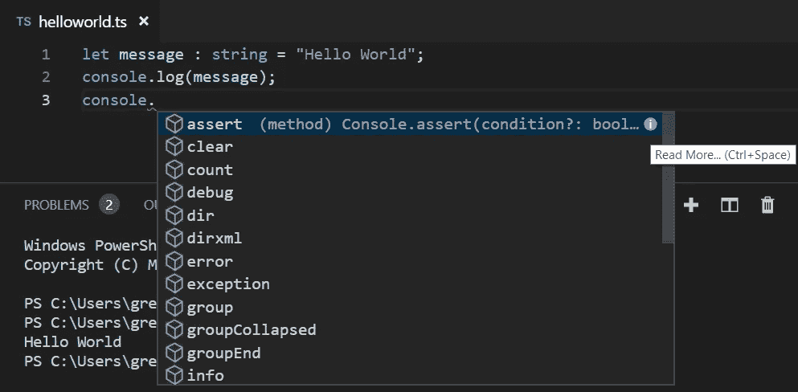

Improvements to IntelliSense in VS Code

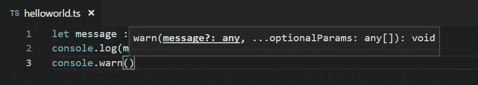

Help with parameters

## **类型帮助自我记录代码(优势)**

[这里的](https://dev.to/rocambille/how-typescript-helped-me-to-self-document-my-react-project-3ab5)是静态类型如何帮助自文档化代码的一个非常清晰简单的例子。使用像 JavaScript 这样的松散类型语言的一个问题是，你永远不能完全确定每个变量的用途，以及什么应该存储在哪里。你可能会说这是使用 JavaScript 的一个优势，但是当你开始借用结构来存储不需要的东西时，这可能会导致难以发现的错误。TypeScript 可以防止这种情况，并允许您使用接口来正确定义结构。

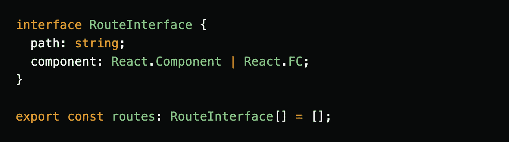

Only an object that implements the RouteInterface can be added to the routes array

## **重构更快(好处)**

重构是开发过程的一部分。保持代码的干净、高效和整洁有助于你的同事和六个月后的你理解代码，这是不应该避免的。花时间进行重构会给以后的开发时间带来好处。然而，这也是一个昂贵的过程，任何额外的帮助只能是一件好事。在这里，我们可以看到安装 TypeScript 时出现的其他重构选项，在 VS 代码中，我可以右键单击变量或函数声明，并为我提取接口。

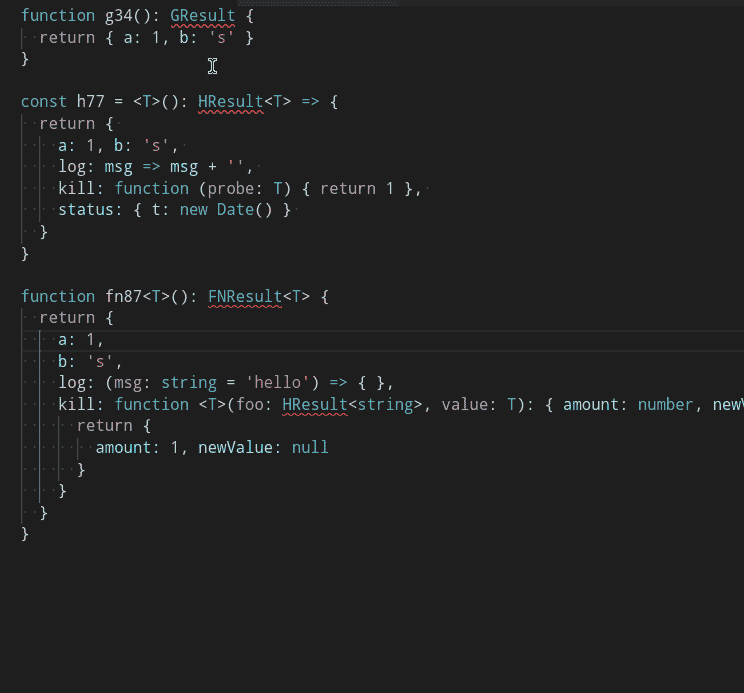

Additional refactoring options available in VS Code thanks to the adoption of TypeScript

## **编译前捕捉 bug(受益)**

这里有一个基本的例子，说明了在使用 TypeScript 时，编译器是如何捕捉到某些 bug 的，从而避免部署到测试中，甚至可能滑入生产中。互联网上有各种各样的估计，可以通过 TypeScript 捕获预编译错误的百分比，有些数字高达 15%。从我使用 TypeScript 的经验和 bug 密度没有减少的事实来看，我不相信这是事实(稍后解释)。

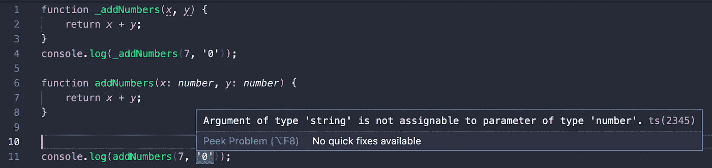

Incorrect parameters can no longer be passed once TypeScript is adopted

## **可以编译成目标 ES 版本(受益)**

一旦用 TypeScript 设置了项目，它就有了一个可以配置选项的. tsconfig 文件。其中之一就是`target`。

将此设置为`ES6`是该设置的一个常见值，因为所有现代浏览器都支持`ES6`标准。但是，如果您想支持较旧的浏览器，您可以将这个值更改为 ES 标准的早期版本，代码将向下编译成 JavaScript，与实现目标标准的浏览器配合良好。如果您的项目中有这种需求，TypeScript 将不再需要编写特定于浏览器的代码。

## **提前获得 JavaScript 的未来特性(优势)**

我记得这是 TypeScript 在 2012 年末首次实现时的一个非常大的卖点。JavaScript 的 ECMAScript (ES)标准进展有点慢，因为它们是社区驱动的。要对 ES 做出改变，必须得到大多数社区成员的同意，然后宣布，浏览器也必须开始解释这些特性。这可能需要一段时间。类就是一个例子。2012 年，JavaScript 开发人员知道类很快就会出现，并且会对他们有用，但是直到它发布后才能使用这个特性。通过采用 TypeScript，开发人员可以使用类，然后 TypeScript 编译器可以简单地将代码编译成向后兼容的 JavaScript。这一点现在不那么突出了，ES 已经大大加快了速度，Babel 解决了这类问题，允许 JavaScript 开发人员在他们的开发流程中添加任何他们能想到的语法特性。

# 缺点

## **单元测试不再是即时的(缺点)**

虽然 TypeScript 经常被认为可以捕捉没有它就会被忽略的错误，但是单元测试是最好的选择。TDD 和单元测试减少了代码库中的 bug 密度，应该在某个阶段成为项目默认工作流的一部分。TypeScript 在这里起了作用，通过在单元测试可以运行之前添加一个 transpiling 步骤，那些单元测试的运行不再是一个瞬时的过程。我希望我的测试能够立即运行，我希望进行修改并快速再次运行它们。Transpiling 可能只会给代码-测试-代码-测试工作流增加一点点延迟，但是这一点点延迟很快就会变得令人讨厌。

## **编译时间增加(缺点)**

单元测试不再是即时的，这是一个相似且紧密相关的缺点；我运行项目的时间会稍微长一点。在 React 中，我可能会有一个热重新加载工作流，但这也会因为 transpiling 步骤而变慢。使用热重新加载和 TypeScript 设置，我更改一行代码或标记，点击 save，并在屏幕更新之前忍受非常轻微的延迟。这可能看起来不多，但快速的工作流程鼓励快速开发，所以我不希望这里有任何放缓。

## **构建管道需要更长时间(缺点)**

传输步骤引入的另一个问题是等待构建管道完成的时间更长。生产构建需要更长的时间，当您有一个构建队列和一群等待的开发人员时，这可能是昂贵的。过多的这种延迟会导致构建超时，并且熟悉你最喜欢的 Git 解决方案中的`rerun`按钮。

## **要雇佣的开发人员较少(退税)**

我经常看到这被列为 TypeScript 的正面。
“TypeScript 是 JavaScript，你可以雇佣任何一个 JavaScript 开发者来做 TypeScript，学习曲线很浅很平滑”(或者类似这样的意思)

这完全不是我的经历。在使用 TypeScript 完成了几个大型项目之后，让 JavaScript 开发人员参与进来，然后让他们花一天时间在 TypeScript 文档上，并期望他们没有任何问题，这通常不是事情的解决方式。不断地查看 TypeScript 文档中的每一个小细节，搜索难以理解的错误，在整个代码库中乱放关键字`any`,这是我作为一个 JavaScript 开发人员“运行和射击”TypeScript 项目的经历。因此，理想情况下，你会想为你的项目雇佣一个有经验的 TypeScript 开发人员，而你刚刚减少了 42.3%的人才库，这是一个巨大的损失。

[https://insights.stackoverflow.com/survey/2020#most-popular-technologies](https://insights.stackoverflow.com/survey/2020#most-popular-technologies)

## **非 TS 库需要类型(退税)**

如果您在项目中使用 JavaScript，那么您很有可能会使用像 npm 或 yarn 这样的包管理器，并利用丰富的可用库使开发人员的工作变得更加轻松。如果使用 TypeScript，JavaScript 库不一定附带类型。通常，要让用 JavaScript 编写的库在 TypeScript 项目中工作，会发生两种情况之一。

1.该库的开发人员事后才开发出一个带有自己版本的类型包，它们通常非常古怪，很少得到支持。在类型更新之前，库本身可以看到一系列的发布。

2.一些不在库上工作的人想要类型，所以他们自己写了一个类型库，并把它添加到 npm 中，然后当 JavaScript 库更新时，从不更新它。所以你正在使用一个旧的类型库，并以令人挠头的、几乎无法解决的错误而告终。

## **锁定版本类型以获得工作编译(缺点)**

我曾经遇到过这种情况，在 react 项目中，一个大型团队在一个相当大的代码库上有许多 npm 依赖项。大约有 25 个类型库被用来容纳这些包。以默认方式保留依赖关系的版本……类似于`^4.0.1`的东西是一种告诉包管理器您将接受任何非破坏性变更的小更新的方式。这是更可取的，因为小错误甚至安全问题经常在这些包中得到修复，而次要版本被升级。一个开发人员将一个特性与一个颠簸的版本合并，这对他们来说很好，然后当你最终取出更新的`package.json`并试图重新运行你的新代码时，你将面临编译错误。您会发现这要么是因为类型库不同步，要么是 JavaScript 库有了新的更改，导致 TypeScript 编译器出错。最终，您可以通过锁定版本号并删除类型库或包本身的`package.json`中的`^`符号来解决这个问题。我不想这么做，我想要最新版本。

## **Typescript 充满了令人困惑的怪癖(缺点)**

我进入 TypeScript 的旅程是一个后端开发人员的旅程。十多年的 C#和 Java。许多其他开发人员来自前端或 JavaScript 学习路径，因此 TypeScript 对他们来说应该不太自然，我可能是真正应该欣赏 TypeScript 附带的类型系统的程序员之一。但我不这么认为，TypeScript 并没有使 JavaScript 成为强类型，它只是增加了一些规则，使它有时表现得像一种强类型语言，但在其他情况下，会让您感到困惑，并想知道为什么 TypeScript 中的怪异之处会是这样。这里有几个例子。

额外的属性是可以的…取决于你的语法

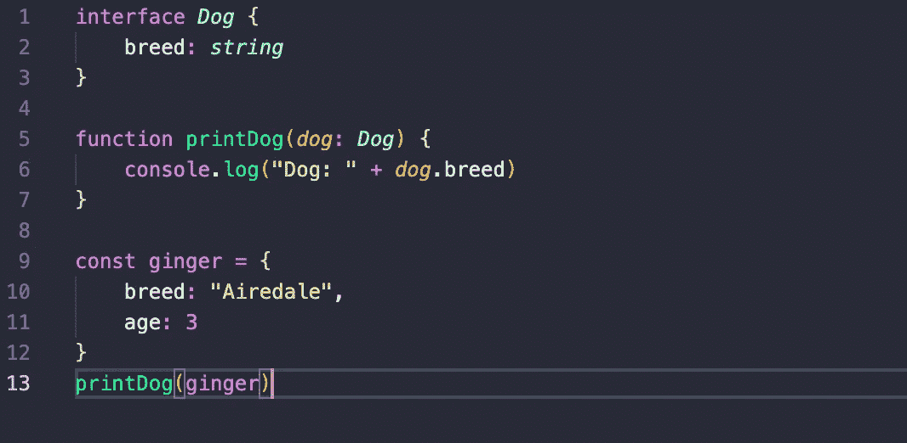

Valid TypeScript, no problems here

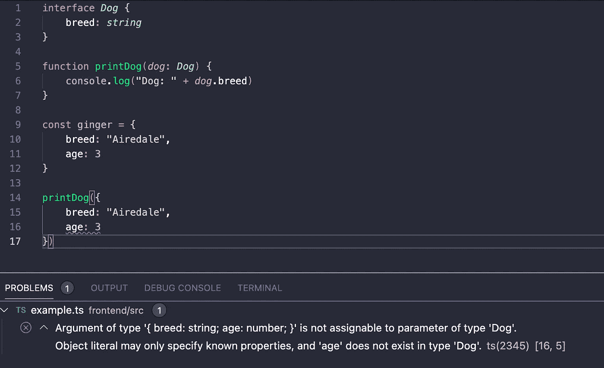

This doesn’t work with inline objects for some reason

您可以将任何旧对象传递给需要特定类型的函数，只要它具有正确的属性。那么这是不是强类型的…嗯，都不是。

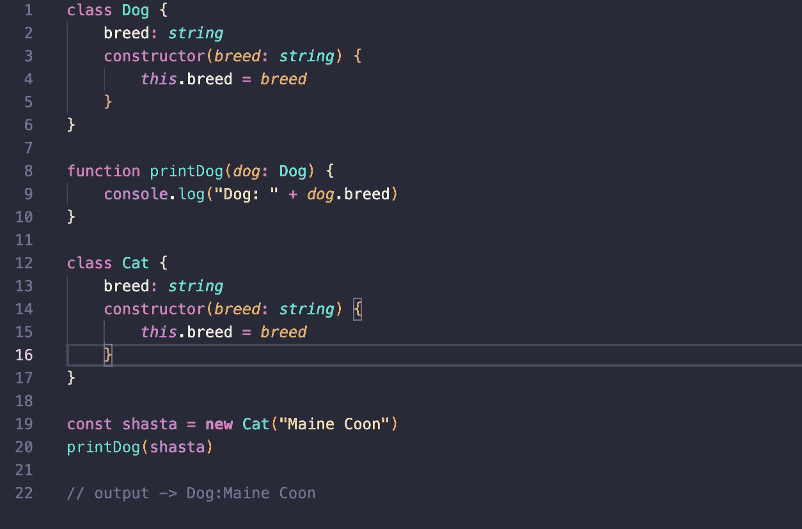

Valid TypeScript, use a Cat as a Dog, all good

你可以使用`|`联合符号，来确定一个变量的类型。但是要小心。

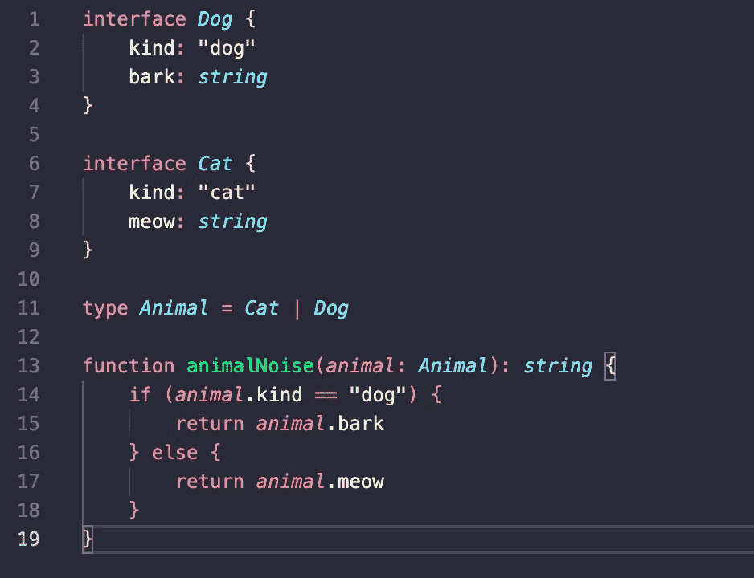

Nice use of a union … the bark attribute is accessible without casting

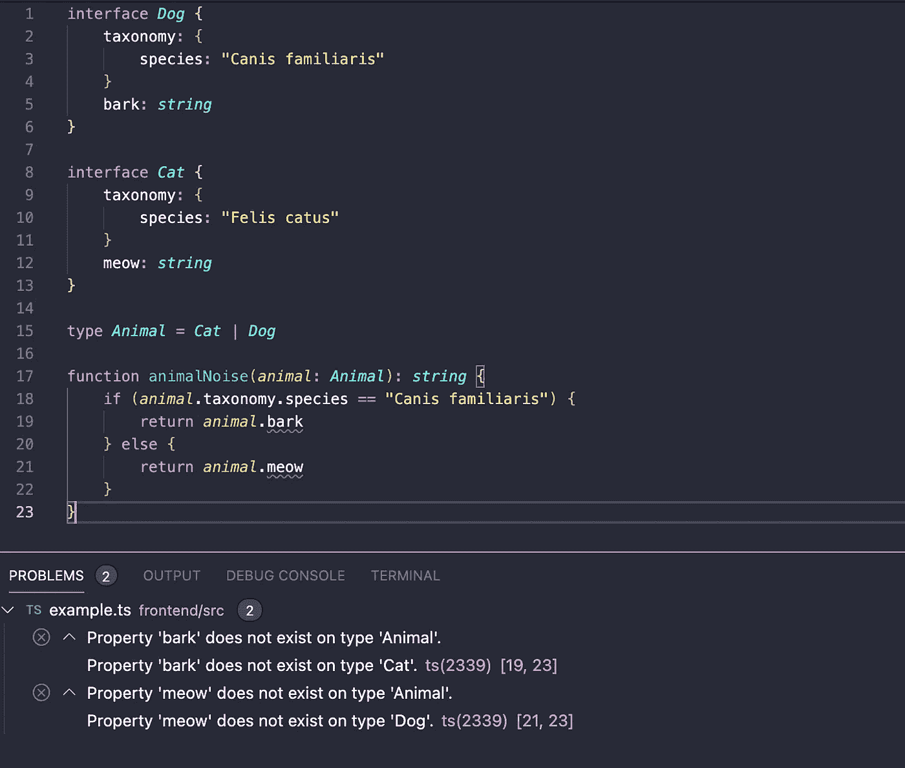

Invalid use of a union

## **仅在编译时检查类型(退税)**

这是一个很重要的区别。在运行时，没有可用的类型检查。TypeScript 被转换成 JavaScript，这时类型安全就不复存在了。网络调用、特定于平台的 API、非类型库没有类型安全。编写 JavaScript 时，您必须编写代码来检查特定的类型(使用 TypeScript 的一个常见原因是能够从代码库中删除这些代码)。使用 TypeScript，您依赖编译器为您完成这项工作，但它无法检查所有内容。当然，您可以编写与 JavaScript 类似的类型检查代码来获得某种运行时安全性，但是使用 TypeScript 的初衷是什么呢？解释语言，无法在运行时检查类型。

## **不降低 bug 密度(缺点)**

这里有深入看这个[。静态类型化不会降低项目中的总体 bug 密度。](https://labs.ig.com/static-typing-promise)

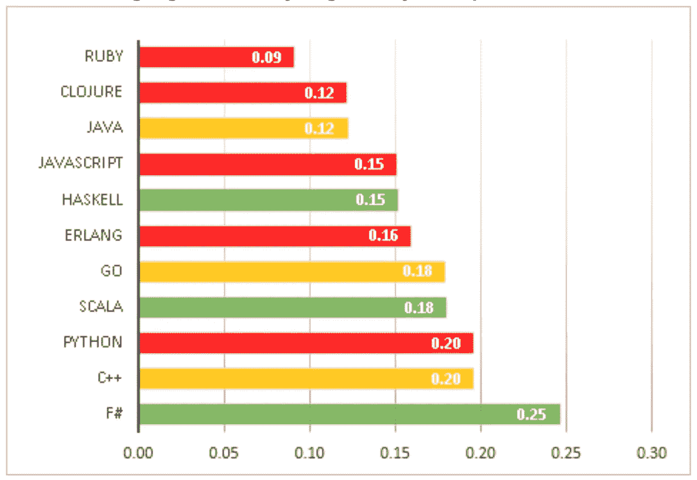

Low bug density for a non statically typed language.

## **离开微软锁定的社区驱动的 JS 路径(缺点)**

JavaScript 现在是一个社区主导、社区驱动的项目。自从引入 ES 标准以来，在发布之前，会对变更进行讨论和广泛协作。如果你对某个你想看的功能有强烈的感觉，你可以投稿。

虽然 TypeScript 已经被微软贴上了“开源”的标签，但在这种情况下，这仅仅意味着你可以浏览和阅读回购协议。但是你不会得到任何改变或建议。JavaScript 社区也可能走上与微软不同的道路……所有那些数以千计的非类型脚本库也将随之而来。通过选择 TypeScript，你承担了额外的风险，并且你接受了被一个公司所束缚，这个公司对特定的技术做了所有的决定。

## **需要编写更多代码(缺点)**

另一件很难进行精确测量或度量的事情。但是从我自己的经验来看，你至少要多写 20%的代码。我真的很喜欢代码库是干的，并且在删除重复和不必要的逻辑中找到很多乐趣。代码库中的代码越少，存在 bug 的代码就越少。TypeScript 需要接口、类型、转换和泛型来编译。这是无法避免的，如果没有 TypeScript 设置，您将不得不编写额外的代码。

## **不良和不可理解的错误(缺点)**

我从事商业开发已经超过 20 年了。我用过很多不同的技术。从运行在 DVD 播放器上的解释器代码，到编译成只能在 Windows 上运行的面向对象代码，移动应用程序，以及一大堆来来去去的网络技术。没有一个比打字稿更让我困惑的错误了。

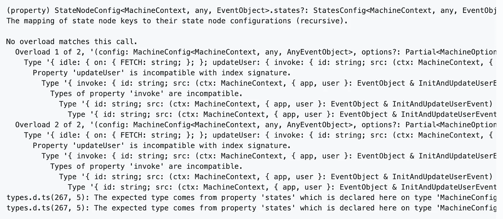

Obvious … isn’t it?

当新的开发人员加入团队时，除非他们已经做了几年的 TypeScript 开发，否则会出现相同的模式，在文档上浪费时间，系统中几乎每个可能的错误都是堆栈溢出的问题，因为它们以看似不正确或令人困惑的方式弹出。

# 我的新项目会采用 TypeScript 吗？

简而言之，没有。

在我看来，缺点仍然远远大于好处，我从来没有喜欢过使用类型脚本，我也没有看到我所列出的任何一个好处是我不能缺少的，或者是我可以用其他非类型脚本的方式解决的。

*更多内容尽在*[***plain English . io***](http://plainenglish.io/)