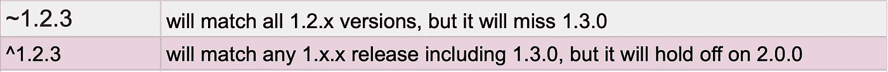
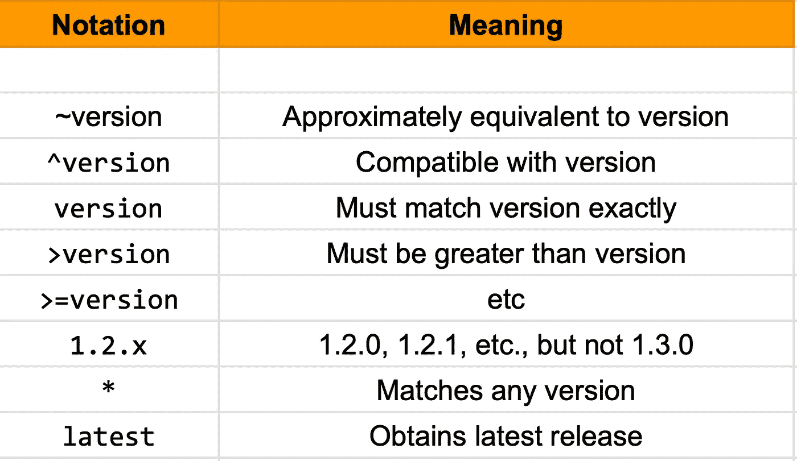

# npm 版本背后的数学原理

> 原文：<https://javascript.plainenglish.io/the-math-behind-npm-versioning-5236f8c821c2?source=collection_archive---------14----------------------->

## 何时使用颚化符(~)或 Caret(^)


Photo by [Pankaj Patel](https://unsplash.com/@pankajpatel?utm_source=unsplash&utm_medium=referral&utm_content=creditCopyText) on [Unsplash](https://unsplash.com/s/photos/code?utm_source=unsplash&utm_medium=referral&utm_content=creditCopyText)

```
npm install somePackage --save
```

每个为前端或节点后端编写的人都非常熟悉这一点，对吗？当我们以这种方式添加一些东西时，我们会看到在我们的 package.json 中像这样添加了一些东西

```
"somePackage": "^3.5.3",
```

这种写法集中在这些特殊的 characters(~,^或*)版本之前。

## 这是什么？

该字符代表节点和 npm 的语义版本。 [Semver](https://semver.org) 被分成 3 个主要部分，用圆点分隔。

```
major.minor.patch
1.0.0
```

这些不同的主要版本、次要版本和补丁用于标识不同的版本。

## **波浪号(~)** VS **Caret(^)**

*   `~`冻结**主副号**
*   当您准备好接受依赖关系中的错误修复，但不希望任何潜在的不兼容更改时，可以使用它。
*   波浪号匹配**最新的次要版本**(中间的数字)
*   波浪号(~)为您提供错误修复版本

而 caret(^)

*   `^`仅冻结主要号码。
*   当您密切关注您的依赖项，并准备在次要版本不兼容时快速更改代码时，可以使用它。
*   它会将您更新到**最新的主要版本**(第一个数字)。
*   脱字符(^)也给你向后兼容的新功能。



In Summary

简而言之:

***~2.4.1*** *表示将检查 2.4.x，其中 x 为任意值*而****^2.4.1****表示将检查 2.x.x，其中 x 为任意值**

**

*CheatSheet*

*感谢阅读！🍻*

**更多内容请看*[***plain English . io***](https://plainenglish.io/)*