# 用 JavaScript 渲染星星背后的数学

> 原文：<https://javascript.plainenglish.io/the-math-behind-stars-rendered-with-javascript-94d4dee2754a?source=collection_archive---------11----------------------->


Photo by [Michael Dziedzic](https://unsplash.com/@lazycreekimages?utm_source=unsplash&utm_medium=referral&utm_content=creditCopyText) on [Unsplash](https://unsplash.com/s/photos/triangle-right?utm_source=unsplash&utm_medium=referral&utm_content=creditCopyText)

我想做的就是在我的教程中添加一个简单的图表。我在那里写着[如何用 JavaScript 和 HTML5 Canvas](/how-to-draw-stars-with-javascript-and-html5-canvas-33ece95c19bf) 画星星，我纠结着试图帮助读者可视化基本的三角学，而不让数学接管我的文章。

它接手了这篇文章。在我意识到之前，我正在单位圆上叠加三角形并推导方程。一个图变成了五个图。

随着我更深入地研究数学的细微差别，我意识到触发器和代码之间的联系值得单独写一篇文章——所以我从另一篇文章中删除了大部分密集的数学，好了，我们到了。

数学的魔力在于一种被恰当地称为`drawStar`的方法。该方法可以根据调用时选择的属性呈现星形。

记住这一点，试着想象下面的代码会产生一个星形。

Calling drawStar with these properties results in a 3-pointed star.

我们现在可以在下面的演示中看到生成的星星。继续运行它，看看你有多接近。

如你所见，我们可以确定恒星的属性，但不需要数学。为什么？因为都是用`drawStar`方法处理的。

如果我们回过头来看大图，整个计划由两部分组成:

*   微型图书馆，俗称`drawJS`，里面有`drawStar`
*   在`drawJS`之外的一个函数，*调用*的`drawStar`方法

`drawStar`如何创建形状？Canvas API 为我们提供了一组方法，允许我们用数字笔在一个`<canvas>` HTML 元素上绘图。并且`drawStar`调用其中的两个方法`moveTo`和`lineTo`，在这个过程中使用了大量的数学知识。

调用这些方法时，`drawStar`必须记住两种类型的半径:

*   `outerRadius`，即中心与每个外点之间的距离。

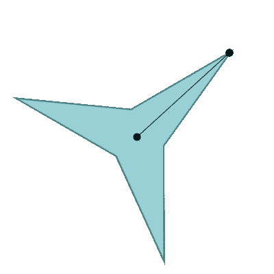

An outer radius with dots for the center point and outer point.

*   `innerRadius`，即中心与每个内点之间的距离。

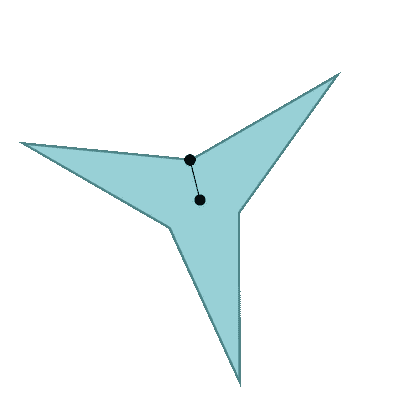

An inner radius with dots for the center point and inner point.

现在我们有了一点背景知识，让我们深入研究一下`drawStar`中的三角学。

# 绘图功能

不像[如何画星星](/how-to-draw-stars-with-javascript-and-html5-canvas-33ece95c19bf)，我们将*而不是*走完整个`drawStar`方法。相反，我们应该把重点放在充满数学的代码行上。两条这样的线驻留在一个叫做`draw`的小助手函数中，它告诉我们的数字笔下一步移动到哪里。下面是:

A star drawing helper function.

正如你所看到的，`draw`使用了两种`Math`方法，`sin`和`cos`，来计算数字笔的方向。该函数有三个参数:

*   `radius`，或从恒星中心到外点或内点的距离。
*   当前的`angle`我们的笔在画布上逆时针移动
*   `action`或者是`moveTo`，它在笔抬起时移动笔，或者是`lineTo`，它在笔放下时绘制一条直线路径。

## 在函数内

现在我们已经有了参数，让我们试着理解这个函数的三行代码。

第一行使用中心点`cx`和一些使用`angle`和`radius`的数学运算来设置目标点的`x`。

```
let x = cx + Math.cos(angle) * radius;
```

第二行使用中心点`cy`和一些类似的数学方法来设置星星外部点的`y`。

```
let y = cy + Math.sin(angle) * radius;
```

然后我们抓住画布的`context`——这是一组绘图方法，可以指引程序的数字“笔”

```
**context**[action](x,y);
```

我们用`context`调用它的一个画图方法，不是`moveTo`就是`lineTo`。其中一个存储在变量`action`中。

```
context**[action]**(x,y);
```

然后我们传入刚刚在前两行数学密集型代码中算出的`x`和`y`坐标。

```
context[action]**(x,y);**
```

目的是找到恒星上的每个点，例如下面标记的外部点。

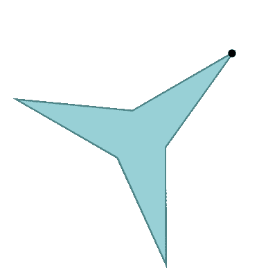

The first outer point that the counterclockwise moving pen should reach.

# 寻找星点

现在我们已经对`draw`函数有了一个概述，让我们检查一下它的基本三角概念。在该程序中，笔从水平 x 轴(或恒星的 3 点钟位置)开始，以递增的逆时针弧线移动来绘制每个点。我们在下图中看到它的第一站，标记为(x，y)。

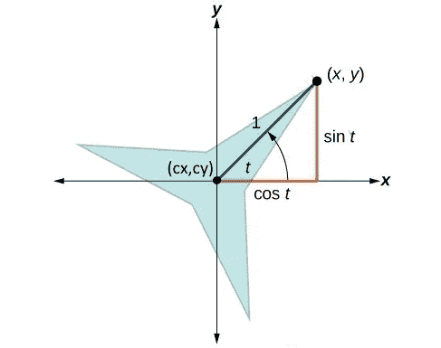

Before we start to draw, our pen moves to point (x,y).

## 主要元素

让我们考虑一下该图的主要元素:

*   我们的三点星，半径为 1 的**和中心的**角 t** 。**
*   我们的笔在开始时移动到的点，由坐标 **(x，y)** 标记。
*   星星的中心点，用 **(cx，cy)** 标注。

我们可以使用一个三角形叠加来查看两个触发函数 *sin* 和 *cosine* 如何与我们外部点的 **(x，y)** 坐标相关联。这是一个直角三角形，因为它有一个直角。带箭头的弧线代表**角度 t，**，我们的程序用它来到达第一个点。

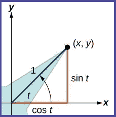

A close-up of the outer angle and the triangle.

## 斜边

这个角度由 x 轴和一条代表恒星外径的蓝线限定。在三角学术语中，蓝线是直角三角形的斜边。

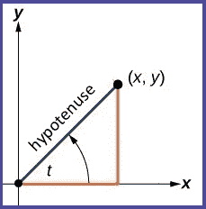

The hypotenuse represents the star’s outer radius.

## 腿

橙色的边是三角形较短的“腿”。标记为 **cos t** 的水平边将帮助我们找到 x 坐标，而标记为 **sin t** 的垂直边将帮助我们确定 y 坐标。

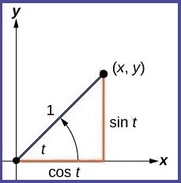

The legs of the triangle are labeled with sin and cosine.

碰巧这个特殊三角形的正弦和余弦等于边长，但那是因为斜边的长度是 1。如果斜边不为 1，这些函数和边长之间的关系就更复杂了，我们将在下一节探讨这一点。

# 方程式概述

为了研究其中的数学原理，让我们根据传入的`angle`和`radius`推导出我们在程序中看到的两个数学方程，它们决定了起点的`x`和`y`坐标。他们又来了。

```
let x = cx + Math.cos(angle) * radius;

let y = cy + Math.sin(angle) * radius;
```

因为这些方程使用了正弦和余弦函数，下面我们来看看。注意，每个函数取决于一条腿的长度与斜边长度的比值。

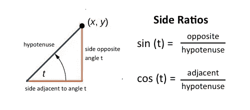

The sin and cosine equations.

# 利用罪恶来寻找 y

让我们努力理解下面的代码行如何使用 sin 来寻找外部点的 y 坐标。

```
let y = cy + Math.sin(angle) * radius;
```

sin 方程表明 sin 等于边对角 t 除以它的斜边。

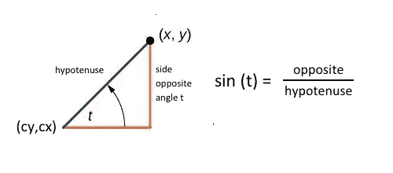

The sin equation and diagram with star center points at (cx,cy).

标记为 **(cx，cy)** 的三角形最左边的点也是恒星的中心点。

求对边的长度是有价值的，因为它可以帮助我们找到 y 坐标。

在一系列的五个步骤中，让我们研究一下 sin 方程和中心点最终是如何用于查找星点的 y 坐标的代码中的。

## 第一步:两边乘以斜边

请记住，sin 等式是这样的:

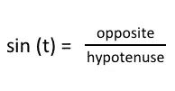

我们可以将这个方程的两边乘以斜边，从而分离出“相反”的值。这为我们提供了以下信息:

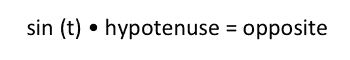

## 步骤 2:交换半径

因为斜边实际上是*星的半径*，我们可以把这个术语换过来。

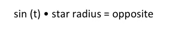

## 步骤 3:添加中心点的 y 轴

对边与恒星外点的 y 坐标有关，但它不等于 y，除非中心点的 y 值，或 *cy* 为零。

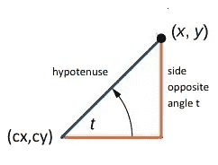

The side opposite angle t.

例如，假设中心点的 y 坐标是 60，对边的长度是 40。这将使外点的 y 坐标为 100。

所以我们要把它的 y 坐标， *cy，* 加到对边的长度上，得到那个 y 坐标。让我们现在做那件事。

> cy + sin (t)半径= cy +相反=外点的 y

## 第四步:简化

这是一个更简洁的方程式

> cy + sin (t)半径= y

## 第五步:比较

让我们看看它与我们的代码行相比如何，其中`angle`代表 t:

```
let y = cy + Math.sin(angle) * radius;
```

成功！只要我们翻转两边，使 y 在左边，我们的方程是相同的！

> y = cy + sin (t)半径

# 用余弦求 x

既然我们的程序中已经有了 sin 的公式，让我们推导一个余弦的公式，它等于三角形的*水平*边——与我们的角度 *—* 相邻的边*除以它的斜边。*

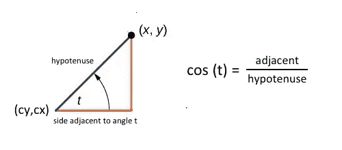

The cosine equation and diagram with star center points at (cx,cy).

同样，让我们用五个步骤从数学到代码。

## 第一步:两边乘以斜边

这又是余弦方程。

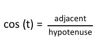

和 sin 一样，我们将等式的两边乘以斜边的长度，这次是为了隔离相邻边的长度。

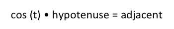

## 步骤 2:交换半径

和 sin 一样，我们可以把恒星的半径换成斜边。

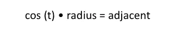

## 步骤 3:添加中心点的 x

让我们把星的中心点(cx)的 x 坐标加到垂直边的长度上。这给了我们恒星外点的 y 坐标的*。*

> cx + cos (t)半径= cx +相邻= x

## 第四步:简化

然后我们可以简化这个等式。

> cx + cos (t)半径= x

## 第五步:比较

现在让我们将其与我们的代码进行比较。

```
let x = cx + Math.cos(angle) * radius;
```

同样，我们所要做的就是翻转我们的方程，它和代码中的方程是一样的。

> x = cx + cos (t)半径

希望上面的步骤阐明了我们的代码如何使用`sin`和`cos`函数来寻找星点的 x 和 y 坐标。这是我们代码中的两个等价行。

```
let x = cx + Math.cos(angle) * radius;

let y = cy + Math.sin(angle) * radius;
```

# 画出整颗星星

我们刚刚看了`draw`是如何工作的，以及这个等式如何让我们到达恒星中的第一个点。现在让我们来看看`draw`是如何应用于第一点和其他点的。

下面是我们如何在代码中调用`draw`来达到第一点。

```
draw(outerRadius, rotate, 'moveTo');
```

让我们检查一下传入的参数。

*   `outerRadius`是恒星中心到外点的距离。
*   `rotate`存储一个起始角度，并允许我们根据需要旋转星星。
*   `moveTo`就是不画图，把笔移到点上的方法。

在我们的`draw`功能中，

*   `outerRadius`变成了`radius`，
*   `rotate`变成了`angle`，
*   而`moveTo`就是现在的`action`。

让我们重温一下我们分析过的`draw`函数，看看这一切是如何翻译的。

Revisiting the draw function.

## 寻找一个标准角度

画完我们的第一个点后，我们的笔将到达三个内部点和两个外部点。

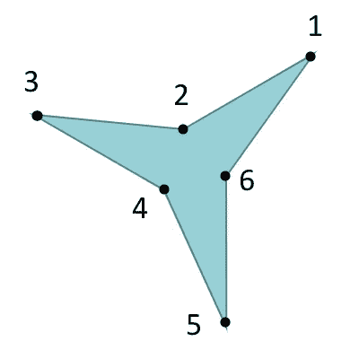

The pen will draw the star by traveling to the above points in the numbered order.

为了到达每个点，我们需要确定一个标准的`angle`，我们的程序使用它从一个点移动到下一个点。该角度由 360 度或 2π除以点数确定。所以点越多，角度越短。

```
let angle = 2 * Math.PI / numPoints;
```

## 我们其余的观点

现在有了标准的`angle`，我们可以调用`draw`函数来绘制其余的点。注意`outerRadius`用于点，而`innerRadius`用于内部点。

We can use a loop to get to all the points on the star.

注意我们用`lineTo`代替`moveTo`，因为笔应该在移动过第一个点后放下并开始绘制。

## 寻找外角和内角

在每个循环中，我们的笔到达一个外部点，然后到达一个内部点。让我们看看我们如何计算`outerAngle`来寻找每个外点，以及`innerAngle`来寻找每个内点。

为了计算`outerAngle`，我们用标准`angle`值乘以我们所在点的指数(`i`)。然后我们把`i * angle`加到`rotate`上。

```
let outerAngle = i * angle + rotate;
```

这个逻辑将把我们带到恒星的每个外点。

`innerAngle`是我们到达恒星内部点的方法。为了找到它，我们简单地把我们标准角度的一半加到`outerAngle`上。

```
let innerAngle = outerAngle + angle/2;
```

我们的数学做完了！然后，我们将一个`stroke`和`fill`应用到我们的路径上，现在我们的星星就画出来了。

```
context.stroke();

if (o.fill) {
     context.fillStyle = o.fill;
     context.fill();
}
```

下面是演示，所以你可以回顾一下它是如何组合在一起的。

The 3-point star demo.

# 要点和后续步骤

告诉我们的程序每个星点在哪里需要应用三角学。如果你想编写自己的图形程序或修改现有的程序，了解数学是如何工作的可以给你更多的创造自由来创造你想要的东西。

以下是一些建议的后续步骤:

*   分叉或下载 CodePen 并进行实验——也许修改代码来创建您自己的星星。
*   注释数学密集型代码，看看你是否能理解它。
*   阅读下面的文章，更好地理解 HTML5 Canvas。

[](/how-to-draw-stars-with-javascript-and-html5-canvas-33ece95c19bf) [## 如何用 JavaScript 和 HTML5 画布画星星

### 让我们创建一个处理细节的库，这样我们就可以专注于大局。

javascript.plainenglish.io](/how-to-draw-stars-with-javascript-and-html5-canvas-33ece95c19bf) [](https://betterprogramming.pub/create-your-own-html5-canvas-toolkit-with-vanilla-javascript-1d2ad1047219) [## 用普通的 JavaScript 创建你自己的 HTML5 画布工具包

### 帮助创作者画出令人惊叹的形状的工具包

better 编程. pub](https://betterprogramming.pub/create-your-own-html5-canvas-toolkit-with-vanilla-javascript-1d2ad1047219) 

我希望你对这个星形绘制函数背后的数学有更好的理解。感谢阅读！

*更多内容看*[***plain English . io***](http://plainenglish.io)