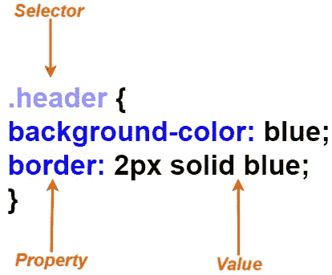
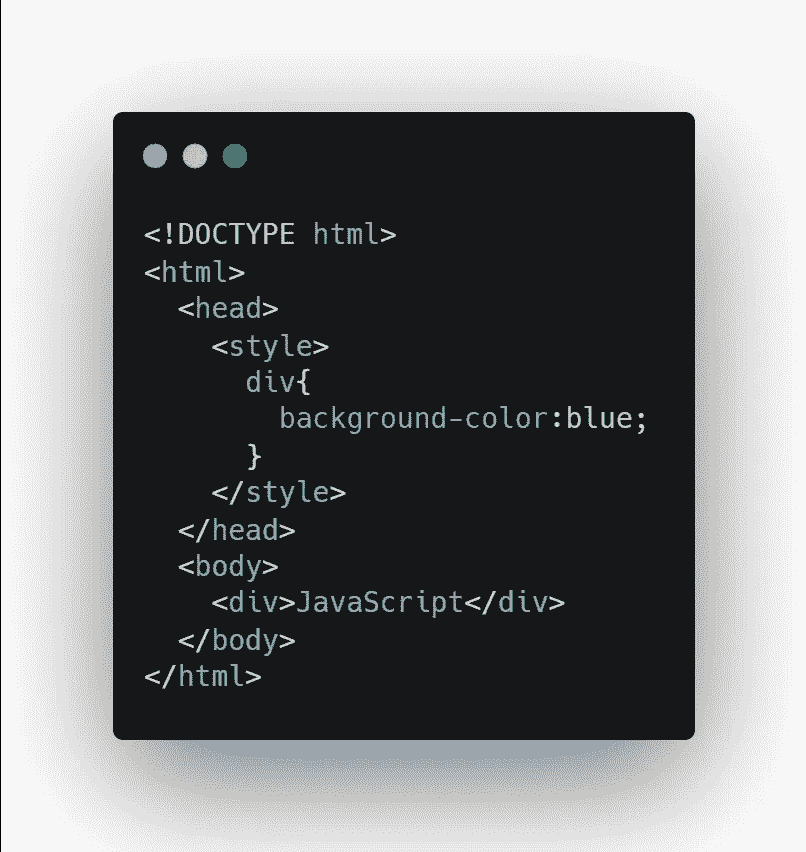
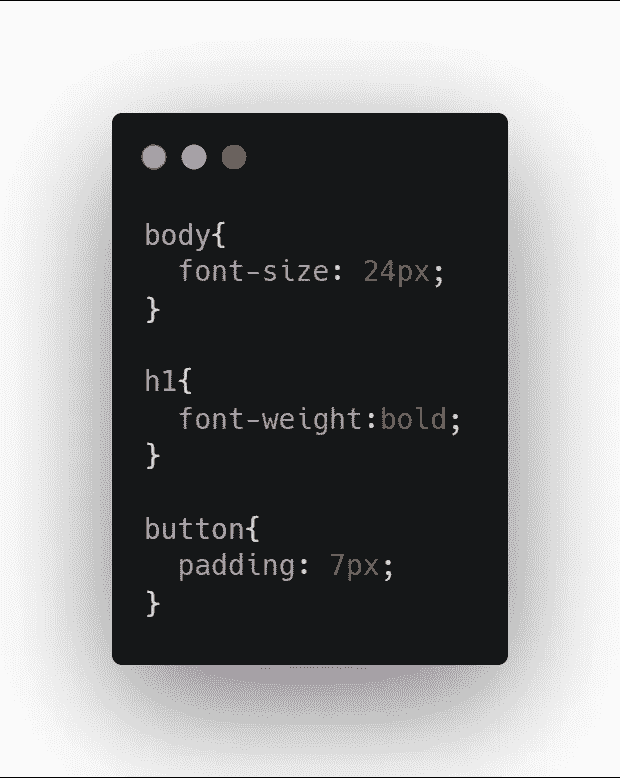
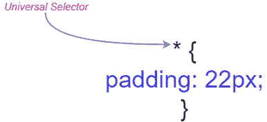
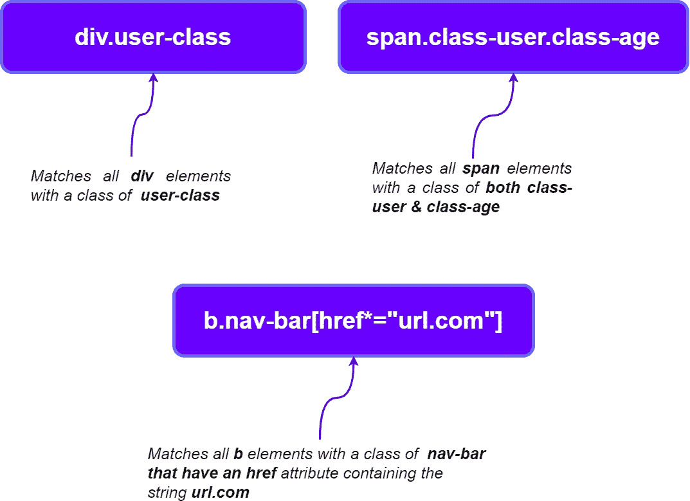

# 现代 CSS 开发人员路线图

> 原文：<https://javascript.plainenglish.io/the-modern-css-developer-roadmap-1ea112451dde?source=collection_archive---------0----------------------->

## 掌握 CSS 的关键概念

# 1.CSS 简介

## **剖析 CSS 规则**

CSS 样式表由规则组成，这些规则通过使用描述样式应该应用的元素的选择器来定位 ***HTML*** 。

**规则语法:**规则由一个选择器组成，后跟一个包含在花括号内的 CSS 属性块。CSS 属性由属性和用冒号分隔并用分号分隔的值组成。但是，一个值可以是单个值，也可以是多个值的集合，具体取决于属性。

***例如，***

*   该规则以具有类 ***标题*** &的任何元素为目标。具有此类*的任何元素将具有蓝色背景和 **2px** 纯蓝色边框。*
*   ****背景色*******边框*** 是 CSS 属性，边框宽度指定为 **2px** ，同时 **px** 是 CSS *单元*。**

****

****属性冲突:**假设在一个给定的规则中，同一个属性被多次使用，那么规则中的最后一个定义被处理。**

*****例如，*****

****

*   **该元素将有一个绿色的*背景，因为它是规则中的最后一个，先前的属性将被覆盖。***

*****注释:** CSS 可以包含规则内外的注释。***

******例如，******

****

****At-rules:*****At-rules***是一个特殊的 CSS 规则，它充当控制 CSS 行为的指令，之所以称为 ***at-rule*** 是因为它以***“At”符号(@)开始。*****

*****例如，*****

*   ****@charset:** 定义 CSS 文件中使用的字符编码。**
*   ****@import:** 导入另一个样式表的内容。**
*   ****@media:** 定义媒体查询。**
*   ****@keyframes:** 为 CSS 动画定义一组关键帧。**

## **如何使用 CSS**

****内嵌样式****

**每个 **HTML** 元素都支持 ***样式*** 属性，其中内联样式在 ***样式*** 属性的值中被指定为 CSS 属性。请注意，内联属性不包含任何选择器或花括号，我们有一个简单的 CSS 属性集合。**

*****例如，*****

*   **应用于元素的内联样式将有一个 ***红色*** 背景，如果应用于元素的规则中有任何冲突，其内联样式总是优先。**

****

****样式块****

**CSS 规则也适用于 HTML 文档本身的*样式*表单内部，我们只需要在*样式*元素内部添加 CSS 规则。这些是带有选择器和规则的完整样式表。**

*****例如，*****

****

****外部样式表****

**CSS 规则也可以用**应用在样式表文件中。css** 扩展，这个样式表稍后使用 ***链接*** 元素引用 HTML 文档的 ***头*** 。**

*****例如，*****

****

# **2.CSS 预处理程序**

**CSS 预处理程序如 **Sass** 、**LESS**&**Stylus**可以帮助使用普通 CSS 中没有的附加功能，这些工具为编写 CSS 规则提供了 CSS 语法的更扩展版本。在运行构建时，预处理器会将样式表转换成普通的 CSS，以便在浏览器中使用。CSS 预处理器是一个完全不同的概念&它需要自己的学习路径。 ***但是这里有一个 CSS 预处理程序的快速概述。*****

****嵌套规则****

**因为 CSS 规则不支持嵌套，这意味着带有选择器的 CSS 规则不能出现在另一个 CSS 规则中。但是在大多数预处理程序中，这是允许的。**

*****例如；*****

****

****变量****

**由于所有最新版本的 ***Edge、Firefox、Chrome*&*Safari***都支持原生 CSS 变量，因此使用 Sass 只有在您希望为您的应用程序提供更强大的支持时才有用，例如像 **IE11** 这样的旧浏览器。**

*****例如；*****

*   **使用 **$** 字符声明和引用变量。**

****

****Mixins****

**Mixins 允许我们将可以应用于一整套属性的 CSS 属性和值写入另一个 CSS 规则，而不必重复所有代码。如果您希望支持在某些属性上需要供应商前缀的旧浏览器，使用 mixins 可能会很有用。**

****举个例子；****

****

# **3.CSS 如何在浏览器中工作**

## **数字正射影像图**

**文档对象模型是一个对象树，表示文档中的元素及其结构和层次，该树由 DOM 节点组成，DOM 是通过读取 **HTML 标记**、**标记它、解析它**并创建对象层次来创建的，该对象层次使 DOM 处于最后阶段。**

*****例如；*****

*   **如果我们有一个如下所示的 HTML 文档。**

****

*   **那么对应的 DOM 树将如下所示。**

****

## **CSSOM**

**就像 DOM 一样，我们也有 CSSOM ***(CSS 对象模型)，*** 它只是另一个树结构，表示文档中样式的层次结构。DOM 和 CSSOM 非常相似，然而， **CSSOM** 是一个独立于 DOM 的结构。**

*****例如；*****

*   **我们有一个应用于 HTML 文档的 CSS 样式表。**

****

*   **然后浏览器解析 CSS 并创建 CSSOM，如下所示。**

****

## **渲染树**

**DOM 和 CSSOM 完成处理后，它们被组合起来形成渲染树，其中包含浏览器渲染页面所需的所有数据。**

## **布局和油漆**

*   **在最后一个阶段，渲染树开始在页面上布局元素，该过程处理样式，如**宽度、高度、位置、边距、&填充、**，以计算页面上每个元素的大小和位置。**
*   **然而，在这个阶段屏幕上还没有显示任何东西，但是一旦布局完成，浏览器就开始绘制，应用样式如 ***颜色*** 和 ***字体*** 来确定要在屏幕上呈现的实际像素。**

# **4.CSS 选择器**

**CSS 选择器是 CSS 中的核心概念之一，它们决定了 CSS 规则应用于哪个元素，因为有几种方法可以用选择器定位元素。*用更简单的话来说*，CSS 选择器可以针对页面上的多个目标，这意味着单个 CSS 规则可以应用于多个元素。**

## **基本选择器类型**

****

*   ****通用选择器:**使用**星号(*)** 符号指定。它可以被指定为单个选择器来选择文档中的所有元素。**

*****例如；*****

****

***在这种情况下，*会将 **7** 的**填充应用到文档中的所有元素。****

*   ****元素选择器:**它通过 HTML 元素的 ***标签*** 名称来定位元素，选择器的语法就是元素的名称。**

*****例如；*****

****

**在这种情况下，它将对文档中的所有 ***p*** 元素应用 **10px** 的填充。**

*   ****ID 选择器:** HTML 元素有一个 ***id*** 属性，给定的 ***id*** 应该只有一个元素。但是，如果有多个元素具有相同的 ***id，*** 浏览器将使用具有该*id 的所有元素来匹配规则，建议避免这种情况，因为这违反了 HTML 规范。***

******例如；******

****

**在这种情况下，我们有一个 ***标题*** 作为 ***id。*** 如果有更多的元素具有相同的 **id ( *标题*)，**它们将接收 **22px** 的填充。由于建议避免这种方法，你可以使用 ***类选择器*** 来代替 id 选择器。**

*   ****类选择器:** HTML 元素也可以有一个 ***类*** 属性，可以用来标记所有相似类型的元素。由于 ***ID 选择器*** 只针对单个元素，因此我们可以拥有任意数量的具有 ***类*** 属性的 HTML 元素。**
*   **此外，单个 HTML 元素可以应用任意数量的类，而多个类在 ***类*** 属性的值中用空格分隔。**

*****例如；*****

****

**在这种情况下，该规则将匹配文档中每个元素的类别 **navbar-color** ，该类别的颜色为**蓝绿色。****

*   ****属性选择器:**属性在**方括号**中指定，属性选择器可以有几种形式。**

****

*****例如；*****

****

**在这种情况下，如果我们用选择器**【title ~ =【Name】，**编写 CSS 规则，那么只有第一个元素*匹配，而不是第二个，因为 ***标题属性*** 没有被 ***空格*** 包围。***

## **复合选择器**

**使用复合选择器，我们可以单独使用任何前面的选择器，或者与其他选择器结合使用，使选择器更加具体。**

*****例如；*****

****

## **多个独立选择器**

**一个 CSS 规则可以有多个选择器，只需用逗号分隔，这个规则将被应用到与任何给定的选择器匹配的元素上。**

*****例如；*****

> ****。一等品。二班****

## **选择器组合子**

**选择器有更多的功能，我们有组合子可以用来选择更具体的元素。简而言之，可以使用由组合子连接的多个基本选择器。**

***而且有五种类型:***

*   ****Descendent Combinator:** 它匹配的元素是左侧元素的后代，这里的 *Descendent* 意味着该元素存在于子层次结构中的某个位置。后代组合符由一个 ***空格*** 字符指定。**

*****例如；*****

****

**在这种情况下，它匹配所有 **div** 元素，这些元素是具有 **header** 类的元素的直接或间接子元素**

*   ****子组合符:**匹配*左侧*元素的直接子元素，用 **>** 字符指定。**

*****例如；*****

****

**在这种情况下，它匹配所有 **div** 元素，这些元素是带有 **header** 类的元素的直接子元素。**

*   ****通用兄弟组合符:**用~字符指定，它匹配的元素是兄弟，但不一定是直接兄弟。**

*****例如；*****

****

*   ****相邻兄弟组合符:**它类似于*生成器兄弟组合符*，除了它只匹配直接兄弟元素。并且用一个 **+** 字符指定。**

****

*   **使用多个组合子:因为我们有了基本的选择器，组合子可以被组合成更具体的选择器。**

*****例如；*****

****

## **伪类**

*   **CSS 还有另一个很棒的工具叫做伪类，它允许我们根据元素的状态来选择元素。伪类允许我们基于*UI 状态选择元素，而其他类只允许基于位置选择元素。***
*   ***它们以冒号开头，可以与其他类一起使用。***
*   ***伪类有很多，但是我推荐浏览一下 [***文档***](https://developer.mozilla.org/en-US/docs/Web/CSS/Pseudo-classes) 以便更好的理解。然而，下面列出了一些最常用的方法。***

****用户界面状态****

> **基于用户界面状态的伪类**

*   ****:活动****

**匹配当前被激活的元素。通常，这意味着已经为按钮和链接按下了鼠标按钮，但是还没有释放。**

*   ****:勾选****

**匹配选中或选中的选择元素内的*按钮、复选框*或选项。**

*   ****:焦点****

**匹配当前有焦点的元素，通常用于按钮和*文本字段*。**

*   ****:悬停****

**匹配光标当前停留的元素。**

****文件状态****

> **基于元素在文档中的位置的伪类**

*   ****:第一个孩子，:最后一个孩子****

**匹配作为其父级的第一个或最后一个子级的元素。**

*   ****根****

**匹配文档的根元素，这是我们通常的 HTML 元素。**

## **伪元素**

**这些元素允许您只选择匹配元素的一部分，它们用一个双冒号(::)后跟一个*伪元素*名称来指定。**

**建议浏览 [***文档***](https://developer.mozilla.org/en-US/docs/Web/CSS/Pseudo-elements) ，因为它给出了详细的概述。然而，这里有一些基本的伪元素。**

*   ****::一线****

**匹配块元素的第一行。**

*   ****::第一个字母****

**仅将样式应用于元素第一行的第一个字母。**

## **特征**

**特异性是处理 CSS 冲突的一个基本概念，有时每个规则为同一属性指定不同的值，但是 CSS 冲突属性在规则内工作。当多个规则之间存在 CSS 属性冲突时，将选择具有最具体选择器的规则。**

***因此 CSS 规则的特殊性如下；***

*   **元素的 ***样式*** 属性中的内联样式。**
*   **ID 选择器。**
*   **类选择器、属性选择器和伪类。**
*   **元素选择器和伪元素。**

> ****注意:**无论是通用选择器还是组合器都不会影响特异性。**

# **5.基本 CSS 概念**

## **盒子模型**

**在 CSS 中元素被视为一个矩形框，由四大部分组成，分别是**边距、边框、填充、** & **内容**。**

****

****CSS Box Model****

> ****注意:**默认情况下，大部分元素没有填充、边框或边距。**

## **块和内联元素**

**有两种类型的 HTML 元素:块和内联。两者都遵循盒子模型，但它们在一些本质上是不同的。**

*   ****块元素:**它们总是出现在自己的行上，并占据其包含元素的整个宽度，但是，可以显式设置 ***width*** 属性。高度刚好适合其内容的高度，并且高度可以显式设置。**
*   ****行内元素:**它们呈现在正常的文本流中，并且根据内容只占用足够的宽度和高度。并且设置 ***宽度*** 和 ***高度*** 显式不会影响。**
*   ****内联块元素:**这是前两个元素的组合，这些元素像内联元素一样随文本流动，但是考虑了 ***宽度*** 和**高度**属性。**

## **单位**

**因为我们在物理世界中有测量单位，如英寸、英尺、米等。同样在 CSS 中，我们有 **px，em，**和 **rem 这样的单位。****

*   ****px** :你一定很熟悉 px 单位，但是，在高分辨率显示器中，CSS 像素不一定与物理设备像素一一对应。这就是为什么一般不推荐在 CSS 中使用 **px** 单位的原因，因为当用户在浏览器上缩放时，这些基于像素的尺寸并不总是缩放得很好。但是建议在 ***媒体查询*** 中使用 **px** 单位，对于页面的基底 ***字体大小*** 。**
*   ****em:** 这是一个相对单位，它是相对于元素的字体大小。**

*****例如；*****

****

**在这种情况下，字体大小被设置为 **20px** ，填充被指定为 **0.5em，**这意味着应用的填充将是 **10px** 。**

*   **rem: 建议使用这些来获得更好的应用程序界面，因为 rem 单位与浏览器的基本字体大小成比例(大多数情况下为 16px)。一个**1 雷姆**的大小等于**16px * 1.5 雷姆=24px。**使用 rem 单元也使得应用程序页面的大小调整得非常好，因为它与基本字体大小成比例，并且没有像我们在 **em** 单元中使用的 ***级联效果*** 。**
*   ****无单位:**在 CSS 中有些属性不需要任何单位，比如**不透明，伸缩增长，**等。他们只期望整数，没有限制。**

> **从我这边建议通过一些其他单位，如视口单位(vw 和 vh)和百分比单位。**

## **颜色；色彩；色调**

**如果你不是一个完全的初学者，你必须熟悉颜色在 web 应用程序中是如何定义的。但是万一你是从零开始，这里有一个 CSS 中如何使用颜色的小概述。**

*   ****预定义颜色:**CSS 中有红、绿、蓝等基本颜色，用于基本需求。**
*   ****RGB 颜色:**任何颜色都可以表示为 RGB 值的组合，r ***ed、green、*** 和 ***blue*** 的每个值都表示为 0 到 255 之间的数字。当您需要构建更复杂的与颜色相关的应用程序时，RGB 颜色非常有用。**

****

*   ****Alpha 值:** RGB 颜色也可以指定一个 Alpha 值，简单来说就是颜色的不透明度。这些值在 **0(完全透明)到 1(完全不透明)之间变化，或者百分比在 0%到 100%之间。****
*   ****HSL 颜色:** HSL 代表*色相*、*饱和度*、*明度*。色调被指定为颜色角度的度数**(从 0 到 360 度)**。饱和度是必须应用多少颜色的百分比 **(0%到 100%)** 值。还有，明度是一个百分比值( **0%是纯黑**， **100%是纯白**)。**

## **CSS 变量**

**CSS 中最省时的特性之一，你可以简单地将 CSS 值存储在变量中，以后可以通过使用变量名来引用它们。使用 CSS 变量的好处是，您可以处理需要随时进行大量更改的大型前端项目，因为所有 CSS 值都存储在变量中，每当您需要对项目进行更改时，您只需更新这些变量。**

*   **用两个前导斜杠声明变量: **- var-name。****
*   **变量由 var 函数引用: **var( — var-name)。****
*   **变量值使用*后代* *元素*继承。**

# **6.基本样式**

## **速记&多个值**

**CSS 中的属性，如边框宽度、填充和边距，取一个值，这些属性被称为 ***简写为*** 属性。单个值将用于顶部、底部、左侧和右侧。**

*****例如*** 如果您应用了 **2px** 的边框宽度，那么容器的所有 4 个边都将是 **2px** 。**

****

**此外，如果同一属性定义了两个相同的值，则第一个适用于**顶部**和**底部**，第二个适用于**左侧**和**右侧**。**

****

## **方框阴影**

**元素的阴影由**框阴影**属性控制。每个框都有一种颜色，其尺寸可以用以下四个值来指定；**

*   ****X 偏移****
*   ****Y 偏移****
*   ****模糊半径:**阴影模糊的程度。**
*   ****扩展半径:**阴影超出元素维度的程度。**

**为了得到最小的结果，必须指定 X 和 Y 偏移，默认情况下模糊和扩散半径为零。**

****

# **6.背景和渐变**

> **背景可以是图像、纯色或渐变**

## **实心背景颜色**

**使用 ***背景色*** 属性应用纯色背景，并且它接受任何有效的 CSS 表达式。**

## **背景图像**

**有几个属性可以用来控制背景图像。**

*   ****背景图像:**利用背景图像属性可以应用一幅或多幅图像，图像将堆叠在一起，第一幅图像位于顶部。**
*   ****背景-重复:**如果一个元素比它的背景足够大，那么默认情况下图像会被采集来填充这个元素。虽然重复行为可以通过设置为**不重复**来停止。**

## **梯度**

**所有现代浏览器都支持两种类型的渐变。**

*   ****线性梯度:**可以从左到右、从上到下或以任意角度变化。**
*   ****径向梯度:**从控制点开始向外辐射。**

****

# **7.文本样式**

## **字体**

**您选择的任何字体都适用于 web 应用程序的样式，但是建议使用 **web 安全的**字体，因为大多数用户的系统都支持这种字体，所以一般认为使用起来更安全**

***一些网络安全字体:***

*   ****Arial****
*   ****凡尔纳****
*   ****快递新****
*   ****佐治亚****
*   ****Times New Roman****

## **式样**

**样式化字体非常容易，因为属性是不言自明的，这使得文本的定制更加容易。像**字体大小、字体粗细**这样的属性你一定很熟悉，但是在处理我们的应用程序的前端细节时，有些属性是必需的。**

****截断文本****

**您不希望应用程序中到处都是溢出的文本容器，以避免文本必须适合其容器而不溢出或换行。这是通过**空白溢出、** & **文本溢出一起完成的。****

*   **设置**空白**为 *nowrap* ，**溢出**为*隐藏，*和**文本溢出**为*省略号，*你可以很容易地在你的文本中达到那种完美。**

> *****注:*** *所有的扩孔属性，如水平和垂直对齐文本，对其他元素的作用类似。***

# **8.布局和定位**

## **填料**

**它是一个元素的内容和它的边界之间的空间，大多数元素都有零填充，默认情况下，填充可以用任何单位指定。**

## **边缘**

**它是一个元素的边框和其他元素之间的空间， **margin** 属性的值可以是一个大小值、一个百分比或者关键字 auto。默认情况下，大多数元素没有边距。**

## ****定位元素****

****CSS position 属性决定元素的位置，t **op，right bottom，**和 **left** 属性与 position 一起使用来决定元素的最终位置。**和*默认位置设置为静态。*******

*   ******位置:**相对****

****如果 position 设置为 relative，并且未指定 top、bottom left 和 right，则它相当于一个静态位置。请注意，当一个元素处于相对位置时，文档流中的其他元素不受影响。****

********

*   ******位置:**绝对****

****由于相对定位元素的偏移量是相对于元素在文档中的原始位置的，所以绝对定位元素的偏移量是相对于最近的 ***祖先定位的。*******

> ****这两个属性对于牢固理解多个元素在 CSS 中的位置是非常必要的。****

## ****z 指数****

****简单来说， **z-index** 决定了元素沿 z 轴的堆叠顺序，它简化了元素的堆叠*(哪个元素在哪个元素上面)*。z-index 可以采用任何数值，具有较高 z-index 的项目将出现在具有较低 z-index 的项目之上。****

********

# ****9.转换****

****它们由*转换*属性指定，其值是一个或多个*转换函数。*此外，我们可以使用空格分隔的转换函数列表来应用多个转换。****

## ******视角******

*****透视变换*激活元素的 3D 空间，尽管它与其他变换结合使用时没有可见效果，但它影响最终结果。****

## ****旋转****

*****旋转*函数围绕给定的轴旋转元素，然后我们需要提供角度作为参数。该角度可以用许多单位来定义，例如**度、坡度、弧度、转弯**。正如我们在正常的几何图形中，旋转轴有 3 个子轴 **(X 轴、Y 轴、Z 轴)**和相关的 ***原点*** 。****

## ****翻译****

> ****元素的平移意味着将其从原始位置移开****

*   ******translate:** 这个函数在 2D 空间移动元素，它有两个参数，分别是**X*-轴*** 和 **Y 轴**位置。****
*   ******translateZ:** 正如你可能观察到的，translate 函数是不言自明的，这个函数沿着 Z 轴移动一个元素。此外，只有在与 ***透视功能一起使用时，它才会产生可见的效果。*******
*   ******translate3d:** 它允许你在 3d 空间中指定一个向量，然后元素沿着这个向量平移。它有三个参数，分别是向量的 x 轴、y 轴、z 轴、分量。****

********

## ****缩放比例****

****缩放变换函数负责缩放元素的大小。就像接受大小值的转换函数一样，缩放函数接受原始大小的倍数作为参数。例如:**。刻度(3，5)** 将使元素在*水平方向上的刻度为**的 3 倍**以及在*垂直方向上的刻度为*的 5 倍。我们有 **scale、scaleZ、**和 **scale3d、**三种缩放功能，您可以在这里*、、更多地了解它们。****

## ***偏离***

***偏斜函数在 X 和 Y 方向上以给定的角度扭曲元素，就像我们在旋转函数中一样，角度可以以任何有效的 CSS 单位给出。你可以在这里 看更多关于偏斜的演示**。*****

# ***10.过渡和动画***

## ***过渡***

***CSS 转换是前端项目必不可少的一部分，它们不同于 CSS 动画，因为 CSS 转换是一种将元素从一种状态动画化到另一种状态的方式。当我们的文档中元素的状态发生变化时，它们会根据变化而变化，这会导致视觉上不和谐的用户体验。向该元素添加一个转换属性将很容易解决这个问题，而无需应用任何 CSS 动画。***

******为例；******

*   ***假设**登录按钮的**状态由于*悬停效果*而改变，此时**紫色**到**蓝色** t 的突然颜色改变将会发生，并且**的刻度为 1.1** ，但是这种方式总是会导致 CSS 的 janky 变化。***
*   ***我们可以简单地通过添加 *transition* 属性来避免这种行为，在这种情况下，**400 毫秒**就足以让这些变化看起来更有吸引力。***

******

## ***动画片***

***由于 CSS 过渡提供了从开始到结束状态的动画过渡，动画提供了任意状态之间的动画过渡。在**at-rules:@ key-frames**中指定了动画，该规则定义了动画期间给定步骤要应用的各种 CSS 属性。***

# ***11.Flexbox***

***它是一种一维布局，可以水平或垂直布局元素。使用 flexbox 作为布局的元素被称为 flex 容器，其中的元素被称为 flex 项目。***

*   *****方向:**伸缩容器有一个由*伸缩方向*属性定义的方向。它决定了容器中内容的流动。***
*   *****轴:****主轴**指向*伸缩方向*中指定的方向，而**横轴**与之垂直。***
*   *****对齐&间距:**这些属性应用于 flex 容器，另一个应用于 flex 项目。你可以在这里 阅读更多关于对齐&间距属性 [***。***](https://www.w3schools.com/css/css_align.asp)***

# ***12.响应式设计***

***这是一种用于制作灵活的页面布局的技术，可以在所有设备屏幕尺寸上流畅地工作。***

*   *****媒体查询:**它们被定义为一个 **at-rule，@media。**他们不是寻找设备的类型，而是查看设备的性能，他们可以检查**宽度、高度、方向、**和**分辨率。*****
*   *****断点:**这是页面布局因媒体查询的视口大小而改变的阈值。由于现在有大量不同屏幕尺寸的设备在使用，你应该根据内容设置断点。***

# ***13.CSS 网格***

## ***基本概念***

*   *****网格容器:**它是包含网格布局的外部元素，它的所有直接子元素都是网格项目。***
*   *****网格项:**网格容器的所有子容器都是网格项。子元素会自动变成网格项目，并按照它们的应用顺序进行布局。***
*   *****网格线:**它们是划分网格的行和列的基本线。***
*   *****网格轨迹:**是网格线之间的行和列，包含网格项。***
*   *****网格区域:**任意四条网格线围成的空间，包含单个单元格或多个单元格。***

## ***网格定位***

***在填充每一列和每一行时，所有的网格项都是自动放置的，但是有一些选项可用于定制网格项的位置。***

## ***网格对齐***

***当项目没有填满容器时，CSS grid 可以完全控制项目的对齐方式。***

*   *****justify-items:** 定义当网格单元格内留有额外空间时，网格项目如何沿行轴对齐。***
*   *****justify-self:** 设置单元格内项目沿行轴的对齐方式***
*   *****align-self:** 设置项目在其单元格内沿列轴的对齐方式。***

***还有更多的网格对齐属性，你可以在这里*了解更多。****

*******注*** *:你可以在这里* ***(打开 draw.io)*** *下载路线图。*****

*****更多内容请看*[***plain English . io***](http://plainenglish.io)****