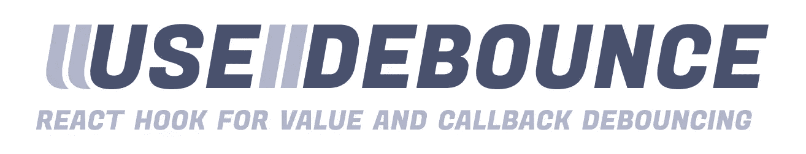

# 提高应用程序性能的最有效的 React 库

> 原文：<https://javascript.plainenglish.io/the-most-effective-react-libraries-to-improve-your-apps-performance-2f6fc66c4061?source=collection_archive---------11----------------------->

Photo by [Oskar Yildiz](https://unsplash.com/@oskaryil?utm_source=medium&utm_medium=referral) on [Unsplash](https://unsplash.com?utm_source=medium&utm_medium=referral)

在本文中，我将向您展示一些有用的 React 库，它们将提高您的 web 应用程序的性能。列表如下:

# 反应虚拟化

当您有一个大型数据集时，很难在不遇到性能问题的情况下呈现它。在最坏的情况下，您的 web 应用程序会完全崩溃。

React Virtualized 使您能够有效地显示大量数据。它为您提供了 React 组件，用于高效地呈现大型列表和表格数据。

Github:

 [## 虚拟化

### React 组件可高效呈现大型列表和表格数据。查看一些例子的演示。的…

github.com](https://github.com/bvaughn/react-virtualized) 

# 使用-去抖

去抖动是一种用来确保耗时的任务不会太频繁地触发，以免影响网页的性能。换句话说，它限制了函数被调用的速度。

一个很好的例子是，当用户在输入字段中输入文本时，您需要向 API 发出请求。如果不去抖，每次击键都会发出请求，这会导致应用程序性能下降。

*use-debounce* 是一个很棒的通过提供一个简单的 React 钩子来解决这个问题。

Github:

 [## xnimorz/使用-去抖

### 纱线添加使用-去抖 npm 我用-去抖-保存最简单的方法开始玩使用-去抖是用这个…

github.com](https://github.com/xnimorz/use-debounce) 

# 反应迟钝

编程中的惰性加载是避免初始化一个对象或元素，直到需要它的时候。它的实现有助于极大地提高资源密集型网站的性能。

这个库可以帮助你延迟加载组件、图像等。以便只在需要的时候才加载它们。

Github:

 [## twobin/react-lazyload

### 这个项目目前由@ameerthehacker 维护，如果有任何问题或需要帮助，请联系他。Lazyload…

github.com](https://github.com/twobin/react-lazyload) 

# 反应可加载

你希望你的网络应用程序有更好的性能吗？你需要开始代码分解！

代码拆分是将包含整个应用程序的一个大捆绑包拆分成多个较小的捆绑包或组件的过程，这些捆绑包或组件包含应用程序的独立部分，可以按需或并行加载。

React Loadable 是一个非常有用的库，可以帮助你完成这个过程。

Github:

 [## jamiebuilds/react-loadable

### 用于加载动态导入组件的高阶组件。如果您的公司或项目正在使用 React…

github.com](https://github.com/jamiebuilds/react-loadable) 

# 反应内容加载器

此库允许您在加载内容时向 web 应用程序添加占位符。因此，您可以为图像、文本、视频等添加占位符。你可能已经在大多数流行的应用程序中见过这个，比如谷歌，脸书。Instagram 等。

与列表中的其他库不同，这不会直接提高你的应用程序的性能，但我仍然认为这是一个非常有用的库，可以让你的应用程序感觉更有性能，所以我认为这值得一提。

Github:

 [## danilowoz/react-内容加载器

### SVG 驱动的组件可以轻松地创建占位符加载(像脸书的卡加载)。

github.com](https://github.com/danilowoz/react-content-loader) 

*在我看来，这些是一些最有用的增强性能的 React 库。我敢肯定还有很多值得一提的伟大的图书馆。*

*更多内容尽在*[*plain English . io*](http://plainenglish.io/)