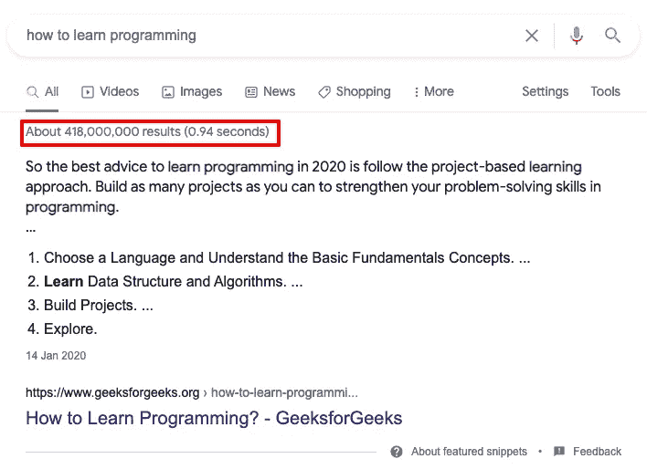
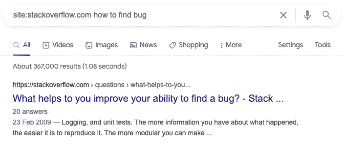
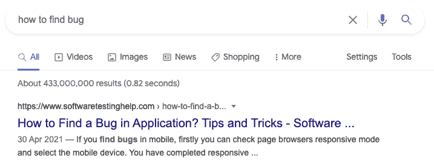
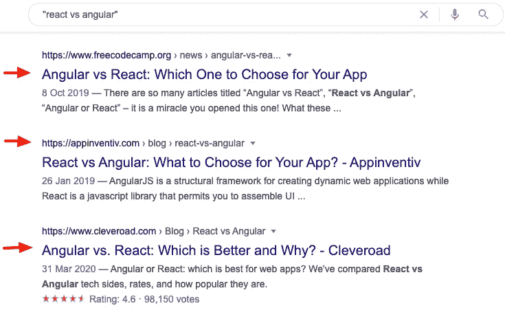
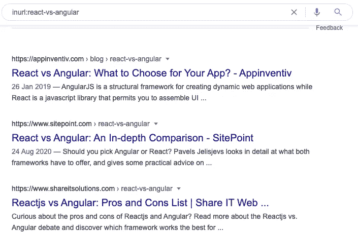
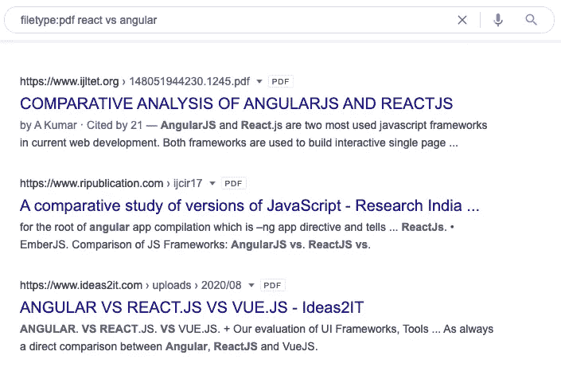
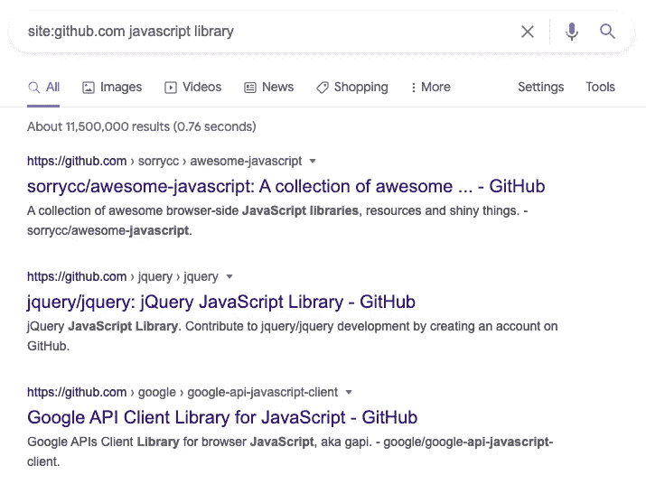
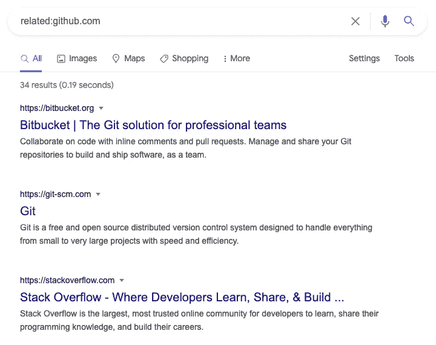
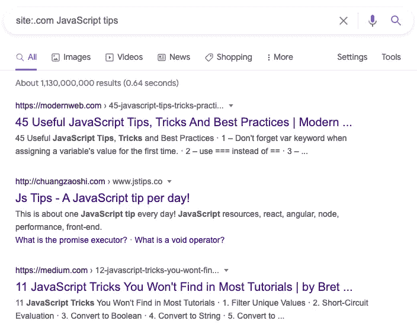

# 每个程序员都应该知道的最重要的技能:谷歌搜索

> 原文：<https://javascript.plainenglish.io/the-most-important-skill-every-programmer-should-know-googling-9fffd3ce3ddf?source=collection_archive---------23----------------------->

## 因为谷歌几乎可以给你任何问题的答案。

Image Source: [Giphy](https://giphy.com/explore/google-search)

我在工作场所遇到的、在网上交谈的、甚至在事后研讨会上遇到的每一个程序员，他们的代码总是有问题。所以他们的第一选择是向他们的同事寻求答案，如果他们的同事没有给他们想要的答案，他们就会浏览网页，自己寻找答案。

这说起来容易做起来难。我的意思是，当你在谷歌上输入“如何学习编程”，你会得到超过一百万个搜索结果。

Image screenshot by the author.

谁有时间查看所有这些结果？这就是为什么我整理了一个有用的谷歌搜索操作符列表，所有程序员每天都会发现它很有用。

# 但首先，谷歌搜索运营商到底是什么？

Google search operator 是 Google search 的一个功能，你可以控制在搜索结果中看到什么。例如，你只寻找 PDF 结果；有一个搜索运营商可以帮你做到这一点。同样，如果你只是在查看 Stackoverflow 的讨论，有一个搜索操作器也可以帮你做。

我将向你们展示另一个仅来自 Stackoverflow.com 的结果的例子

Image screenshot by the author.

现在，这是另一个不使用谷歌搜索操作符的搜索结果的例子。

Image screenshot by the author.

**这里有一个区别:**

*   与谷歌搜索运营商:367，000 个结果。
*   不含谷歌搜索运营商:4.33 亿。

**注意:当你使用精确的关键字时，如果你比较使用和不使用搜索操作符的两个搜索查询，你总是会得到不同的结果。**

现在，让我们看看有用的谷歌搜索操作符，你可以在你的研究中使用。

# 1.精确关键字匹配+“关键字”

这个谷歌搜索运营商会给你搜索结果，其中包含你在网页内容标题，正文，评论，或你的查询在内容中出现的任何实例的确切关键字。

*   如何在查询中使用: " "
*   示例:“反应与角度”

Image screenshot by the author.

# 2.InURL:

这个谷歌搜索运营商会给你在 URL 中包含你的确切关键字的搜索结果。这个搜索操作符基本上会显示你的网页内容。你可能看不到 PDF，YouTube 视频，图片等。

这也类似于“关键字”搜索操作符，但是这次您的搜索结果要窄得多。

*   如何使用:URL:关键字
*   示例:inurl:反作用与角度

Image screenshot by the author.

# 3.文件类型:

如果你只是在寻找 PDF、DOCs 或任何文件格式，你可以使用 filetype Google 搜索操作符。

*   如何使用:Filetype:关键字
*   示例:inurl:反作用与角度

Image screenshot by the author.

# 4.网站:

如果你只是在 Github 或 StackOverflow 等特定网站上寻找结果，你仍然可以使用谷歌。例如，下面的结果将只给你关于 Github.com“JavaScript 库”的网页。

*   如何使用:site:domain.com 关键字
*   示例:site:github.com JavaScript 库

Image screenshot by the author.

# 5.相关:域

这个结果会给你与你比较的相关领域。

*   如何使用:相关:domain.com
*   示例:相关:github.com

Image screenshot by the author.

# 6.站点:顶级域名

如果你只是在寻找一个. com 扩展名，而没有看到其他网站，如。网，或者。org，也有可能。

*   如何使用:网站:。com
*   示例:站点:。com JavaScript 技巧

Image screenshot by the author.

有不同的方法可以使用这些搜索操作符。要做到这一点，你需要有创造力。以下是一些例子:

*   如果你只寻找论坛结果，你可以使用这种格式:inurl:/forum/ + keyword
*   如果你只是在一个特定的网站上寻找问题，你可以使用这种格式:site:stack overflow . com/questions/+keyword
*   如果您想在搜索结果中排除特定的单词。这也可以通过添加-keyword: JavaScript 库-框架来实现
*   如果您想要搜索年份，即 2019–2020 年，您可以使用。“年份..Year keyword“我没有在上面包括这个的原因是，你会在 2018 年看到一些实例，但只是很少。

我没有包括其他搜索操作符，比如 cache:、define、allintitle、allintext、inallurl，因为我发现当开发人员使用它们时，它们没有用或者多余。不过，你可以在它们身上做实验。祝你好运！

*更多内容尽在*[*plain English . io*](http://plainenglish.io/)