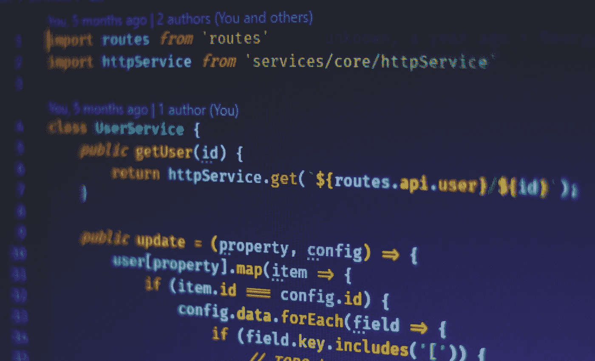

# 人们忘记了 JavaScript 中递归函数的一件事

> 原文：<https://javascript.plainenglish.io/the-most-important-thing-about-recursive-functions-in-javascript-5f71147ea9ba?source=collection_archive---------13----------------------->

Photo by [Ferenc Almasi](https://unsplash.com/@flowforfrank?utm_source=medium&utm_medium=referral) on [Unsplash](https://unsplash.com?utm_source=medium&utm_medium=referral)

> “要理解递归，首先必须理解递归”——斯蒂芬·霍金

递归有许多陷阱。大多数 JavaScript 开发人员在遇到特定问题之前甚至不会考虑使用它。递归函数很少受到关注，尤其是在 JavaScript 中，因为有一些很大的性能限制。

在本文中，我将介绍什么是递归函数，与经典迭代相比有什么优势，以及使用递归函数时您可能永远不会忘记的一件事。

# 什么是递归函数？

如果你已经知道这一点，请随意跳到下一部分。对于其他任何人来说，*递归函数是称自己为*的函数。使用递归的一个经典例子是生成行 Fibonacci (0，1，1，2，3，5，…)。考虑这个函数:

你看到这里发生了什么吗？斐波那契函数正在调用自己。例如，如果我们调用 *fibonacci(3)* ，我们的响应将是 2。如果我们从视觉上来看，情况是这样的:

或者如果我们从调用堆栈的角度来看:

我们调用参数值为 3 的函数。该函数将首先调用*Fibonacci(3–2)，*，这将返回一个整数值 1。该函数返回，然后将执行*Fibonacci(3–1)*调用，这又需要使用参数 0 和 1 再调用 *fibonacci* 函数 2 次。然后堆栈最终会收缩，直到我们回到原来的函数中，函数调用返回 2。

虽然这是一个非常简单的例子，但是我希望您能够理解递归函数所代表的意思。你可能在想:这很好，但在现实世界中有什么用呢？

# 与经典迭代相比的真实用例及优势。

当我准备撰写本文时，我问我的开发人员朋友，他们在过去几年中是否使用了很多递归。反应是明确的。他们都用过一两次，大多数人只是抄袭了 StackOverflow 的剧本。

那么有哪些使用递归的例子呢？这里有一个小清单。

*   递归循环遍历目录，对文件和目录执行 CRUD 操作。
*   排序算法(快速排序等)
*   在 HTML 和 XML 中导航
*   游戏开发中的碰撞检测
*   内容管理系统中的面包屑生成
*   解决数独游戏😄

有很多例子，传统的函数式程序员会更喜欢递归，因为它更具声明性。在我们的代码中，状态是在调用堆栈中捕获的，而不是显式地循环和保存状态。如果条件决策或[回溯](https://www.geeksforgeeks.org/backtracking-introduction/)是必要的，递归是非常有趣的。

我并不主张你应该用递归来代替所有的 for 循环。如果一个 for 循环变得太复杂，尝试将你的逻辑封装在递归函数中可能是明智的，对于下一个必须阅读你的代码的人来说，它们可能更容易理解。

# 你永远不应该忘记的事情

当我们在屏幕后面递归调用函数时，我们的调用堆栈会增长。这在上图中可以看到。如果我们调用整数值为 100，000 的*斐波那契*函数会怎么样。对我们的申请有什么影响？

在 JavaScript 中，如果引擎认为调用堆栈增长过多，应该停止，它就会介入。你会看到，你会得到一个叫做**范围误差的东西。**不像其他一些语言，没有硬性限制。当引擎认为内存使用因调用堆栈的大量增长而失去控制时，它将介入。

但是如果你真的想得到斐波那契数列的第 100，000 个值，是不是不可能用递归函数计算出来呢？

## 尾部呼叫

进来的时候，尾巴在叫。尾部调用不是 JavaScript 特有的，它们是优化递归函数的通用技术。

其思想是，如果从递归函数的最后一行调用一个函数，调用函数可以从调用堆栈中删除。

例如，考虑这个函数:

它会将从 1 到某个特定数字的所有数字相加，因此，例如，对于 3，结果将是 3 + 2 + 1 = 6。在调用堆栈中，这将如下所示:

当编程语言实现尾部调用时，实际发生情况是这样的:

而不是必须跟踪调用函数。尾部调用优化语言将从调用堆栈中删除调用函数，最终只返回最后一个被调用函数的结果。**只有当调用函数有一个返回语句，其中只调用一个函数**时，这才有可能。如果函数有一个类似于*的返回语句，返回 1+sumOneToNumber(x)；*它不能执行这种优化，因为求和必须在最后一次调用后执行。

这样，我们可以防止调用堆栈失控，并防止 RangeError。

除了。

JavaScript 以一种称为“适当的尾部调用”(PTC)的特定形式实现尾部调用。然而，这仅在 ES6 之后才可用，在 ES6 之前，无法保证会应用尾部调用优化。

同样需要注意的是，只有在严格模式下使用 JavaScript 时，PTC 才起作用。如果你还没有听说过“严格”模式，这是值得一读的。

这些限制可能是到目前为止我们还没有在 JavaScript 中看到多少递归应用的原因。这当然值得进一步讨论，因为我相信使用递归函数可以极大地增强可读性，这是一个好的软件项目中最重要的指标。

# 结论

如果应用时疏忽，递归是一种危险的技术。您可能会在生产环境中部署一些代码时遇到一个范围错误，这种情况在开发过程中不会发生，因为您的测试应用程序中没有那么多数据。

在这篇博客中，我解释了什么是递归函数。具体是做什么的，在现实场景中可以应用到哪里，使用的时候有什么需要注意的地方。

我希望你学到了一些新的东西，这篇博文将有助于你在未来做出更好的决定。祝你好运！

*更多内容尽在*[*plain English . io*](http://plainenglish.io/)